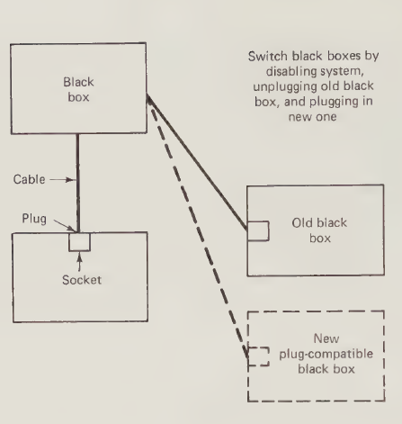
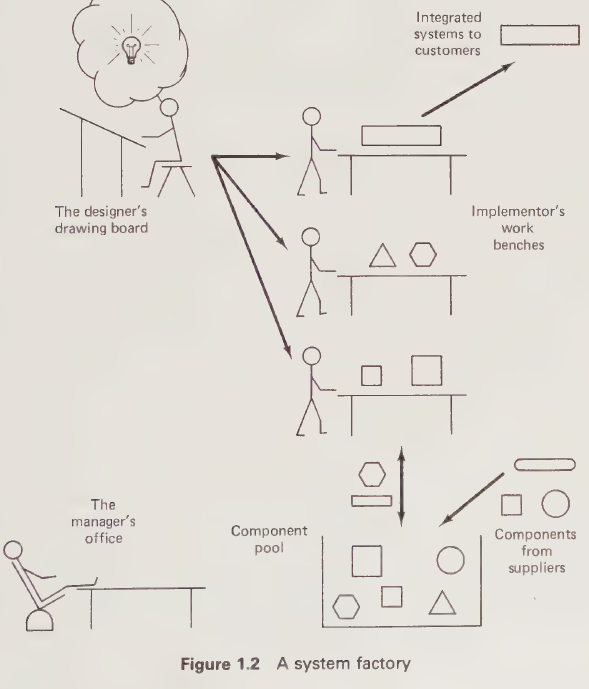
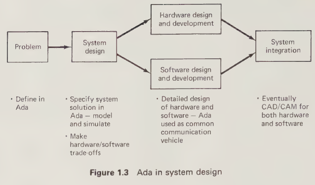
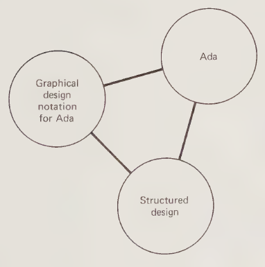

# System Design with Ada - Preface

The objectives of this book are as follows:

1. To provide a top-down, design-oriented introduction to Ada, accessible to a wide audience.
2. To present and to illustrate by example a practically useful, graphical design notation, intended for use at various levels:
* as an aid to conceptualizing the organization of a system in Ada terms;
* as an aid to communicating design approaches and decisions in an informal manner among members of a team;
* as a possible basis for Computer Aided Design of systems, using Ada as the specification and/or implementation language.

3. To arm the novice system designer with philosophies, strategies, tactics, techniques, and insights into ways of effectively carrying out the design process in a system life-cycle context.

This book should be particularly helpful to all those relatively inexperienced system designers who are currently being or will soon be turned loose to develop microprocessor-based embedded systems. The aim is to provide them with tools, methodologies, and insights to help them succeed in designing quality systems to be implemented by a project team. The recent explosion of available, inexpensive microelectronic technology has produced an extreme shortage of experienced system designers with the right mix of capabilities. Neophyte electrical engineers and computer scientists are thrust into situations where design responsibilities are theirs without having the training or experience to do it right the first time. Old timers in other fields find themselves willy-nilly responsible for system projects. This book is aimed at helping them.

The major part of the book should be accessible to anyone with a modest degree of computer literacy who can program in a language such as Pascal, PL/M, or C. The term computer literacy is used here to imply some familiarity with the use of computers as embedded components of systems rather than just as vehicles for running application programs in conventional high-level languages.

The book should be accessible to many second-year and all third-year students in computer engineering or computer science programs and to many third-year and all fourth-year students in electrical engineering programs with computing options, or in data processing programs.

Graduate students and professionals in the work force will find the book useful to fill important gaps in their training by providing a conceptually consistent treatment of approaches to problems they will have already faced in practice. Several advanced design applications are provided toward the end of the book, which will be of particular interest to this group.

The book is aimed at the future through its use of the new programming language Ada to provide abstractions and tools for specifying modular systems. An Ada overview is included. However, the book does not depend on a detailed knowledge of Ada. Indeed, the book may be advantageously read before attempting to acquire such detailed knowledge. In this way, appropriate concepts may be formed before programming habits are developed. For the most part Ada is viewed as if it were Pascal with the addition of the basic features of packages and tasks. The Ada concepts that are required are introduced from the top down in a tutorial fashion. Thus, the book is relatively self-contained. Ada programs may be used as specifications for non-Ada target environments, so that the book is not tied to the use of Ada as an implementation language. Ada may eventually dominate the software world due to the key role being given it by the U.S. Department of Defense. At least one microprocessor manufacturer is supporting Ada at the chip level. However, it is more than the momentum behind Ada that justifies its use for design. The fact is that Ada has the expressive power to describe modular, concurrent systems in terms exactly suited to design.

The expressive power of Ada provides many traps for the uninitiated and unwary. The use of Ada in this book is deliberately constrained, not only to make the material widely accessible but also to arm the reader with an approach to design that can avoid most of the traps. KISS (Keep It Simple Stupid) is the watchword.

The approach of the book to the design process has been inspired by the work of E. Yourdon, L. Constantine, and G. J. Myers on Structured Design.

The graphical notation for Ada evolved naturally while trying to explain and use Ada concepts. Discussion always seemed to center most naturally around pictures drawn on the blackboard or on paper. The details of the notation are the author's own, but the nature of the notation was inspired in part by notations used by Intel to describe iAPX 432 and Ada concepts and by Grady Booch to describe Ada concepts. The idea of using a graphical notation was also inspired by Per Brinch Hansen's structure graph notation for concurrent Pascal which was used and extended by the author and B. A. Bowen in an earlier book.

The graphical notation provides a specific, one-to-one mapping between pictorial descriptions and the key features of the corresponding Ada programs. Thus, pictures are used as a convenient shorthand for Ada programs as well as for design.

A viewpoint of this book is that discussion of structured design in the absence of such a direct relationship between design-level graphical representations of systems and the means by which these representations may be expressed in a programming language can lead to confusion and misunderstanding, unless there is detailed, personal guidance at every step of the way by an experienced practitioner of the art of structured design. Because the object of this book is to present a relatively self-contained, tutorial introduction to design, the need for personal guidance from an expert to interpret it must be avoided. The use of a specific graphical notation for Ada enables this book to discuss structured design at a suitably high level while keeping the reader's feet on the ground.

An aim of this book is to assist readers in harnessing their intuition to think about systems at a logical level. An assumption is that technically-oriented persons usually have a good, intuitive understanding of the ideas of modularization and concurrency which have hitherto lacked a means of expression in a widely-known programming language. Required to harness this intuition are good conventions for visualizing a system composed of interacting modules, a language which can express these visualizations directly and some examples of system design to illustrate the techniques and to provide a basic "parts kit" for assembling new systems. This book aims to assist readers in harnessing their intuition by satisfying these requirements.

The usually difficult subject of concurrency is treated to harness the reader's intuitions about concurrency obtained in day-to-day interactions with other people. The reader is encouraged to think of tasks as analogous to persons and of interactions among tasks via the Ada rendezvous mechanism as analogous to interactions among persons in business offices. The problems of concurrency and the ways of solving these problems are, thus, demonstrated to be old and familiar rather than new and strange.

Both technical system design issues and the design process itself are covered. The approach is to discuss issues and guidelines in both areas in the context of specific examples, rather than in the abstract.

The examples are used as a springboard for attacking problems of wide general concern within the limits of the author's own experience, which includes real time process control, computer communications, office automation, and signal processing systems. The insights obtained from the examples should be transferable to new problem areas.

This book is concerned with the design of systems which may be implemented in a mixture of software and hardware. It is, therefore, more concerned with system structure than with programming per se. The book introduces high-level design abstractions from the top down in a way that will develop the reader's intuition about them without obscuring their fundamental nature behind the complexities of language syntax. Programming examples are provided for all key abstractions in order to keep the reader's feet on the ground. But these examples are provided only after the abstractions have been introduced.

Several substantial design examples illustrate design almost entirely separately from programming.

Design takes place at a higher logical level than implementation and it must accordingly leave out details. Accordingly, the Ada examples in this book are seldom developed as complete programs with all details in place. Rather, they are at the level of skeleton pseudocode, which is the right logical level for design.

The design examples are presented in a stepwise fashion, imitating the way in which they would be presented in design "walk-through" meetings. Figures give system structures as they would be presented in view-graph form by the person conducting the walk-through. The narrative text accompanying the figures describes them in a way they would be described verbally by the person conducting the walk-through. Skeleton Ada programs are then presented at the appropriate level for the first program walk-through. The aim is to show how designs can be developed and discussed using pictorial techniques to enhance communication among members of a project team.

Many of the examples and issues are abstracted from real, difficult implementation projects undertaken by the author and his associates. This provides another reason for informality—the real projects could not be described in detail in the scope of a book such as this. Yet, they provide lessons worth learning.

The material in this book has been tested and refined in the classroom in several undergraduate and graduate courses of the Department of Systems and Computer Engineering of Carleton University and in several short courses given to conference attendees and to industry beginning in 1980.

The book is organized into three major parts. Parts A and B are introductory and should be widely-accessible to readers with minimal background. Part A introduces and motivates the subject and provides an overview of Ada as a design language. Part B provides an introduction to logical design by introducing Ada-oriented, pictorial system description techniques and using them on a variety of simple examples. Part C explores logical design in greater depth. It begins by taking a more detailed look at some features of Ada that affect design. It then tackles questions of modularity, reliability, and structure, using as an example a communications subsystem implementing a simple message protocol. Finally, it tackles the issues in the design of modular, concurrent systems in general, using as an example of the design of a system to implement the X.25 packet switching protocol.

**ACKNOWLEDGEMENTS**

This book would never have seen the light of day without the flying fingers of Elaine Carlyle at her word processor.

Particular thanks are due to Steve Michell, who contributed criticisms, ideas, and examples for all parts of the book but especially for Chapter 7, and to Ellis Sinyor, whose detailed criticism of the final draft was invaluable.

I would like to thank all of my students who suffered through the development of this material in a number of my courses.

Some of the ideas in this book were developed as a byproduct of research contracts with the Federal Departments of Communications and of National Defense, and of research grants from the National Science and Engineering Research Council. Their support is gratefully acknowledged.

I would never have started without the prodding of my colleague, Archie Bowen. Discussions with co-workers and students too numerous to mention have shaped my ideas about system design and implementation over the years. Particular thanks in this regard are due to Dennis MacKinnon.

Finally, I would like to thank my family for putting up with Ada's residence in our house for so long.

*R. J. A. Buhr*

---

# Part A: Background

*In this part we give a top-down overview of Ada as a system design language. Advanced readers may proceed directly to Part B.*

## Chapter 1: Introduction

### 1.1 MOTIVATION

This book describes an approach to system design with Ada which may be characterized as "object-oriented structured design."

The approach provides for the design and description of Ada systems in "black box" terms using "blueprintlike" pictures, which are easily understandable by all and encourage the formation of intuitive ideas about the nature of a system. The motivation for using the approach is the expectation that improved communication and enhanced intuition will lead to superior design quality in actual projects. For this purpose it seems likely that "a picture is worth a thousand lines of code."

In this book, the term *object* refers to a system component which has the characteristics of a black box. That is, its internal organization is invisible to the user, who only sees its interface specification. According to this use of the term, objects in Ada are packages, tasks, and procedures. Ada objects and their interaction mechanisms provide a metaphor for thinking of systems in a hardwarelike fashion as black boxes connected by cables which plug into sockets. This metaphor aids both communication and intuition.

This chapter is concerned mainly with motivating the approach and placing it in context. Section 1.2 discusses system design in the context of the system life cycle. Section 1.3 explores current problems and future directions in system design and implementation arising from the technology explosion and the software crisis. Section 1.4 summarizes the approach of the book. Impatient readers may skip Sections 1.2 and 1.3 without loss of continuity.

### 1.2 SYSTEM DESIGN AND THE SYSTEM LIFE CYCLE

This book is concerned with two aspects of the *how* part of design, namely

1. The design process itself; that is, the methodology by which a design for a system is produced.
2. Technical factors in system design; that is, the factors which affect how the system is to be structured.

Design is part of the overall system development process as reflected in the system life cycle. The phases of the system life cycle are as follows, in very high-level terms:

1. **ANALYZE:** Analyze the application requirements to determine the feasibility of satisfying the requirements.
2. **SPECIFY:** Specify the external requirements of the system.
3. **DESIGN:** Prepare a global design in terms of:
(a) user interface
(b) system functions
(c) system architecture
(d) test plan based on the requirements and the global design
4. **IMPLEMENT:** Implement the system in the following stages:
(a) construct the modules
(b) test and debug the modules
(c) integrate the modules into subsystems and the final system
5. **DELIVER:** Deliver the system to the customer using the following steps:
(a) validate the system following the test plan
(b) perform the customer's acceptance test
6. **MAINTAIN:** Make changes as necessary to correct errors and to accommodate changing requirements.

The system life cycle applies recursively to life cycles that produce hardware and software portions of the system.

This book is mainly concerned with developing the system logical architecture as part of the global design phase. The remainder of the life cycle is not treated in any detail explicitly. However, throughout the book the influences of other parts of the life cycle on design are continually emphasized.

As presented in the book, the design process is an informal one. It is not possible simply to follow a recipe, turn a crank and produce a system design. Instead of attempting to present a formal methodology, the book concentrates on giving informal guidelines for the steps to be followed in system design and then providing numerous examples to illustrate the use of the guidelines.

Technical factors in logical system design arise in attempting to develop a clean, error-free design which satisfies all of the system requirements. Technical factors may be both qualitative and quantitative. Qualitative factors include modularity, flexibility and reliability. Quantitative factors include external performance in terms of response time and throughput. Factors affecting reliability are considered to be qualitative. With this qualification, we may say that the prime emphasis of the book is on qualitative technical factors in system design. The approach is to discuss these factors in the context of examples.

### 1.3 REFLECTIONS ON HARDWARE AND SOFTWARE

#### 1.3.1 Introduction

The two components of systems, hardware and software, have had, from a historical perspective, very different characteristics and have been developed by very different methods. The technology explosion is changing all this. The inherent physical modularity of hardware has served as an inspiration for new approaches to software, which in turn are enabling both software and hardware to be designed and specified using software driven techniques. In this sense, software and hardware are moving closer together.

In the software world new development techniques are showing promise of short-circuiting the historical life-cycle approach in certain areas. Furthermore, the arrival of the ubiquitous personal computer has brought software development within the reach of almost everyone.

The purpose of this section is to relate these trends to the material of this book.

#### 1.3.2 Hardware as an Inspiration for Software

Consider for a moment the lucky hardware engineer. The components he designs have an inherent physical reality. These components may be connected together into assemblies, subsystems or systems using cables, plugs and sockets with well defined interface characteristics. Figure 1.1 illustrates the point. A module connected to another module by a plug and cable may be disconnected and replaced by a plug-compatible module with different internal structure without having any effect on the system. Make-or-buy decisions about plug-compatible modules are possible, because plug compatibility permits the growth of a parts industry. Systems are field reconfigurable after the power has been turned off or the function performed by the module to be replaced has been disabled.

**Figure 1.1 Thinking of systems in hardware terms**

Another aspect of hardware systems of the kind depicted in Figure 1.1 is the ability of one or more of the modules of the system to operate concurrently. In fact any particular module may itself have concurrent components.

The concepts of plug compatibility and concurrency are so natural in hardware terms that it would be quite foreign to think of hardware in any other way. However, historically this has not been the case with software. The widely used traditional programming languages include provision neither for plug-to-plug compatibility of modules nor for support of concurrency. Until recently the few languages that did provide such support were not widely used or widely available. In many cases addition of such features to standard languages has been performed in nonstandard ways by different organizations who recognized the need for these features. The result has been a proliferation of non-standard, ad hoc approaches.

Ada, however, provides both plug-to-plug compatibility and concurrency in a neatly uniform and consistent fashion. The language supports both sequential modules (packages) and concurrent modules (tasks and active packages, containing tasks). Both packages and tasks have the equivalent of sockets, described by separate specifications. An elegant uniformity results from the fact that the sockets for both packages and tasks look very similar from the outside. This provides for an economy of concepts in describing a system composed of interconnected modules of different types.

Field reconfigurability of an Ada program is very similar to that of a hardware system whose power must be turned off or functionality disabled before unplugging the old module and plugging in a new one. In Ada terms, a software system must be taken down and relinked to install a new, plug-compatible module. In this sense Ada does not provide completely general reconfiguration capability, such as is needed for dynamic installation of a newly created module in a running system. Because of this, Ada is not suitable for writing general-purpose operating systems. However, it is completely suitable for writing special-purpose systems composed of collections of preexisting modules.

#### 1.3.3 The Software-Driven System Factory: A Vision of the Future

Having available in Ada a language which can be used to describe systems in hardware-inspired terms, it is possible to think of a system factory in which both hardware and software are designed and specified in the same terms. In these terms, programming becomes more than just generating lines of code. Programming becomes structured system building in which programs are built up as structured assemblies of logical black boxes connected together by logical plugs and cables. As such, programs may be used to represent either hardware or software, only becoming lines of code in the bodies of modules which have been committed to software.

Figure 1.2 illustrates a vision of the software factory of the future based on this concept. Figure 1.3 shows how software-driven system design may be performed using a language such as Ada. A key feature of such an approach is the conceptual viewpoint of the system structure that it provides to managers, designers, implementors, suppliers, customers, marketers and clients. Discussions of system projects, thus, can take place in the same terms between members of the same interest group and different interest groups in a systems project. The common conceptual viewpoint can be used as a basis for discussing design features, schedules, resource requirements, and so on.

**Figure 1.2 A system factory**

**Figure 1.3 Ada in system design**

However, it would be too much to ask all of these interested parties to share the same level of understanding of the Ada language. Instead, what is required is a graphical notation for expressing the main features of system structures in terms directly related to Ada language features.

In other engineering fields the pictorial depiction of system structures is known as a blueprint. Of major concern in this book will be the development of a pictorial notation for preparing the equivalent of blueprints for software-driven system designs.

Finally, we note that this software-driven system factory approach implies a life-cycle approach to system development. That is, following the system life cycle described in Section 1.2, system requirements must first be defined before systems can be designed and implemented to satisfy them. However, a different approach to software development which short-circuits the life cycle is emerging for certain types of applications. The significance of these developments and their relationship to the material of this book is discussed in the next section.

#### 1.3.4 New Software Development Techniques

An aspect of the so-called software crisis is the difficulty experienced in practice with translating requirements into satisfactory systems without long lead times and high costs due to inherent properties of the life-cycle approach. The life-cycle approach demands that all significant requirements be defined before results can be seen by clients.

Highly typed, compiled languages such as Pascal and Ada are oriented toward the life-cycle approach. Ada in particular is so oriented, with its support for system modularization and its separation of module specification from the internal details of module implementation. Ada program structures can only be developed based on a detailed understanding of the requirements, and any changed requirements may invalidate them.

However, it may be argued that specification and agreement on all customer requirements for a complex system is humanly impossible in the real world until the customer has seen at least a partial implementation. This impossibility arises from the fact that in the real world human organizations are unavoidably fallible: people are busy, they forget details or are not interested in them, not everyone who knows the requirements is always involved in defining them, and information is lost in human interactions. Even with the best efforts to avoid them, there will be oversights, mistakes and forgotten details. But an Ada program structure to satisfy a requirement may be invalidated by a missing detail. And if the module structure, in terms of data types, packages, tasks, their interfaces and interactions, is invalidated, then every module may have to be modified, or the system will have to be delivered without meeting requirements.

It is certainly desirable in the early stages of a system life cycle to postpone making any design commitments which could later cause major redesign problems. Ideally, all such commitments should be postponed forever, and customers should define their requirements directly by user-friendly interaction with the system which satisfies these requirements. In some application areas, such as data base retrieval, this will become increasingly possible with time.

In such areas, high-level application programs will no longer be written by application programmers and then compiled. Instead, they will be constructed by very intelligent user interface programs, then executed interpretively and finally modified if necessary by further interaction with the user. Strong typing is inappropriate, because program objects may change in nature as the system evolves.

This approach may be called *requirements-by-result*, because the user sees the results of his requirements directly and may refine them interactively to achieve the desired results. It has also been called interactive prototyping.

Requirements-by-result contrasts greatly with the more conventional life-cycle development approach in which requirements must be stated in detail long before results become visible. However, the requirements-by-result approach is not applicable, even in principle, to problems which are not of the application-programmer-replacement type. Such problems must be handled for the most part by the life-cycle approach.

Therefore a commitment to Ada as a specification or design language does not impose any more constraints on flexibility than are already present in the nature of real life-cycle projects. Whatever the language of design or implementation, making a change to subsystem interfaces late in a project may affect all subsystems. In a large project, reprogramming or rebuilding the subsystems will be only a part of the cost of such a change.

#### 1.3.5 "Cottage" versus "Heavy" Software Industry

The ubiquitous personal computer has brought software development within the reach of almost everyone. We can all see around us the beginnings of a software "cottage industry," in which people who are not computer professionals are developing applications software on personal computers for their own use or for sale, often with considerable success. Such people are apt to be impatient with talk about software design. The situation is similar with students who have successfully completed a few introductory courses in programming and consequently believe themselves capable of tackling any programming job with similar success. This attitude is natural, because programming can lead to impressive, immediate results with relatively small intellectual effort invested in programming technology per se, apart from that required to learn some arbitrary rules relating to language syntax and system commands. There is, after all, very little computer-related theory actually needed to write programs that work. At its most basic level, programming is a skill like carpentry or house building which may be learned by experience by anyone with an aptitude for it.

The contrast between system designers and cottage-industry programmers is similar to that between professionals (architects and engineers) who design complex buildings and the home handyman who builds his own furniture, summer cottage or house. The home handyman can proceed from the bottom up with a minimum of preliminary design effort, making design decisions as the work proceeds and obtaining required materials (boards, bricks, nails, etc.) as the need arises. The home handyman does not need training in architecture and engineering to do the job successfully.

The cottage-industry programmer can often get away with the home-handyman approach by building programs from the bottom up, a line at a time, making design decisions as the work proceeds. In a sense the job is even easier than the home handyman's, because new materials may not have to be obtained; given a computer of adequate capacity, there is always an ample supply of basic components (computer instructions). The cottage industry programmer does not in many cases need training in software architecture and engineering to do the job successfully.

However, both the home handyman and the cottage-industry programmer will reach a plateau of project size and complexity beyond which it is difficult or dangerous to proceed without training in the relevant architectural and engineering aspects. We may characterize this plateau as marking the dividing line between "cottage" and "heavy" industry.

Heavy industry is characterized by a multiplicity of technologies, workers, and goals, requiring that plans be worked out in detail for any project before implementation work begins. The methods of this book, therefore, are clearly aimed at heavy industry software development. However, it is surely true that working out plans in detail before beginning work will help to avoid mistakes and to increase productivity in any project. Thus, the book should also be helpful to cottage industry programmers.

#### 1.3.6 Software As Black Boxes: A Conceptual Leap

The book encourages the reader to think about software in structural form rather than in flow chart or lines of code form. The approach of the book is to develop system structures in black box terms using blueprintlike pictures. Experience shows that the ability to think at this level requires a major conceptual leap for many programmers. This is particularly true of programmers used to working in a conventional application programming environment in which sequential programs run under the control of a monolithic central operating system. A goal of this book is to guide readers over this hurdle. To this end, a considerable amount of tutorial material is presented in Part B to assist the reader in making the necessary conceptualizations.

### 1.4 APPROACH OF THIS BOOK

The methods of this book are aimed at software-driven system design following the life-cycle approach. The book stands on three legs as illustrated by Figure 1.4:

* **Structured Design:** The methods of the book derive their inspiration from so-called structured design, which is a methodology for deriving system structures from data flow patterns in the system.
* **An Object-Oriented Graphical Notation and Conceptual Model:** This notation and model for system components, their interfaces, and interconnection forms the basis of structure graphs developed in structured design; its underlying semantics are provided by the Ada language.
* **The Ada Language Itself:** Only the parts of the Ada language which describe system objects, their interfaces and interactions are of fundamental importance to the material of the book. For the purposes of this book, Ada may be considered as Pascal plus the basic features of packages and tasks. Ada programs are used to illustrate structured design examples, but for the most part the reader with a knowledge of Pascal and a basic knowledge of Ada packages and tasks will be able to follow the examples.

**Figure 1.4 Three foundations of this book**

The book first develops each of the three legs of Figure 1.4 in sufficient depth to begin the discussion of examples. Thereafter, the three legs are used as a basis for the discussion of a number of design examples which illustrate both the design process and technical factors in design. The book is heavily example-driven; issues and principles are developed mainly through examples. The three legs of Figure 1.4 are developed in the remainder of Part A and in Part B. In particular, Chapter 2, which is the last chapter of Part A, provides a top-down introduction to Ada. This introduction should be sufficient to make the book self-contained for the reader familiar with Pascal (or any similar language) and having sufficient "computer literacy" to be comfortable with multitasking concepts.

---

