## Chapter 2: Ada as a System Design Language

### 2.1 INTRODUCTION

As discussed in Chapter 1, Ada has a number of new features which support ideas of modularity and concurrency derived from hardware. In particular, Ada supports the metaphor of systems composed of black boxes interconnected by cables which plug into sockets. Black boxes may be packages or tasks or combinations thereof. Sockets are package or task specifications, which are defined separately from their bodies. Concurrency is supported by tasks. Packages and tasks present similar appearing interfaces to the external world. A system may be configured statically by linking together precompiled black boxes through their specifications.

These features of Ada are clearly advantageous for structured design. However, Ada has many other unconventional features. It is useful to classify all the new, important, unconventional features of Ada under the headings of life-cycle features, structured design features, and technical features, as illustrated in Figure 2.1. Life-cycle features are those which assist the entire design and development life cycle. Technical features are those which have been included in the language to meet particular technical requirements. Neither life-cycle features nor technical features are the main concern of this book except as they overlap with structured design features. Structured design features are the ones which are of particular interest in this book.

Consider Figure 2.1, beginning from the center of the figure and moving first to the structured design features. Packaging and separate specification have already been mentioned and discussed briefly. The top-down refinement feature of the language allows nested modules to be included in the first instance in specification form only; their bodies may then be developed separately. This is very useful for presenting the internal design of a complex module without obscuring the essentials with a lot of details. Another widely useful feature is packaged input/output (I/O). Ada has no I/O instructions or statements per se. Instead, I/O is performed by packages; standard I/O packages are included with the compiler, and users may write their own I/O packages for special purposes. A feature of particular significance for structured design is Ada's rendezvous mechanism for intertask communication. This mechanism provides for the uniform nature of package and task interfaces. These five features are the main ones which underlie our methods in this book.

**Figure 2.1 Classification of the important new features of Ada**
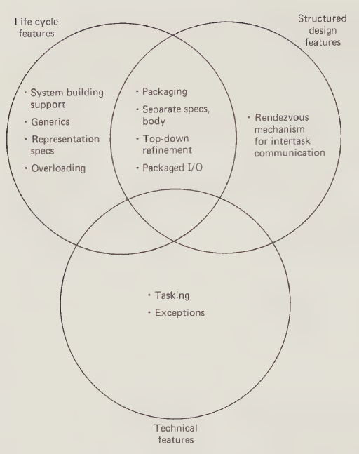

Features which are particularly life-cycle oriented are system building support, which provides for type checking across separate compilations; generic modules, which provide for macrolike parameterized copies of modules to be created; representation specifications, which provide for defining the structure of the hardware environment to the compiler; and overloading, which provides for multiple usage of the same name provided the compiler can distinguish the different usages of the name from the context.

Technical features include tasking and exceptions. Tasking is obviously required for support of concurrency in applications such as real time control. It is not so much the fact that tasking is supported by Ada that is particularly useful to structured design but the particular manner in which intertask communication is handled. Exceptions are technical features which provide for abnormal returns to an exception handler in a caller's environment on occurrence of a designated error condition.

Section 2.2 provides a top-down view of the major new features of Ada of interest to the system designer. Section 2.2 also provides an Ada wrap-up including comments on controversial features of the language and on its appropriateness as a system design or implementation language.

### 2.2 TOP-DOWN VIEW OF THE MAJOR NEW FEATURES OF ADA OF INTEREST TO THE SYSTEM DESIGNER

#### 2.2.1 Introduction

The major features of interest in this section are those oriented to structured design as shown in Figure 2.1. In the order in which we shall treat them here, these features are as follows:

- packaging

- separation of specifications and bodies of packages and tasks

- rendezvous mechanism for intertask communication

- top-down refinement

- packaged I/O

- interrupts

#### 2.2.2 Packaging and Specification/Body Separation

The concept of a package is illustrated in graphical terms in Figure 2.2. A package is a black box which provides services to users through an interface defined by a package specification. The package specification and the package body are distinct components of the program text in Ada and may be separately compiled if desired. The package body is hidden from the user who may only use the package in the way defined by the specification. The specification is the visible part of the package and may include definitions, declarations, and specifications of almost anything that may be in an Ada program. Most often it will contain specifications of subprograms which provide access to the services of the package. However, it may also include data type definitions, data object declarations, nested package specifications, and nested task specifications. The body is the hidden part of the package. Most often it will consist of the bodies of subprograms defined in the visible part and the declarations of package local variables and auxiliary subprograms which are shared between externally visible subprograms. The package body may also include nested packages and tasks and initialization specifications.

**Figure 2.2 Logical view of packages**
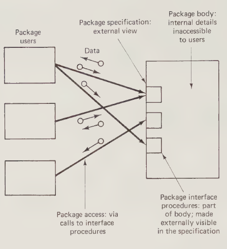

Figure 2.3 gives a specific example of a black-box view of a simple type of package, namely a STACK package. This example is a modified version of the stack package example presented in the Ada reference manual. This package provides externally accessible procedures PUSH and POP for elements of fixed, predefined types. The procedures return flags to indicate overflow or underflow. Invisible to the user are the bodies of the PUSH and POP procedures and the stack data structure which is shared between them. The idea is that users of the stack package will not have to change the way in which they use it if the body of the package is changed to accommodate different types of stack data structures, for example, arrays or linked lists.

**Figure 2.3 A stack package**
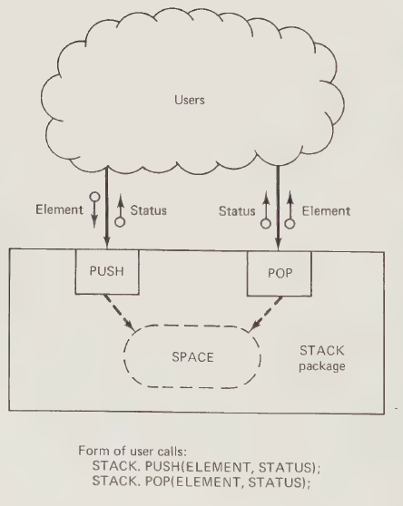

An Ada program for implementing this package for an array stack data structure is given in Figure 2.4. The first part is a definition of global types used by both the caller and the package. Note that these types could also be defined in the stack package specification, because they are not really global but are only relevant to users of the package. They remain global here for later comparison with a stack task.

The stack package specification includes the specification of the procedures PUSH and POP; these specifications consist of simply the name of the procedure followed by its parameter specifications.

The third part is the body of the stack package containing a fixed-size array for the stack and two procedures PUSH and POP which operate on this array.

The procedures PUSH and POP are accessed from outside the package by calling STACK.PUSH or STACK.POP. Simply naming the package by qualifying the call in this way provides access to any program elements inside the package that are made visible in the specification.

**Figure 2.4 Ada program for the stack package**

```ada
--THIS IS A COMMENT
--GLOBAL TYPES USED BY BOTH CALLER AND PACKAGE
type ELEM is INTEGER;
type STATUS is (OK, UNDERFLOW, OVERFLOW);

--THE STACK PACKAGE FOR VARIABLES OF TYPE ELEM
--SPECIFICATION
package STACK is
    procedure PUSH (E:in ELEM; FLAG:out STATUS);
    procedure POP (E:out ELEM; FLAG:out STATUS);
end STACK;

--BODY
package body STACK is
    SIZE: constant INTEGER := 10;
    SPACE: array (1.. SIZE) of ELEM;
    INDEX: INTEGER range 0.. SIZE := 0;

    procedure PUSH (E: in ELEM, FLAG: out STATUS) is
    begin
        if INDEX = SIZE then FLAG := OVERFLOW;
        else
            INDEX := INDEX + 1;
            SPACE (INDEX) := E;
            FLAG := OK;
        end if;
    end PUSH;

    procedure POP (E: out ELEM, FLAG: out STATUS) is
    begin
        if INDEX = 0 then FLAG := UNDERFLOW;
        else
            E := SPACE (INDEX);
            INDEX := INDEX - 1;
            FLAG := OK;
        end if;
    end POP;
end STACK;

--FORM OF USER CALLS
STACK.PUSH (ELEMENT, STATUS);
STACK.POP (ELEMENT, STATUS);

```

Some key points on the packages are as follows:

- Invoking the name of a package provides access to all the elements in it that are named in the specification.

- Package specification has to be declared only once in a program even though there may be many modules using it.

- Almost anything may be packaged.

- Packages and their specifications may but do not have to be separately compiled.

How do Ada packages differ from what we have available in more conventional languages? Let us take "standard" Pascal as an example. Pascal has been extended in many different directions by many different organizations, but in standard Pascal the only packaging feature is the procedure. Figure 2.5 illustrates the ways in which procedures could be used to emulate Ada packages. If we insist on separate POP and PUSH procedures, Figure 2.5(a) illustrates that the association of these procedures as part of a stack package must be performed by documenting the association in comments in the program text. The stack space must be declared as global data and PUSH and POP must be declared as separate procedures with no way of associating them by name or even contiguous position in the program text. If we wish to have a single-named stack object, we must make it a procedure with an opcode parameter to indicate which operation is to be performed, as shown in Figure 2.5(b). The stack data structure must still be declared globally. Finally, if we wish to emulate the Ada approach and hide the stack data structure inside the stack package, we arrive at the approach of Figure 2.5(c), which is incorrect in Pascal. Procedures in Pascal are completely reentrant, and all local data structures disappear on return from the procedure call. There is no way of ensuring that what has been put on the stack will still be there on the next call.

**Figure 2.5 Packages in Pascal**
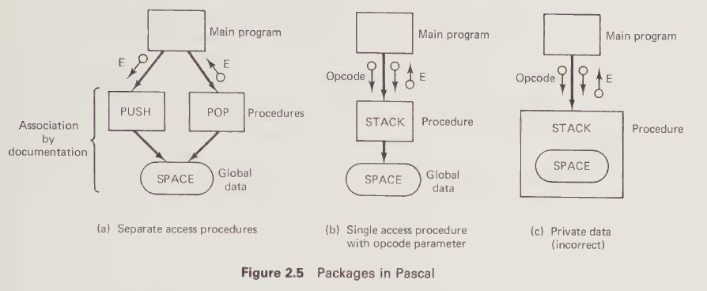

The perceptive reader may observe that Figure 2.5(b) is sometimes exactly what one wants to do with a stack. In Figure 2.5(b) the stack package is pure procedure which operates on appropriate global data. This is exactly what processor stacks do in hardware. Although this observation is true, it is beside the point. The fact is that standard Pascal does not provide for the hiding of data in a package in the many cases where that is exactly what is desired.

#### 2.2.3 Rendezvous Mechanism

The next design-oriented feature of Ada we shall consider is the rendezvous mechanism for tasks. Tasks provide a mechanism for concurrent execution. It may be desirable to have concurrent execution in order to exploit the capabilities of multiple processors or because tasks provide a natural model for many real world applications, even if the target environment is a uniprocessor.

The reader familiar with other concurrent programming languages and/or multitasking operating systems will wonder whether the term task in Ada is equivalent to the same term in those environments or to the term process which is also used in those environments. The answer is that Ada tasks have one additional fairly unique feature, namely the capability to provide a procedurelike interface to users very similar to the interface to users provided by a package. Tasks may have entries which may be called by other tasks, and these entries must be specified in a task specification in exactly the same way that package procedures must be specified in a package specification. Although entries are called in the same way as procedures, they are defined and processed differently. Procedures are executed by the caller. Entries are executed by the callee (or acceptor), while the caller waits during a so-called rendezvous.

Thus, considered as black boxes, tasks with entries are similar system objects to packages with visible procedures. This makes for an economy of concepts for system design.

Standard languages such as Fortran, standard Pascal and many others have no multitasking facilities. Instead multitasking facilities, if required, must be provided by an underlying multitasking operating system. The high-level language programs run as application programs which make calls to this operating system for intertask synchronization and communication as required. The calls to the operating system and the intertask communication mechanisms are outside the high level language. This approach is illustrated in onionskin form in Figure 2.6(a). A major difficulty with this approach lies in its logical complexity. There is no single conceptual model for the entire system consisting of the set of application programs together with the operating system.

In contrast, Ada provides in a single, high-level language a conceptually consistent mechanism for intertask communication which does not rely on explicit calls to an underlying operating system. Instead, as illustrated in Figure 2.6(b), all that is required is an underlying kernel which can support the rendezvous mechanism. This underlying kernel is not visible at the Ada program level.

**Figure 2.6 Conventional versus Ada approaches to tasking**
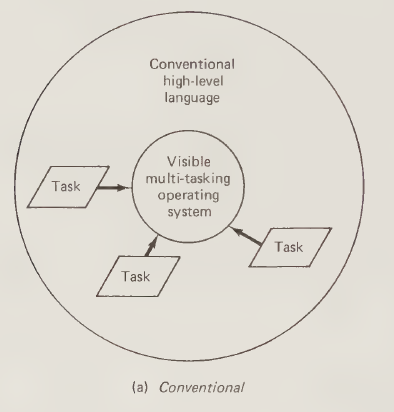
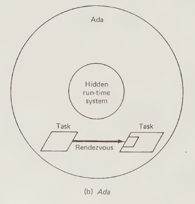

To illustrate the nature of intertask communication and the use of the rendezvous mechanism, consider the buffer example of Figure 2.7. This figure shows a black-box view of the interactions between a producer task, a buffer task, and a consumer task. Tasks are shown as black boxes looking somewhat like packages, except that they are drawn as parallelograms rather than rectangles to symbolize their parallel (that is, concurrent) nature. In the figure, the producer and consumer tasks are autonomous tasks without entries. The buffer task, on the other hand, has write and read entries for use by the producer and consumer. The idea is that the buffer task smooths variations between the speed of output of a producing task and the speed of input of a consuming task. The astute reader may ask why not use a package? Why is a task required? The answer is that otherwise the producer and consumer would not be able to synchronize their accesses to the buffer and might simultaneously interact with the buffer in such a way as to cause inconsistency in its internal data structures. In other words, the buffer task provides mutual exclusion on the buffer data structures.

**Figure 2.7 The basic format of the structure graph for a three-task producer-consumer system**
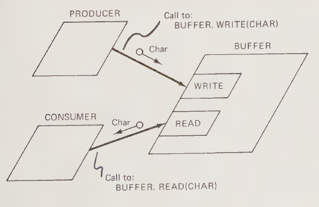

To readers unfamiliar with Ada tasking, the buffer task may seem a strange form of task. It spends most of its time waiting for other tasks to call it. The reader may object, tasks should be active; they should have work to do, such as controlling a machine or receiving messages from another computer. However, any task which does work must also communicate with other tasks. The buffer task example serves to illustrate the communication interface mechanism for more general tasks. From this perspective, the fact that it does no work of its own is not important. It could do work and still look the same from the outside. In fact its external interface is a good model for the kind of interface presented to users by many tasks which do work in the examples of later chapters.

Readers familiar with concurrent programming theory and practice will be aware that in other systems there are other ways of ensuring mutual exclusion involving, for example, test-and-set instructions, semaphores, conditional critical regions, monitors, message exchanges, and so on. Ada requires the use of tasks. A positive advantage of this approach from the viewpoint of design is that all task intercommunication and synchronization activities are performed by active program objects at the same logical level. Thus synchronization and intercommunication are explicitly visible in the calls made between program objects. There is no hidden functionality buried in signals or messages. Another positive advantage is the resulting economy of concepts needed to describe a system containing both packages and tasks. Both types of objects present similar external interfaces to users.

Figure 2.8(a) gives the buffer task specification and shows how the producer and consumer tasks call the buffer task. Figure 2.8(b) shows the simplest code for the buffer task body. This version of the buffer task accepts one character from the producer via the WRITE entry and then waits for the consumer to pick up the character via the READ entry before going back to accept another character from the producer. The accept statement is the buffer task's way of saying that at this point it is ready to accept a call on the named entry. If a call has already been made, then a task is waiting in the entry queue and the rendezvous takes place immediately. If the entry queue is empty, then the buffer task waits for a call on that entry. From the caller's viewpoint, if it makes a call on an entry before the buffer task has executed an accept statement for that entry, the caller waits in the entry queue until the buffer task accepts the entry. The buffer task's body must contain at least one accept statement for each entry declared in its specification, otherwise a caller of that entry will wait forever.

**Figure 2.8 A three-task producer-consumer program in Ada**

**(a) Task interfaces**

```ada
--PRODUCER
loop
    --PRODUCE THE NEXT CHARACTER
    BUFFER.WRITE(CHAR);
end loop;

--CONSUMER
loop
    BUFFER.READ(CHAR);
    --CONSUME THE CHARACTER
end loop;

--BUFFER SPECIFICATION
task BUFFER is
    entry READ (C: out CHARACTER);
    entry WRITE (C: in CHARACTER);
end;

```

**(b) Simplest buffer task**

```ada
task body BUFFER is
    POOL: CHARACTER;
begin
    loop
        accept WRITE (C: in CHARACTER) do
            POOL := C;
        end;
        accept READ (C: out CHARACTER) do
            C := POOL;
        end;
    end loop;
end BUFFER;

```

Until the rendezvous is finished, the caller is idle. Note that there is no busy waiting in any of these interactions. When the caller waits in the entry queue for the rendezvous to be finished, the caller is not using processing resources. When the acceptor waits to accept a call on an entry, the acceptor is not using processing resources.

To the caller the rendezvous appears syntactically exactly like a call and return from a procedure. The essential difference from a procedure call is that the operation requested by calling the entry is performed by the called task rather than by the calling task, and that a variable delay may therefore be experienced by the caller before returning from the call.

The particular interaction shown in Figure 2.8(b) is obviously inadequate for buffering, because characters cannot accumulate in an internal data structure in the buffer task. Figure 2.8(c) shows a more general program based on the use of an internal ring buffer. To the callers nothing has changed except that idle periods at the buffer task will be shorter. The body of the buffer task has, however, changed significantly. It now contains a so-called selective wait statement naming the WRITE and READ entries as alternatives. This selective wait statement (that is, the entire statement between the select and end select reserved words) should be regarded as a single primitive instruction which sets up a waiting condition in the buffer task for the first call on either WRITE or READ. The producer and the consumer can now proceed independently, leaving it to the buffer task to accumulate any excess of production over consumption. In this example characters are accumulated in a bounded ring buffer. If the producer gets too far ahead of the consumer, the ring buffer will wrap around and data will be overwritten before it has been consumed.

**Figure 2.8 (continued) (c) Buffer task with selective waiting**

```ada
task body BUFFER is
    POOL_SIZE: constant INTEGER := 100;
    POOL : array (1.. POOL_SIZE) of CHARACTER;
    IN_INDEX, OUT_INDEX: INTEGER range 1.. POOL_SIZE := 1;
begin
    loop
        select
            accept WRITE (C: in CHARACTER) do
                POOL (IN_INDEX) := C;
            end;
            IN_INDEX := IN_INDEX mod POOL_SIZE + 1;
        or
            accept READ (C: out CHARACTER) do
                C := POOL (OUT_INDEX);
            end;
            OUT_INDEX := OUT_INDEX mod POOL_SIZE + 1;
        end select;
    end loop;
end BUFFER;

```

This overwriting of the ring buffer can be prevented by using another feature of Ada called a guard. Figure 2.8(d) shows the results. The guards are contained in the `when` statements which indicate conditions under which the selective wait alternatives are open for acceptance. Again, the selective wait statement must be regarded as a primitive instruction which sets up a waiting condition. At the time of execution of this primitive instruction, the guards are evaluated to select open entries which may be accepted. In this particular example, if `COUNT` is equal to `POOL_SIZE`, then only the READ entry will be open for acceptance. This means that if the WRITE entry is called, the caller will wait in the entry queue until the entry is opened by a change to the guard. Note that this change to the guard will be caused by acceptance of another entry. A situation in which all entries are closed would be a programming error.

**Figure 2.8 (continued) (d) Buffer task with guards**

```ada
task body BUFFER is
    POOL_SIZE: constant INTEGER := 100;
    POOL : array (1.. POOL_SIZE) of CHARACTER;
    COUNT : INTEGER range 0.. POOL_SIZE := 0;
    IN_INDEX, OUT_INDEX: INTEGER range 1.. POOL_SIZE := 1;
begin
    loop
        select
            when COUNT < POOL_SIZE =>
                accept WRITE (C: in CHARACTER) do
                    POOL (IN_INDEX) := C;
                end;
                IN_INDEX := IN_INDEX mod POOL_SIZE + 1;
                COUNT := COUNT + 1;
        or when COUNT > 0 =>
            accept READ (C: out CHARACTER) do
                C := POOL (OUT_INDEX);
            end;
            OUT_INDEX := OUT_INDEX mod POOL_SIZE + 1;
            COUNT := COUNT - 1;
        end select;
    end loop;
end BUFFER;

```

Figures 2.9 and 2.10 provide timing diagrams showing the producer-buffer-consumer interactions for the two cases when all select alternatives are open and when there is one closed select alternative.

**Figure 2.9 Timing diagram for buffer example with no closed entries**
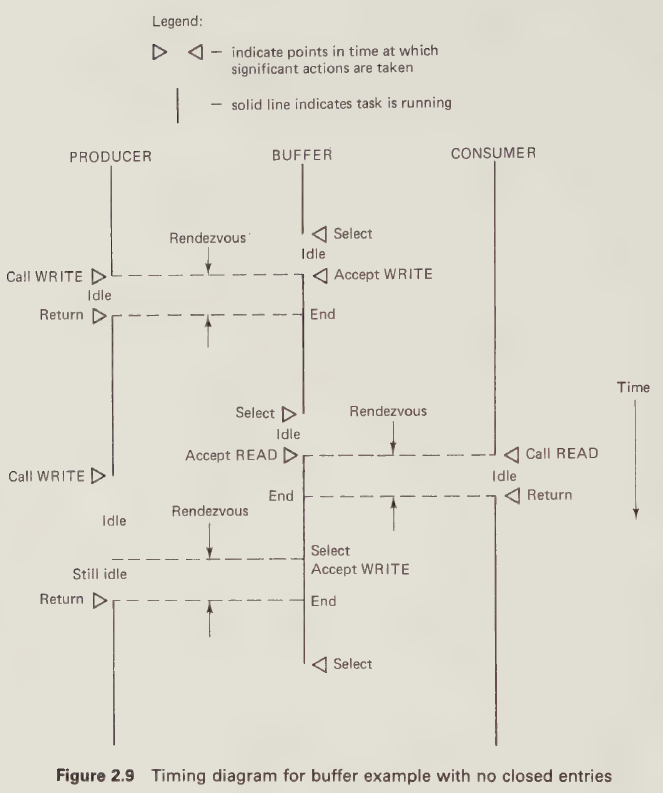

**Figure 2.10 Timing diagram for buffer example with a closed entry**
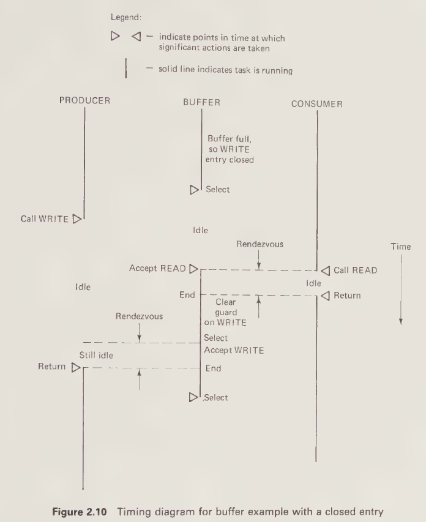

Ada has other features associated with the rendezvous mechanism and in Chapter 3 these other features will be introduced together with an expanded pictorial notation to represent all of the alternatives.

Contrast the Ada approach to tasking with that required when using standard Pascal. The first point to note is that standard Pascal does not support concurrency in the language. Standard Pascal can only be used to write concurrent programs by writing special task procedures which are never called and never execute returns in the high-level language environment. These procedures are made known to the separate run-time kernel which supports concurrency by a Pascal main program which initializes the kernel. From the high-level language view-point, it is all in the programmer's mind. Figure 2.11 provides a structure diagram showing how the various components of a concurrent system written in Pascal interact. This approach may be taken for any standard high-level language which does not support concurrency. The main requirements are that each task procedure has its context maintained by the kernel in such a way that the code generated by the high-level language compiler interacts with the appropriate context for each task. Pascal works fine because its procedures are reentrant and the context is maintained on the stack. Fortran presents a problem because of its lack of reentrancy.

**Figure 2.11 Tasking with procedures in Pascal**
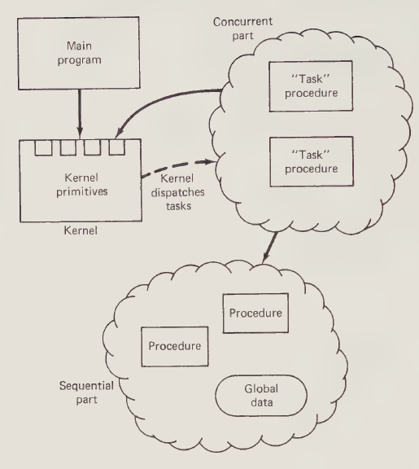

Note that an Ada design in which tasks communicate via rendezvous, can be implemented in a system such as shown by Figure 2.11 by appropriate use of the task synchronization and communication facilities of the kernel. The kernel does not need to support the rendezvous mechanism explicitly because this mechanism is relatively easily implemented using other intertask communication mechanisms.

#### 2.2.4 Top-Down Refinement

The next design-oriented feature of Ada requiring discussion is the ability to develop Ada programs in a top-down fashion. We have already seen that user programs which must access packages and tasks only need the package and task interface specifications. However, what about nested objects? For example, suppose a package contains internal procedures, packages, and tasks in a nested fashion. The usual rule of program nesting is that an object must be defined before it is used. This rule is also true for Ada. However, the requirement that it be defined before it is used is restricted to the specification. The body may either be defined after it is used in the same context as the specification, or it may be left as a stub to be defined as a separate compilation unit. The latter approach is illustrated by Figure 2.12. We shall often make use of the approach of Figure 2.12 in examples because of the convenient way in which it provides for explicit partitioning of the program text into page-sized chunks. However, the reader should note that separate compilation is not necessary for top-down refinement in Ada.

**Figure 2.12 Top-down programming with stubs in Ada**
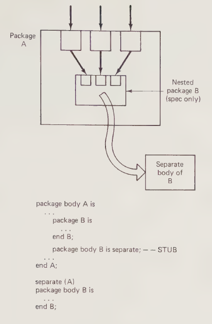

How does this differ from conventional languages such as standard Pascal? Standard Pascal has a forward declaration mechanism which makes it possible to write a program in which two procedures call each other. This would be impossible if everything had to be fully defined before it was used. The approach is illustrated in Figure 2.13. In this figure, procedure R calls procedure P, which calls procedure Q, which in turn calls procedure P. This is made possible in Pascal, as shown in Figure 2.13, by programming the heading only of Q first, then programming P in full, then programming Q in full, then programming R. However, there is no way of deferring definition of the bodies of P and Q until after that of R in the program text.

**Figure 2.13 Limited top-down programming in Pascal**
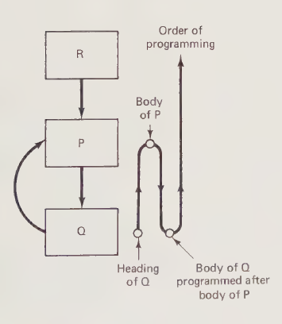

#### 2.2.5 Packaged Input/Output

A central feature of Ada which affects not only design but also all other areas of use for the language is that there are no special language statements for input/output. Instead, input/output is performed by packages which may be standard ones distributed with the compiler or special ones written by users. Figure 2.14 provides an example of a package for file input/output. The example is largely self-explanatory except for the new feature in the package specification of the limited private data type. This is a further example of information hiding by packaging. Clearly, in any file input/output package, filenames must be externally accessible. This implies that the structure of the filename type must be known in the package specification. However, it is important that users do not generate their own filenames or modify filenames provided by the package. The declaration of filename as a limited private type accomplishes this. A user of the package may obtain a filename only by calling OPEN and may later use it in calls to READ and WRITE. However, it may not access components of a variable of type filename, and it may perform no operations on variables of this type. Therefore it cannot generate its own values of variables of type filename. Such values can only be obtained as parameters of procedures of the package.

**Figure 2.14 File I/O package**

```ada
package I_O_PACKAGE is
    type FILE_ID is limited private;
    procedure OPEN (F: in out FILE_ID);
    procedure CLOSE (F: in out FILE_ID);
    procedure READ (F: in FILE_ID; ITEM: out INTEGER);
    procedure WRITE (F: in FILE_ID; ITEM: in INTEGER);
private
    type FILE_ID is
        record
            INTERNAL_ID: INTEGER := 0;
        end record;
end I_O_PACKAGE;

package body I_O_PACKAGE is
    LIMIT: constant := 200;
    type FILE_DESCRIPTOR is record... end record;
    DIRECTORY: array (1.. LIMIT) of FILE_DESCRIPTOR;
    procedure OPEN (F: in out FILE_ID) is... end;
    procedure CLOSE (F: in out FILE_ID) is... end;
    procedure READ (F: in FILE_ID; ITEM: out INTEGER) is... end;
    procedure WRITE (F: in FILE_ID; ITEM: in INTEGER) is... end;
begin
end I_O_PACKAGE;

```

Contrast this with languages such as standard Pascal which have imbedded input/output instructions which limit the flexibility of the language.

Obviously this packaging approach to input/output does not at this level address the problem of direct interaction with hardware. The body of this package must somehow perform this interaction either by making calls to an underlying operating system or by directly interacting with hardware. This leads to the next feature.

#### 2.2.6 Interrupts

The final design-oriented feature of Ada which requires discussion is the interaction of interrupts with Ada software. From the Ada software point of view, an interrupt is considered an entry call to an interrupt handler task. There are mechanisms called representation specifications in the Ada language which allow interrupts to be associated with task entries to accomplish this. For logical design purposes the details of representation specifications are not important at this stage; it is sufficient to know that the capability exists. Figure 2.15 illustrates this approach to interrupt handling for the example of a keyboard handler task.

Contrast this with languages such as standard Pascal which have no low-level mechanisms for interacting with hardware.

**Figure 2.15 Interrupt handling tasks in Ada**

**(a) Concept**
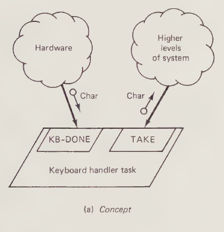

**(b) Ada Code**

```ada
task KB_HANDLER is
    entry TAKE (CH: out CHAR);
    entry KB_DONE;
    for KB_DONE use at 8#100#; -- Representation spec
end KB_HANDLER;

task body KB_HANDLER is
    BUF, DBR: CHAR;
    for DBR use at 8#177462#;
begin
    loop
        accept KB_DONE do BUF := DBR; end;
        accept TAKE(CH: out CHAR) do CH := BUF; end;
    end loop
end

```

#### 2.2.7 Conclusions

The remaining special features of Ada do not have the same critical significance for design as do the features covered in this section, although they of course may be used. We shall introduce them at appropriate points in the text by example. However, we have covered enough in this chapter to proceed with Part B.

It should be emphasized once more that, for design purposes, Ada may be considered to be essentially Pascal with special added features. At the Pascal level, Ada is different in detail from standard Pascal, but its meaning will be obvious to readers familiar with Pascal.

### 2.3 ADA WRAPUP

#### 2.3.1 Introduction

What are the pros and cons of using Ada as a design and/or implementation language?

#### 2.3.2 Ada for System Design

Ada provides a uniform, black-box view of different types of program modules. It is relatively easy to interpret packages and tasks in hardware or software terms due both to the uniformity of treatment and to the separation of specification and body.

The restriction to the rendezvous mechanism for interaction between concurrent program components offers positive advantages of clarity and uniformity of specification. There are no indirect interactions whose nature is hidden in signals or messages. If direct interaction between interacting tasks is not desirable, then a third party task must be included to handle indirect interactions. The nature of the interactions is thus made clearly visible in an explicit fashion.

Readers concerned with efficiency should note that third party tasks included to handle interactions do not necessarily have to be implemented as tasks in non-Ada target environments. A task which only receives entry calls from other tasks and makes none of its own could be implemented efficiently in a non-Ada target environment as a critical region in shared memory using well known techniques. The desirability of doing so could be indicated by the designer in the Ada description of the system by a critical region pragma (formally, a pragma in Ada is an instruction to the compiler—however, it can also be interpreted in a design environment as an instruction to the implementor). The possibility also exists of an Ada compiler using such a pragma to generate efficient code.

Ada supports top-down refinement of nested modules in program text, thereby aiding both the design process and the ease of reading of the program text.

Ada supports the postponement of commitment to the target hardware configuration, subject to the reasonable assumption that the logical architecture is naturally mappable onto all visualized target hardware configurations. For example, a design which includes only two tasks would be very difficult to map onto a hardware architecture consisting of 10 processors. On the other hand, a design which contains 30 tasks might be quite easily mappable onto 10 processors. This would be true independent of the use of Ada. More specific to Ada, a design which relies on sharing packages between tasks would be difficult to map onto a distributed environment. On the other hand, the rendezvous mechanism is quite easily mapped into a distributed environment. We shall have more to say on these matters in Part C.

The expected high level of standardization of the language and of its penetration into the computing community are both positive features.

#### 2.3.3 Ada for Implementation

Considered as an implementation language, there is a certain amount of controversy surrounding Ada. The major substantive criticisms are concerned with complexity, reliability, and real time processing.

There is no doubt that the language has many features, is very powerful, and is consequently more difficult to learn than most current languages. However, it is surely easier to learn than existing combinations of standard languages and multitasking operating systems. Furthermore, if not all features are required, then subsets may be defined by convention; that is, programming organizations using Ada may establish standards for the use of Ada which restrict normal use of certain features of the language. Such restrictions might be enforced by the use of preprocessors.

Questions concerning reliability arise in part because of the language's size and complexity and in part because some particular features of the language may interact in ways which may prove unreliable. For example, dynamic tasking and exceptions are in themselves complex, and it seems likely that using them in combination in an unrestricted fashion will produce programs whose correctness is difficult to guarantee.

Questions concerning Ada's capability to support real time interactions arise from the fact that the rendezvous mechanism is the only mechanism for interaction between concurrent system components. There are no explicit test-and-set or semaphorelike memory locks which can be used for efficient sharing of memory-based critical sections between concurrent components. The concern is that in an environment in which several tasks are running on a single processor, the forced overhead of task context switching to make a rendezvous places a limit on real time response. In the author's opinion, this is unlikely to be a significant problem in the long term. Intelligent compilers, aided perhaps by suitable pragmas, will be able to generate efficient code for particular environments.

An extreme, negative view of Ada as an implementation language is advanced by Hoare in his famous (or infamous) address to the ACM (Association of Computing Machinery), where he says that it should not be used for applications where human safety is at stake. This seems to the author to be an unfair criticism of a programming language, given the present state of the art in practice. Much more than merely the programming language is involved in ensuring the safety of a complex engineering system. In the final analysis, no matter what programming language is used, the safety of such systems depends on the foresight and competence of their designers and implementors in a wide variety of areas, of which software is only one. The programming language is simply a tool for implementing the software part of the system. As with all tools, it can be used poorly or well.

Used well, Ada seems likely to be a better software implementation tool than we have had previously. But the real advantage of Ada, in the author's opinion, is the contribution it makes to bringing system design and implementation closer together conceptually. Surely this can be expected to yield, in the hands of competent professionals, positive results with respect to system safety and reliability.

#### 2.3.4 Conclusions

Ada's high-level concepts form an excellent basis for system design. Ada's high level of standardization and its expected wide dissemination provide further good reasons for using it for system design. Avoidance of details of the language inappropriate for design may be accomplished by following a design methodology based on a subset of Ada. The remainder of this book is concerned with presenting such a methodology, centering around the use of a graphical notation which captures the essential concepts of Ada while avoiding non-essential details.
