# Part B: Introduction to Logical Design

In this part we first explore Ada system structures using graphical techniques. Then we describe an informal system design methodology and use it, together with our knowledge of system structures, to develop designs for three example systems which are simple enough to be relatively easy to follow but which nevertheless illustrate key issues.

# Chapter 3: Design-Oriented, Pictorial System Description Techniques

## 3.1 INTRODUCTION
Everyone knows that "a picture is worth a thousand words." Mathematicians know that a good notation may assist in suggesting solutions to problems. This chapter describes an approach to the description of system architectures which employs pictures and a good notation. The approach is based on the Ada language. However, only superficial knowledge of Ada is required to read this chapter, which introduces the concepts by analogy with familiar, nonprogramming examples. The description technique includes concurrency. However, the treatment of concurrency is tutorial in nature and should be accessible to readers without substantial background in concurrent system principles.

Section 3.2 provides a pictorial notation to describe system architectures. It includes a tutorial section on a dynamic metaphor for Ada tasking in terms of human activities and interactions (Section 3.2.2), which may be skipped by the advanced reader.

Section 3.3 develops a "parts kit" of canonical system structures using the pictorial notation of Section 3.2. It covers both sequential and concurrent systems. For concurrent systems it covers solutions to the basic problems of mutual exclusion, synchronization, scheduling and deadlock.

Section 3.4 reviews the relationship of the material of this chapter to Ada. Section 3.5 provides conclusions.

## 3.2 INTRODUCTION TO PICTORIAL DESCRIPTIONS OF SYSTEM ARCHITECTURES
### 3.2.1 Pictorial Notation
Figure 3.1 provides the basic pictorial symbols: boxes represent packages and tasks; arrows represent access connections and data flow; and a special oval symbol represents data. It is also useful to have a special cloud symbol for a module whose nature has not yet been defined.

These symbols may be used to construct data flow graphs and/or structure graphs. Data flow graphs identify modules and show data flow interactions among them, without showing the control interactions. Structure graphs show both data flow and control interactions.

The major difference between packages and tasks is symbolized by the different way in which the boxes representing them are drawn. Packages are rectangles. To symbolize their parallel nature, tasks are parallelograms.

The symbols for packages and tasks indicate not only their differences but also their similarities. Boxes are used to symbolize the black-box nature of both packages and tasks. Smaller boxes at the edges are used to symbolize "sockets" which users may use to "plug into" the black boxes. Note that sockets is not an Ada term. The term is used to symbolize the common aspects of package and task interfaces. For both packages and tasks, plug compatibility is required. That is, users of packages or tasks as well as bodies of packages or tasks must meet the requirements of the interface specification defining the nature of the sockets.

An access connection from a user to either a package or a task is indicated by an arrow drawn from anywhere on the user box to the appropriate socket of the accessed box. Note that access here is a pictorial concept indicating a connection from one module to another. It does not imply use of access variables in the Ada sense.

In both cases, the interface specifications describe only how to connect to black boxes. Neither connections from black boxes nor identities of users are given in the interface specifications.

Connections to packages may be procedural or nonprocedural. Procedural connections indicate calls to ordinary procedures declared in the package specification. Nonprocedural connections indicate access to other internal aspects of a package, such as internal variables which are declared in the package specification.

Isolated procedures are depicted as rectangular boxes without sockets. They may be visualized as degenerate packages.

Sockets of tasks, known in Ada as entries, behave, from the user's viewpoint, very much like package procedures. Indeed, a task with an interface which is never accessed by more than one other task can be replaced functionally by a package, with procedures replacing the entries. Conversely, a package whose procedures may be accessed by more than one task in a non-overlapping fashion can be replaced functionally by a task, with entries replacing the procedures.

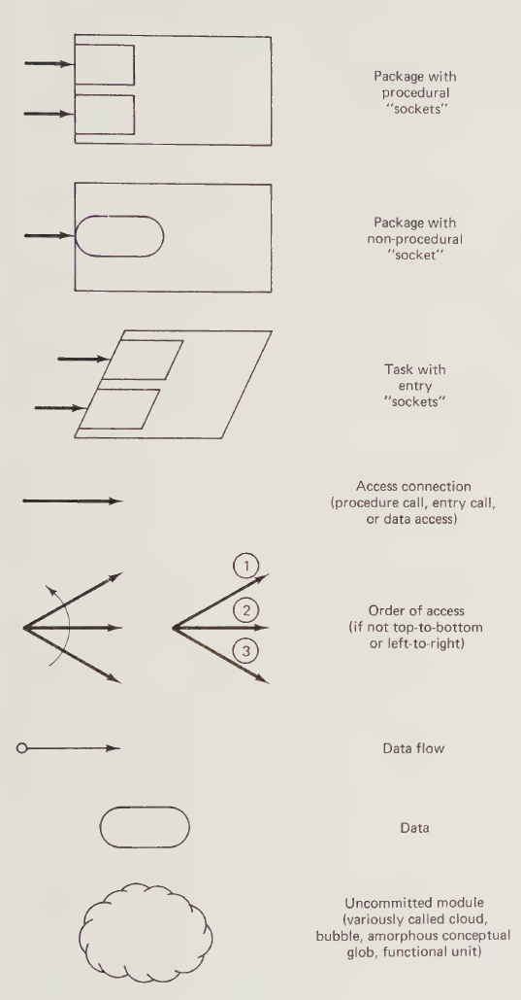

The significant difference between procedural access to packages and entry access to tasks lies, from the user's viewpoint, in mutual exclusivity and timing, not functionality. The rendezvous mechanism requires the calling task to meet with the accepting task and then wait while the accepting task services the call. If an accepting task is busy performing its own work or interacting with another task, then it cannot accept a new call. In such circumstances, new callers must wait in a queue associated with the entry. This ensures mutually exclusive processing of entry calls from different tasks. It also has timing implications for the caller, who may have to wait for an unpredictable length of time to return from the call.

The symbols of Figure 3.1 are not sufficient for all purposes. In particular, the rendezvous mechanism has a number of options which must be distinguished for design purposes by different symbols.

In what follows, the reader should assume, unless stated otherwise, that all tasks loop forever and never terminate. The calling and accepting patterns shown in the figures then may be interpreted as patterns for one cycle of the loop.

Figures 3.2 and 3.3 illustrate the various rendezvous options and the corresponding pictorial symbols. As illustrated by these figures, entry calls may be unconditional, conditional, or timed, and acceptances of entry calls may be in fixed order, in time order (first-come-first-served), or conditional. As well, the acceptor may time out if no calls occur for a predefined time interval.

With reference to Figure 3.2, we introduce a new symbol with a bent-back arrow to indicate refusal by a caller to wait indefinitely for acceptance. The refusal can take two forms. If no delay is permissible, then the call is said to be conditional, and an alternative action indicated by an ELSE statement must be specified. If a delay T is permissible, then the call is said to be timed, and the permissible delay T must be specified in an OR statement. In either case an alternative action may be performed.

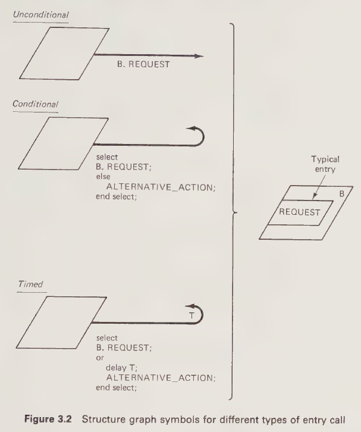

As shown by Figure 3.3(a), entries accepted in fixed order are indicated pictorially either by an arrow drawn across the access arrows in the structure graph in the fixed order of acceptance or by numbering the arrows in that order. As shown by Figure 3.3(b), a set of entries accepted on a first-arrival basis (in other words in time order) by selective waiting is indicated pictorially by drawing a line around or across the corresponding set of entry sockets. As shown by Figure 3.3(c), entries ignored until a guard is cleared are indicated by a dot adjacent to the access arrow. As shown by Figure 3.3(d), the possibility of timeout from a selective wait condition is indicated by including a delay alternative, as a pseudo-entry socket in this task. Such an alternative is like another entry from the acceptor's point of view. It is effectively an entry called by the run-time system.

In Figure 3.3(b), the selective accept clause indicates that the acceptor task wishes to wait for the first entry call of any of entries A or B; if calls on A and B occur simultaneously, then one of them is to be picked at random. When a call is made and accepted, the rendezvous lasts until the acceptor reaches the END statement. This is the so-called critical section. Further processing may be performed by the acceptor relative to an entry after the end of the critical section but before leaving the selective wait clause.

With reference to Figure 3.3(b), it is essential to understand that waiting for an entry call in a selective wait clause is not busy waiting. The form of the selective wait clause, with its list of select alternatives separated by or, can mislead the reader into thinking that these alternatives are tried one after the other in an iterative fashion until one is found on which a call is pending. Nothing could be further from the truth. In fact, the entire selective wait clause, with all its select alternatives, should be regarded as a primitive instruction to set up a compound waiting condition. During the waiting period, the accepting task is in a suspended state.

In Figure 3.3(c), the WHEN statement uses a guard variable X to defer acceptance of a call on entry A until X is true. In practice a guard will be cleared during processing of another entry in the same selective wait statement or as a result of an entry call to another task.

With reference to Figure 3.3(c), it is essential to understand that guards are set when the select clause is invoked and do not change dynamically while the task is waiting. With reference to any of Figures 3.3(b)-(d), it is essential to understand that only one entry call is accepted in a single invocation of a selective waiting clause. After processing this entry, the acceptor will typically invoke the clause again to wait for another entry call, on the next cycle through its infinite loop.

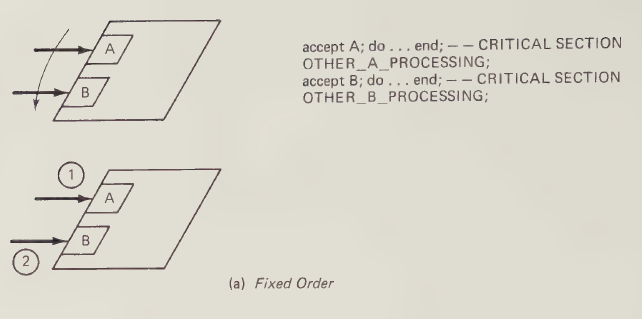
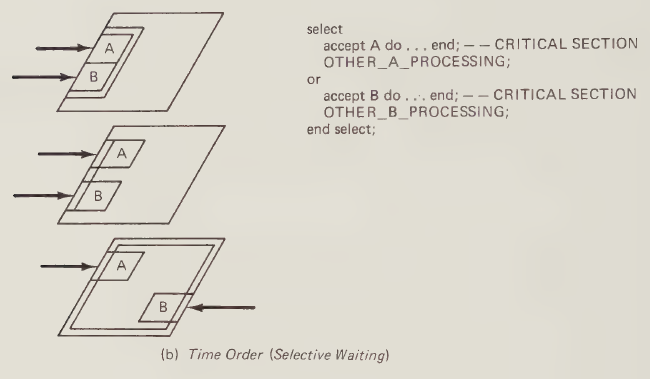
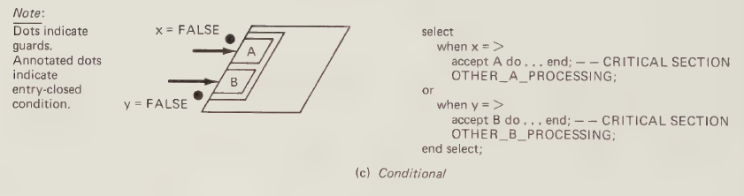
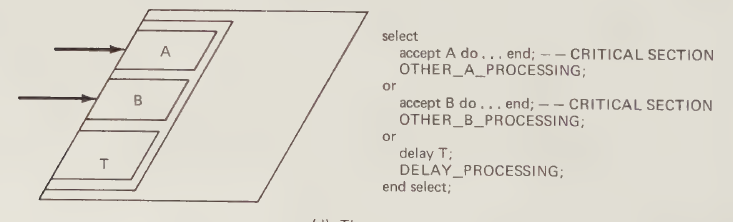
**Figure 3.3 Structure graph symbols for different types of entry acceptance**

It will be useful to distinguish the types of delays which can occur in task interactions as follows:

1. A calling or accepting task may experience structural delays resulting from either fixed order of acceptance or conditional acceptance. Structural delays depend on the structure of the interactions between tasks. The possibility of their occurrence is visible in the structure graph.

2. A calling task may experience congestion delays due to entry queueing. Congestion delays depend on the number of tasks calling a single acceptor and on the frequency of their calls. The possibility of congestion delays is thus also visible in the structure graph.

3. A calling or accepting task may experience latency delays, even in the absence of structural delays or congestion delays. This may occur either because the accepting task has not yet reached the point in its internal logic where it accepts an entry which has already been called or because the calling task has not yet reached the point in its internal logic where it calls an entry which has already been accepted. Latency delays must be assumed to be small in any sensibly designed system. Their nature is not visible in the system structure graph.

Figure 3.4 illustrates how some of these symbols may be used to depict systems. Figure 3.4(a) is a data flow graph, which shows only data flow between modules. It does not show access connections. It may include any of the module types of Figure 3.1. Figure 3.4(b) is a structure graph, which shows the actual access connections between modules. A structure graph also shows the data flow between modules. It presents a static picture of the structure of the system, including both control and data interactions. It also gives some information about the sequencing of interactions.

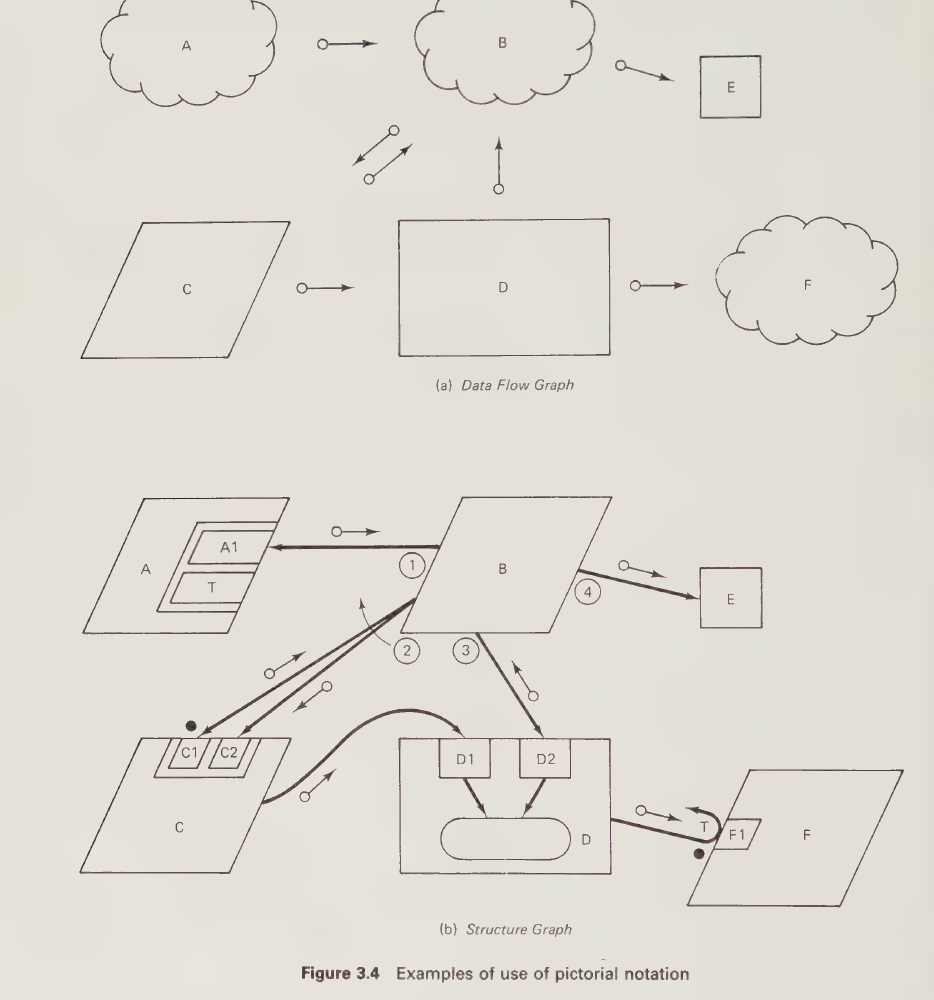

To a large extent, packages and tasks may be freely interconnected and nested as illustrated by Figure 3.5. Care must be taken to ensure that where a package is accessed by more than one task, the tasks will not interfere with each other. This is a design problem covered in Section 3.2.

As illustrated by Figure 3.5, it is useful to distinguish between passive and active packages. A passive package contains no nested tasks. An active package contains nested tasks, which may be hidden by the package interface specification.

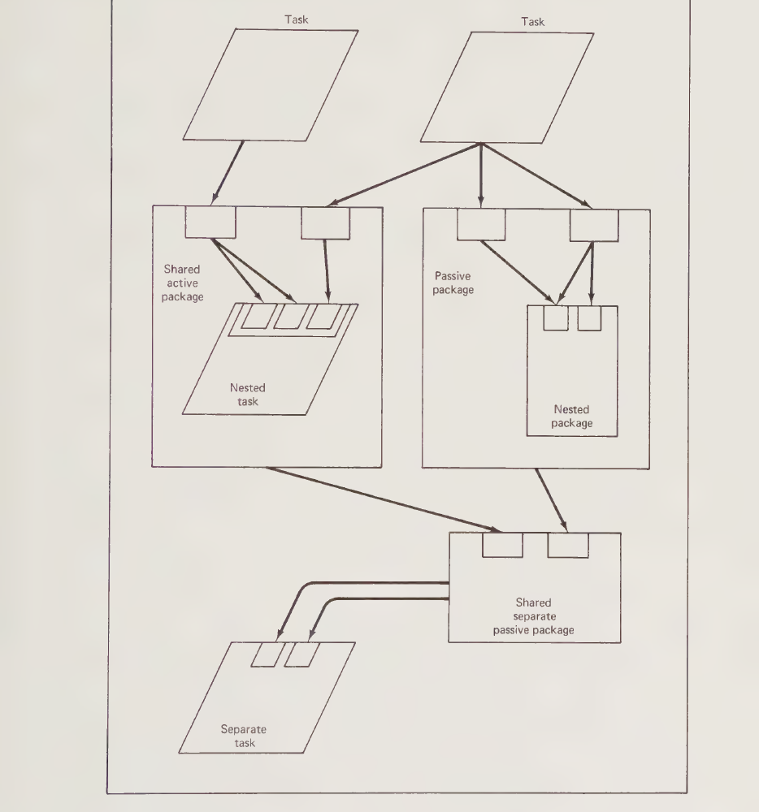

Our pictorial notation provides a hardwarelike metaphor for systems as collections of black boxes connected together by plugs and sockets. However, this is primarily a static metaphor, helpful mainly for visualizing relationships.

A dynamic metaphor of system operation is required for visualizing operation of the system as a dynamic entity with possible concurrent activities. This requirement is addressed in Section 3.2.2, following.

### 3.2.2 Dynamic Metaphor of Ada Tasking: Human Interactions
Our purpose here is to assist the reader in harnessing his or her intuition about human interactions and organizations to develop a dynamic metaphor of Ada tasking.

Think of the structure graph of a system as describing the static, physical structure of a business office. People in offices are connected by corridors and doorways. People correspond to tasks. Corridors correspond to access connections. Offices with their doorways correspond to interfaces of tasks or active packages. Walking down a corridor to another office corresponds to a task entry call or an active package procedure call. Waiting outside the office for service and then receiving service corresponds to the rendezvous mechanism. Using a passive resource such as a dictaphone, word processor, or filing cabinet corresponds to accessing a passive package.

A small portion of the structure of a business office is depicted by the structure graph of Figure 3.6. Figure 3.6(a) provides an informal view, using stick figures for people, and Figure 3.6(b) provides a corresponding Ada view. This graph shows an incomplete set of possible access and rendezvous relationships among several persons (tasks) and passive black boxes (passive packages) in a typical office environment. Note that this structure is not necessarily a good one; it is simply one of many possible structures. Shown are five persons: the vice president, two managers, a secretary, and an assistant to one of the managers. Also shown are three passive black boxes, all of which are filing cabinets in this particular example. Because, in the sense we shall be developing it, the analogy between black boxes and packages and between persons and tasks is exact, for clarity we shall henceforth refer only to packages and tasks. We shall now proceed to describe the relationships in this figure informally.

First consider the vice-president task. He accesses his private filing cabinet at his own pleasure without any need to coordinate this access with any other task. He may also choose to access a more public filing cabinet, such as the company personnel file, and then perform a rendezvous with one of his managers to hand over control of that file to the manager. The access arrow from the vice-president task to the personnel manager indicates a visit by the vice president to the personnel manager's office to make a rendezvous. Here the rendezvous is used to request the acceptor to perform a service on behalf of the caller. The caller names the service requested, in this case process personnel file, and may also pass parameters to the acceptor such as the name of the person whose file is to be processed and the type of processing required. In general a rendezvous may be used to pass parameters and data in either direction. While a rendezvous is in progress, the caller waits, and either task may have to wait for the rendezvous to commence. For example, the vice-president may have to wait for the manager to accept his request, or the manager, who may be expecting a request from the vice-president, may have to wait for his request to arrive before it can be accepted.

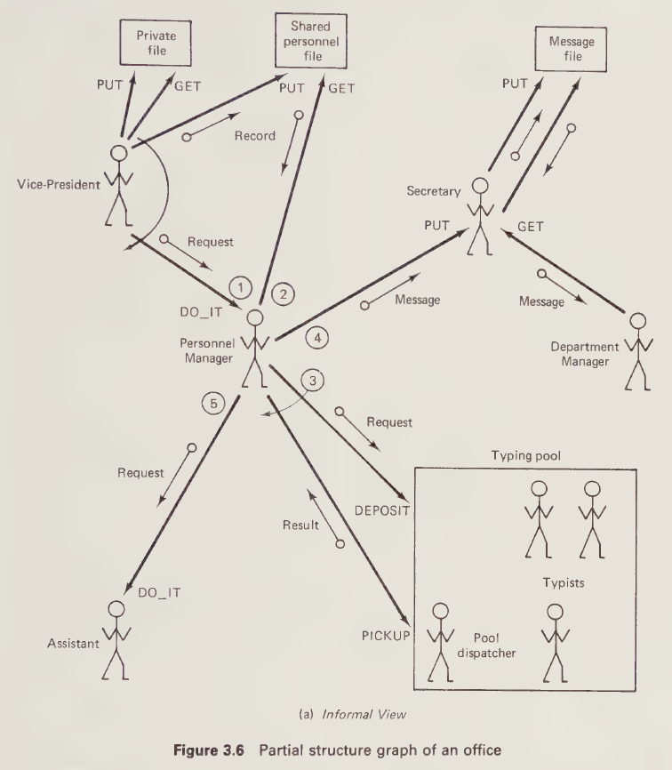

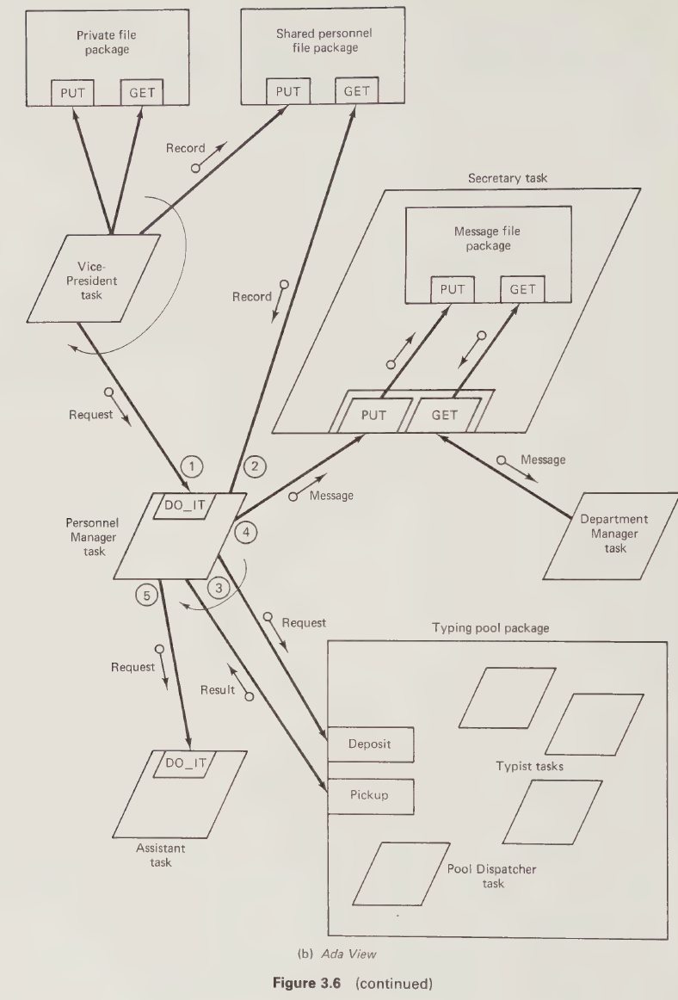

In this particular example, the vice-president task accesses three modules, namely two passive packages and one task. The structure diagram can give considerable information on the time ordering of these accesses as shown.

An Ada program skeleton for the vice-president task is given in Figure 3.7. The term skeleton implies that only the major logical features of the program are given, omitting details. Program skeletons of this kind are sometimes useful design and specification tools. Note in this case, however, how the information contained in the program skeleton is also contained in more compact form in the structure graph.

**Figure 3.7 Ada program skeleton for the vice-president task**

```ada
task body VICE_PRESIDENT is
begin
loop
PRIVATE_FILE.GET(...);
PRIVATE_FILE.PUT(...);
PERSONNEL_FILE.PUT(...);
PERSONNEL_MANAGER.DO_IT(...);
end loop;
end VICE_PRESIDENT;
```

Now consider the personnel manager. He waits for a call from the vice-president and then processes the named personnel record. Interactions of the type depicted here which involve a shared package are tricky in programming terms, as they are in real life, because control over the shared package must be very carefully handed over from task to task. For example, the vice-president must be careful not to modify the particular record in the personnel file after he has asked the personnel manager to process it and before the personnel manager has informed him that the work is done.

To process the file, suppose the personnel manager has the following operations to perform: he must pick up the designated record, have a report typed based on the record, pass the report to the manager of the department concerned, and request his own assistant to keep track of further developments. He may be happy to interact directly with the typing pool and with his assistant, knowing they will not keep him waiting, but direct interaction with the departmental manager, who is not always available, may be inconvenient. Therefore he may decide instead to perform a rendezvous with a secretary to deposit a message for the departmental manager. Whether the departmental manager performs a rendezvous with the secretary to pick up messages before the message is deposited or after the message is deposited does not matter to the personnel manager; in either case, the personnel manager expects that the message will get there eventually.

An Ada program skeleton for the personnel manager task is given in Figure 3.8. The secretary performs message-drop services for a number of managers depositing these messages in a message file as they arrive from some managers and handing them over to other managers as they are requested. The secretary initiates no rendezvous but participates in a number of rendezvous by accepting calls for service.

**Figure 3.8 Ada program skeleton for the personnel manager task**

```ada
task PERSONNEL_MANAGER is
entry DO_IT(...);
end PERSONNEL_MANAGER;

task body PERSONNEL_MANAGER is
begin
loop
accept DO_IT (...) do... end;
PERSONNEL_FILE.GET(...);
TYPING_POOL.DEPOSIT (...);
TYPING_POOL.PICKUP (...);
SECRETARY.PUT (...);
ASSISTANT.DO_IT (...);
end loop;
end PERSONNEL_MANAGER;
```

An Ada program skeleton for the secretary task is given in Figure 3.9. The assistant to the personnel manager simply waits for orders from the personnel manager and then executes these orders. This execution is not shown.

The departmental manager picks up messages from the secretary by initiating rendezvous with the secretary and then performs his own functions not shown in the structure diagram.

**Figure 3.9 Ada program skeleton for the secretary task**

```ada
task SECRETARY is
entry PUT (...);
entry GET (...);
end SECRETARY;

task body SECRETARY is
begin
loop
select
accept PUT (...) do... end;
or
accept GET (...) do... end;
end select;
end loop;
end SECRETARY;
```

Consider now the interaction of the personnel manager and the typing pool. The personnel manager needs to be able to assign typing of the report to any free typist in the pool. Similarly, free typists in the pool need to be able to signify their readiness to do work for users of the pool. There are two approaches to these types of interactions in human organizations:

* third party coordination by another person, acting as a dispatcher for the pool, or
* direct multiway interactions between the multiple persons in the pool and the multiple potential users.

Third-party coordination is easy to describe. The clients and the typists both rendezvous with a pool dispatcher who accepts typing requests and allocates work to free typists. The dispatcher and typists are together regarded by users as a resource with its own office. This resource is an analogy for an active package.

Direct multiway interactions between users of the typing pool and the typists in the pool are more complex to describe. In human terms, a user may walk into the pool and, in effect, broadcast a request to all typists in the pool. This may be done by shouting, ringing a bell, visual scanning and making eye-to-eye contact, or other similar means. If there are many free typists, they will require a method of agreeing among themselves who will volunteer to perform the service. Alternatively, they may all volunteer, and the user will accept one and reject or ignore the rest. In the latter case, typists not explicitly rejected will have to recognize that they have been ignored. If the pool is very busy, then many users may be waiting for service, and a method for matching users to typists is required.

Clearly, the Ada rendezvous mechanism provides a good metaphor for systems as groups of persons interacting on a one-to-one basis. Multiway interactions must be reduced to sets of one-to-one interactions to be described in rendezvous terms. Third-party coordination of multiway interactions is directly and easily described in this way; direct multiway interaction is not.

There are two ways of looking at Ada's restriction to one-to-one interactions between tasks:

* as a welcome application of the KISS (Keep It Simple Stupid) principle, or
* as a limitation.

On the one hand, if Ada provided a mechanism by which a rendezvous could occur with any free member of a selected pool of tasks, then the multiway direct interaction could be more simply described in Ada. There would need to be a method for queueing multiple tasks wishing to avail themselves of this mechanism for the same pool. On the other hand, as was discussed earlier, such a mechanism can be easily specified in Ada by packaging a number of worker tasks and a dispatcher task to form such a pool. Thus there do not appear to be any limitations imposed on design freedom by the one-to-one nature of the rendezvous mechanism.

We defer the detailed consideration of structure graphs and program organizations for active packages and for pools of tasks until Section 3.3.

The relationships shown by the structure graph of Figure 3.4 and the program skeletons of Figure 3.5, although incomplete, are representative both of real operations in an office and of interactions between program modules in an Ada program. There are a number of aspects omitted from this particular example diagram which give rise to further questions. For example, how, later on, can the vice-president check or be notified that the correct action has been performed? This question and others like it lead, in programming terms as in real life, to a need for multiple rendezvous between the vice-president and the personnel manager and, indeed, between other tasks in the structure diagram. However, we shall leave these questions to Section 3.3.

We now need to examine the rendezvous mechanism in more detail.

### 3.2.3 Human-Interaction Metaphor for the Ada Rendezvous Mechanism
A metaphor for the rendezvous mechanism in human interaction terms for the simplest type of rendezvous is illustrated in Figure 3.10. The caller leaves his office and goes to the acceptor's office, where he finds the acceptor's door open. He gives a request form providing the nature and parameters of the request to the acceptor and then goes to sleep outside the acceptor's office. The acceptor, who has been waiting for a call with his door open, accepts the request form and processes the request while the caller is asleep. At the end of the rendezvous, the acceptor reopens his door and awakens the caller, who then returns to his office.

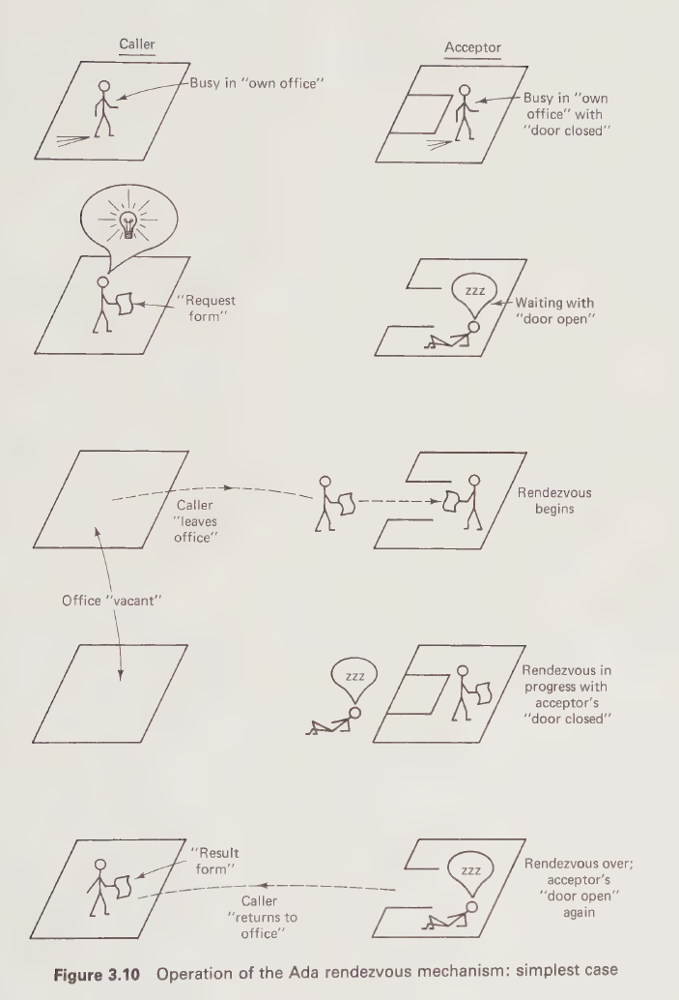

Life is not always as simple as in Figure 3.10 and in general, either the acceptor must wait with his door open for a call, or the caller must wait outside the closed door for acceptance before rendezvous can begin. Figure 3.11 illustrates both of these cases. In either case the progress of the rendezvous after it begins is the same as shown in Figure 3.10.

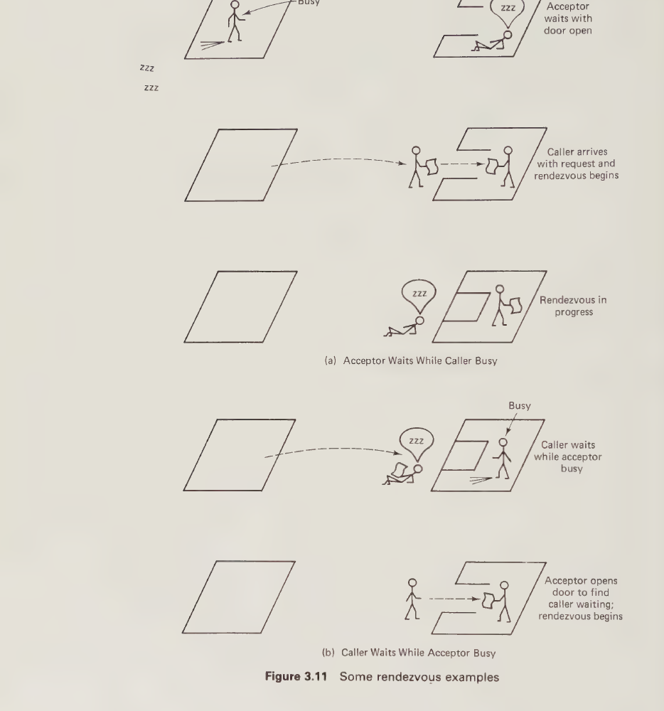

Figure 3.12 illustrates the general case. Multiple callers queue in first-in-first-out (FIFO) order outside the acceptor's door (multiple doors symbolize multiple entries). In Ada terms there is a separate entry queue for each entry, organized in first-in-first-out order. Not all doors may be open while the acceptor is waiting; closed doors correspond to closed entries (closed by guards).

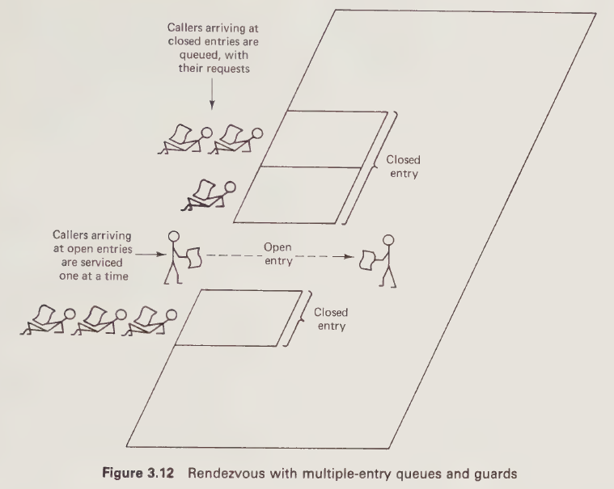

Where no parameters are associated with the call of an entry, it is appropriate to think of each request form as simply a token to indicate that the service provided by that entry is required. In general terms, the request form includes input parameters and a tear-off sheet containing spaces to fill in returned parameters. The caller picks up this tear-off sheet from the acceptor before walking away from the rendezvous.

An acceptor may close his door again immediately after terminating a rendezvous, even if someone is waiting outside the door, in order to finish processing the request associated with the terminated rendezvous, or to perform other internal actions.

Structural delays are experienced by callers when a door is closed even when the acceptor is not busy and other doors are open. Congestion delays are experienced when a queue forms in front of a door which the acceptor is servicing as fast as possible. Latency delays are experienced when all doors are closed while the acceptor performs his own internal work even though no guards are set. Note that an acceptor's own internal work might require him to visit other offices. Therefore, when a door is closed, the acceptor might not even be in his office.

Thus, visits to other offices may waste time in unpredictable ways. And while absent from his own office, a person may miss important events. Other things being equal, a person in an office will usually prefer to interact with other persons by being visited rather than by making visits. Then there is never any need to waste time waiting for other persons unless there is nothing else to do.

Obviously, this selfish viewpoint would result in no interactions at all if every task adopted it. As we shall see, in Section 3.3, the problems of designing interaction structures for interacting tasks center around deciding which tasks have roles which require minimal interference with their other work. Only in the simplest systems is the rendezvous direction unimportant; for example, if two tasks interact only with each other then it is not important who calls whom.

As a final remark on the rendezvous mechanism, any impression that may have been formed that a rendezvous restricts callers and acceptors from concurrent activities while the acceptor is servicing a request made by an entry call should be dispelled. The restriction on concurrency exists only during the actual rendezvous when the entry call itself is being processed. A rendezvous may be used simply to deposit a request which may require further processing by the acceptor after the rendezvous has terminated. An example is the rendezvous performed by the vice-president with the personnel manager in Figure 3.6, to hand over a file for processing. The vice-president may continue to work independently after the rendezvous has terminated, while the personnel manager processes the file. In this case, the rendezvous itself is used only to pass the request to process the file.

## 3.3 DEVELOPING A PARTS KIT OF CANONICAL ARCHITECTURES
### 3.3.1 Introduction
Having introduced tasks and packages from an informal viewpoint and having considered a few examples of their use, we now proceed to a more general viewpoint in which we present and classify various ways of structuring parts of systems using these building blocks. A goal of this section is to develop a basic set (or parts kit) of canonical, structured system parts. Various types of canonical parts are obviously possible, and our concern here is to classify these types, discuss their properties, and provide guidelines for selecting appropriate types for particular circumstances. Note that the term type in this context does not mean data type in the Ada language sense.

Because most of the problems arise in concurrent systems, the concern here will be mainly with concurrent systems.

First, we need a few definitions.

System parts may be composed of tasks of the following functional types:

1. **Slave**: a task which interacts with only one other task (called its master) to receive work to do; may call its master to get the work and to report on its completion or vice versa; may also be assigned by its master to perform work for others.
2. **Server**: a task which performs services in response to calls from a number of user tasks; never calls other tasks, either autonomously or in response to requests; has no control over other tasks; always accepts calls immediately, subject only to the usual constraint of accepting one caller at a time.
3. **Scheduler**: a task whose only purpose is to delay the acceptance of calls on particular entries, subject to prevailing conditions.
4. **Buffer**: a combined server/scheduler used for deposit and pickup of items.
5. **Secretary**: a task with greater autonomy than a server/scheduler, which not only provides services and performs scheduling, but also makes calls to other tasks to report results.
6. **Agent**: an autonomous task which not only performs as server, scheduler, and secretary, but also does its own work involving autonomous calls to other tasks (note that, in these terms, many so-called secretaries in human organizations are actually agents).
7. **Transporter (or messenger)**: a task whose purpose is to transport items between other tasks; makes calls to other tasks to pick up and deliver items but has no other control over the activities of other tasks.
8. **Users, managers, etc.**: autonomous tasks which interact with tasks of the other types to perform some overall system function.

We have seen that tasks may be grouped into functional units in active packages, just as persons in human organizations may be grouped into functional units in offices. Such active packages behave in many ways like tasks and, like tasks, may be classified into the same functional types as above. Thus system parts may be composed not only of tasks, but also of active packages of these functional types.

Tasks and active packages may also be usefully classified according to the directions of their data and control interactions with other tasks and active packages. Such a classification is provided in Figure 3.13.

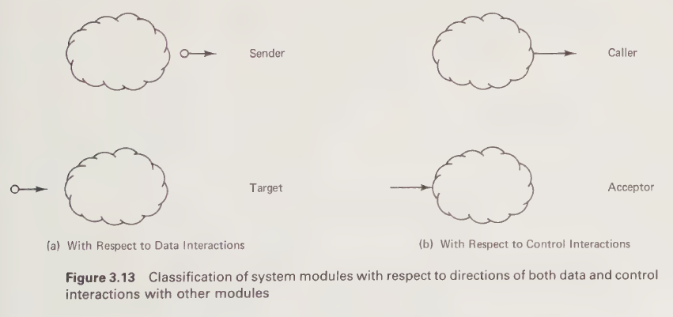

With respect to data interactions, a module (task or active package) may be classified as a *sender* or a *target* (or both). With respect to control interactions, a module may be classified as a *caller* or an *acceptor* (or both). For example, an item may be passed from a caller-sender to an acceptor-target via a call in the direction of the data flow. Alternatively, an item may be passed from an acceptor-sender to a caller-target by a call in the opposite direction to the data flow. It may sometimes be convenient to use the term *middle-man* to denote modules which are both senders and targets or both callers and acceptors.

Let us now consider some basic types of system architectures involving packages and tasks.

### 3.3.2 Architectures Involving Shared Packages
Sequential system structures involving passive packages were briefly discussed in Section 3.2. Such structures present few technical or conceptual difficulties, and accordingly, further discussion of them will be postponed until we discuss design examples in subsequent chapters.

Consider now the interaction of many tasks with a shared passive package; such interaction presents coordination problems which may be solved as shown in Figure 3.14. This figure uses the STACK package of Chapter 2 as a convenient example of a package whose visible procedures access shared internal data. Whether or not a stack would be shared in practice between many tasks is irrelevant to the points we wish to make here. The figure illustrates both structure graphs and program skeletons for the major components of the structure graphs.

Several tasks may share a package without further coordination if the package procedures are reentrant and there is no shared internal data or if the package provides read-only access to shared internal data as shown in Figure 3.14(a). Uncoordinated sharing is also possible if timing conditions in the system ensure that calls to the package can never overlap; however, this approach is unsafe in general, because timing conditions may change with time. Otherwise some coordination is required.

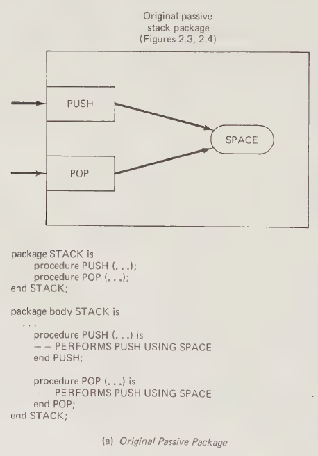

One form of coordination, shown in Figure 3.14(b), is to change the package into a server task whose entries provide the same services as the procedures of the original package.

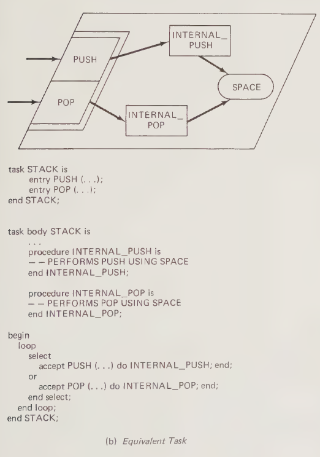

Another approach, shown in Figures 3.14(c) and 3.14(d), is to change the package into an active one with a nested scheduler task to enforce mutual exclusion.

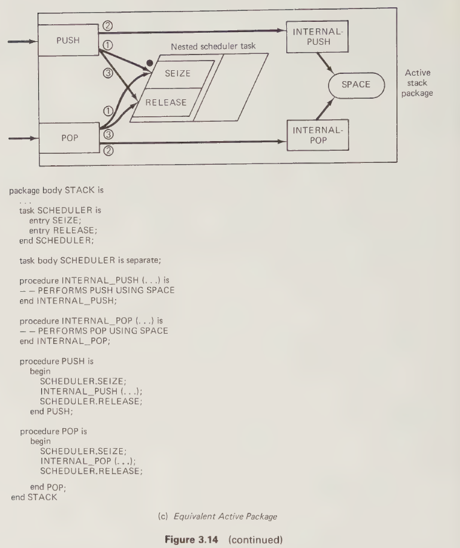

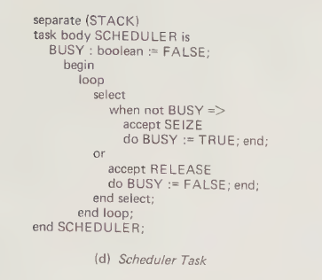

A final approach, shown in Figure 3.14(e), is to leave the original package untouched and to use a separate scheduler task which allocates the package to user tasks as required: the user tasks must agree that they will use the package only after calling the scheduler.

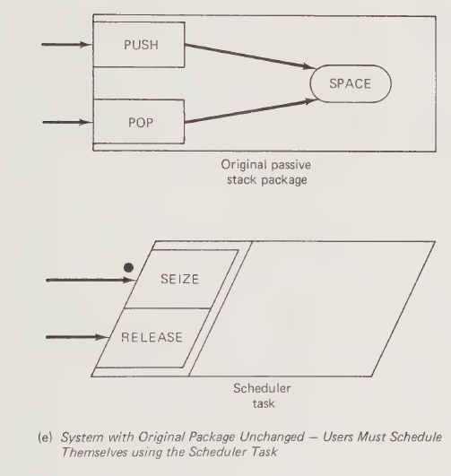

Is one of the solutions of Figure 3.14 preferred? The solution of Figure 3.14(b), which uses a single server task, is attractive because it combines intuitive clarity with safety. The solution of Figure 3.14(c) is attractive because it preserves the facade of the original package. Finally, Figure 3.14(e) provides a more complicated interface to user tasks than seems desirable and is potentially unsafe because of the lack of direct protection of the package contents from use by unauthorized tasks.

### 3.3.3 One-Way Interaction Architectures
In preparation for the data-flow-based design technique used in subsequent chapters, the development of appropriate architectures for canonical system parts in this and subsequent sections of this chapter is based on data flow.

Consider how tasks may interact to pass items (requests or data) in one direction. We have seen several examples of such direct interactions in Figure 3.4. In such interactions, the item being passed may flow in the direction of the rendezvous or in the opposite direction. For example, in Figure 3.4, the request from the vice-president to the personnel manager flows in the direction of the rendezvous, but the message from the secretary to the department manager flows in the opposite direction.

In Section 3.2.3, several types of delays in task interactions were distinguished. In considering the performance characteristics of various candidates for our parts kit of interaction architectures in this chapter, we shall be concerned mainly with structural delays; that is, those which involve conditional waiting.

Structural delays have the interesting property that their average duration tends to increase with decreasing interaction activity and vice versa (interaction activity measures the rate of flow of items between pairs of tasks). For example, when a task is waiting for an item, the average length of time it must wait is inversely dependent on the average rate of flow of items. Thus a high level of interaction activity may reduce structural delays effectively to zero. It follows that different interaction structures may be appropriate for different levels of activity.

The possibility of congestion delays will affect our thinking in this chapter only through the principle stated earlier that a busy task will always prefer to act as an acceptor rather than a caller in its interactions with other tasks. One reason for this preference is that a call to another busy task risks a congestion delay.

Following the discussion of Section 3.2.3, we shall ignore the possibility of latency delays.

Suppose a single sender task wishes to send something to a single target task as shown in Figure 3.15(a). Then two main possibilities are clearly apparent: the sender may send it via an unconditionally accepted call directed to an acceptor target, as shown in Figure 3.15(b), or a caller target may request it via a conditionally accepted call directed to the sender, as shown in Figure 3.15(c). Clearly the first approach will be preferable to the target and the second to the sender; no choice can be made without further information.

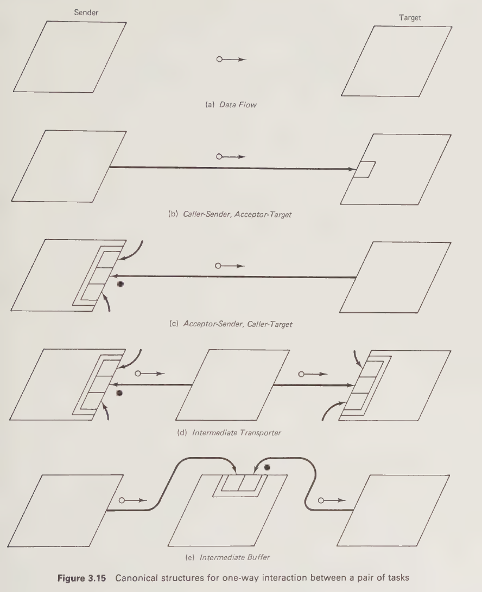

The further information that is needed is the nature of the roles of the two tasks in a system context. If two tasks interact only with each other via a single rendezvous, then the direction of the rendezvous is unimportant. If, however, the sending task has other interactions (for example, due to its role as a server, scheduler, buffer, secretary, or agent), so that unnecessary interference is intolerable, then configuring the target task as a caller as in Figure 3.15(c) is preferable. In these circumstances, the target task must be prepared to put up with postponing its other work while waiting for the sender to accept its call.

If the target task cannot afford to do this and interaction activity is low, then this configuration is unsatisfactory. On the other hand configuring the target task as an acceptor, as in Figure 3.15(b), ensures minimal interference with its other activities but may be unacceptable to the sender.

If neither the sender nor the target can tolerate interference with their activities, then a solution is to use a transport task, as shown in Figure 3.15(d). The figure shows this structure as appropriate for communication between tasks which also have other entries, so that the entry called by the transport task may be included within a single selective accept clause in the called task.

A transport task may be regarded as the target's stand-in or partner, which does the target's waiting for it.

Because a transport task calls both the sender and target instead of them calling it, it provides minimal interference with their other activities, and by definition it has no other activities to be interfered with, so it can afford to wait. This solution is often one that is adopted in human organizations in similar circumstances.

For high levels of interaction activity, the transport task of Figure 3.15(d) will seldom or never have to wait for items. A possible approach in this case is to eliminate guards and have the transport task operate on a fixed schedule. It may do so by delaying itself on each cycle of its infinite loop. Note also that for high levels of interaction activity, the sender may need buffer storage for items being produced at a higher rate than they can be picked up by the transport task. For this case, the transport task may be designed to carry more than one item.

As shown in Figure 3.15(e), an alternative approach for high levels of interaction activity is to provide a buffer task between the sender and target which can handle any temporary excess of items produced by the sender, thus, removing the need for buffer storage from the sending task. This will be an appropriate solution only if the target task interacts with other tasks only through the buffer task. We shall have more to say on this later.

A buffer task was illustrated by an Ada program example in Chapter 2. An Ada program skeleton showing the typical interactions of a sender and target task via a transport task is provided in Figure 3.15(f). Note the assumption that the entries called by the transport task are members of a selective wait group at either end.

**Figure 3.15(f) A Transport Task Example**

What if several tasks may send something, as shown in Figure 3.16(a)? Again, two main choices for direct interaction are possible, with the target task as a caller, as shown in Figure 3.16(b), or as an acceptor, as shown in Figure 3.16(c). Unlike Figure 3.15, there is a clear difference between the acceptor and caller approaches even when further information about the roles of the tasks in a system context is not available. A caller target task must choose which sending task to call, and once it has made the choice, it is stuck with it until the called task has something for it; in the meantime an item may come along from another sending task which it could pick up if it wasn't waiting elsewhere. Furthermore, it must know all its senders.

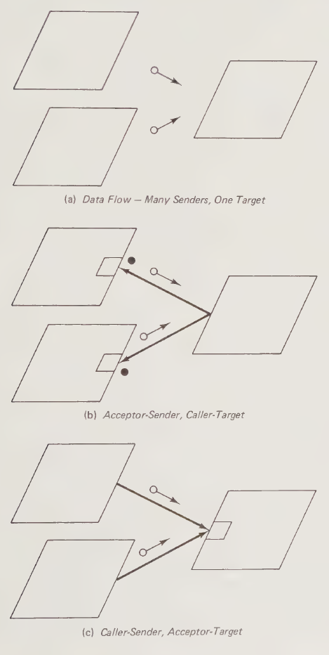

On the other hand an acceptor target task may pick up the first call from any sender, as shown in Figure 3.16(c), and it does not need to know all its senders. Therefore it seems wise to configure the target as an acceptor in these circumstances with a proviso that senders must not be made to wait unnecessarily due to other activities of the target task.

However, if the target task is configured as an acceptor, as recommended above, and if it is often otherwise occupied so that it is not always able to accept the entry calls in question quickly, then all senders may be unnecessarily blocked, waiting for a rendezvous. In these circumstances, neither of the approaches of Figure 3.16(b) or 3.16(c) is satisfactory.

Now consider the circumstances of Figure 3.16(d), where one task sends to many targets. If the targets are acceptors, then problems arise similar to those of Figure 3.16(b). In these circumstances it is better to configure the target tasks as callers and the sender as an acceptor, as shown in Figure 3.16(e). The sender needs an entry for each target so that it can apply guards appropriately to force targets to wait when it has nothing for them. This approach assumes that the target tasks can afford to wait in the sender's entry queues. If not, then a transport task must be introduced between the sender and each of its targets, as in Figure 3.16(f).

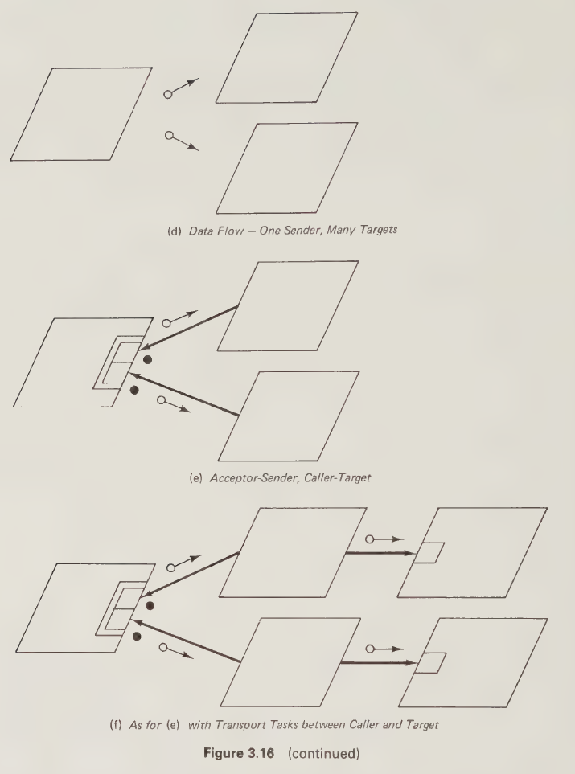

Of course, the problems of unnecessary delays either in picking up items sent or in unblocking senders in both Figures 3.15 and 3.16 can be solved by using conditional or timed calls. However, the calling tasks must be prepared to retry failed calls. They may also have to resort to polling a number of tasks before a successful call is made. This is a messy solution when a clean mechanism for selective waiting is available, as it is in Ada. Programs with retry and polling will tend to be both more logically complex and less efficient than programs without it.

What if there are many senders and many targets? Then a solution is to introduce one or more buffer tasks, as shown in Figure 3.17.

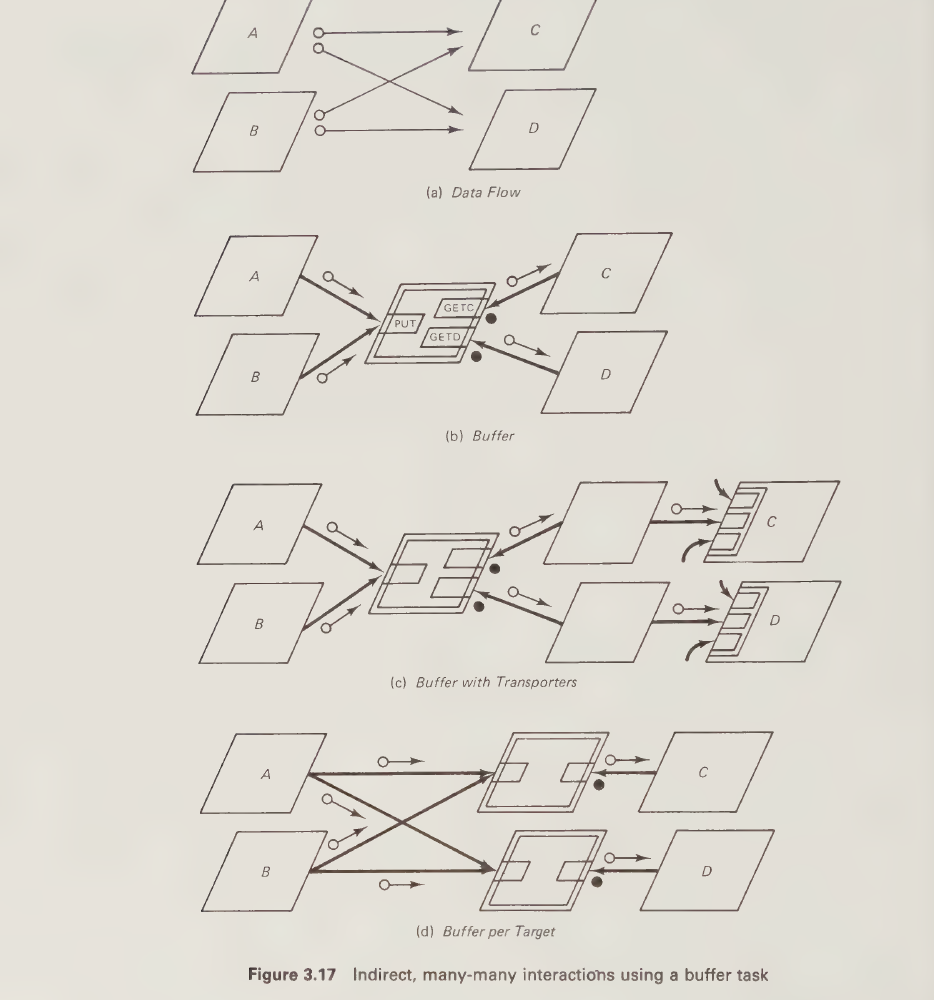

The buffer task of Figure 3.17(b) has a single SEND entry for all senders and a RECEIVE entry for each target. It is configured as an acceptor. It is not configured as a caller or a middleman for the following reasons. The caller choice can be rejected immediately for the same reasons as for Figure 3.16(b) when there is more than one sender. Configuring it as a middleman in the direction of data flow has the undesirable effect that it must decide when to attempt to rendezvous with each target task. If a target is otherwise occupied at the chosen time, then unnecessary, indirect blocking of sending tasks may occur. A way around this problem is to poll the targets using a conditional or timed entry call. However, as discussed previously, polling is undesirable and should be avoided. Configuring it as a middleman in the opposite direction to the data flow is also undesirable, for the same reasons that the caller choice was rejected in Figure 3.16(b).

Note that the approach of Figure 3.17(b) for providing a receive entry for each target is suitable only when all targets are well known. Otherwise, a single entry without conditional waiting may be used (implying that callers may have to keep trying).

The solution of Figure 3.17(b) assumes that the target tasks do not have to worry about missing other events while waiting in the buffer's entry queue. The assumption will be valid if the targets have no entries of their own.

To provide more flexibility, a transport task can be used between the buffer and each of its targets, as shown in Figure 3.17(c). This allows the target tasks to wait for other entry calls while the transport tasks are waiting for items to arrive at the buffer task. This solution is a generalization of that of Figure 3.13(d).

A solution with more tasks than Figure 3.17(b), but with desirable modularity properties, is shown in Figure 3.17(d). Instead of a single buffer task, there is a buffer task associated with each target task. Each such buffer task provides a single pipeline to its associated target task. Any task may use this pipeline to send items to the target task. The target task, for its part, receives all its interaction with other tasks through this pipeline. Thus it never needs to worry about missing other events while waiting in the buffer task's entry queue.

The price paid for using the structures of Figures 3.17(b) or (d), compared to Figure 3.17(c), is a loss in flexibility. In Figures 3.17(b) or (d), the target task must process items in the order in which they are supplied by the buffer task. In contrast, in Figure 3.17(c), the target task can place guards on its own entries to control the order of processing.

This loss in flexibility could be avoided at the price of additional complexity, by placing the appropriate entries and selective accept mechanisms in the buffer task. However, a complicated interaction may then be required between the buffer and the target because the application logic is distributed between them.

An Ada program skeleton for the buffer task of Figure 3.17(b) is provided in Figure 3.18.

**Figure 3.18 Code of a buffer task serving many senders and targets**

```ada
task BUFFER is
    entry PUT (ITEM: in ITEM_TYPE)
    entry GETC (ITEM: out ITEM_TYPE)
    entry GETD (ITEM: out ITEM_TYPE)
end BUFFER;

task body BUFFER is
begin
    loop
        select
            accept PUT (ITEM: in ITEM_TYPE) do
                STORE ITEM
                CLEAR APPROPRIATE TARGET'S GUARD
            end;
        or
            when SOMETHING FOR TARGET C =>
            accept GETC (ITEM: out ITEM_TYPE) do
                HAND OVER ONE ITEM
                SET GUARD IF NO MORE ITEMS
            end;
        or
            when SOMETHING FOR TARGET D =>
            accept GETD (ITEM: out ITEM_TYPE) do
                HAND OVER ONE ITEM
                SET GUARD IF NO MORE ITEMS
            end;
        end select;
    end loop;
end BUFFER;
```

### 3.3.4 Out-of-Order Scheduling
A requirement often arises for requests made in entry calls to be serviced in a different order (in time) from that in which they are made. This may be termed out-of-order scheduling. Such a requirement may arise when certain requests need to be treated differently at different times due to changing conditions or when certain requests have fixed higher priority than others. The best way of handling out-of-order scheduling in Ada is by providing separate entries to differentiate requests requiring different treatment. This enables out-of-order scheduling to be handled by the called task alone using guards. Entries are treated differently at different times due to changing conditions. The entry names must provide all the information required for the server to decide which entries to close until they can be serviced. This approach may in some cases require that a large number of entries be defined. For this purpose, arrays of entries, known as entry families in Ada, may be used.

Out-of-order scheduling may also be based on a parameter of the entry. However, this requires cooperation between tasks to accomplish the scheduling. The calling task must be prepared to have its request rejected if it cannot be serviced at the time its entry call is accepted. This is because the nature of the Ada rendezvous mechanism is such that the parameters of an entry call cannot be examined until after the call is accepted and there is no explicit mechanism for blocking a calling task at that point. Implicit blocking can be performed by nesting accept statements, but such an approach does not solve the out-of-order scheduling problem, because the nested rendezvous can only be terminated in the reverse order from that in which they were initiated. Therefore, if the parameters are such that the request cannot be immediately serviced, the acceptor usually has no alternative but to terminate the rendezvous and return a parameter indicating rejection of the request. The caller must then be prepared to try again. To ensure fair treatment of retries, the acceptor will need one or more retry entries which it preferentially accepts. But if extra entries are required anyway, why not provide separate entries in the first place to differentiate requests requiring different treatment instead of using parameters? Indeed, this is the proper approach.

A server task with some entries having fixed higher priority than others is illustrated in Figure 3.19. The figure shows a special structure diagram notation combining fixed-order and selective acceptance. The reason this notation was not introduced earlier is that it is not directly supported in Ada; it must be programmed, as shown in the figure. The server is always open to the highest priority entry. Lower-priority entries are open only if no one is waiting for higher-priority service. When no one is waiting on any entry, any entry at any priority level will be accepted. Thus, callers of lower-priority entries suffer longer congestion delays.

This solution assumes callers do not use timed entry calls. Otherwise a delay alternative would be required to prevent deadlock resulting from a high priority caller timing out after his entry count attribute has been checked but before his call has been accepted.

In an actual Ada run-time environment, there may be a slight, unavoidable anomaly if several calls occur "simultaneously," when all entries are open, because the selective accept mechanism will pick one at random. However, the practical implications of this anomaly will not be great if the time window during which simultaneous calls can occur is small. In any case only one anomalous call will be accepted, after which the guards will be readjusted. The practical difference is negligible between, first, a high-priority call hitting this window and then not being accepted and, second, missing this window and having to wait for completion of servicing of a lower-priority call.

An example of when such a priority server might be needed is when low-priority background tasks and high-priority real time tasks both use the server.

**Figure 3.19 Priority server task (following Wegner)**
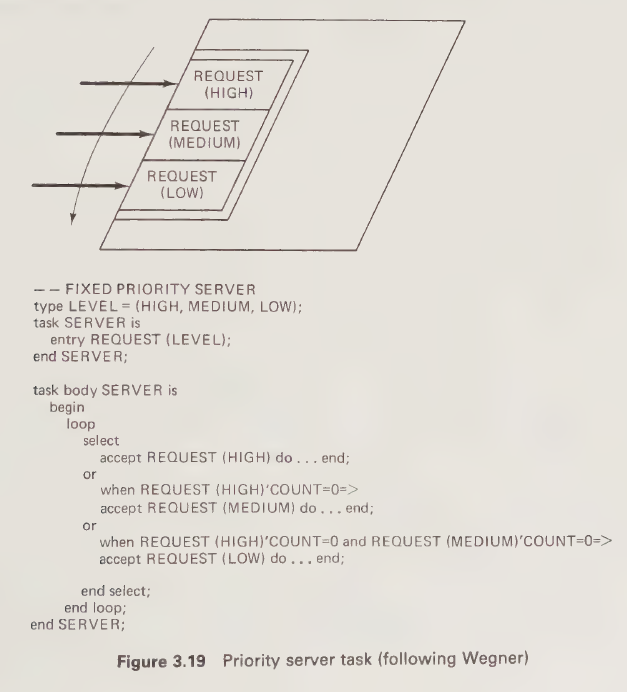

### 3.3.5 Two-Way and Multi-Way Interaction Architectures
Two-way interaction between two tasks occurs when items may flow in both directions between them.

A degenerate case of two-way interaction occurs when items are exchanged during a single rendezvous. This case is effectively one-way interaction; it will not be considered further here.

Many mechanisms involving multiple rendezvous and/or multiple tasks may be devised for two-way interaction between a pair of tasks. As we shall see, the alternatives have varying degrees of acceptability for various purposes. However, several alternatives can immediately be discarded as unacceptable, because of the danger of deadlock. Figure 3.20 provides examples. Deadlock may occur due to a direct structure graph cycle (Figure 3.20(a)), or due to an indirect structure graph cycle (Figure 3.20(b)). It may also occur when there are no apparent cycles in the structure graph, as shown in Figure 3.20(c). Figure 3.20(c) contains a possible mutual waiting cycle, due to improper closing of an entry by a guard. Figure 3.20(d) provides timing diagrams showing how deadlock can occur for all of these cases.

**Figure 3.20 Rendezvous deadlock**
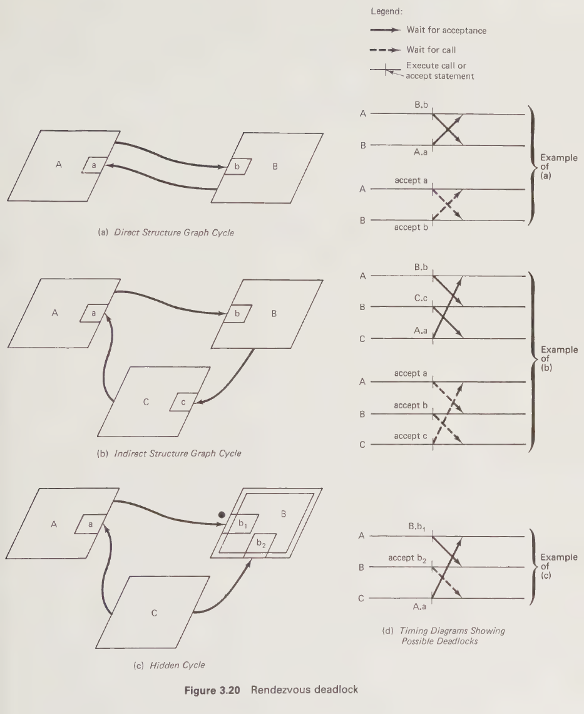

Figure 3.21 shows a number of deadlock-free ways of structuring two-way interactions between a pair of tasks.

As shown by Figure 3.21(a), direct structure graph cycles can be used safely by careful ordering of each task's sequence of call and accept statements. One task must make the first call, the other task must make the first accept, and thereafter each task's calls and accepts must alternate. However, this is a very restrictive approach.

Figure 3.21(b) illustrates another way of making a direct structure graph cycle safe, by using a conditional entry call in one direction. This concept is simple but requires additional logic to decide what to do if the call fails and when and how often to call again. The overall system is also conceptually complex, because return from a rendezvous does not mean the work was done. It also makes use of a unique feature of Ada, namely the conditional entry call, when other good solutions which do not require this feature are available. Both the KISS principle and the goal of using Ada as a design language suggest that the other solutions might be preferable.

In Figure 3.21(c), separate rendezvous in the same direction are used for the different directions of data flow. Pickup can be performed polling or by conditional waiting, neither of which is satisfactory in general.

Figure 3.21(d) has rendezvous in both directions but avoids deadlock by using a transport task in one direction. The sender in that direction accepts calls from the transport task only when it has something to be picked up. In the other direction the sender calls the other task directly. This solution is good if the direct call between the two primary tasks does not result in undue interference with the caller's other activities. The call should, therefore, not involve conditional waiting. This solution has the advantage over the next one of using fewer tasks but the disadvantage of providing an asymmetric solution to a symmetric problem.

The solution of Figure 3.21(e) uses two transport tasks, one in each direction, each of which conditionally waits for items to transport. This solution is flexible because it imposes no constraints on either of the primary tasks with respect to their interactions with other tasks, and as with all transport task solutions, it minimizes interference with the other activities of the primary tasks.

Figure 3.21(f) mimics a solution one often sees in human organizations for batched transport of items, where immediate delivery is not of concern but transport costs are of concern. A single transport task performs both pickup and delivery services for batches of items in both directions, on a scheduled basis, without conditional waiting. For high levels of interaction activity in both directions, such a single transport task handling both directions and running on a regular schedule performs as well as two transport tasks, one for each direction, each running on the same schedule. It seems questionable that constraints will often arise in computer programs leading to a requirement for such batched transport of items.

Transport task solutions have great flexibility, but suffer from two disadvantages in certain circumstances:

* the number of transport tasks required is proportional to the number of pairs of interacting tasks, which could be high if each task interacts with many others;
* there may be a need for internal buffering of items in the sender or target tasks, if interaction activity is high.

The buffer task solutions of Section 3.3.4 can be used for two-way, as well as one-way, interactions, to avoid these disadvantages, at the cost of some loss of flexibility. Figures 3.21(g) and 3.21(h) illustrate the approaches, which are identical to those for one-way interactions, except that primary tasks may be both senders and targets. The loss of flexibility was discussed in Section 3.3.4.

In terms of efficiency, both transport and buffer approaches require the same number of rendezvous to transfer data between a pair of primary tasks. However, this may be somewhat misleading, because the number of task context switches may be higher in certain circumstances for the transport task approach, simply because there are more tasks.

Multi-way interaction structures among many tasks may be handled by piecing together pairwise interaction structures from Figure 3.21 in a consistent fashion.

To be avoided are ad-hoc combinations of different interaction structures for the same set of tasks. Such combinations could contain hidden deadlocks due to pernicious combinations of entry calls and guards, even when entry call cycles are not present in the structure graph. An example of this kind of deadlock was given in Figure 3.20(c).

**Figure 3.21 Two-way interaction architectures**
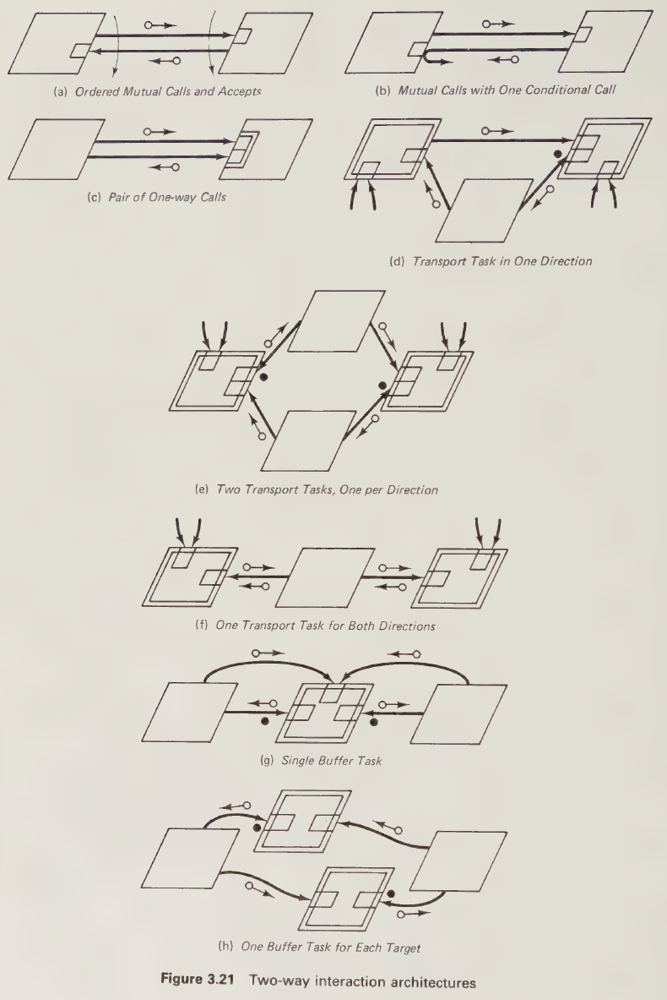

### 3.3.6 Intertask Flow Control
We have seen how tasks can arrange to send items to other tasks and to wait for items from other tasks, using a wide variety of canonical structures. We have also seen in passing how sometimes a sending task may be blocked by the unavailability of room for the item. Our first contact with this possibility was in the first example of tasking in the book, namely the buffer task of Chapter 2, in which a guarded WRITE entry provided the blocking. Such blocking is one way in which a target task may control the incoming flow of items. However, other ways are also possible, as described below.

Caller-target tasks may exercise flow control very simply by not calling for items. Acceptor-target tasks face a more complex situation.

In general, an acceptor-target task may exercise flow control in the following ways:

* block the item by blocking the sending task, using a guard;
* block the item by refusing to accept it from the sending task during the rendezvous but release the sender from the rendezvous;
* discard the item during the rendezvous;
* call potential senders to tell them when a flow control condition has been imposed;
* give credit to senders in advance of sending.

The first three approaches require that senders be prepared to try to send first and then either wait or fail, if flow control is being exercised, thus possibly tying up resources unnecessarily or losing data.

The fourth approach is not satisfactory because the warning may not get there in time and because it can result in deadlock due to simultaneous mutual calls.

The approach of giving credit in advance has attractive advantages. With this approach, a sender can always be sure that items it sends will not be blocked, and a target can always be sure that items it receives will be acceptable. In its simplest form, credit would take the form of a count of the number of items which the target can accept. The sender would agree not to exceed its current credit allocation. When its current credit allocation was exhausted, the sender would have to wait for additional credit before sending more items.

How should sender/target interactions be arranged to manage credit effectively? This depends on the canonical structure chosen for task interaction. Some possibilities are shown in Figure 3.22.

If interaction is direct or via transport tasks, then the approaches of Figures 3.22(a)-(b) are possible.

Figures 3.22(a)-(b) assume that, while credit is available, it is returned as an out parameter of the SEND entry (initial credit could be obtained by calling SEND with a null item). The differences between these figures relate to different ways of getting more credit after no more credit is available via SEND.

The target could call the sender back when credit becomes available, as shown in Figure 3.22(a). This is safe from deadlock because of the order of the calls and accepts. However, this introduces excessively tight (and, therefore, unmodular) coupling between sender and target.

As shown in Figure 3.22(b), the target could provide a separate, guarded `ASK_CREDIT` entry, where the sender may wait for credit after it has sent an item, if no more credit is available. If the sender cannot wait directly, a transport task could be introduced for this purpose.

If buffer tasks are chosen as the interaction mechanism, then the approach of Figure 3.22(c) is appropriate. The PUT entries may be used by many senders. Each GET entry is used only by the target task which owns the buffer task. Each sender may also be a target.

**Figure 3.22 Task interaction structures for flow control by credit**
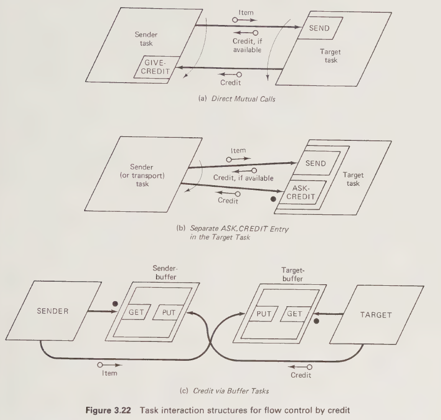

### 3.3.7 Packaged Sets of Tasks: Active Packages
As mentioned in our discussion of the business office analog of concurrent programming, it may often be desirable to view a collection of tasks which are cooperating to provide services to other tasks as an active package which provides these services. Active packages may perform the same roles as tasks (recall the roles of slave, server, secretary, agent, transporter, etc., defined in Section 3.3.1). They may also perform new roles such as service pools, as we shall see.

A simple, real-life example allows us to describe the active package approach without being concerned with details of the problem. Consider the example of customers queueing for service from one of a number of tellers in a bank. A common solution is to have a single queue from which customers are dispatched to be serviced by tellers at particular wickets. A particular approach will be described here in which customers wait at a dispatching window in the bank for a dispatcher to provide the name (i.e., wicket number) of a free teller. Customers then move to the assigned wicket to obtain service from the teller.

The dispatcher is the manager of the single customer queue. During operation each teller informs the dispatcher that it is free by giving it the name of its wicket to be passed on to a customer. Each customer waits for a wicket name and then goes to the wicket to be serviced.

Figure 3.23 provides a simple description of this example in structure graphs and Ada, avoiding sophisticated features of tasking (Chapter 5 removes this restriction). Figures 3.23(a) and 3.23(b) show the tasks and the bank package in structure graph form. The customers, the dispatcher, and the tellers are tasks, and the bank is an active package whose services are provided to customers by procedures. The dispatcher performs the role of scheduler. The tellers perform the roles of slaves who are assigned by their master (the dispatcher) to perform work for customers. They are assumed to interact with other tasks in the bank, not shown in the figure, to perform this work; otherwise there would be no need to make them tasks.

**Figure 3.23 The bank example of an active package**

**(a) Structure Graph Showing External View of the Active Bank Package**
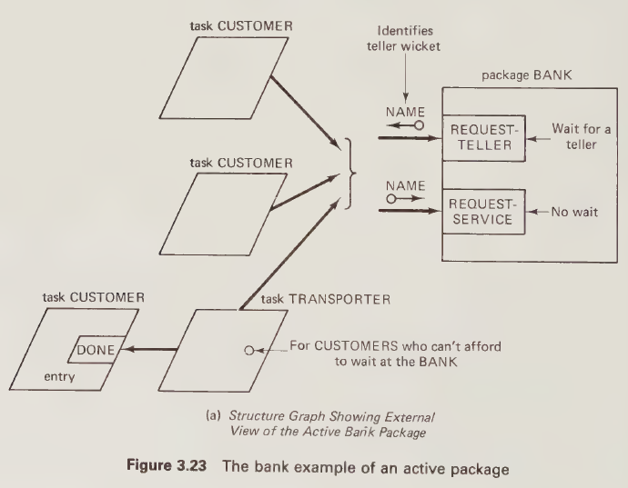

**(b) Structure Graph Showing Internal Details of the Bank Package**
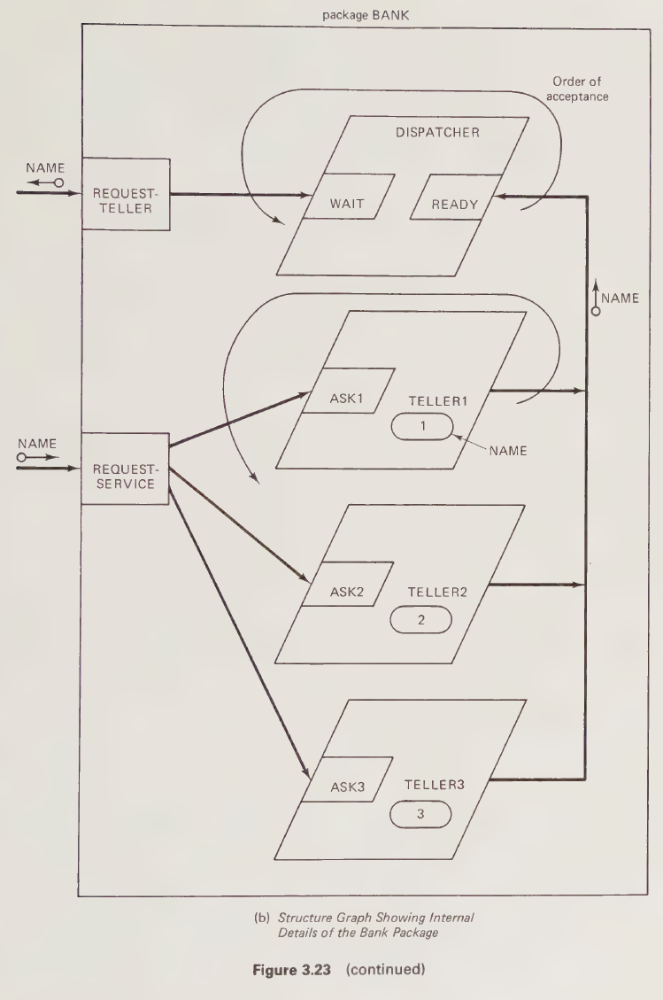

In Figure 3.23(b), the entry queue of the dispatcher's WAIT entry serves as the customer queue. The dispatcher task accepts a WAIT call only after it has rendezvoused with a free teller who has made a READY call. It thus cycles between acceptance of calls on READY and WAIT, assigning a teller to a customer on each cycle. Each teller cycles between calling READY and accepting ASK. Each teller knows its wicket number and passes it to the dispatcher when ready. Each customer given a wicket number is expected immediately to make a call on the ASK entry of the appropriate teller via the REQUEST_SERVICE procedure. Failure to do so is an error which will tie up that teller.

Thus, a customer calling REQUEST_TELLER may have to wait to return from a WAIT call. The dispatcher itself may have to wait to receive a READY call or a WAIT call. A teller may have to wait to return from a READY call and then may have to wait for an ASK call.

Figure 3.24 gives an Ada program skeleton corresponding to these structure graphs. Note again how a structure graph aids in conceptualizing the organization and operation of a program. The program skeleton of Figure 3.24 is not really necessary for this purpose. Design-level discussions can be conducted entirely in terms of the structure graph. The program is only necessary to resolve details such as the method of identifying teller tasks. Here the method is simple to the point of naivety—each TELLER task is separately coded with its own internal wicket number initialized prior to run time. This number is passed around as shown in the figure and finally used in a case statement to select the right teller. Better ways of defining and identifying members of task pools will be covered in Chapter 5.

**Figure 3.24 The BANK package with task stubs**

```ada
package BANK IS
    type T_TYPE is (DEPOSIT, WITHDRAW, CHECK_ACCOUNT, PAY_BILL);
    type R_TYPE is ... -- RESULTS REPORTED HERE;
    type WICKET is integer range 1..3;
    procedure REQUEST_TELLER (NAME : out WICKET);
    procedure REQUEST_SERVICE (NAME : in WICKET;
                               TRANSACTION : in T_TYPE;
                               RESULT : out R_TYPE);
end BANK;

package body BANK is
    NAME : WICKET;
    task TELLER1 is
        entry ASK(TRANSACTION : in T_TYPE;
                  RESULT : out R_TYPE);
    end TELLER1;
    task body TELLER1 is separate;
    task TELLER2 is ...
    task TELLER3 is ...

    task DISPATCHER is
        entry WAIT (NAME : out WICKET);
        entry READY (NAME : in WICKET);
    end DISPATCHER;
    task body DISPATCHER is separate;

    procedure REQUEST_TELLER (NAME : out WICKET) is
    begin DISPATCHER.WAIT (NAME);
    end REQUEST_TELLER;

    procedure REQUEST_SERVICE (NAME : in WICKET;
                               TRANSACTION : in T_TYPE;
                               RESULT : out R_TYPE) is
    begin
        case NAME is
            when 1 => TELLER1.ASK (TRANSACTION, RESULT);
            when 2 => TELLER2.ASK (TRANSACTION, RESULT);
            when 3 => TELLER3.ASK (TRANSACTION, RESULT);
        end case;
    end REQUEST_SERVICE;
end BANK;
```

Finally, Figure 3.25 fills in the deferred details of the skeleton package. The task bodies were left as stubs in the BANK body; their internal details are defined separately here.

**Figure 3.25 Task bodies for the BANK package**

```ada
-- TASK BODIES OF BANK PACKAGE --
separate (BANK)
task body DISPATCHER is
    NAME: WICKET;
begin
    loop
        accept READY (NAME : in WICKET);
        accept WAIT (NAME : out WICKET);
    end loop;
end DISPATCHER;

separate (BANK)
task body TELLER1 is
    NAME : WICKET := 1;
begin
    loop
        DISPATCHER.READY (NAME);
        accept ASK(TRANSACTION : in T_TYPE;
                   RESULT : out R_TYPE)
        do WORK;
        end;
        CLEAN_UP_AFTER_WORK;
    end loop;
end TELLER1;
-- AND SO ON, FOR THE OTHER TELLERS
```

Although in this particular example, no interactions by tellers with packages or tasks outside their own package are shown, in real life such interactions are quite common. In general, active packages may not only be called, but may also call others.

The particular type of active package illustrated by this example may be called a service pool. A service pool is an active package which provides the services of one of a number of identical tasks to individual callers.

Active packages may also be used as bi-directional transport entities and as generalized servers or agents of various types, as we shall see in subsequent chapters.

### 3.3.8 Conclusions

Many further design issues with respect to system architecture could be explored but would take us into too much detail at this stage. In this section we have illustrated how to describe system architectures assembled from the high-level Ada building blocks of packages and tasks. The description techniques have been presented in such a way that they should be accessible to readers without specific detailed knowledge of the Ada language. All that is needed is an informal understanding of the meaning of the symbols in the structure diagrams and an appreciation of the nature of the rendezvous mechanism. Given this informal and intuitive understanding, system organizations may be described simply as collections of persons cooperating to achieve an end, and system architectures may be designed based on our knowledge of human organizations.

We have also introduced some useful system parts in the form of slaves, servers, schedulers, buffers, secretaries, agents, transporters, and pools.

We have generally avoided discussing the efficiency of the various structures we have introduced. Efficiency is of particular concern in multi-tasking systems in which third-party tasks are required for transport and/or buffer purposes. We defer specific discussion of efficiency to postmortem discussions of system design examples in Part C.

The next section makes some concluding remarks on the relationship between the material of this chapter and the Ada language.

## 3.4 DISCUSSION: STRUCTURE GRAPHS AND ADA PROGRAMS

### 3.4.1 Introduction

The old adage "a picture is worth a thousand words" can only be true in a design context if everyone seeing the picture is confident that it can be translated into a thousand words if necessary. To aid the reader's development of this confidence, Ada programs for selected examples were provided in Section 3.3. Section 3.4.2 provides a brief retrospective discussion of the mapping mechanism.

Two issues which are not at this stage of great concern to the novice reader, but which will be of interest to the more advanced reader, are raised in Sections 3.4.3 and 3.4.4. These sections may be skipped on first reading without loss of continuity. Section 3.4.3 discusses some deficiencies of Ada with respect to the ability of the specification parts of Ada modules to reflect the intent of the designer. Section 3.4.4 discusses how in this chapter we have implicitly and deliberately restricted the designer's freedom with respect to the full power of Ada.

### 3.4.2 Mapping Structure Graphs into Ada Programs

Section 3.3 showed by example that mapping structure graphs into Ada programs is straightforward and mechanical.

Interface sockets in the boxes representing packages and tasks translate directly into declarations in module specifications. Socket names become procedure or entry names. Names adjacent to data flow arrows become parameters. Access arrows directed at packages translate into procedure calls. Access arrows directed at tasks translate into entry calls. The different symbols for different types of rendezvous access all translate directly into Ada. Socket names do not have to be globally unique, because in Ada a call to a procedure or entry is qualified by the package or task name. Module bodies are programmed separately from module interfaces and internal details are invisible across the interface, enforcing the black box nature of packages and tasks. Modules with the same interface but implemented differently are interchangeable.

Certain aspects of structure graphs are, however, not represented in Ada module specifications.

### 3.4.3 Limitations of Ada with Respect to the Specification of Structure

Ada does not support the declaration of structure graph interconnections at the specification level. There is no requirement in a module's specification to name either which modules it accesses or which modules access it. Therefore it is not possible in general for the compiler to check that the designer's interconnection constraints are met. It is possible for a module to access an incorrect module, in error. The only apparent exception is when modules are separately compiled. Then, `with` clauses are required to name the separately compiled modules which are to be accessed. However, such clauses may occur in module bodies and do not represent a specification-level declaration of structure. Furthermore, `with` clauses cannot name tasks.

What such a structure graph declaration might look like is shown in Figure 3.26. It may often be appropriate to include such structural information in a package or task specification in comments.

**Figure 3.26 What a package specification with a structure graph declaration capability might look like**
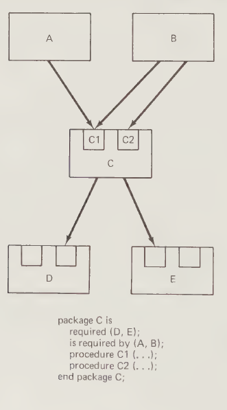

```ada
package C is
    -- required (D, E);
    -- is required by (A, B);
    procedure C1 (...);
    procedure C2 (...);
end package C;
```

There is no semantic information of any kind in the specification part of a task or package. Such information must be conveyed in comments. This applies not only to the functionality of procedures and entries but also to the nature of the interactions between tasks, including interactions with tasks nested in active packages. The nature of such interactions is often important to both the calling and called tasks, as illustrated by Figure 3.27. The reader is encouraged to use such comments in task and active package specifications.

**Figure 3.27 Nature of comments required**
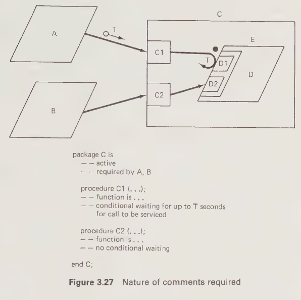

```ada
package C is
    -- active
    -- required by A, B
    procedure C1 (...);
    -- function is ...
    -- conditional waiting for up to T seconds
    -- for call to be serviced
    procedure C2 (...);
    -- function is ...
    -- no conditional waiting
end C;
```

These limitations do not impede the straightforward translation of structure diagrams into Ada program bodies; but they do impose a requirement to document the designer's intent in comments in the specifications.

### 3.4.4 Have We Restricted Designer Freedom?

The structure diagram notation and approach of this chapter is very simple. The advanced reader may object that its simplicity is likely to make it inadequate to express all the possibilities inherent in Ada. The objection is a valid one, but it misses the point.

There are possibilities for system structuring in Ada which are not covered by the notation and approach of this chapter. However, the remaining possibilities are subjects for more advanced discussion. The architectural possibilities discussed so far are easily described pictorially, cover a broad range of requirements, and are all straightforwardly mapped into actual Ada programs. An attitude of this book is that architectural possibilities not easily described pictorially should be considered only as a last resort.

The approach to tasking in this chapter has been the simplest possible one. An implicit assumption has been made that systems are composed of a fixed number of tasks activated at startup which thereafter loop forever. No functionality is lost, and considerable simplicity is gained by such an approach. However, Ada allows more generality; tasks may be dynamically created and terminated. One of the more complex features of tasking in Ada is the task termination rules. By avoiding dynamic task creation and termination, concern for these rules is eliminated, and system conceptual clarity is enhanced at a single stroke. In many circumstances where a variable number of tasks need to be assigned to a varying number of activities, a fixed-size pool of tasks can be created to fulfill the need. Idle tasks in the pool simply wait to receive calls or to have their calls accepted. Often, the disadvantage of occupying memory space with stacks and descriptor tables for idle tasks will be a small price to pay for simplicity.

The more general approach to tasking is discussed in Chapter 5.

In this chapter, packages and tasks are assumed to have similar access interfaces. Packages are assumed to provide only procedural access, just as tasks provide only entry access. In fact, in Ada the package access interface can provide for direct access to almost anything in as nonuniform a fashion as desired. However, it contributes to design simplicity if a single, uniform type of interface is assumed. We shall retain this view throughout the book.

Exceptions have been omitted from this chapter. In general, the philosophy of this book is that exceptions should be relegated to the level of internal details within modules, with errors at module interfaces handled by parameters of calls. This is a simple and sufficient approach. Chapter 5 will provide a broader view of exceptions.

In this chapter, data flow arrows have been used freely to indicate parameter passing between modules, as if all such passing of parameters was by value (that is, by copying the parameter values into the target module's context). Thus, the problem of pointers (access variables in Ada) has been ignored.

The problem with pointers is that they point to dynamic objects which may be deallocated or reused for other purposes whereas some program modules incorrectly still retain reference to them. This is because a caller's copy of a pointer is not destroyed when it is passed to another module. If the caller tries to reuse the pointer in error, after the object it points to has been deallocated or reused, unpredictable results may occur.

Unfortunately, in the absence of mechanisms in Ada for doing certain desirable things without pointers, their use is unavoidable. For example, in implementing a communications package, pointers to messages, packets and the like appear unavoidable. Pointers will be discussed further in Chapter 5.

Finally, the whole subject of generics has been ignored in this chapter. Our philosophy is that the use of generics is more closely related to implementation than system design. Accordingly, there will be no treatment of generics in this book.

## 3.5 CONCLUSIONS

Based on this chapter, it should be possible both to understand and to generate system descriptions in terms of structure diagrams showing interactions between Ada packages and tasks without needing detailed knowledge of Ada.

A perspective has also been provided on some system design issues and a start made on developing a parts kit of basic architectures.

In general, Ada provides great freedom of expression for the programmer. The restrictive assumptions which have been made or implied in this chapter constrain this freedom in order to provide systemization of the design process. A viewpoint of this book is that Ada provides too much freedom to create excessively complicated and potentially unreliable system structures. Restricting this freedom is unlikely to do harm and likely to do good. The KISS principle has dominated our thinking.
