# Chapter 4: Introduction to Architectural Design (with Examples)

## 4.1 INTRODUCTION
The purpose of this chapter is to describe the design process, to illustrate it using some simple examples, and to raise further technical design issues in the context of these examples. The chapter draws on the material of Chapter 3 and reinforces it by using it on simple examples.

The design portion of the system life cycle is shown in Table 4.1. It is preceded by the analysis and requirements definition phases and followed by the implementation phase. The design phase itself may be broken into three major subphases, namely, global design, test plan design, and detailed design. The primary concern in this chapter is the global design subphase.

Global design is concerned with definition of the user interface, identification of the system functions, and development of the system architecture. The user interface design is part of the design phase because it is very closely coupled to the system architecture. That is, certain features of a user interface may dictate certain approaches to system architecture and vice versa. Therefore it is important that system designers and not just end users participate in this phase. This phase describes in complete detail all the features of the system which are visible to its users, including all commands, command syntax, command parameters, error messages, startup procedures, error recovery procedures, and so on.

The system function subphase is required as a checklist for allocating functions to system modules during development of the architecture. The system functions specification provides a listing and description of all functions without any explicit or implied commitment to any particular grouping of these functions into modules.

**Table 4.1 DESIGN PORTION OF THE LIFE CYCLE**

| Life cycle phase | Explanation |
| :--- | :--- |
| Global design | * User interface * System functions * System architecture |
| Test plan | Down to the level of subsystems and major or critical modules inside major or critical subsystems |
| Detailed design | In terms of user interface and architecture defined to this point * Level 1: Down to the module level * Level 2: Internals of each module |

The system architecture phase of global design is concerned with identifying modules, allocating functions to modules, and defining interaction between modules to determine overall system operation.

The test plan phase of design is concerned with defining test data, test modules, test procedures, and testing philosophies for the system. Testing is concerned with exercising the system to ensure first, that it operates without failure and second, that it meets the requirements. Debugging is a separate activity from testing which involves looking for the sources of problems when they are found during testing and fixing them. The test plan is an important phase of design because the act of developing it can lead to greater insight into actual operation of the system and can often reveal inadequacies in the user interface and system function specifications. Because of this mutual influence, development of the global design and of the test plan tend to proceed in an interleaved fashion in actual projects.

Of course, the final phase of design is detailed design. In this phase details are defined to the point that the remaining work can be assigned to implementors.

For a large system the design phase may proceed recursively for subsystems, sub-subsystems, and so on.

In this chapter we are concerned with design methodology and technical issues for system architecture design for simple problems in a simple target environment. To this end, we shall attack the design of three simple example systems intended for implementation on desk-top microprocessor systems of the type illustrated in Figure 4.1. This type of system is assumed to have a video character display refreshed directly from memory by hardware, a keyboard for entering commands and data, and a printer for producing hard copy output. Programs and fixed data are contained in PROM (Programmable Read Only Memory) chips on system boards which plug into the back of the system. RAM (Random Access Read-Write Memory) is available for scratch-pad use at run time. There is no on-board general-purpose operating system so that programs developed for this desk-top microprocessor system must do all the device handling and interfacing, as well as controlling and synchronizing internal activities associated with keyboard input, video output, and printer output.

The desk-top system will be referred to as the target system. Programs for the target system are assumed to be developed on a separate development system with an Ada compiler and a PROM chip loader. Ada multitasking mechanisms are assumed to be supported by an appropriate PROM-based kernel in the target system. Such an arrangement will support the direct implementation of Ada programs in the target system. An alternative approach would be to use another language such as Pascal or PL/M in the development system and to augment the language by an appropriate set of programming conventions and an appropriate run time kernel in the target system to support the package and task concepts of Ada.

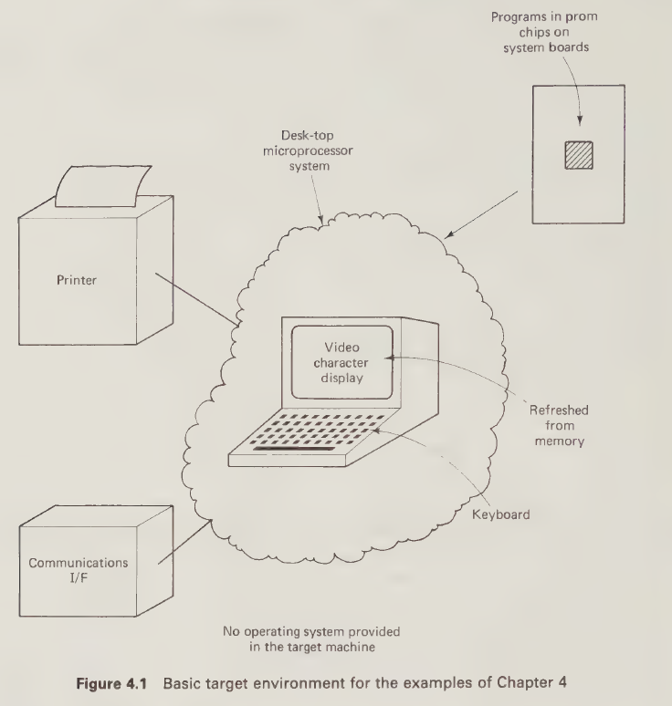

The three examples chosen for development are the following:

1. LIFE—a system to enable the operator to play the game of LIFE using the keyboard and video character display.
2. FORMS—a system to allow the operator to enter data via the keyboard into the fields of a form on the video display and to have the form printed as quickly as possible on a line-by-line basis as fields are completed without waiting for data entry for the entire form to be completed.
3. DIALOGUE—a system to allow operators at geographically separate locations to interact via messages prepared and displayed on their screens.

The simplicity of the assumed target system obviously limits the usefulness of these systems. A particular disadvantage is the lack of peripheral storage. However, we have deliberately kept the target configuration simple so that the examples will be as simple as possible. Even these simple examples provide a variety of design issues for discussion, and, as will be shown, the approaches which emerge can be easily applied to more general target systems.

This chapter develops design methodologies and technical issues by developing the software architectures of these three simple applications. Section 4.2 gives an overview of design strategies and methodologies. Section 4.3 provides preliminary guidelines for an informal, practical design process. Sections 4.4, 4.5, and 4.6 discuss the design examples.

## 4.2 DESIGN STRATEGIES
### 4.2.1 Introduction
We use the term *design strategy* to indicate a starting point, a direction of approach, and a philosophy for developing the system architecture. For example, one design strategy is *top-down functional decomposition*. In contrast, we use the term *design methodology* to include, in addition to the design strategy, the systematic procedure by which the designer describes, refines, and records his design decisions.

Strategies relating to the direction of development of the system design include top-down, bottom-up, middle-out and edges-in.

Strategies which relate to the philosophical basis for development of the system design include functional decomposition, data-flow-driven structure design and data-structure-driven design. These strategies are described and illustrated in the next sections.

### 4.2.2 Functional Composition/Decomposition Strategy
Figure 4.2 illustrates top-down functional decomposition. The system is first thought of as an amorphous, conceptual glob which must perform all of the functions described in the functional specifications. This set of functions is regarded as a single composite function F; top-down functional decomposition then proceeds by breaking F into subfunctions, those subfunctions into further subfunctions, and so on.

A problem with top-down functional decomposition is that it does not naturally lead to identification of common functionality at the bottom-most levels of the hierarchy. It is a fact that many systems naturally emerge from the design process as diamond-shaped with a bulge in the middle rather than as triangular with the peak at the top and the base at the bottom. It is often true that the common functions at the bottom levels can be identified in advance.

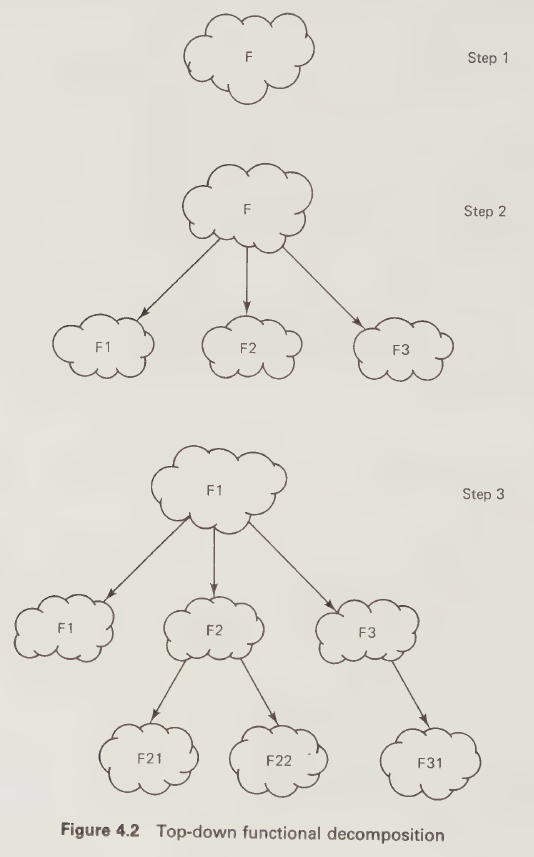

Figure 4.3 shows the strategy of bottom-up functional composition...

**Figure 4.3 Bottom-up functional composition**
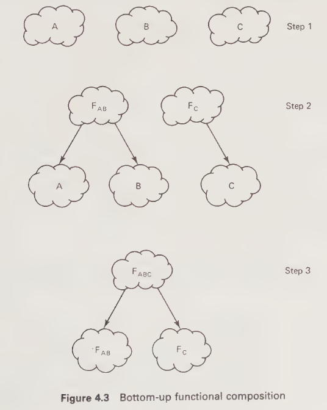

In some cases it may be easier to identify functional units at the *middle* of the hierarchy first. Figure 4.4 shows the strategy of *middle-out functional composition/decomposition*...

**Figure 4.4 Middle-out functional composition/decomposition**
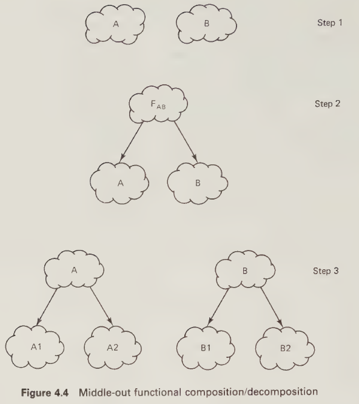

...

Figure 4.5 illustrates data-flow-driven structured design for the case where there is a single thread of data flow.

**Figure 4.5 Data-flow-driven structured design**
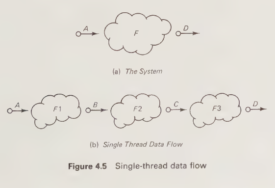

...

Figure 4.6 shows the most straightforward way of turning a data flow graph into a structure graph.

**Figure 4.6 Vertical control structure**
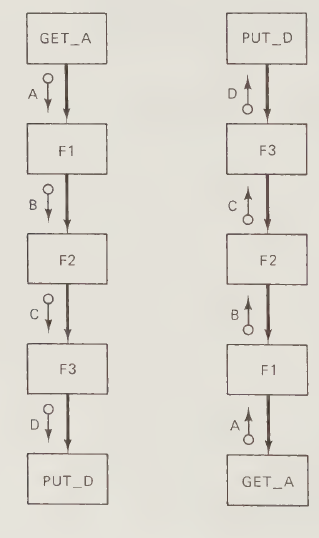

An alternative to vertical control is horizontal control, as shown in Figure 4.7.

**Figure 4.7 Horizontal control structure**
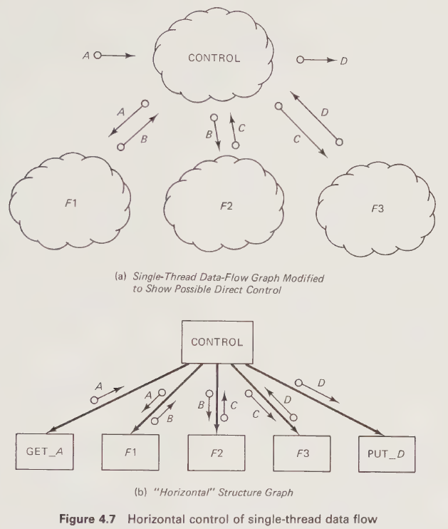

Another approach is to use hierarchical control, as shown in Figure 4.8.

**Figure 4.8 Hierarchical control structure**
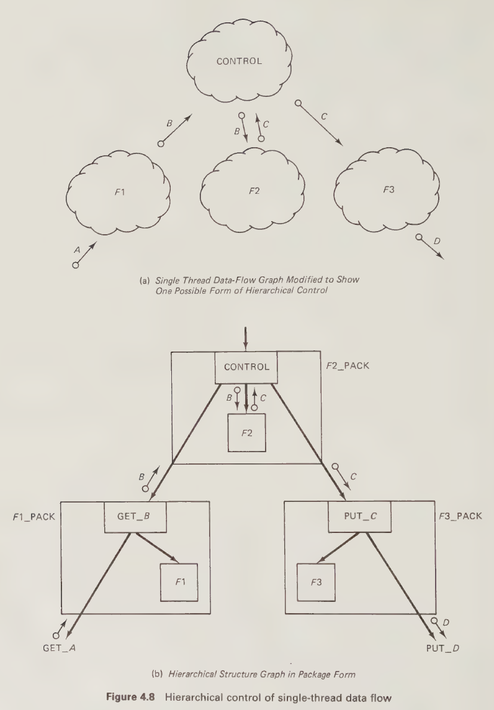

A mixed approach is shown in Figure 4.9...

**Figure 4.9 Mixed control structure**
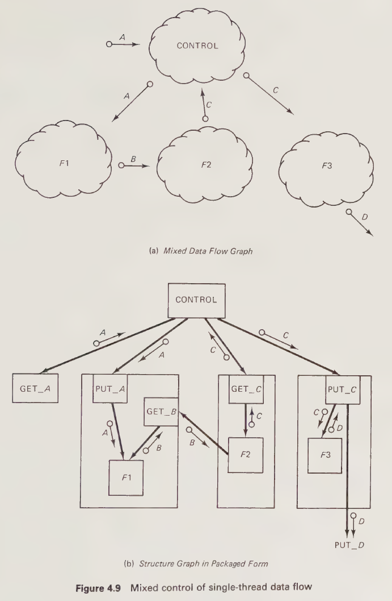

...

Figure 4.10(a) gives two examples of a structure diagram for a concurrent system...

**Figure 4.10 Concurrent system structures**
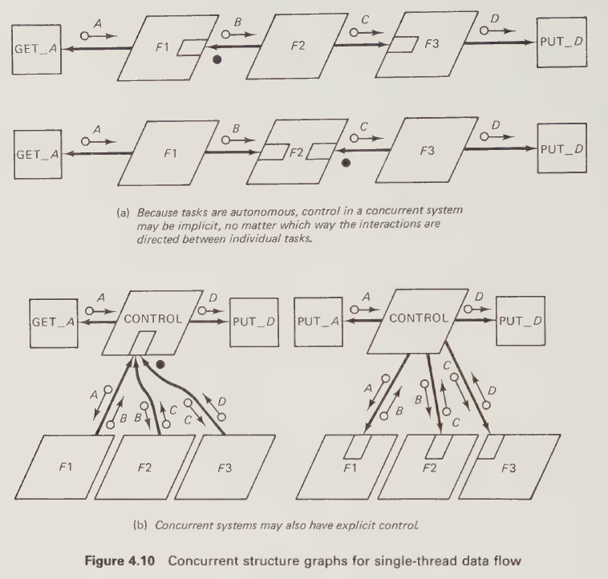

...

The operation of embedded systems is unlikely to be characterized only by single thread data flow. More likely is multi-thread data flow as illustrated by Figure 4.11.

**Figure 4.11 Multi-thread data flow**
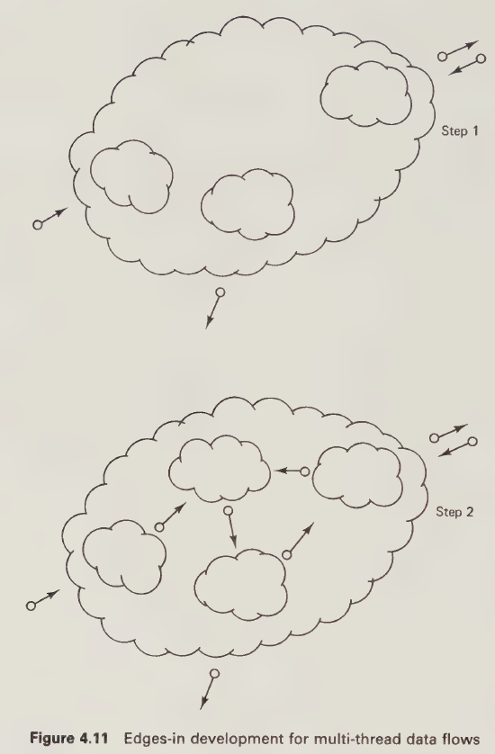

### 4.2.5 Design Strategies and Testing Strategies
As was mentioned earlier, the design phase of the system life cycle is concerned not only with development of the system architecture but also with the system test plan. Each of the design strategies has a corresponding test strategy. Thus, testing may be performed from the top-down, from the bottom-up, from the middle-out, or from the edges-in. Testing may also follow particular control paths or particular data flow threads.

Top-down testing requires the use of *dummy* lower-level modules. Bottom-up testing requires the use of *driver* higher-level modules. Middle-out testing requires both driver and dummy modules. Edges-in testing is similar to bottom-up testing. All testing must be done in integration steps in which fully tested modules are integrated with untested modules and other tested modules on a progressive basis for further testing.

Testing is a separate subject, and further discussion here would take us beyond the scope of this chapter.

## 4.3 DOODLING WITH DATA FLOW: GUIDELINES FOR STEP-BY-STEP DEVELOPMENT OF A SYSTEM DESIGN
This section describes an informal design methodology based on the data-flow-driven structured design strategy.

There are a number of major steps in the development of a system design by the data flow approach which are of general enough applicability to summarize here as guidelines. The informality of this methodology justifies the term *doodling with data flow* to describe it. The steps are as follows:

1. Make a first pass at identifying the major obvious subsystem modules at the system edges. Treat the central part of the system as a single central module. At this stage, functions should be assigned to the modules only in the broadest, most informal sense without being too concerned yet about completeness or whether the modules are exactly the right ones. The objective of this first step is only to provide a starting point for the design process. Further steps in that process can be expected to identify required changes to the starting point; this is natural and inevitable and, therefore, too great a commitment to the first starting point is undesirable. Design is always in part a trial-and-error process and should be willingly accepted as such.

2. On a blank piece of paper sketch these modules, for design doodling purposes. Begin thinking about the nature of the data flows between them and of the need for consequent components of data flow internally. Based on this thinking, arrive at a trial identification of internal modules which seems sound on both functionality and modularity grounds.

3. Use the data flow sketches and the thinking that went into them to refine the view of both modules and data flows. The need for further modules and data flows may become apparent, for example to include control and error handling functions.

4. To the extent possible at this stage, assign functions in detail to modules, using the functional requirements specification as a check list. Again, refine the data flow graph based on this assignment. Perform a walk-through of the system design at this point, and make changes as necessary.

5. Develop one or more structure graphs defining candidate system architectures in terms of packages and tasks for the view of the system developed so far; based on the function assignments, define the package and task interfaces from a functional viewpoint omitting details of data structures and types. For tasks, decide on rendezvous directions, guard conditions, third party tasks, transport tasks, conditional and timed calls and so on, following the guidelines of Chapter 3. Again, perform a walk-through, and make changes as necessary.

6. Define the system interfaces in detail, including details of data types and structures, and perform a walk-through again.

7. If the system is sufficiently large and complex, it may be necessary to proceed recursively with this approach to develop subsystem designs.

8. Walk-throughs should be performed from as many different viewpoints as are necessary to satisfy key members of the project team of the quality and completeness of the design; these walk-throughs should be in meeting form with all key team members participating—a presentation followed by a question and answer session is best. Criteria for evaluating designs are discussed later in this chapter and in Chapter 6.

These guidelines are illustrated by example in the following sections.

## 4.4 FIRST DESIGN EXAMPLE: LIFE
### 4.4.1 Introduction
This section describes the design of a system to play the game of LIFE on an interactive, desk-top computer of the type described in Section 4.1. The main reason for choosing the game of LIFE for this first example is its simplicity; by choosing such a simple example, we can proceed with the problems of design without having them obscured by the problems of the application.

The main contribution of this example is to show how the design for a system with an interactive command decoding requirement can be developed using the data flow approach and implemented using finite state machines, Ada tasks, and Ada packages.

The game of LIFE is not really a game in the normal sense of the word. Rather it is just a set of rules for displaying interesting sequences of patterns on a *board*, consisting of a grid of squares like a checkerboard. Counters are placed on each square and live or die at each generation according to certain rules relating to the presence or absence of other counters. Successive generations of boards may present interesting dynamic patterns. In our system the board will be displayed on a video screen. The dimensions of the board are assumed predefined in the program. The player sitting at the keyboard may use a series of commands to initialize the first generation on the video screen and may then ask the system to play a given number of generations. Our primary concern in this chapter is with the design of the interactive part rather than the game playing part of the LIFE system.

The rules of the game of LIFE have no significant bearing on our design. However, for the curious, here they are. The rules are based on the relationship of each counter to its neighbors. Each counter may have up to eight neighbors in the eight squares surrounding it. The game begins with any number of counters on the board in any pattern. This is known as the initial generation. The next generation is determined by applying the following two rules to all squares on the board simultaneously:

* If a counter is on a square, then it survives if it has exactly two or three neighbors.
* If a square has no counter on it then one is born if it has exactly three neighbors.

Let us assume that the user manual has defined a set of commands composed of strings of words formed into command lines. Commands are entered on a character-by-character basis from the keyboard, and the end of a command line is denoted by a special character, for example, carriage return. Command words are separated by blanks. Commands are processed only at the end of each line. A special line on the screen is reserved for displaying the current command as it is entered.

Assume there are seven possible commands with word sequences defined by the finite state machine (FSM) of Figure 4.12. Commands 1 and 2 fill all the squares or empty all the squares to provide a starting point. Commands 3 and 4 set up the way in which pairs of numbers in commands 5 and 6 will be interpreted as row or column numbers. Commands 5 and 6 add or remove counters in the square at the coordinates specified by the number pair. Command 7 plays a given number of generations. Our problem now is to design a system which will recognize these commands when entered, reject sequences of characters and words which do not form recognizable commands and arrange for execution of the appropriate operations of filling or emptying the board, placing the counters on the initial board to create the initial generation, adding or removing counters on a displayed board to create a new, initial generation board, and playing a designated number of generations.

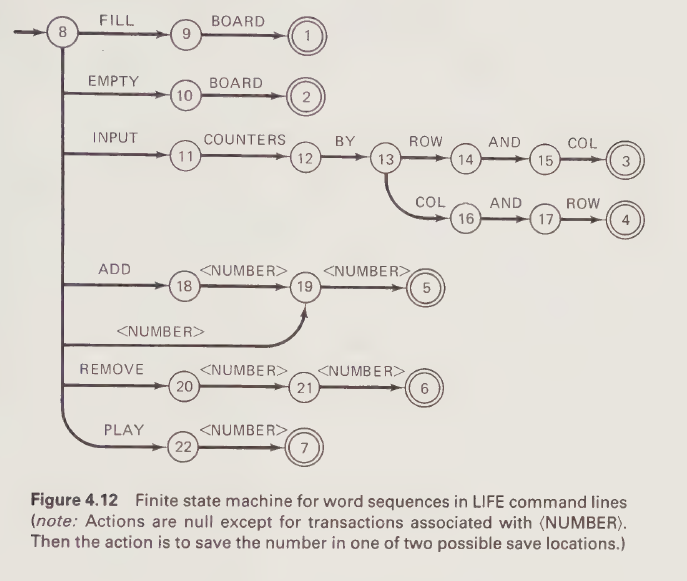

### 4.4.2 Data Flow
The following development of the LIFE system data flow graph follows the recommended doodling with data flow procedure of Section 4.3.

At the system edges, the following modules are needed:

* a keyboard input module to receive characters from the keyboard hardware
* a line holder/decoder module to hold partially completed command lines for display in the special area on the screen and to decode the completed command lines
* a board holder module to hold the information required to display the current board and to generate new boards for display

The essential elements of internal data flow are as follows:

* input characters for assembly into command lines
* decoded commands
* display requests for prompts, lines and responses
* display requests for new board configurations

To string these data flow elements together, at least one additional module is required, namely a command processor to transform decoded commands into board display requests. The previously identified line holder/decoder module performs the transformation of characters into decoded commands. The result is shown in Figure 4.13.

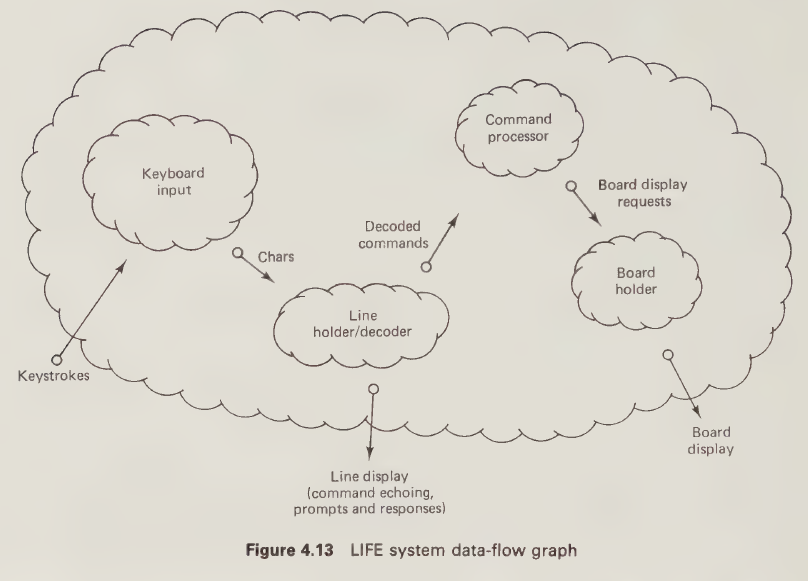

Having arrived at a clean, overall data flow graph, refinement of the line holder/decoder module is appropriate. Command lines are decoded on a word-string basis. Therefore it seems appropriate to partition the line holder/decoder into a line holder and word-string decoder. Figure 4.14 shows the result. A command-word dictionary is assumed to be part of the line holder module to translate a string of characters delimited by blanks into a word code. The word-string data flow element between the line holder and the word-string command decoder could be a single word-string variable or a sequence of word-code variables; this is a design detail which can be postponed at this stage.

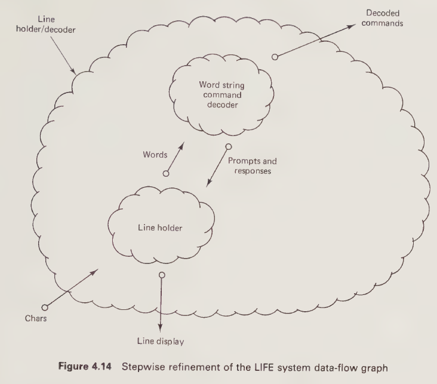

### 4.4.3 Structure
It is quite straightforward to derive a structure graph from this data flow graph. The first problem is to decide the nature of the modules in the data flow graph. The keyboard input module must be a task if characters on the keyboard are to be fielded on an interrupt basis. The line and board holder modules can be packages, because the screen is refreshed from memory by hardware and does not require a task to drive it. Note that, from a broader perspective, a screen driver task should be specified as part of the system design even if it is to be implemented in hardware; however, here we are assuming the hardware is given. Because, in general, interrupt service tasks should be kept as simple as possible, the control of the system should not be left to the keyboard input task. Therefore, we need one other task internally in the system to interface with the keyboard task and to provide system control. Several approaches are possible. A particularly simple approach is to hang the data flow graph from some point near the middle. An appropriate point is between the line-holder/decoder and command processor modules. A task may be inserted at this point to provide overall control. Note that this task introduces no new functionality; it simply realizes the data flow path. Thus, no corresponding module is required in the data flow diagram. The word-string decoder module is now appropriately committed as a package. This result is illustrated in Figure 4.15.

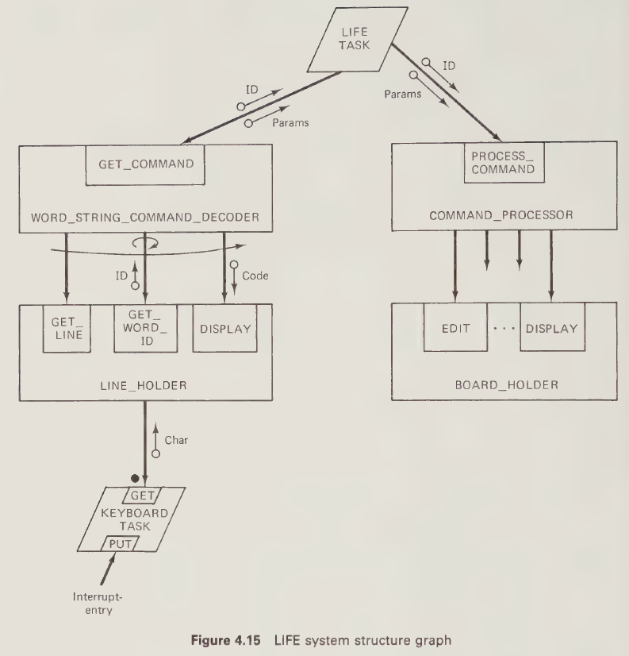

The intended operation of the system described by this structure graph is as follows. When the LIFE task starts up, it first calls GET_COMMAND in the line holder/decoder package, which in turn calls GET_CHAR in the keyboard task repeatedly until all characters in the line are assembled and stored internally in the line holder package; the command is then decoded and the code returned as an out parameter of the GET_COMMAND call together with any parameters of that command (such as the number of generations to play).

Note that the LIFE task may be held up waiting for the next character.

Internally, when the decoder package returns from the NEXT_LINE call, it calls GET_WORD_ID repeatedly until it gets a recognizable or an unrecognizable command. Command error messages and next command prompts are handled internally via the DISPLAY procedure.

When the command is decoded, the LIFE task calls the command processor package, passing the appropriate command id and parameters. The command processor package then takes care of performing the function requested by the command by accessing the board holder package as appropriate.

The next step in design is to develop the internals of the various modules. It will be sufficient for illustrative purposes to develop structure graphs for the internals of the line holder package and the command decoder package. Figures 4.16 and 4.17 show possible internal structures of these packages.

In the line holder package of Figure 4.16, the GET_LINE procedure repeatedly calls GET_CHAR. An internal marker indicates the position of the next word available for retrieval by GET_WORD_ID. The GET_WORD_ID procedure retrieves this next word (moving the marker at the same time), matches the word against the internal dictionary, and passes the resulting word ID to the caller. Because no explicit error handling is indicated in this package, there must be at least one value of the word ID reserved for the condition unrecognizable word.

**Figure 4.16 Internal structure of the line holder package**
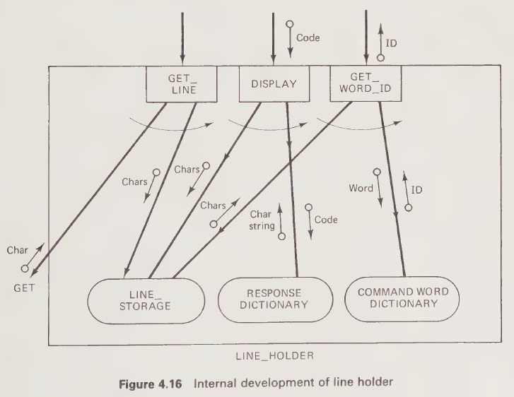

The internal development of the command decoder package is shown in Figure 4.17 in both structure graph and skeleton program form. This package contains an internal FSM package which encapsulates the current state, the FSM tables and the NEXT procedure for accessing the tables to update the state, given the event. Returned as parameters of the NEXT procedure are state and action codes which are used by the GET_COMMAND_ID procedure to decide whether the command has been decoded yet and whether there are any parameters to be saved.

**Figure 4.17 Internal structure of the command decoder package**
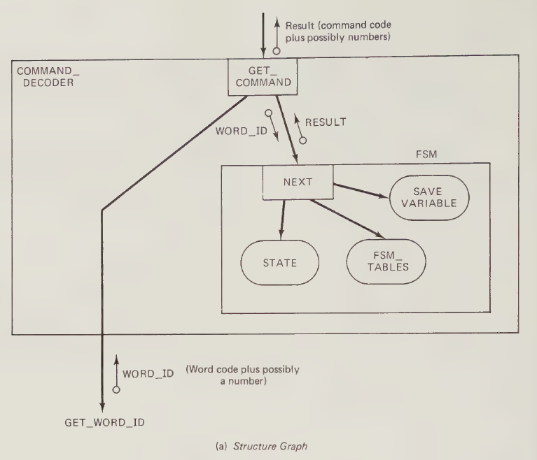

### 4.4.4 Design Evaluation
Some typical questions concerning design quality which might be raised in a design walk through are as follows:

1. Could this design easily handle type-ahead of characters? Type-ahead is a feature allowing a fast typist to get ahead of the system without loss of characters. The lack of type-ahead in this simple system is unlikely to be a problem, but it can be a problem in systems where processing of a character is sometimes slow, perhaps due to the need to access peripheral storage.
2. Could the system easily be modified to provide immediate notification to the operator of an incorrect character sequence up to the current character position without waiting for the end-of-line?
3. Does the system design make it easy to change the words of commands, the allowed word sequences in command strings, and the semantics of commands? Such changes are often required during the normal lifetime of any system.

With respect to type-ahead, it would obviously be quite easy to place a type-ahead buffer in the keyboard task for accumulation of characters under conditions when the system does not call GET_CHAR fast enough to remove each character before the next one arrives.

Immediate notification of errors is more of a problem. The internal design of the line holder/decoder package must be modified to produce a system which is capable of notifying the operator of command errors as soon as an incorrect character is typed in the context of the command string entered up to that point. The main modification required is to replace the word-string command decoder by a character-string command decoder.

The system is not particularly easy to modify to accommodate changes in commands because of the separation of the command-word dictionary in one package and the word sequence FSM tables in another package. It would be better from this point of view to put these data structures in the same package. In this respect the character-string command decoder suggested above provides a better starting point for a quality design.

Note, however, how the design of Figure 4.15 emerged as a result of an explicitly stated user interface requirement that commands would be processed one line at a time. Thus, the user interface definition has resulted in a design which limits the flexibility of the system. As a general rule, if flexibility is important, then it must be stated as part of the requirements; otherwise, the designer may be led to meet specific requirements with a system of limited flexibility.

Finally, is the particular structure as clean as possible? Are there any logically unnecessary extra interfaces or extra modules? Reexamining Figure 4.15, the overall design might be tidied up a bit by eliminating the somewhat redundant GET_COMMAND call made by the LIFE task to the word-string command decoder package. This could be accomplished by eliminating the latter package and instead imbedding its functionality in the body of the LIFE task. This approach amounts to hanging the data flow graph of Figures 4.13 and 4.14 from the word-string command decoder module and making that module a task. Whether the resulting structure is better or not is probably a matter of taste in this example. However, it is important to explore such questions as part of the design process.

## 4.5 SECOND DESIGN EXAMPLE: FORMS
### 4.5.1 Introduction
The purpose of this design example is to introduce an additional level of complexity over that of the very simple LIFE example. This additional level of complexity arises because of the need to coordinate foreground activity seen by the operator with a concurrent background activity spawned by this foreground activity.

The FORMS system is required for the preparation, editing, and printing of business forms. To keep the system simple, there is assumed to be no file storage device available, so that all that can be done is to prepare one business form on the screen and print it directly from its resulting representation in primary memory.

Editing the form is a foreground activity in the sense that the operator specifically initiates all form edit activities and waits for them to be completed. On the other hand, printing a form could be a foreground or a background activity. As a foreground activity, the operator would request printing of a completed form displayed on the video screen and then wait for printing to be completed.

As a background activity, printing could take place while edit operations were in progress on the screen. One approach would be to arrange that more than one form could be stored in primary memory so that edit operations could proceed on one form while another completed one was being printed. Another approach, taken in this example, is to arrange that foreground editing and background printing take place concurrently on the same form but that editing can only access the incomplete parts of the form and printing the complete parts. In this way we can arrange that the form is printed as quickly as possible without having the operator wait to complete the form before printing begins. With this approach an interesting coordination problem arises between editing and printing because of different logical views of the form by these two activities. Editing views the form as a collection of fields. Printing views the form as a collection of lines of full page width.

With reference to Figure 4.18, for the purposes of this example, a business form may be viewed two quite different ways.

* As a collection of rectangular fields of different sizes and shapes, each with a defined position on a page, and each containing lines of text within the confines of the field (field-lines)
* As a set of lines on a page (page-lines)

Fields may be narrower than a full-page width, and they may, therefore, include parts of several page-lines. A page-line may contain several field-lines. Field boundaries are assumed to consist of rows and columns of asterisks. Field titles are assumed to be part of the text in the field. Pages are assumed to be filled with fields; that is, there are no empty spaces between fields and the fields all line up at the page edges.

To provide for simultaneous editing and printing of the same form, fields are numbered sequentially, first from left to right and then from top to bottom; a field may only be edited in this sequence, and once a particular field is edited, it may not be reentered for further editing until the field edit sequence is completed. Page-lines of the form are printed as soon as they are inaccessible to further editing without waiting for the entire form to be complete. Because the form is prepared fieldwise, a page-line is complete when all the fields it crosses have been completed.

**Figure 4.18 Fields in a form**
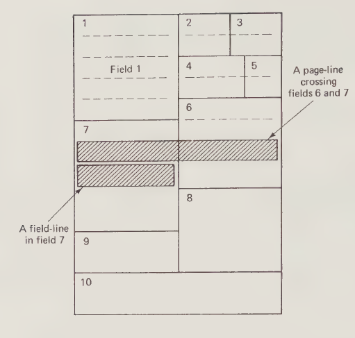

Editing is controlled by two special function keys, as follows:

1. A special START-EDIT function key is followed by the entry of a three-character integer specifying the form number to be edited. This results in a blank form being displayed with field #1 ready for data entry; the special form number 000 indicates reedit of the current form. The START-EDIT keystroke will be recognized only when the system has just been turned on or when printing of the current form is complete.
2. A NEXT-FIELD function key is used by the operator to indicate completion of the current field and to request movement of the cursor to the beginning of the next field in the field number sequence. Thus, the system knows that editing of a field is completed when it sees the NEXT-FIELD keystroke.

The current edit position is always indicated by a cursor. Display of the cursor is controlled automatically from the hardware. The position of the cursor is controlled by software separately from the entering of data characters.

Within a field, data entry and editing are accomplished by entering data characters at the current cursor position and by using a BACKSPACE function key to move the cursor backwards within a field. As characters are entered, the cursor position moves to the right one character position at a time. Use of the BACKSPACE key simply moves the cursor backwards one character position at a time without modifying the field contents. For software simplicity, insertion is simply handled by typing the material to be inserted over top of what already exists and then retyping the remainder of the field; deletion is accomplished by backspacing and then typing blanks.

The system takes care of enforcing field boundaries and of performing the correct operations at these boundaries. When moving to the right at the right field boundary, the cursor position moves to the beginning of the next field-line, and when moving to the left at the left field boundary, it moves to the end of the previous field-line, under software control. At the uppermost left and bottommost right cursor positions in the field, the cursor has nowhere further to go. Any attempt to move it in the wrong directions at these points is an error, except for use of the NEXT_FIELD key.

If an error of any kind occurs, the system will ring a bell and stop processing the command that caused the error.

The above user interface has been kept simple, for pedagogical purposes, and is not particularly good in some respects. However, it will be sufficient for our purposes for the moment. We shall reserve criticism of it until the design evaluation.

Tables describing different forms are required. In the absence of peripheral storage, they must be stored in primary read-only memory so that they are available as soon as the system power is turned on. The START_EDIT command identifies a particular one of these form tables to be used in displaying a blank form on the screen and to be used subsequently in editing. The form tables must contain information about the dimensions and position of each field on the form and about the sequence of fields for editing purposes. The form tables must also contain, for each field, a list of the page-lines freed for printing. For example, in Figure 4.18, fields 1 and 2 free no page-lines; field 3 frees page-lines 1 and 2; field 4 frees no page-lines; field 5 frees page-lines 3 and 4; field 6 frees page-line 5 and so on. Such lists of page-lines for each field are inherent, fixed properties of the form and can therefore be part of the form tables.

### 4.5.2 Data Flow for Editing

Following the guidelines of Section 4.3, a data flow graph for this system can be developed from the edges in. Figure 4.19 shows the first step. Flowing into the middle of the system from its edges are keystrokes from the keyboard, form shape and attribute data from the current form table, and characters or page-lines from the video display storage for printing. Flowing out from the middle of the system to its edges are ring requests for the bell, characters to be displayed in the video display storage (note that this includes the cursor display function), and page-lines for the line printer subsystem. Also flowing out from the middle of the system are requests to print page-lines. The assumption here is that the actual page-lines to be printed come directly from the video display storage via a different mechanism from that which makes requests to print page-lines; this is a logical assumption in light of the way in which page-lines are freed for printing by successive field visits.

**Figure 4.19 First data-flow graph of the FORMS system**
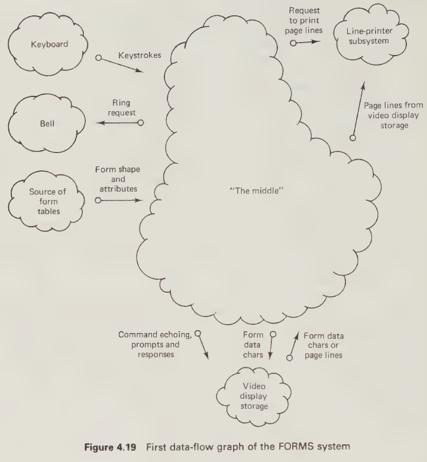

It now remains to develop the internal details of the data flow graph for the middle of the system. However, unlike the LIFE system, the data flow graph will not be single thread. Multiple threads arise from the fact that multiple functions are being performed. As general strategy it is a good idea to consider such multiple threads separately at first. In this case the logical place to start is the foreground form editing thread.

Figure 4.20 provides an expanded data flow graph of the form edit/display foreground activity. The essential principle around which this data flow graph is constructed is the separation of logical and physical display management. Logical display management is concerned only with the processing and editing of forms. At this level, forms are treated as logical entities without regard for how they are physically displayed. Physical display management, on the other hand, is concerned only with such items as the cursor's position on the screen, the entry of characters at absolute screen positions, the retrieval of physical lines for printing, and so on. Physical display management is not concerned with the logical interpretation of what is displayed. Given this basic separation, the data flow graph naturally evolves by inserting an event decoder module between keystrokes and logical display access requests, a display management module between the latter and physical display management requests and, at the end of the thread, a physical display management module. We use the term event decoder here rather than command decoder, because we wish to include the possibility of interaction of this module also with the printing background activity. As such, it will eventually be concerned not only with operator commands but also with events in the printer system.

**Figure 4.20 Expanded data-flow graph of the form edit/display foreground activity**
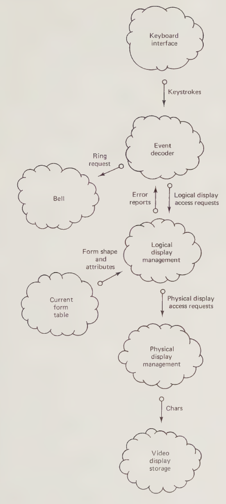

### 4.5.3 Structure for Editing

It is quite straightforward to translate this data flow graph into an appropriate structure graph. Following the discussion in Section 4.4.4, we shall make the event decoder module a task. Logical display management does not need to be a task because it is exclusively used by the event decoder for the foreground edit activity. There is never any interaction of logical display management with the background printer activity. Therefore we can immediately decide that logical display management will be a passive package.

Provided that the event decoder task handles all the coordination between the foreground and background activities with respect to the printing of lines, there can never be any possible conflict between access to physical display management for editing purposes and access to it for retrieving lines for printing. This is the only situation in which it is possible at this stage to decide that physical display management will be a passive package. Otherwise there might arise an unacceptable conflict. For the moment, we shall assume that physical display management is a passive package and return to the question of whether conflict can arise later.

Figure 4.21 provides external and internal views of a logical display management package. It has three interface procedures, namely, NEW_FORM, NEXT_FIELD, and EDIT_FIELD. Calls to NEW_FORM must provide a form number as a parameter. Internally, the NEW_FORM procedure accesses the form table identified by the form number to display a blank form (if the form number is not 000) and moves the cursor to the upper left corner of the first field in the form (home position). An incorrect form number results in an error parameter being returned. The NEXT_FIELD procedure takes no input parameters because the next field is determined by the form tables. The body of the NEXT_FIELD procedure gets the required cursor position from the form tables and moves the cursor to that position. It also passes the field number to an internal field edit package which will handle the details of editing within that field.

The EDIT_FIELD procedure takes a character code as an input parameter (any alpha numeric character or the backspace character) and returns an error code when the input character is invalid or field boundaries would be violated by performing the edit function. The body of the EDIT_FIELD procedure simply passes on the character to the ENTER_CHAR interface procedure of the internal field edit package.

The internal FIELD_EDIT package knows which field is current through the SET_FIELD procedure and can therefore check the current form table for boundary violations via an internal boundary check procedure. This package relies on the physical display management package to find the current physical cursor position and to enter the character in the physical display and move the cursor.

**Figure 4.21 External and internal views of a logical display management package**
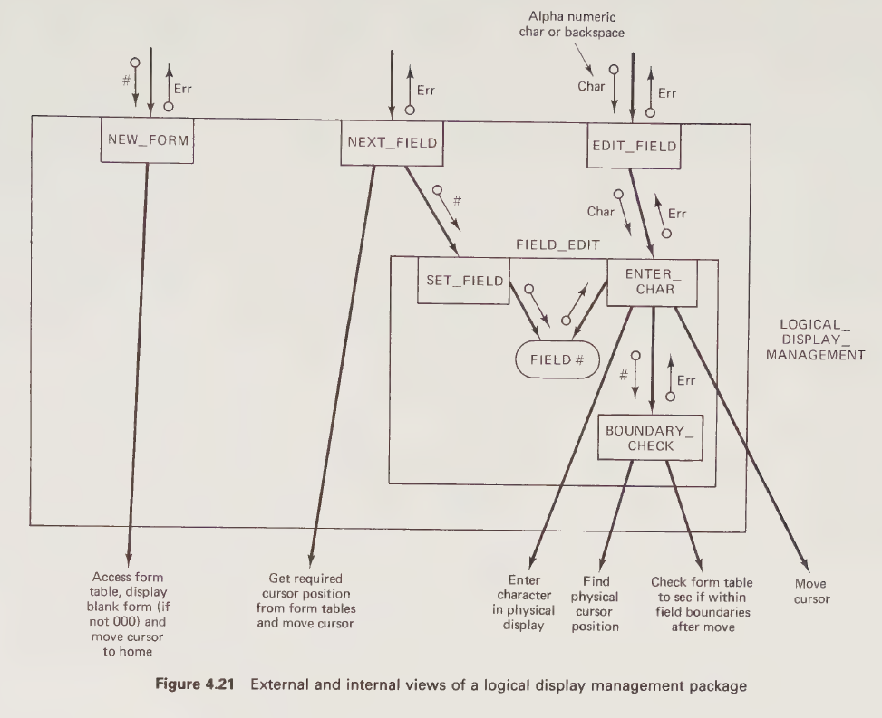

Turning now to the physical display management package, Figure 4.22 presents a minimal external view of this package to provide the necessary services required for logical display management. These services are provided by interface procedures ENTER_CHARACTER, CLEAR_DISPLAY, MOVE_CURSOR, and CHECK_CURSOR.

**Figure 4.22 External view of a physical display management package**
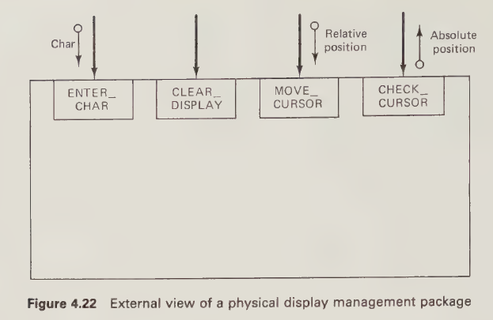

### 4.5.4 Data Flow for Background Printing

Figure 4.23 refines the data flow graph based on the requirements for background printing.

Figure 4.23 shows that no new modules are required to handle background printing but that some additional data flows are needed. Omitted from this figure are all data flows associated only with editing. Let us follow a NEXT_FIELD request. First, the NEXT_FIELD keystroke interrupt is picked up by the keyboard interface, and a keystroke code is passed to the event decoder. The event decoder sends a NEXT_FIELD request to logical display management. Following lookup of the current form table, logical display management sends a page-line number range (N..M) for printing back to the event decoder. The event decoder forwards this page-line number range to the page-line printer, which retrieves the actual page-lines from the physical display management package, prints them, and then reports back to the event decoder with a MORE_LINES notification.

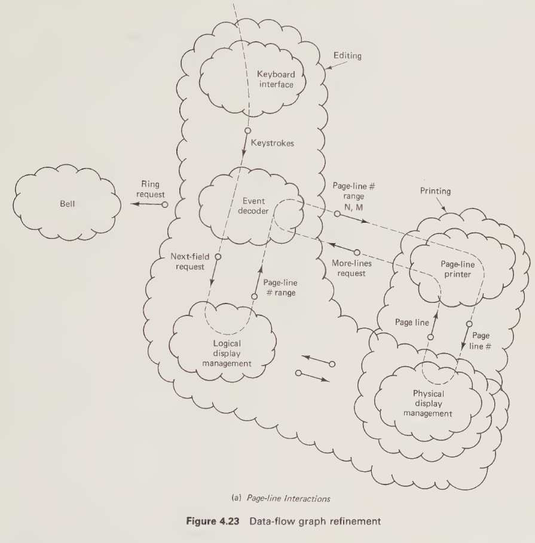

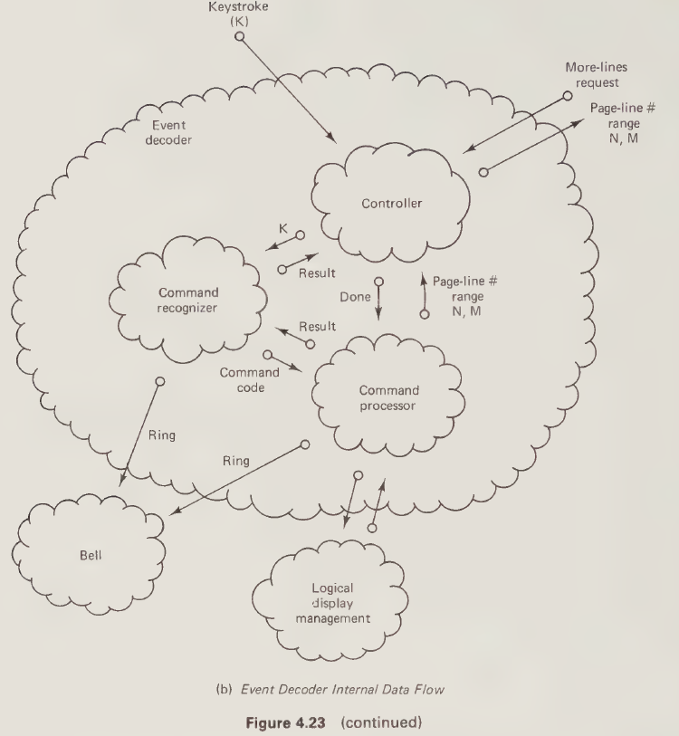

The reason for using the term event decoder instead of command decoder now emerges; the decoder must be responsible for processing two events, namely, keystrokes arriving from the keyboard interface and MORE_LINES notifications arriving from the page-line printer.

The event decoder has moderately complex responsibilities. It must perform both command recognition and command processing, each of which involves correct handling of different kinds of event sequences. Accordingly, a further refinement of the event decoder module seems desirable.

Figure 4.23(b) provides this refinement. Separate command recognizer and command processor modules perform these functions with a single controller module acting as an overall coordinator. The controller sends keystrokes to the command recognizer which in turn sends command codes to the command processor when printing is done. The command processor in turn provides the controller with a range (N..M) of lines to be printed upon field exit. The controller interfaces with the keyboard interface and page-line printer modules. The command processor interfaces with the logical display management module. Note that the controller must know when there are no more lines.

Figure 4.24 provides finite state machines (FSMs) for the command recognizer and command processor modules. Edit commands are single keystrokes and are therefore immediately recognized. START_EDIT commands involve multiple keystrokes and therefore require several stages of recognition. The command processor FSM is required to ensure that editing of a new form does not begin until printing of the old one is done. Events causing state changes are receipt of a START_EDIT command, receipt of a NEXT_FIELD command when in the last field of a form, and receipt of a printing done notification. It might be thought that notification of a new page-line number range for printing should be a separate event. However, it is a direct consequence of a NEXT_FIELD keystroke, and so it is processed as part of that event. The dotted lines in the command processor FSM are discussed below.

**Figure 4.24 Event decoder finite state machine**
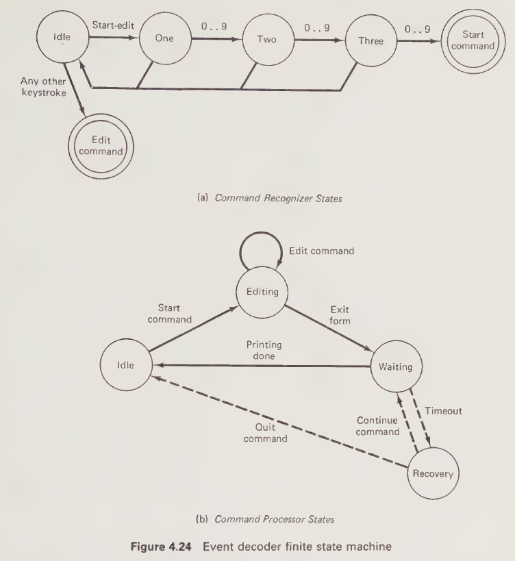

One of the more irritating circumstances that can arise in an intelligent workstation is the keyboard going dead because a device has failed to respond. This is what could happen without the dotted lines in the command processor FSM, which provide for explicit rejection (instead of ignoring) of edit commands in the waiting state, and for exit from the waiting state if the printer does not respond. The lines are shown as dotted, because we did not include this possibility in the commands (a typical example of a specification error uncovered during design).

It is worth noting here that we have been able to define the major system modules and their interactions in considerable functional detail without making any commitment to whether the particular modules are packages or tasks, which module calls which other one, and how many calls are necessary to implement the data flow. Thus, the data flow first approach to design enables us to postpone commitment to these essentially administrative details. The commitments already made in Section 4.5.3 could easily have been postponed until the data flow picture was complete.

### 4.5.5 Structure for Background Printing

We are finally in a position to decide on the overall task interaction structure for background printing. Consider first the interaction between the keyboard interface task and the event decoder task. One approach would be to have the event decoder task call an entry GET_KEYSTROKE in the keyboard interrupt task to wait for a keystroke. This approach has the advantage that the keyboard interrupt task can never be held up by circumstances affecting another task which it has called. Another approach would be to have the keyboard interrupt task call the event decoder task to pass the keystroke when it does arrive. This has the advantage that the event decoder task will never miss other events because it is waiting for keystrokes. However, this is clearly one of those situations described in Chapter 3 where each task is too important to call the other. A transport task must be used between them.

The bidirectional data flow between the line printer task and the event decoder task can be handled easily by a unidirectional entry call from the line printer task to the event decoder task to wait for more lines to print. The call in itself, serves as notification that it has finished printing the previous set of lines. The page-line number range for a new set of lines to be printed can be returned as an output parameter of this call. Figure 4.25(a) shows the resulting structure.

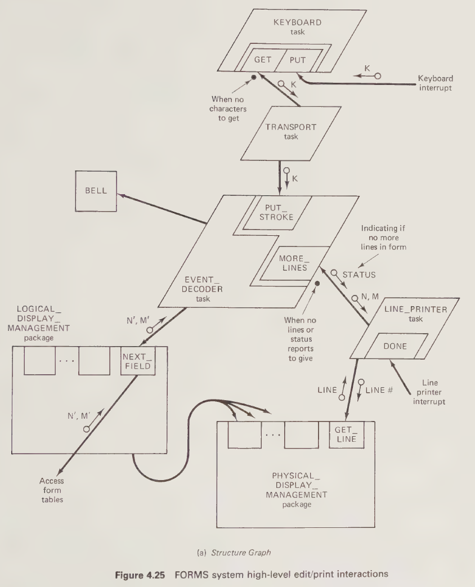

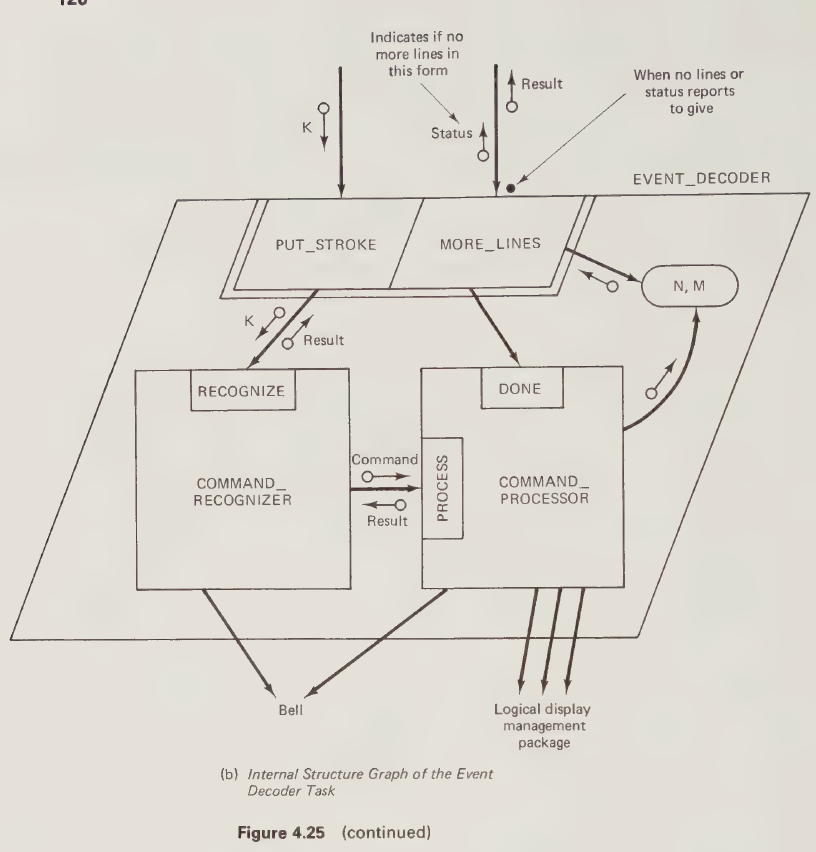

As further reinforcement of the use of a transport task for keyboard events, consider the following scenario. If the event decoder called the keyboard interface directly, the following sequence of events could occur. While the line printer task is busy printing the first few lines of the form, editing operations managed by the event decoder task could succeed in freeing several more lines. The line range freed would be noted internally in the event decoder for release to the line printer on acceptance of the MORE_LINES call. At this point, suppose the operator pauses for thought while the event decoder task is waiting for another keystroke. Before the operator hits the next key, suppose the line printer task calls for more lines. Because the event decoder task is waiting elsewhere, the line printer task must also wait even though lines are available. The line printer task will not get its lines to print until the operator hits the next keystroke, freeing the event decoder task to process that keystroke and accept the MORE_LINES call. It is very unlikely that this small unnecessary delay in resuming printing would ever be important to the operator in this system. However, note that in rejecting it as unimportant, we are making assumptions about system timing which could be invalidated by subsequent changes to the requirements or to the system design. With a transport task between the keyboard and the event decoder, it is never possible for the printer to be held up unnecessarily when lines are available for printing because the event decoder task will never be waiting elsewhere when the printer task makes its call for more lines.

Note that Figure 4.25(a) does not show the complete system structure but only that involving the high-level edit/print interactions. The nature of the structure is obvious from the previous diagrams and discussions, and it would be a simple matter to draw on these to develop a complete structure diagram. However, note that it is often the case that complete structure diagrams are less informative than a number of partial diagrams showing how parts of the system interact for particular purposes. Often one wants to focus on a particular package or task together with all of its interactions with other packages or tasks without regard to their interactions with each other.

We now turn to the internals of the Event Decoder task. Figure 4.25(b) provides one possible structure, employing nested packages to implement the command recognizer and processor modules. The controller is the main loop of the task.

An Ada program skeleton for the task is given in Figure 4.25(c).

### 4.5.6 Design Evaluation

A simpler interaction of the field edit package with the external world would result if a field context were maintained inside the package. Field context means the physical position and dimensions of the field on the screen together with all field attributes. Figure 4.26 illustrates this approach. It offers the attractive possibility of extensibility to include complete field editing functions similar to those associated with page oriented word processing.

**Figure 4.26 Alternative approach to the field edit package**
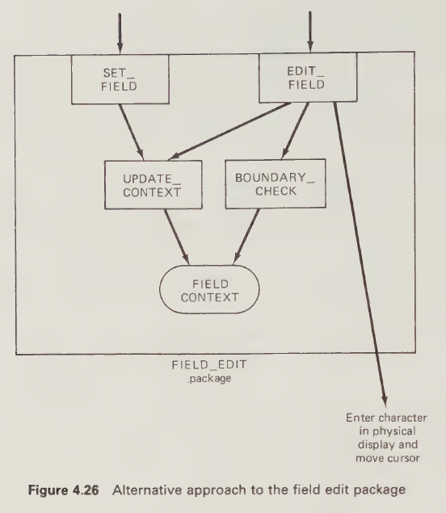

However, before jumping on the bandwagon for this approach, consider Figure 4.27, which shows an approach to cursor control typical of that employed in many word processors but different from what we have assumed here. In this approach the cursor may be moved physically anywhere on the screen independently of the current logical context; it is up to the logical display management package to determine whether operations associated with the new cursor position are legal. It is difficult to reconcile this approach with that of maintaining all logical field operations, including cursor movements within the field, under the control of the field edit package, as suggested by Figure 4.26.

**Figure 4.27 Data-flow graph showing mixed logical and physical cursor movements**
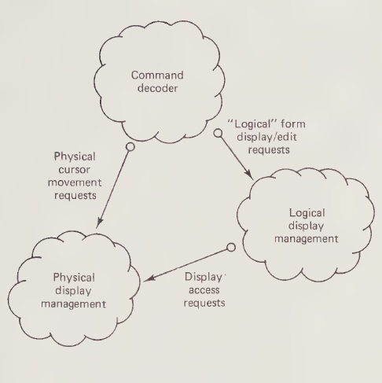

Of particular concern for designs which involve operator interactions is the extensibility of the design to cover possible new forms of interaction without major modifications. If changes are required, the important considerations are:

* Can the changes be restricted to tables?
* Can the changes be restricted to code and tables in one module?
* Are changes required to the interactions between modules as well as to the modules themselves?

Changes in the FORMS system might be required due to deficiencies of the present system with respect to the following points:

* lack of provision for multiple keystroke commands or command echoing
* lack of a proper insertion facility in a field
* lack of operator control of printing
* inability to return to a field once the next field keystroke has been entered except by redoing the entire form
* lack of provision for form table storage or secondary memory

We must now ask ourselves if these deficiencies can be easily rectified within the framework of this design.

There is no problem with multiple keystroke commands. These could be handled by adding a keystroke sequence recognizer in the event decoder, which would include character sequences in commands as well as sequences of commands. Nor would there be any problem with echoing, because the system has been designed to accommodate effects on the screen of individual keystrokes.

Changes to provide for automatic movement of text in the field to the right or left on insertion or deletion would be confined to the internal logic of the Field Edit package and so could be accommodated fairly easily. The interface to this package would not even have to be changed provided that insertion or deletion requests were passed as character code parameters of the ENTER_CHAR procedure.

Operator control of printing and arbitrary ordering of field visits by the operator could be very easily handled at the sacrifice of concurrent editing and printing on the same form. The logic of this particular design is based on the requirement that lines at the top of the page can be printed while fields at the bottom are still being edited. To accommodate arbitrary ordering of field visits by the operators, the ability to simultaneously edit and print a single form in this manner would have to be sacrificed. However, the structure of the system is such that this is easily done. Simply modify the form table for each form so that only the bottom right hand corner field releases all of the lines for printing. A special small print-enable field could even be created just for this purpose.

As for the arbitrary field ordering, the NEXT_FIELD command would have to be redefined to include a field number parameter, and the NEXT_FIELD procedure in the logical display management package would have to take account of this parameter. Otherwise the system would be unchanged.

An alternate approach to handling separate printing which would require some modification to the system is to add a print command. This print command would now have to be recognized by the event decoder, and printing would now take place on recognition of this command instead of on recognition of exit from the print-enable field in the form. With reference to Figure 4.25, the event decoder task would no longer retrieve the page-line number range as a parameter of the next field call. However, no change would have to be made to the way in which the line printer task interacts with the event decoder task. On receipt of the print command (which could have page-line number range as a parameter), the event decoder task would simply hand the page-line number range as a parameter to the line printer task as before.

Note that there is never any possibility of conflict between editing and printing in either the original system or any of these variations, because the event decoder prevents it. Therefore the decision to make physical display management a passive package is justified, and the decision to pass line numbers instead of whole lines to the printer is also justified. However note the possible lack of safety if additional tasks are added to the system.

Accommodating forms tables stored on secondary storage would also be quite easy. The NEW_FORM procedure in the logical display management package would have to be modified to access the file system to get the form table instead of simply going directly to the form tables already stored in memory. The rest of the edit part of the system would be unaffected.

## 4.6 THIRD DESIGN EXAMPLE: DIALOGUE
### 4.6.1 Introduction
As a final design example in this chapter, consider the interaction of human operators at geographically separate physical sites using the video screens of their workstations to prepare messages for remote operators and to receive messages from remote operators. The interesting new problem introduced by this example is that of contention on an equal partner basis for a resource (the screen) rather than on a master/slave basis as with the FORMS system. In the FORMS system, contention for the resource (the video memory) was between a master foreground task and a slave background task whose activities were explicitly initiated by the foreground task. A new feature of the DIALOGUE system is that the local and remote human operators interact on an equal partner basis. In a single workstation at a particular site, the local human operator and the remote human operator will each have a task acting on his or her behalf inside that workstation and, accordingly, these tasks must also interact on an equal-partner basis. This equal-partner contention introduces some new design issues.

Figure 4.28 provides a high-level view of the DIALOGUE system. The human operator at either end can enter command and data keystrokes via the keyboard. Keystrokes include three special function keys, namely, RESERVE, RELEASE, and SEND. The RESERVE function key reserves the screen for message preparation. The RELEASE function key releases the screen and clears it when the operator decides either to abandon preparing an incomplete message without sending it, or to release the screen after reading a message which has been sent from the remote operator. The SEND function key is used to send the message displayed on the screen to the remote operator and then to release and clear the screen. Keystrokes also include any alphanumeric key.

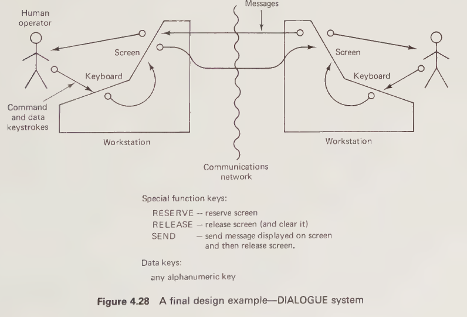

We shall not be concerned in this example with details of screen formatting or command echoing but only with sequences of interactions. Neither shall we be concerned with details of the communications network link. We assume that either a physical connection exists between the two terminals or that a connection can be established somehow through a public data network. We assume that a facility exists to send text messages to the current remotely connected terminal and to receive text messages from it. The design of such a message system is treated in Chapter 6.

Our main concern in this example is with sequencing. We want to avoid sequencing errors such as a locally prepared message being overwritten by a remotely arriving message before the local one has been sent.

It is quite easy to develop a finite state machine showing proper sequencing of local reserving, releasing and sending the screen. Figure 4.29 provides a finite state machine for these activities and gives an example of a legal sequence of keystrokes. Note the assumption implicit in this FSM that messages are passed from the screen to the messaging system as complete units. However, correct sequencing will also depend on remote events; before including them in a finite state machine, we must examine data flow.

**Figure 4.29 Finite state machine showing legal DIALOGUE system keystroke sequences**
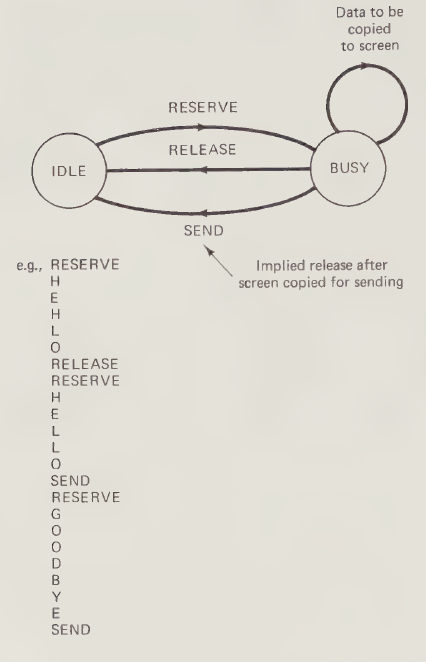

### 4.6.2 Data Flow
Figure 4.30 provides a start on developing an edges-in data flow graph for this system. Within each workstation there must be a keyboard interface, a screen interface, and a message system interface. Moving inward from these edges, we recognize the need for an event control module which will provide the proper mediation between all of these activities. Inside this module we can identify the possible need for an event pool which serializes the keystrokes and incoming messages into a single stream of events and an event decoder which decodes these events and performs appropriate actions. The need for this serialization of the event stream arises, because remote events arrive at unpredictable times completely outside the control of either the human operator or the keyboard interface.

**Figure 4.30 Edges-in data-flow graph development for the DIALOGUE system**
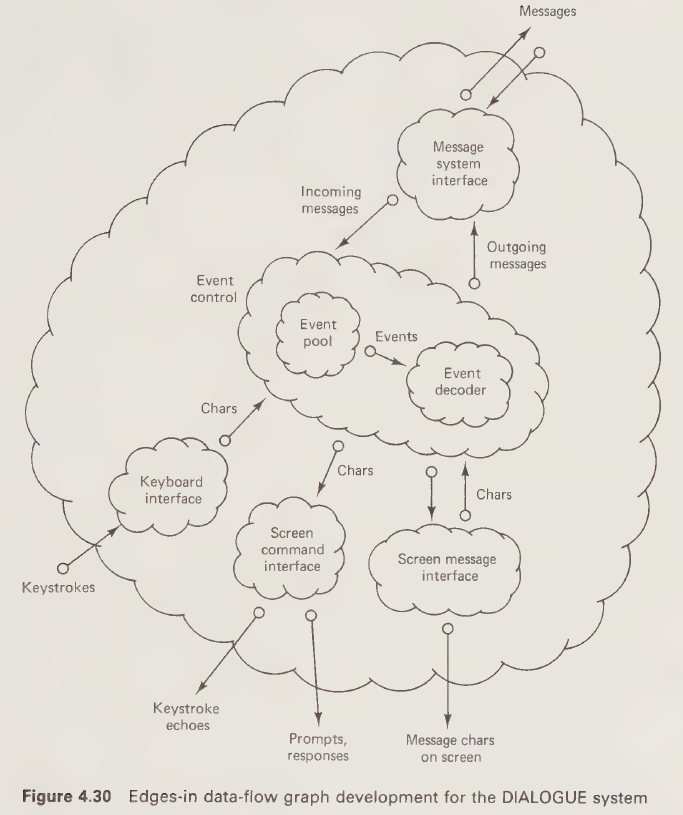

Given the idea of an event stream, we can now define an expanded finite state machine showing legal event sequences, as shown in Figure 4.31. In this finite state machine the former BUSY state has been renamed BUSY_LOCAL and a new state BUSY_REMOTE has been added. The BUSY_REMOTE state can only be entered from the idle state, thus, avoiding the possibility of overwriting the message on the screen.

**Figure 4.31 Expanded finite state machine showing legal DIALOGUE system event sequences**
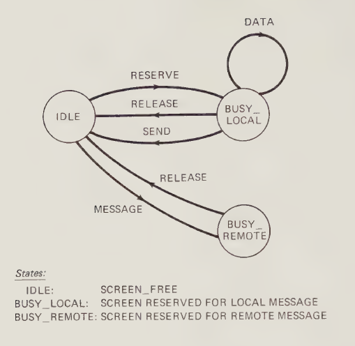

### 4.6.3 Structure
Given the data flow graph of Figure 4.30 and the event stream sequencing finite state machine of Figure 4.31, we can proceed to develop a structure graph for this system.

Figure 4.32 shows both structure and Ada code of a first attempt. Motivated by the discussion of the FORMS system design in Section 4.5.5, it includes two transport tasks, one for each type of event, to avoid any problems with unnecessarily delayed recognition of events. These transport tasks call PUT_STROKE and PUT_MESSAGE entries in the event decoder task.

**Figure 4.32 Event pool implemented implicitly by entry queues of event decoder task**
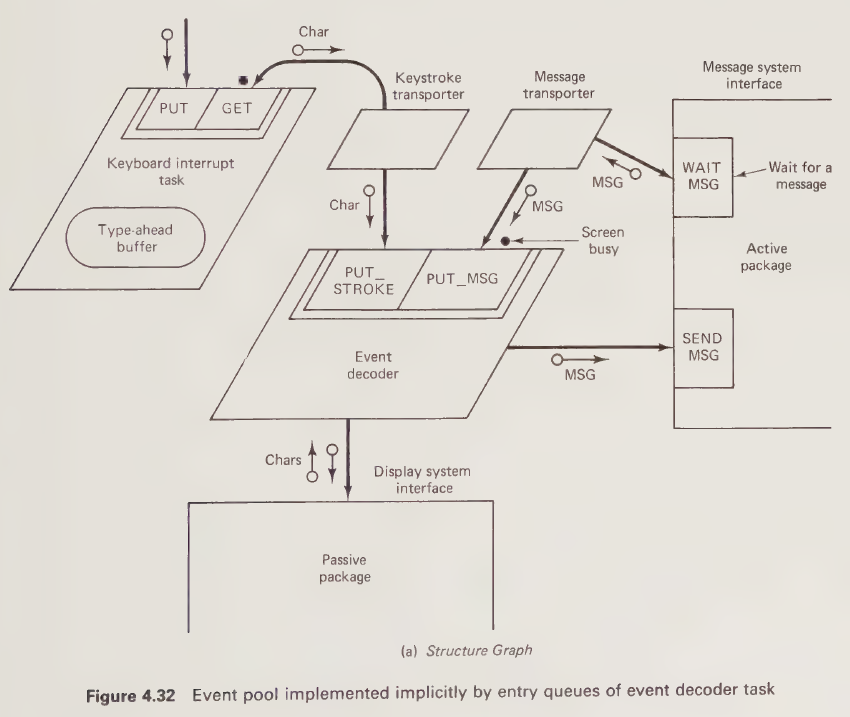

The PUT_STROKE entry is accepted unconditionally. The PUT_MESSAGE message entry is only accepted when the FSM is in the idle state. Because there is only one transport task for each of these entries, it is not possible for the entry queues to contain more than one keystroke or more than one message so that if multiple keystrokes and multiple messages can arrive while the transport tasks are waiting for acceptance by the event decoder, they must be queued in the keyboard interrupt task or in the message system interface. In the keyboard interrupt task, this can be accomplished by providing a type-ahead buffer as shown. We are not concerned here with the internal details of the message system. However, whether or not the message system provides such buffering internally is irrelevant to the operation of Figure 4.32.

As shown by Figure 4.32(b), the finite state machine must be explicitly coded in the accept statements of the event decoder task. If it is desirable, for modularity, to provide a table-driven finite state machine, then the event sequence should be available internally in the event decoder task. This implies removal of the type-ahead buffer from the keyboard interrupt task, replacement of the PUT_STROKE and PUT_MESSAGE entries by a single PUT_EVENT entry, and addition of an event pool data structure internally in the event decoder task.

The result (structure graph only) is shown in Figure 4.33. Now, because the finite state machine operates directly on the event sequence, it can be completely table-driven. The event pool is defined as an internal package of the event decoder task with separate interface procedures to put and get keystrokes, messages, or the next event of either kind.

**Figure 4.33 Event pool implemented by body of event decoder task**
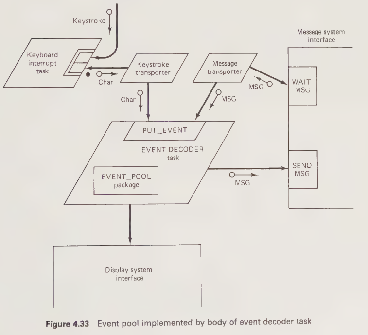

### 4.6.4 Design Evaluation
Lest the design decisions up to now have appeared somewhat too easy, let us examine another approach which appears at first sight to be very natural but which is logically more complex. This approach allows open competition for the screen between the keyboard decoder and the communications system. Missing is the intervening event stream serializer which characterized the previous design. This alternative approach is illustrated in Figure 4.34. In this approach a screen scheduler controls access to the screen without knowing anything about the purpose for which the screen is being requested. Because of the unpredictable timing of arrivals of requests, any competitor for the screen (keyboard decoder or communications system) may have to wait before screen access is granted. The problem with this approach is that the screen is used asymmetrically by the two competitors. The communications system only asks for the screen to display incoming messages but is not able itself to release the screen; this can only be done by the keyboard decoder when the screen is released by the operator. This results in an unpleasant asymmetry in the handling of keyboard and message events, which is entirely missing from the previous approach. This asymmetry adds complexity.

**Figure 4.34 DIALOGUE system data flow—a more complex approach**
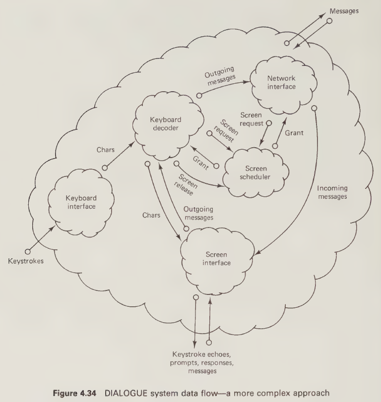

There is a general principle at work here. When multiple activities generated by human operators and system components can compete for resources, coordination of these activities should be centralized rather than distributed. Otherwise, complex interactions between the activities may be required, and modularity of the human interface subsystem is compromised.

In this design we have blithely ignored issues associated with message buffering and the network interface. These issues will be treated in Chapter 6.

## 4.7 CONCLUSIONS
This chapter has attempted to illustrate, using examples, design strategies and methodologies, the design process, and technical issues in design.

We are now ready for Part C, which explores the major issues raised in Part B in more detail.