# Part C: Exploring Logical Design

This part begins by taking a more detailed look at some features of Ada that affect design, using both examples from Part B and new examples. It then tackles questions of modularity, reliability, and structure, through the design of a communications subsystem called COMM, for use with the DIALOGUE system. Finally, it tackles issues in the design of layered, concurrent systems in general, through the design of a system to implement the X.25 packet switching protocol.

# Chapter 5: More Issues About Ada

## 5.1 INTRODUCTION

In this chapter we explore some further Ada issues touched on only lightly, if at all, in previous chapters. We are primarily concerned here with the organization and interaction of active modules, that is, tasks or active packages.

Our approach in this chapter is to discuss what a designer may wish to express and then to discuss how it may be expressed in Ada.

Section 5.2 explores some important questions associated with task identifiers, task pools, and the dynamic access and creation of tasks, using the BANK example of Chapter 3 to illustrate many of the points. In passing, the identifier aliasing problem is treated.

Section 5.3 treats some important questions associated with task interaction structures. Linear and nonlinear interaction structures are defined and their properties examined using as examples flow-control, readers-writers scheduling, and task pool allocation problems. In passing, problems of starvation of tasks and of races between tasks are illustrated and solved.

Section 5.4 expands our view of event reporting to include exceptions. It shows how exceptions alter our view of system structure and argues that they should be used sparingly.

Section 5.5 treats the detecting and controlling of aberrant behavior from a number of viewpoints. Can test-bed software be constructed to detect aberrant behavior, particularly in tasks and active packages? When should intertask protocols be used to provide protection from aberrant behavior in other tasks? How should the possibility of distributed target environments with potentially unreliable links and nodes be treated?.

Section 5.6 considers system building issues. Ada has been characterized _structured system building_ for module concepts. However, what about dynamic installation of new modules or reconfiguration of old ones? How should the designer view packages and tasks from a system building perspective instead of simply from a structured design perspective? It is in this section that we confront some major limitations of Ada.

## 5.2 ISSUES IN THE DYNAMIC ACCESS AND CREATION OF TASKS

### 5.2.1 Introduction

This section explores some important questions associated with dynamic interaction and creation of tasks. How may task identifiers be assigned and made known dynamically to all who need them (for example, to allow customer tasks to call otherwise anonymous members of task pools, or to allow secretary tasks to make calls back to previously anonymous customer tasks)? Hitherto, we have assumed all tasks were well-known so that their identifiers could be explicitly coded in call statements. A related question is: How may active packages implementing task pools protect themselves from misuse of dynamically assigned identifiers? A further related question is: How may members of task pools be dynamically created as needed?.

Ada provides a template mechanism for identical tasks by allowing tasks to be defined as types. This allows us, for example, to define a single `TELLER_TYPE` task for the BANK example of Chapter 3. Instances of this single `TELLER_TYPE` may be created in a variety of ways, the simplest of which is to declare an appropriate number of tasks to be of type `TELLER_TYPE`. The names of these tasks may then be used in entry call statements. This is a much less cumbersome approach than that (used in Chapter 3) of defining each teller task individually with its own specification and body. However, it introduces identity problems, as we shall see.

### 5.2.2 Indirect Access to Anonymous Members of Task Pools

Direct use of the names of otherwise anonymous instances of task types is not necessarily the best way of identifying them in applications. In particular, it is often appropriate to identify members of task pools by application-dependent identifiers. Examples include the wicket numbers of the BANK example, connection identifiers in communications protocols, and device identifiers in I/O handlers. This approach enables rendezvous to be made with tasks hidden inside active packages.

Consider the BANK example again, retaining the wicket number mechanism but this time using a single task type for tellers. The wicket number mechanism creates an identity problem. The task body definition obviously can't include static initialization of the wicket number, as before. Each teller must therefore somehow acquire its wicket number dynamically. Two possibilities exist: either the dispatcher calls the teller or the teller calls the dispatcher .

The first possibility is illustrated in Figure 5.1(a). In this figure the teller tasks are components of an array. During initialization the dispatcher calls each task in the array, using the array name and index as a qualifier in the call statement, and passes the array index to the task to use as its wicket number. Later, the `REQUEST_SERVICE` procedure uses the wicket number passed to it by the customer in a similar fashion to call the correct teller.

**Figure 5.1 How a member of a task pool may discover its identity**

**(a) By Accepting a Call From the Dispatcher**
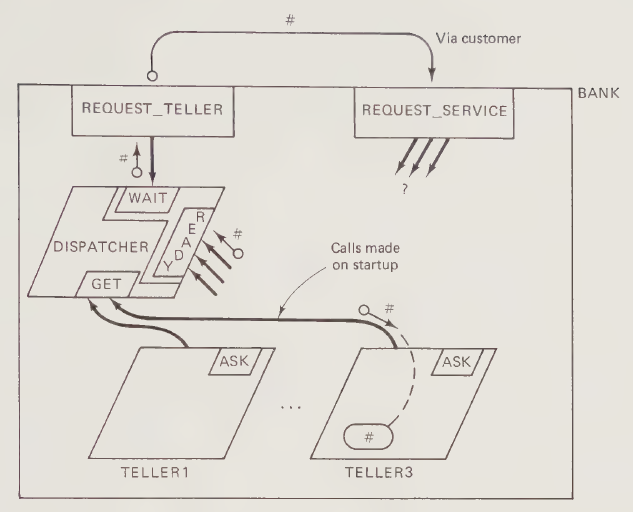

```ada
package body BANK is
    -- SHOWING STARTUP ONLY
    task type TELLER_TYPE is
        entry ASK (...);
        entry NAME (I:in WICKET);
    end TELLER_TYPE;
    TELLER_COUNTER: array (WICKET) of TELLER_TYPE;

    task body DISPATCHER is
        I: WICKET;
        for I in 1..N loop
            TELLER_COUNTER(I).NAME(I);
        end loop;
    end DISPATCHER;

    task body TELLER_TYPE is
        MY_NUMBER: WICKET;
    begin
        accept NAME (MY_NUMBER: in WICKET);
        -- ... rest of task body
    end TELLER_TYPE;
end BANK;

```

The second possibility, of the teller calling the dispatcher, is more difficult to realize. As shown in Figure 5.1(b), the teller initially calls the dispatcher to GET its wicket number. Thereafter, whenever it is free, it calls a single READY entry in the dispatcher to pass on its wicket number. But how can the `REQUEST_SERVICE` procedure then contact the correct task using this wicket number? Under the circumstances, it can only call tellers successively until it finds the correct one. The problem could be solved, somewhat awkwardly, by providing a separate READY entry for each teller in the dispatcher, allowing the dispatcher to set up a correspondence table between wicket numbers and tellers which could be used by the `REQUEST_SERVICE` procedure to identify the correct teller.

Alternatively, the teller could pass both its name and wicket number to the dispatcher. But now we have come full circle: How does the teller know its own name? This question is addressed in Sections 5.2.3 and 5.2.4.

**Figure 5.1 (continued)**

**(b) By Calling the Dispatcher**

### 5.2.3 Direct Dynamic Connection Between Tasks

What if, instead of rendezvousing with unknown tasks through interface procedures of active packages, direct contact between tasks is desired? Then identifying values, useable directly in entry call statements, must be passed between tasks. This approach might be required to enable customers of the bank to call tellers directly. It might also be required to enable tellers to call customers directly, for example, if a transaction involved a lengthy background activity by the bank during which the teller could service other customers.

The ability to call another task directly using a dynamically-supplied value identifying the task will be referred to as dynamic connection or dynamic access, to contrast it with the static access characterizing all previous examples. A structure graph notation for dynamic access is shown in Figure 5.2. Task A gets a value identifying task B from somewhere and then calls an entry in task B using this value as a qualifier in the entry call. There is no intermediate procedure which knows the name of the task, given an application-assigned identifier, as there was in Section 5.2.2. The calling task does not need to know the value identifying the called task at the time the code is written, but it must know the called task's type so that it may know the entry names and parameters.

From the designer's viewpoint, such dynamic connections might be desirable between any module types; however, as illustrated in the figure, such connections between procedures or packages are illegal in Ada.

**Figure 5.2 Dynamic connections between modules**
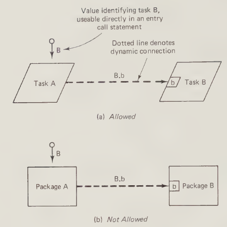

Let us now reexamine the BANK example, considering how dynamic connections may be made by customers to tellers and by tellers to customers. The former case may be characterized as dynamic connection in the forward direction of the customer/server relationship and the latter case as dynamic connection in the reverse direction of the customer/server relationship .

For reference purposes, Figure 5.3(a) depicts the original BANK example (with wicket numbers) as static connection in the forward direction.

Figure 5.3(b) depicts the BANK as providing dynamic connection in the forward direction, without wicket numbers. Here the dispatcher provides the customer a value identifying the teller, and the customer uses this value directly in an entry call statement to the appropriate teller .

**Figure 5.3 The BANK example—connection in the forward direction**

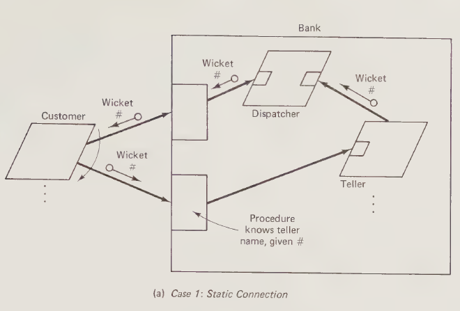
(a) Case 1: Static Connection

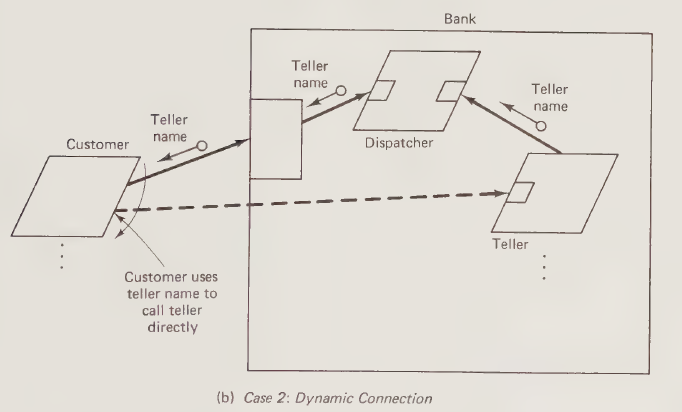
(b) Case 2: Dynamic Connection

What values can be used to identify tellers in the absence of wicket numbers? How may the body of the teller task acquire the value which identifies a particular teller (namely, the teller executing the body at the time the value is needed)?.

A simple (but, alas, incorrect) approach is to have the teller body pass the task type identifier to identify the task currently executing the body. The Ada Reference Manual encourages us to think this might work when it says that within a task body this identifier "denotes the task currently executing the body." This incorrect approach is illustrated in Figure 5.4.

**Figure 5.4 A simple but incorrect approach to task self-identification for the BANK example—Case 2**
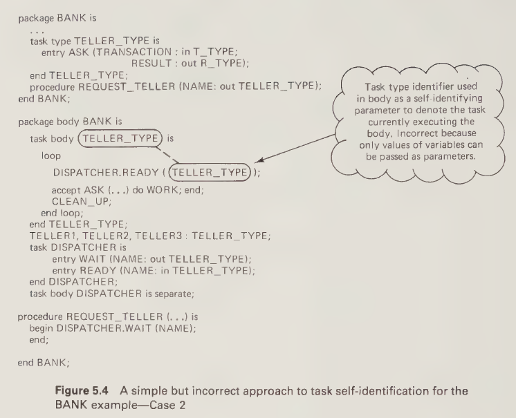

A suitable approach is to use access variables. We defer discussion of access variables for tasks until Section 5.2.4. However, note that a task does not automatically know its own access variable. It must be given it explicitly via an initialization rendezvous, just as it had to be given its own wicket number in Figure 5.1(a).

Figure 5.5 illustrates dynamic connection in the reverse direction for the BANK example. Here customers identify themselves to the bank so that tellers may call them later. Even if this approach is not used for the first contact between the customer and the teller, it may be appropriate for the teller to report results to the customer some time after the initial rendezvous. Because it is unreasonable to expect server packages to know all customer names in advance, dynamic connection is the only logical approach for the reverse direction.

**Figure 5.5 The BANK example—Case 3—Dynamic connection in the reverse direction**
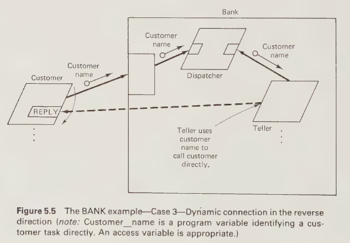

A simple (but also incorrect) approach is to have the customer body pass the task identifier to the bank. This incorrect approach is illustrated in Figure 5.6. Again, a suitable approach is to use access variables, as discussed in Section 5.2.4.

**Figure 5.6 A simple but incorrect approach to task identification for the BANK example—Case 3**
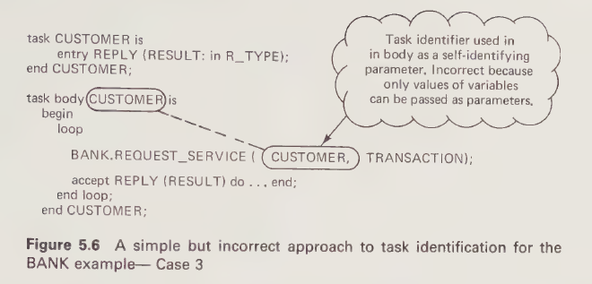

It is not only task pools such as the bank package which have naming problems. Consider the case of a MAILROOM package allowing tasks to send messages to other tasks by name and to receive messages for themselves by name. One approach would be for a customer task to pass its own name as a parameter of a RCVE call and then simply wait to return from that call until mail had arrived. Of course, if the customer task did not wish to wait personally, it could send a transport task for this purpose. The problem with this waiting approach is that it requires out-of-order scheduling. A customer will wait with other tasks in an internal entry queue in FIFO order but needs to be awakened only when its own mail arrives, not just when any mail arrives. As discussed in Chapter 3, out-of-order scheduling problems based on parameters of entry calls are awkward to handle in Ada. As suggested, a way around the difficulty is to provide each customer with its own internal entry in a task in the MAILROOM package. But this is obviously undesirable if the MAILROOM must serve many customers whose names are unknown a priori.

This is an example of a situation where reverse direction dynamic connection is desirable. Instead of waiting in an internal entry queue associated with the RCVE procedure, this procedure could simply be used to pass on the caller's identity to the MAILROOM package. If there is no mail immediately available for pick up, the caller may then go about its business and when it is ready to receive mail, invoke an accept statement for an entry which will be called by the MAILROOM package when mail arrives.

This approach is illustrated by Figure 5.7. The only thing to watch is that tasks in the mailroom package (which, of course, is an active package) are not held up waiting for customers to accept GIVE calls, thereby holding up other customers who want to receive or send mail.

**Figure 5.7 A reverse-direction, dynamic interconnection approach to a mail reception problem**
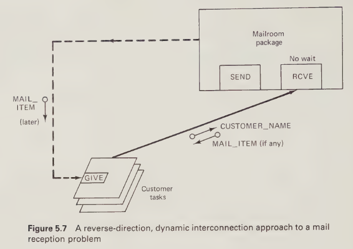

One approach to ensuring that such holdup does not happen is for customers to promise to be ready to accept GIVE calls immediately after placing RCVE calls to the mailroom package. In this case, calling the RCVE procedure is good only for one mail receipt.

Another approach is to use the RCVE call to register customers with the mailroom package for multiple mail receipts and for the mailroom package to have a pool of transport tasks which give mail to customers as required. If a sufficiently large pool is maintained to handle all customers or if members of the pool are dynamically created as required, then problems of waiting are avoided .

Without dynamic interconnection the only recourse is to introduce mailboxes. These are like the wickets in the bank example, except that they may be used for multiple interactions with the mailroom package. The externals of this approach are illustrated in Figure 5.8. Customers may rent and release mailboxes and may use the mailbox identifiers to send and receive messages. Internally in the mailroom package, mailbox identifiers could be used to index members of an entry family. Thus, each customer owning a mailbox could wait in its own entry queue for its own mail. Details of code for the MAILROOM example are left to the reader.

**Figure 5.8 A forward-direction, static interconnection approach to a mail reception problem**
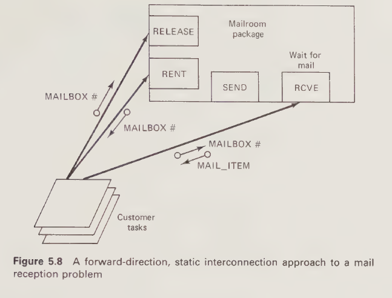

### 5.2.4 Dynamic Creation of Tasks

Because tasks may be defined as types, instances of tasks have many of the properties of variables. In particular, instances of tasks may be created dynamically in the same way that memory space for variables may be created dynamically:

- by declaring instances of task types in a dynamic context, for example locally in a procedure;
- by defining access types (pointers) to task types and creating instances of these types using a `new` statement.

Task pools such as the teller pool in the BANK example are an obvious application of dynamic creation.

Why not create instances of tellers only when customers need service and save the space taken up by task descriptor tables and stacks at other times? The issue is primarily one of implementation efficiency and, as such, is at a different logical level than the primarily design-oriented issues associated with dynamic connection.

An example of dynamic creation of tasks as they are required is given in Figure 5.9 for the BANK example. Note that the body of the `TELLER_TYPE` task contains no loop, so that each task instance terminates as soon as it has done its work. For simplicity, no limit on the number of tellers created is imposed in this example.

**Figure 5.9 BANK example with tellers dynamically created as required**

```ada
package BANK is
    procedure REQUEST_TELLER (NAME: out TELLER);
    task type TELLER_TYPE is
        entry ASK (...);
    end TELLER_TYPE;
    type TELLER is access TELLER_TYPE;
end BANK;

package body BANK is
    task body TELLER_TYPE is
        accept ASK (...) do WORK end;
        CLEAN_UP;
    end TELLER_TYPE;

    task DISPATCHER is
        entry WAIT (NAME : out TELLER);
    end DISPATCHER;

    procedure REQUEST_TELLER(...) is
    begin DISPATCHER.WAIT (NAME);
    end;

    -- DISPATCHER CREATES UNLIMITED NUMBERS OF TELLERS
    task body DISPATCHER is
        NAME : TELLER;
    begin
        loop
            accept WAIT (NAME : out TELLER)
            do NAME := new TELLER_TYPE; end;
        end loop;
    end DISPATCHER;
end BANK;

```

More significant from a design viewpoint is the requirement stated previously that access variables for tasks be used for dynamic connection. This requires dynamic creation, but not necessarily of the as required kind illustrated in Figure 5.9.

For example, in the BANK system tellers could be created by the dispatcher during initialization and then passed their own access variables for later use in self-identification. This approach is logically very similar to the wicket number approach of Figure 5.1(a), with access variables replacing wicket numbers.

### 5.2.5 Aliasing of Identifiers

A possible problem with all of these approaches is the aliasing of task identifiers. The term aliasing implies the existence of multiple copies of identifiers (whether application assigned numbers or access variables). The aliasing problem arises if identifiers are not explicitly deallocated by their supplier when their use is no longer appropriate. For example, customers of the BANK package should not continue to use old wicket numbers or teller task access variables after the interaction with the teller is completed.

One approach to guard against aliasing in the BANK package is to make teller identifiers in/out parameters of the procedure call requesting teller service and to assign an invalid identifier on return from this procedure. Identifiers are checked for validity on all calls to the procedure. This, of course, requires that identifiers be limited private types of the BANK package.

This approach is illustrated for wicket number identifiers in Figure 5.10. It can be used to guard against simple aliasing problems of the kind described here. However, more general aliasing problems are not so easy to guard against, as we shall see in Chapter 6.

**Figure 5.10 Protecting against wicket number aliasing in the BANK example**

```ada
package BANK is
    type WICKET is limited private;
    procedure REQUEST_TELLER (NAME: out WICKET);
    procedure REQUEST_SERVICE (NAME: inout WICKET; RESULT:...);
private
    type WICKET is range 0..3; -- 0 TO DEALLOCATE
    -- ...
end BANK;

package body BANK is
    -- ...
    procedure REQUEST_SERVICE (NAME: inout WICKET; RESULT: ...);
    begin
        -- Access teller and do work
        NAME := 0; -- Invalidate name
    exception
        when CONSTRAINT_ERROR => RESULT := INVALID_WICKET;
    end REQUEST_SERVICE;
end BANK;

```

Just how far one should go in guarding against this type of misuse is debatable. In the BANK package as designed, we already rely on customers to call tellers after they have been allocated, otherwise tellers will wait forever. If the BANK is willing to trust customers to this extent, then it should be willing to trust them not to reuse old identifiers. Of course, failure on the customer's part to make the call can also be guarded against by redesigning the BANK package. One possibility is to specify that one interface procedure both waits for a teller and asks service of the teller. Another possibility is to require tellers to time-out on waiting for customer calls.

## 5.3 MORE TASK INTERACTION STRUCTURES

### 5.3.1 Introduction

A task will be said to have a _linear interaction structure_ with respect to other tasks if there is no nesting of entry acceptances or entry calls within the critical sections of its accept statements.

All the task examples so far in this book have displayed linear interaction structures. However, cases arise in practice where it may appear at first glance, particularly to the experienced programmer, to be difficult or inappropriate to use such structures. The purpose of this section is to argue for the desirability of linear interaction structures, to show by example how they may be developed, and to introduce a new structure graph notation for the rare cases where they are unsuitable .

In passing we treat issues associated with appropriate representation of finite state machines, with starvation of tasks and with races between tasks.

Linear interaction structures are desirable for a number of reasons:

- The designer can clearly and unambiguously identify all waiting conditions, in terms of guards on entries, at the level of the task interface.
- The process of translating the designer's intentions into Ada code can be made relatively mechanical, thus minimizing the possibility of errors (and offering the enticing prospect of automated translation).
- The internal logic of each task follows a simple pattern of rendezvous-process-wait, which makes the overall system organization easy to understand.

Three examples illustrating the key issues are treated here:

- a task exercising flow control on data items sent to it (Section 5.3.2)
- a task implementing a finite state machine with a difficult out-of-order-scheduling aspect (Section 5.3.3)
- a task pool in which tasks are explicitly reserved and released by customers of the pool (Section 5.3.4)

Our emphasis throughout the exploration of these examples is not just on solving the technical problems but on developing solutions which have easy to understand task interface properties.

### 5.3.2 Flow Control Example

How a task may exercise flow control on data items sent to it was discussed briefly in Chapter 3. The solutions there all used linear interaction structures.

Consider now a possible nonlinear interaction structure to solve this problem, suggested by the linear structure of Figure 5.11(a). In this figure, A never waits for credit but only gets it if available at the time of the `SEND` call to B. However, a designer might wish to specify a different arrangement, for which we have, as yet, no structure graph notation, as follows. Suppose B grants credit to A by an out parameter of the `SEND` entry and that A waits for credit after its `SEND` call has been accepted, if credit is not immediately available (assuming it has indicated a willingness to wait by an appropriate value of the opcode parameter). If A calls `B.SEND` and, in doing so, exhausts its credit, then the `SEND` call will be accepted, but the rendezvous will not be terminated until credit is available. This credit will presumably be made available when another task calls `B.RCVE` to pick up an item. The only way of arranging the internal logic of B to satisfy these external requirements is for the `RCVE` entry to be accepted within the critical section of the `SEND` entry, thus violating linearity .

**Figure 5.11 Linear and non-linear interaction structure for a flow-control problem**
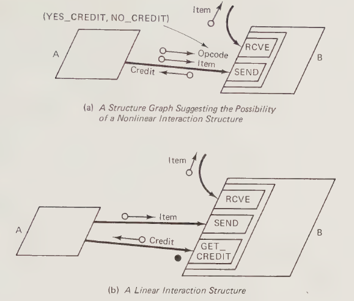
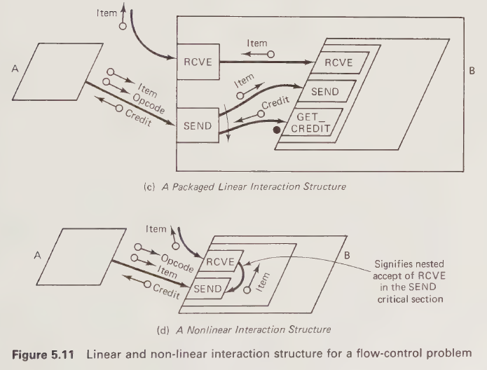

We argue that, in general, nonlinear approaches may be complex, both from an interface viewpoint and from an internal logic viewpoint. Therefore, before introducing a new structure graph notation which can reflect a designer's requirement for a nonlinear interaction structure, we first consider why this approach may be complex and then show how the problem may be solved without resorting to nonlinear structures.

From an interface viewpoint, the nonlinear interaction structure is complex because it is more difficult to describe than a linear structure in which the call is either always accepted and then processed to completion immediately, or guarded and thereby not accepted until it can be processed to completion. The simple dot notation on an entry in a structure graph to indicate guarded conditional waiting is no longer sufficient to indicate the nature of the interface, because conditional waiting for the out parameter of the call may occur even when a guard is not present. Furthermore, the caller can no longer take the simple defensive action against prolonged waiting of making a timed entry call. Once the `SEND` is accepted, the caller is stuck at the acceptor's pleasure.

From an internal logic viewpoint, the nonlinear interaction structure is more complex because of the higher level of explicit coupling required between the code fragments which process the various entries. For example, what if the accepting task has a large number of entries in a single selective accept clause? Accepting one of them and then waiting for a call on another one before terminating the first rendezvous effectively closes all the other entries. If they shouldn't all be closed, then a nested, selective accept clause may be needed, and such a nested clause may be needed for all entries which trigger nested accepts. The resulting code will be complex. With linear interaction structures, coupling between entries is restricted to the setting and clearing of guards and the inspection and updating of local variables, all of which are straightforward operations.

Figure 5.11(b) shows the appropriate structure graph notation for a linear interaction structure which includes the possibility of waiting for credit after sending. Figure 5.11(c) shows how a user might see this approach if task B were hidden inside an active package, as it might be in practice. The approach of Figure 5.11(c) offers the twin advantages of the simplicity of single user call and the clarity of a linear task interaction structure.

If, in spite of these considerations, a designer wishes to specify a nonlinear interaction structure, then Figure 5.11(d) provides a new structure graph notation allowing him to do it. This notation indicates that termination of the `SEND` rendezvous may be delayed (depending on the value of the opcode parameter and the availability of credit) by accepting the `RCVE` entry in the critical section of the accept clause for the `SEND` entry. The `SEND` rendezvous will thus not be terminated until the `RCVE` rendezvous is completed, presumably thereby releasing credit.

The nonlinear structure of Figure 5.11(d) solves the problem and on the face of it is not particularly complex from an interface viewpoint. However, the complexity arises in general from the fact that entries involved in nested accepts may also be accepted directly as separate select alternatives, perhaps even guarded ones. It is even possible to visualize nested accepts of the same entry occurring in several different select alternatives and of this being true for several entries. We shall return to this complexity question in our treatment of the next two examples .

### 5.3.3 A Readers/Writers Example, Using Finite State Machines

Finite state machines are ubiquitous in many types of embedded systems. Accordingly, their explicit, consistent, and uniform representation in the Ada program text seems desirable, both for verifiability and readability. The use of linear interaction structures can accomplish this purpose.

We saw in Chapter 4 several examples of how finite state machine modules naturally arise in system design. In particular, the DIALOGUE example showed how a finite state machine could be implemented in a task using a linear interaction structure with entry calls to announce events and guards on the entries to defer processing of events until appropriate states. This approach was straightforward for the DIALOGUE example. However, an apparent problem can occur with out-of-order scheduling in more complex cases. This problem is illustrated and solved below using a readers/writers example.

The approach of this section is to work through a number of progressively more general versions of this example, using both linear and nonlinear interaction structures, culminating in a final version (Figure 5.16), which is both linear and general. Along the way, a number of issues are raised and resolved.

A problem which arises often in concurrent programming and which has been solved by many methods in the literature is the readers/writers problem. The essentials of this problem are that a data structure in primary or secondary memory is accessed by a number of tasks, some of which only need to read its contents and others to update it. In general, reading and writing can occur at any time, although only one task at a time should be allowed to write. While it is writing, all other writing and reading tasks must be denied access. However, when no one is writing, any number of reading tasks may be allowed access. The rules can be refined, as we shall see, but first consider the solution for this simple statement of the problem.

An obvious approach to this problem is to use a scheduler task to control access. Figure 5.12 illustrates the approach, assuming there are several readers but only one writer. The resource scheduler task has `REQUEST_READ`, `REQUEST_WRITE`, and `FIN` entries. Readers calling `REQUEST_READ` are held up in the entry queue if writing is taking place until the writer is finished. The writer calling `REQUEST_WRITE` is held up in the entry queue until all readers are finished. Return from either the `REQUEST_READ` or the `REQUEST_WRITE` call denotes permission to proceed with reading or writing. Both readers and writers call `FIN` when they are finished. The problem as stated is a sequencing problem which is amenable to finite state machine solution along the lines of that employed in the DIALOGUE example of Chapter 4. Figure 5.13 illustrates both an appropriate finite state machine and the Ada code to implement it in the resource scheduler task. The linear interaction structure displayed by this particular Ada solution is attractive because of its explicit representation of the finite state machine, making it straightforward to program, easy to verify against the state transition diagram, and easy to read .

**Figure 5.12 Readers/writers example—external view**
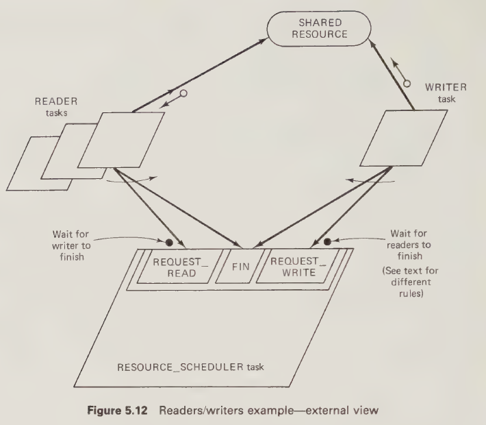

**Figure 5.13 Readers/writers example—solution 1**

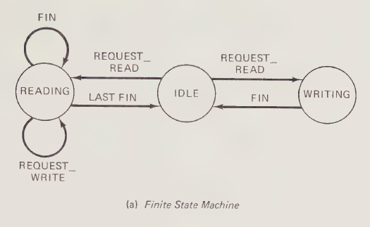

(a) Finite State Machine

```ada
task body RESOURCE_SCHEDULER is
    type STATETYPE is (IDLE, READING, WRITING);
    STATE : STATETYPE := IDLE;
    READERS : integer := 0;
    loop
        select
            when STATE = IDLE => accept REQUEST_WRITE
                do STATE := WRITING; end;
        or
            when STATE /= WRITING =>
                accept REQUEST_READ
                do case STATE is
                    when IDLE => STATE := READING; READERS := READERS + 1;
                    when READING => READERS := READERS + 1;
                end case;
                end;
        or
            when STATE /= IDLE =>
                accept FIN
                do case STATE is
                    when READING => READERS := READERS - 1;
                        if READERS = 0 then
                            STATE := IDLE; end if;
                    when WRITING => STATE := IDLE;
                end;
                end;
        end select;
    end loop;
end RESOURCE_SCHEDULER;
```

(b) Ada Program

However, the statement of the problem leading to this solution is faulty. A number of busy readers can lock out the writer indefinitely. This form of lockout exemplifies a system problem called starvation. It is not deadlock, because as soon as the readers cease to be busy, the writer may proceed. It is a milder system problem than deadlock but, nevertheless, undesirable. A proper statement of the problem should require that a writer be allowed to proceed as soon as all current readers have finished. This refinement introduces an aspect of out-of-order scheduling into the problem which makes the Ada implementation of the finite state machine in the form of Figure 5.13 less straightforward.

The tricky problem arising now is how to recognize (but not immediately accept) a `REQUEST_WRITE` call in the READING state as an event which should trigger a change to a new state. In this new state, new `REQUEST_READ` calls would not be accepted, and only when all pending `FIN` calls from current readers were accepted, would the `REQUEST_WRITE` call be accepted and the WRITING state be entered. The natural approach, following previous examples, would be to accept the `REQUEST_WRITE` call in the READING state and then to trigger an appropriate state change. However, also following previous examples, the next step would be to terminate the `REQUEST_WRITE` rendezvous and reenter the selective accept clause with new guards appropriate to the new state. But this would incorrectly give writing permission to the caller of `REQUEST_WRITE` .

An approach using nested rendezvous to solve this problem is given in Figure 5.14. Although this solves the programming problem, it does not fulfil the aim of explicitly representing the finite state machine in a linear interaction structure in the program text. There is an implicit reading-waiting-to-write state in this program. Furthermore, the structure graph illustrating the intent at the interface is awkward, because `FIN` is accepted in two places, one nested and one not.

**Figure 5.14 Readers/writers example—solution 2 (nonlinear)**

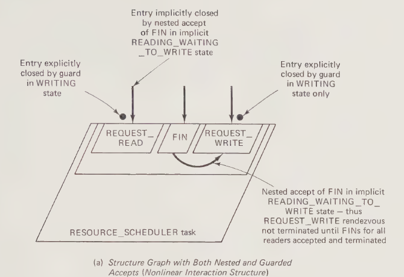

(a) Structure Graph with Both Nested and Guarded Accepts (Nonlinear Interaction Structure)

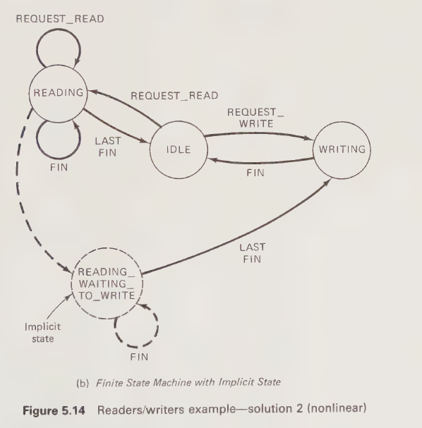

(b) Finite State Machine with Implicit State

```ada
        select
            when STATE /= WRITING =>
                accept REQUEST_WRITE
                do case STATE is
                    when IDLE => STATE := WRITING;
                    when READING => loop
                        accept FIN;
                        READERS := READERS - 1;
                        if READERS = 0 then
                            STATE := WRITING;
                            exit;
                        end if;
                        end loop;
                    end case;
                end;
        or
            when STATE /= WRITING =>
                accept REQUEST_READ
                do case STATE is
                    when IDLE => STATE := READING; READERS := READERS + 1;
                    when READING => READERS := READERS + 1;
                    end case;
                end;
        or
            when STATE /= IDLE =>
                accept FIN
                do case STATE is
                    when READING => READERS := READERS - 1;
                        if READERS = 0 then STATE := IDLE; end if;
                    when WRITING => STATE := IDLE;
                    end case;
                end;
        end select;
```

(c) Program Fragment Showing Nonlinear Interaction Structure

An explicit finite state machine representation is, however, easily obtained by noting that nothing can be done in the READING state for the prospective writer until the next `FIN` call arrives. Therefore, at the time of accepting the next `FIN` call, the `REQUEST_WRITE` entry queue can be checked and appropriate state changes made. This will protect the writer against ultimate starvation but may allow some additional readers to slip in before the next `FIN` call. We can restrict this to at most one reader by cross checking the `REQUEST_WRITE` entry queue at the time of accepting the next `REQUEST_READ` call. We can increase our chances of not letting even one reader slip in by periodically cross-checking the `REQUEST_WRITE` entry queue in a delay alternative, instead of waiting for external calls. The finite state machine representation of this approach is given in Figure 5.15(a), and an appropriate Ada program directly expressing this finite state machine is given in Figure 5.15(b).

**Figure 5.15 Readers/writers example—solution 3**

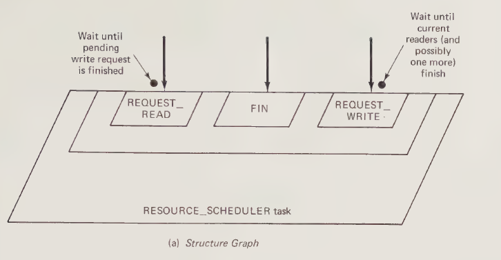
(a) Structure Graph

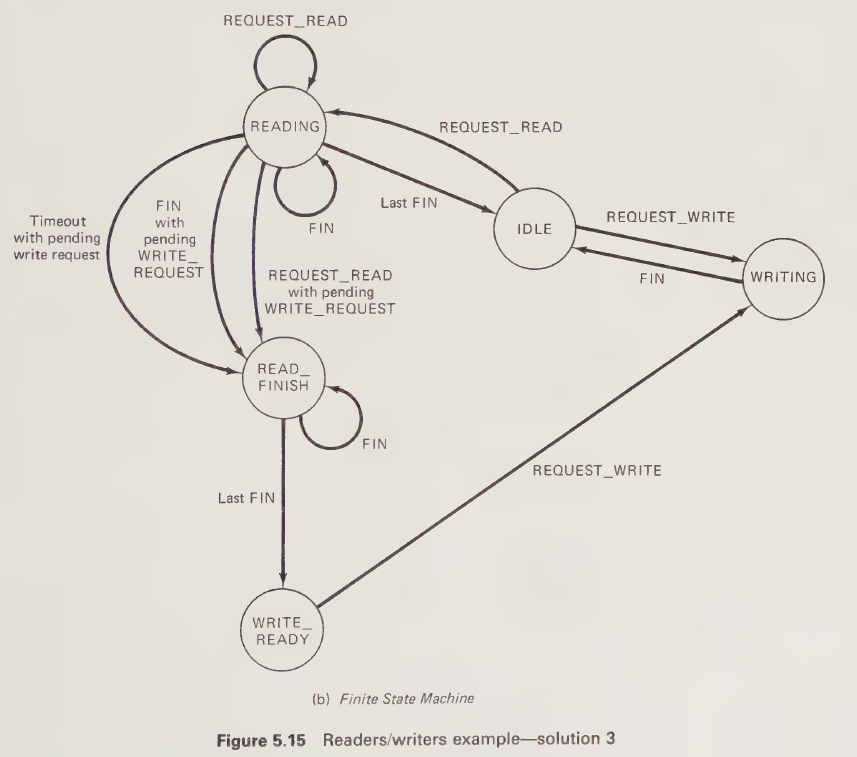
(b) Finite State Machine

```ada
task body RESOURCE_SCHEDULER is
    type STATETYPE is (IDLE, READING, WRITING, READ_FINISH, WRITE_READY);
    STATE : STATETYPE := IDLE;
    READERS : integer := 0;
    loop
        select
            when STATE = IDLE or STATE = WRITE_READY =>
                accept REQUEST_WRITE
                do STATE := WRITING; end;
            or
            when STATE = IDLE or STATE = READING =>
                accept REQUEST_READ
                do case STATE is
                    when IDLE =>
                        STATE := READING;
                        READERS := READERS + 1;
                    when READING =>
                        READERS := READERS + 1;
                        if REQUEST_WRITE'COUNT > 0
                            then STATE := READ_FINISH;
                        end if;
                end case;
                end;
            or
            when STATE /= IDLE or STATE /= WRITE_READY =>
                accept FIN
                do case STATE is
                    when WRITING => STATE := IDLE;
                    when READ_FINISH =>
                        READERS := READERS - 1;
                        if READERS = 0
                            then STATE := WRITE_READY; end if;
                    when READING =>
                        READERS := READERS - 1;
                        if READERS = 0
                            then STATE := IDLE;
                        else if REQUEST_WRITE'COUNT > 0
                            then STATE := READ_FINISH;
                        end if;
                        end if;
                end case;
                end;
            or
                delay TIMEOUT_PERIOD;
                if REQUEST_WRITE'COUNT > 0
                    then STATE := READ_FINISH;
                end if;
        end select;
    end loop;
end RESOURCE_SCHEDULER;
```

(c) Ada Program With a Linear Interaction Structure

The essential idea of the solution of Figure 5.15 is the treatment of the `REQUEST_WRITE` entry queue count attribute as an auxiliary variable affecting state transitions which are triggered in the first instance by the acceptance of other entries or by timeouts. If, however, there is a requirement which explicitly forbids the acceptance of even one `REQUEST_READ` after a `REQUEST_WRITE` has arrived, then the solution of Figure 5.15 is no longer valid. That solution allowed for possible acceptance of a single `REQUEST_READ` while in the READING state but after a `REQUEST_WRITE` call had occurred and before a `FIN` call had occurred.

A linear interaction structure to solve this problem can be realized by providing separate entries for the writer to post a request (`POST_WRITE`) and to wait for the request to be honored if it can't be honored immediately due to readers being active (`WAIT_WRITE`). If there is only one writer, then the posting entry is unguarded and the waiting entry is guarded. Otherwise, the posting entry must also be guarded, to avoid races among multiple writers between `POST_WRITE` and `WAIT_WRITE`. The same user interface can be maintained by nesting the scheduler task in an active package. This approach is illustrated in Figure 5.16. The finite state machine logic follows that of Figure 5.15 except that the transition from the READING to the `READ_FINISH` state is triggered by acceptance of `POST_WRITE`, and the transition from the `WRITE_READY` to the WRITING state is triggered by acceptance of `WAIT_WRITE`. To ensure that multiple writers are given priority over readers in the IDLE state, the priority mechanism of Figure 3.16 could be employed. The Ada code for the body of the task is left as an exercise for the reader.

**Figure 5.16 Readers/writers example—solution 4—packaged linear interaction structure**

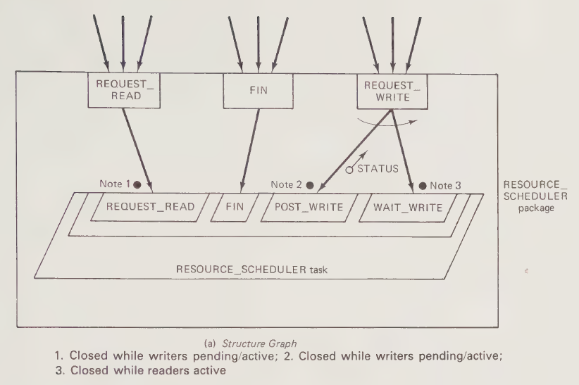
(a) Structure Graph
1. Closed while writers pending/active; 2. Closed while writers pending/active;
3. Closed while readers active

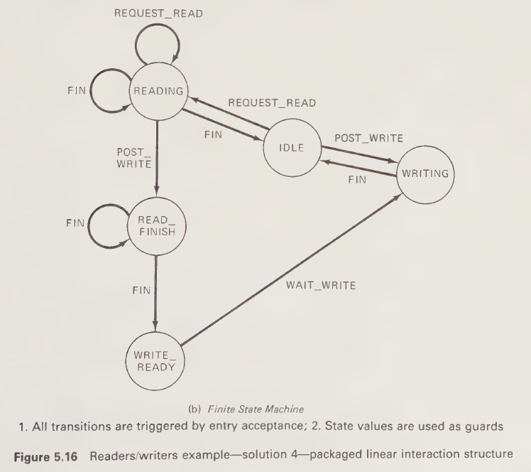
(b) Finite State Machine
1. All transitions are triggered by entry acceptance; 2. State values are used as guards

### 5.3.4 Task Pool Example: AGENT_POOL

Here we treat an `AGENT_POOL` example, which is more general than the BANK example. Multiple agent tasks in a pool are allocated and deallocated at explicit customer request. Between allocation and deallocation, an agent is available for multiple interactions with the customer to whom it is allocated. Presumably these interactions generate a need for autonomous activity by the agents; otherwise, why use tasks? Some interesting and important task interaction issues arise in considering the interactions between the pool dispatcher, the customers, and the agents. Figure 5.17 illustrates the points .

The basic idea is illustrated by Figure 5.17(a). Similarities to the bank example are obvious: the use of an integer (#) to identify an agent, the calling of `DISPATCHER.FREE` by a free agent, and the customer interactions on `RESERVE` (like WAIT in the bank example) and `ASK`. A new feature is the availability of an explicit `CANCEL` entry in the agent. The agent calls `FREE` to give the dispatcher its number after accepting a `CANCEL` call.

Solutions may involve agents waiting at the dispatcher or not waiting. Consider these possibilities in turn.

**Figure 5.17 Interaction structures for the AGENT-POOL example**
(note: Agent #'s assumed fixed at startup.)

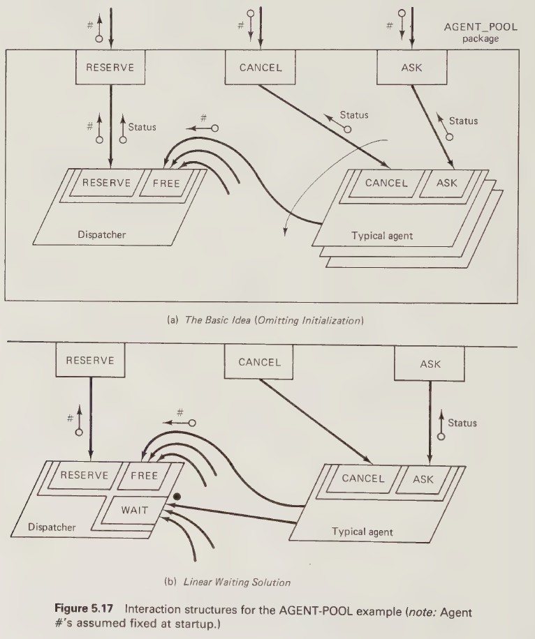
(a) The Basic Idea (Omitting Initialization)
(b) Linear Waiting Solution

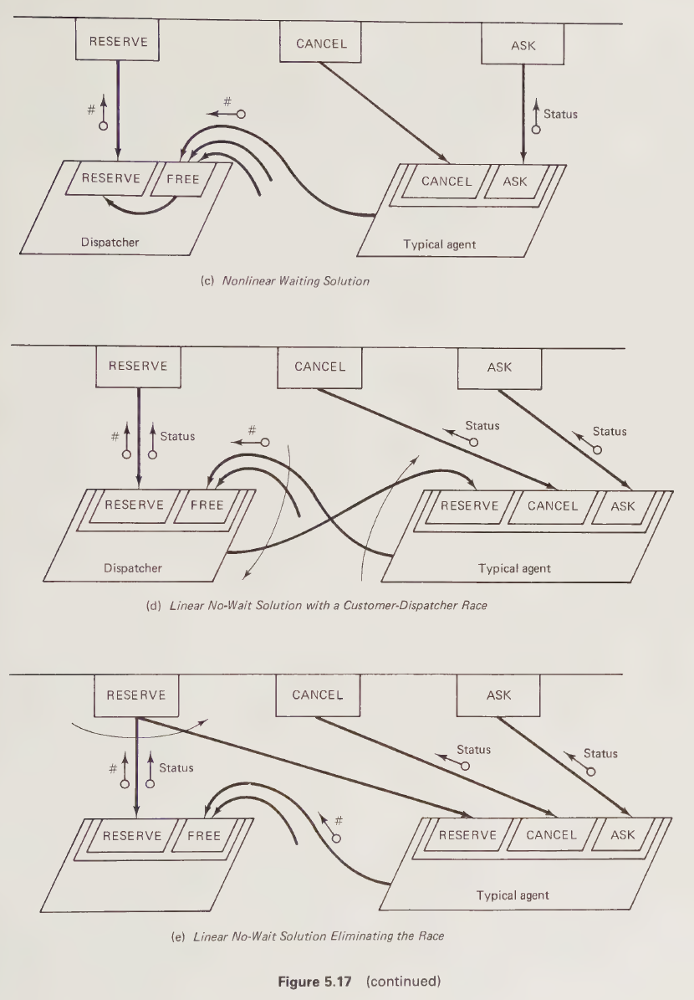
(c) Nonlinear Waiting Solution
(d) Linear No-Wait Solution with a Customer-Dispatcher Race
(e) Linear No-Wait Solution Eliminating the Race

A linear waiting solution is shown in Figure 5.17(b). Here, the agent calls the unguarded `FREE` entry and then calls the guarded `WAIT` entry in the dispatcher. The idea is that the dispatcher gets free numbers via `FREE`, which can be handed over to customers via `RESERVE`, following which allocated tasks can be released by accepting `WAIT`. There is no guarantee in such a structure that calls on `FREE` and `WAIT` will be made in the same order by agents. Races between agents may result in a different order and, ultimately, in the customer receiving an invalid agent number.

This race problem may be solved by making `WAIT` in Figure 5.17(b) an entry family indexed by the agent number. This preserves the linearity of the solution.

Alternatively, this race problem may be solved by using a nonlinear nested accept approach, as illustrated in Figure 5.17(c). This avoids races between agents and ensures the correct numbers will be handed over to customers. However, this approach is potentially complex if the dispatcher has more entries, as will be the case in an example in Chapter 7.

A linear no-wait solution is shown in Figure 5.17(d). The new `RESERVE` entry in the agent is required to tell the agent when it has been allocated so that it can return an appropriate `STATUS` parameter to its callers to indicate whether or not it is able to provide service. The approach shown in Figure 5.17(d), in which the dispatcher makes the `RESERVE` call, opens the possibility of a race between a customer and the dispatcher to make the first call on the agent. If the dispatcher's call on `RESERVE` is not accepted first, then a valid customer's request via `ASK` will be rejected. The interface procedure of the pool package could take care of this problem by placing a second call on behalf of the customer again after a suitable delay. However, this is an awkward solution.

A better solution is to have the `RESERVE` procedure of the package call the `RESERVE` entry to tell the agent it has been allocated, before returning control to the customer, as shown in Figure 5.17(e).

### 5.3.5 Conclusions

Linear interaction structures are desirable for the reasons enunciated in Section 5.3.1. They can be arranged by structuring waiting conditions appropriately, as illustrated by the examples of Sections 5.3.2 to 5.3.4. With linear interaction structures, care must be taken to avoid race conditions, as illustrated in Section 5.3.4. If nonlinear interaction structures are desired, appropriate structure graph notation may be found in Sections 5.3.2 and 5.3.4.

## 5.4 EVENT NOTIFICATION

Another important aspect of module interactions is event notification.

Event notification may be classified as synchronous or asynchronous as follows :

- Synchronous event notification occurs from a called module to the calling module at the time of the call (procedure or entry). It may be performed using out-parameters of the call or by exceptions propagated to the calling module while processing the call.
- Asynchronous event notifications may occur at any time. They may be in response to previous calls but occur separately from these calls.

Our main concern in this section is with synchronous event notification. Asynchronous notification may be handled by any appropriate intertask communication mechanism. However, before proceeding to synchronous notification, we should ask the question, is there any other mechanism for propagating asynchronous events between tasks other than by conventional intertask communication using the rendezvous mechanism? The answer is no, except in unusual circumstances involving task termination. Exceptions raised during processing of accept statements may be propagated to the calling task at the point of the entry call; however, this is synchronous rather than asynchronous event notification because of the nature of the rendezvous.

We now turn our attention exclusively to synchronous event notification. An out-parameter of a procedure or entry call is a perfectly acceptable way of propagating a synchronous event notification back to a calling module and is in fact the only method used in examples of previous chapters. Therefore, why bother with exceptions?

Before answering this question, consider the nature of Ada exceptions. At its simplest, the ADA exception mechanism provides a way in which an error discovered during the processing of a call can be propagated back to an exception handler in the calling module as an abnormal return from the call.

Thus, the exception mechanism simply provides a way for separating error handling code from the code associated with normal operation. This is convenient for the programmer, but it can be argued that it is bad software engineering practice—normal operation and error handling should not be separated during design.

One very significant feature of the Ada exception mechanism is that not all exceptions need to be programmer-defined; some exceptions are defined in the language and are raised by code generated by the compiler when an error occurs. Whether the exception is raised by programmer-generated or compiler-generated code, the handling mechanism is the same. Thus, the program can handle errors which in other languages would cause it to abort. This is a powerful motivation for using exceptions.

Unfortunately, there is considerable motivation for not using them, because the rules for using exceptions in Ada are complex and inconsistent.

On balance, it seems that there will be occasions when the designer will wish to specify the use of exceptions. Accordingly, we need a structure graph notation for them. No such notation was provided in Chapter 3.

Given a rule that all exceptions are declared in the specification of the called module and handled in the body of the calling one, exception propagation is, from a structure graph viewpoint, somewhat like a reverse direction procedure call, as illustrated by Figure 5.18(a). The externally visible exception X in the right-hand module B triggers an invisible handler internal in the left-hand module A. Exception X is declared in module B in a manner visible to module A, so that module A knows a handler is required. When exception X is raised in module B (during a call from A to B), it is propagated to a handler in module A, invisible to module B. Figure 5.18(b) illustrates the concept for the case of an exception propagated from package B to procedure A. Procedure A calls procedure b in package B and during the execution of this procedure, exception X is raised. This exception is then propagated back to A at the point of the call. A handler for X must be present in A but is not visible to package B. For the exception X to be visible to the caller of B, it must be declared in B's specification, just as procedure b must be so declared.

**Figure 5.18 Structure graph notation for exception propagation**

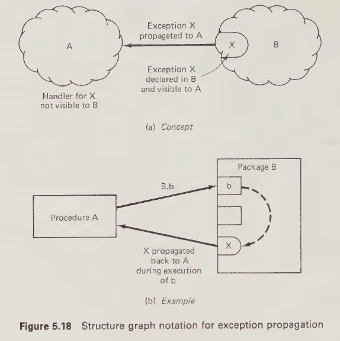
(a) Concept
(b) Example

Although exceptions may be propagated from B to A when A is a task or when both are tasks, there is no mechanism for declaring exceptions in task specifications. This and other complications make exceptions tricky in a tasking context.

When we view exceptions at a design level from a structure graph viewpoint, we can see that, far from simplifying the situation, exceptions complicate it by imposing an underlying shadow exception handling architecture behind and different from the architecture for normal operation. Why introduce this complication?

The author's strong bias is in favor of not using exceptions as a means of synchronous event notification between major system modules and instead to use them only internally within modules for special purposes, particularly where standard errors found by compiler-generated code need to be handled.

Notwithstanding these arguments, some designers may wish to opt for the use of exceptions for the more general case. An illustration of their use in this manner for the stack example of Chapter 2 is provided in Figure 5.19.

**Figure 5.19 Stack package with externally handled exceptions**

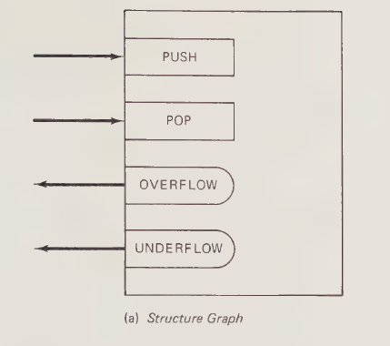
(a) Structure Graph

```ada
package STACK is
    procedure PUSH (E : in ELEM);
    procedure POP (E : out ELEM);
    OVERFLOW, UNDERFLOW : exception;
end STACK;

package body STACK is

    SPACE : array (1 .. SIZE) of ELEM;
    INDEX : INTEGER range 0 .. SIZE := 0;

    procedure PUSH(E : in ELEM) is
    begin
        if INDEX = SIZE then
            raise OVERFLOW;
        end if;
        INDEX := INDEX + 1;
        SPACE(INDEX) := E;
    end PUSH;

    procedure POP(E : out ELEM) is
    begin
        if INDEX = 0 then
            raise UNDERFLOW;
        end if;
        E := SPACE(INDEX);
        INDEX := INDEX - 1;
    end POP;

end STACK;
```

(b) Ada Code (following the Ada Reference Manual)

## 5.5 DETECTING AND CONTROLLING ABERRANT BEHAVIOR

### 5.5.1 Testing

Bugs in modules can be guaranteed to exist during system testing and integration. They may also, hopefully infrequently, occur during system operation if testing has not managed to find them all. The designer needs to be able to specify methods for abnormal module communication to be used for detecting, recording, and isolating such bugs.

Our concern here is not with debugging per se, which will be supported to a greater or lesser extent by the Ada programming support environments of particular computer systems supporting Ada. Rather, our concern is with the design of instrumented test beds for complete systems in operational form.

For example, it might be desirable to specify special testing interfaces for modules bypassing the normal rules of module access (for instance, to access the internal variables of a package which are not visible in the normal package specification). The author has used this approach successfully in projects employing monitors, which are a special form of package used for protected intertask communication in some non-Ada systems. In these projects, test-bed software was allowed to bypass normal monitor interfaces to read internal variables of the monitor.

Unfortunately, in Ada there is no explicit mechanism for specifying different forms of package or task interfaces for different purposes. Each package and task has a single specification and access to it is possible only as defined in that specification. The only way around this is to include special interfaces in the specification and comment them out in the operational version.

Designers would also like to be able to specify that test-bed software components be conditional parts of a program; that is, a mechanism for conditional compilation is desirable. Unfortunately Ada does not have such a mechanism. Again, special components may be included and commented out in the operational version.

At the design level, it is also desirable to be able to specify some means of recognizing and stopping the execution of rogue tasks or active packages without stopping the execution of the entire program so that intermediate results can be examined and the source of problems diagnosed. The recognition problem can be solved by embedded test-bed instrumentation in the program. But what of stopping execution?

In particular, what about stopping tasks that are suspected to have failed at points in time other than during rendezvous interactions with them? One method is available. A task may simply abort another task. Structure diagram notation for this approach is depicted in Figure 5.20. Aborting a task is an immediate action which may occur in the middle of some processing action of the task, thus leaving data in an inconsistent state. However, if the task is suspected to be misbehaving, its data may already be inconsistent.

**Figure 5.20 Structure graph notation for task termination**

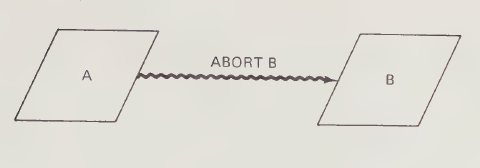

Although it is possible to visualize using this mechanism in normal operation of a system, its prime use will probably be in system testing. For example, suspected failed tasks may be aborted to permit diagnosis.

It may be possible to make deductions about which tasks have failed by examining external events. For example, if during testing, tasks are required to deposit heartbeat counts in a test log accessible to the test-bed software, it may be possible to diagnose failure of a task by failure of its heartbeat to increment after a certain time period.

Taking into account these various capabilities of Ada, Figure 5.21 shows possible test-bed environments for Ada packages and tasks. A special test version of an Ada package or task would contain a special test recorder and possibly a special trigger interface which would cause the package or task to record internal variables in a test log external to it. The test log could be examined by the test bed at desired points in time possibly triggered by exceptions from the package. The package would include statements embedded in its normal operating code to invoke the test recorder package to record important events such as passing a particular point in the program, violating a particular assertion, and so on.

As shown by Figure 5.21(b), the only extension to this mechanism required for tasks is the inclusion of one or more watchdog tasks in the test driver which would be capable of aborting suspected rogue tasks.

**Figure 5.21 Possible Ada test-bed environments**

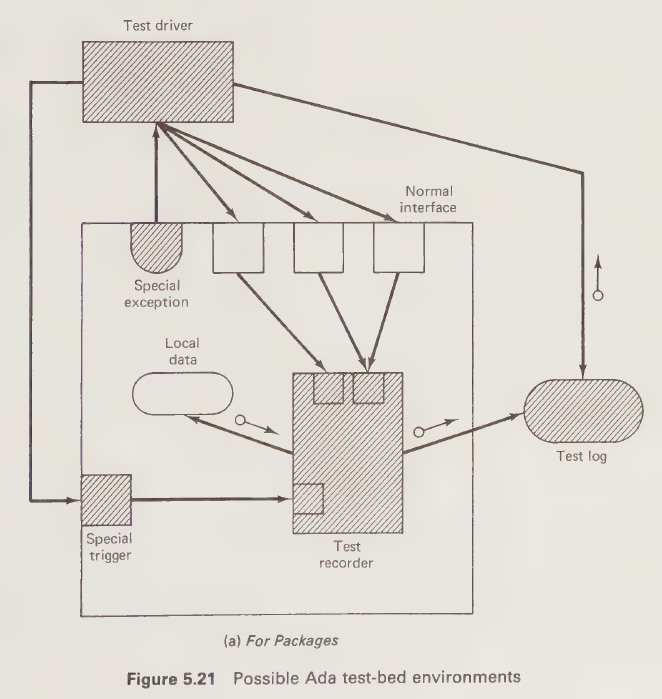
(a) For Packages

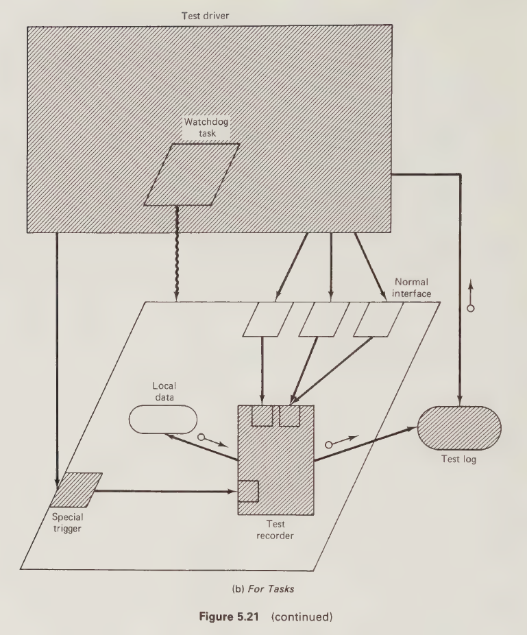
(b) For Tasks

### 5.5.2 Self Protection by Intertask Protocols

Tasks are autonomous entities, and it may not always be possible to be sure that another task received a message intended for it. Consider Figure 5.22 depicting an intertask dialogue. Such a dialogue could occur, for example, between a customer and the MAILROOM package discussed earlier. Suppose the sender of the message never receives a reply.

**Figure 5.22 Intertask messaging—simple case**

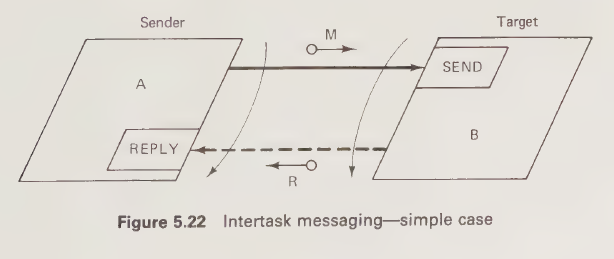

Possible reasons for this are as follows:

- The message never reached the target task.
- The target task has "died" (perhaps it is on another processor which has "crashed").
- Although sender and target are both willing to make a rendezvous, some underlying system problem is making it impossible (perhaps the two tasks are on different processors which are communicating via a failed link).
- There is a bug in the target task.

All of these except the first are possible reasons for the failure. The first is not possible because of the nature of the rendezvous mechanism; return from the `SEND` call implies receipt of the message.

In this sense the rendezvous mechanism is more reliable than one relying, for example, on messages deposited in a mailbox in shared memory. In the latter case, a rational response on the sender's part to a failure to receive a reply might be to try resending the message. However, this raises the possibility of the target getting multiple copies of messages. This further requires that the sender and the target agree on some mechanism for distinguishing copies of messages. In fact, a protocol is required between sender and target.

A protocol is a formalized dialogue between autonomous entities for purposes of reliable communication in the face of possible failures of either the entities or the communications medium between them but not failure of the protocol. Protocols are usually thought of as occurring between separate computers in a computer network but can also occur between tasks in an Ada program.

Although the rendezvous mechanism appears to eliminate the need for a protocol with respect to messages never getting from a sender to a target, this is partly an illusion. Recall from Chapters 3 and 4 that there is often a need to introduce a third-party task between sender and target to act either as a transporter of messages or a repository for messages. Even though all rendezvous associated with intercommunications between the two original tasks and the third-party task are completely reliable, messages may still fail to get from sender to target .

Should we worry about protocols at the Ada program level? The answer depends on the nature of the target environment for Ada programs.

If the target environment is a single processor, then it is probably best to assume that failure of a message to reach another task is a fatal error caused either by a hardware or a software fault, which renders all software running on that processor suspect. Intertask protocols are obviously not of concern in this context.

If the target environment consists of multiple processors connected either to common memory or to a common communications environment, then the possibility exists of processors or shared resources failing. If complete transparency is required in mapping single Ada programs onto the target environment, so that any task could run on any processor, then all intertask communication is potentially suspect. In these circumstances, it would be complex, inefficient and, ultimately, impossible to provide recovery mechanisms at its Ada program level for all possible failures; the target environment would have to provide the recovery mechanisms.

However, tasks will often fall naturally into sets such that intraset communication will be _close_ and interset communication will be _loose_ given some appropriate definition of the terms _close_ and _loose_. If we require that such sets be allocated as units to individual target processors, then our recovery problem is much less complex. All tasks in such units have reliable communication among them as long as the unit is functioning. If the unit fails, all its tasks are potentially suspect, but the unit can be isolated from other units.

Therefore, such units must take account only of the possible failure of other such units and of the communication paths between them. Associated with each such unit is a communication package which provides for reliable communication with other units. We shall call such units _reliability units_. The reliability unit concept may be supported at the Ada program level or at the target environment level.

The nature of the reliability unit concept at the Ada program level is illustrated by Figure 5.23, for the sender/target example of Figure 5.22, assuming the sender and target are in different reliability units. An active communication package in each reliability unit could support entry call forwarding to tasks in other reliability units. The sender would use this package to forward a call to the target's `SEND` entry. The communications package in the target's reliability unit would make the required call (perhaps via a created _partner task_). Then it would return an acknowledgement of completion of the rendezvous. Until this acknowledgement arrived, the sender would be blocked. The `REPLY` call would be forwarded in the reverse direction in a similar fashion. Other approaches to inter-reliability unit communication are also possible. In any case, the existence of the reliability units is visible to the communicating tasks.

**Figure 5.23 Entry call forwarding between reliability units**

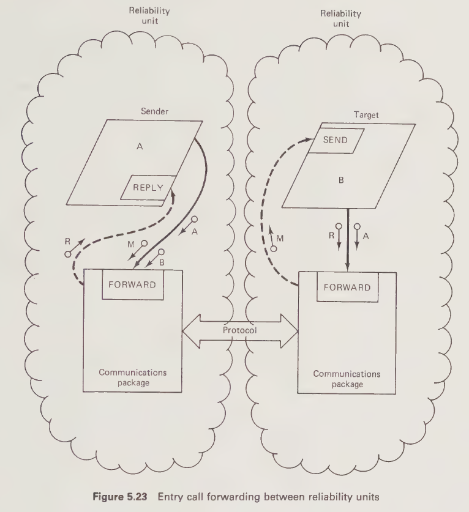

Support of the reliability unit concept at the target system level, would enable reliability units to be transparent to the communicating tasks. Then entry calls could be made at the Ada program level directly between tasks in different reliability units.

However, it seems unlikely, given the amount of work that remains to be done to make Ada and its application support environment available in uniprocessor and shared memory multiprocessor environments, that such distributed target system support will be available in the near future.

The reliability unit approach will be useful for the indefinite future, whether or not Ada support for distributed systems become available. Its only disadvantage is that a single Ada program cannot be developed for the target distributed environment, independent of any concern about how software is to be distributed over that environment.

## 5.6 SYSTEM BUILDING

Ada has been characterized in this book and elsewhere as a language for structured system building. We have attempted to show how structured designs may be developed with the aid of Ada. However, the actual business of structured system building involves more than just design. It also involves development, installation, and reconfiguration. Here we consider some concerns of the designer in this area and show how they relate to Ada.

A very natural design requirement is to make provision for the loading and running under Ada program control of Ada program modules whose nature is unknown a priori by the loading program. There is no provision for this in Ada. Thus Ada cannot be used to design and write conventional operating systems which run _a priori_ unknown user programs.

A point which has arisen several times in our discussions is the conceptual uniformity which results in system design from similar-appearing interfaces to packages and tasks. The implication is that packages and tasks are modules at a similar logical level. One might conclude that packages and tasks should also be treated uniformly at the system building level. However, this is not the case. In Ada, packages can only be created at programming time. At most, copies of generic packages may be made by instantiation at compile time. Packages may be compilation units, and, thus, they represent implementation- and installation-level modules.

Tasks, on the other hand, may not be compilation units except as stubs. Tasks are types and instances of task types may be created dynamically at run time.

Why do these differences between packages and tasks exist when, from a design point of view, it appears desirable to view them as similar logical entities? The designers of Ada obviously visualize packages as the macroscopic units of system construction, static and few in number in comparison to tasks. In our design examples this viewpoint is seen in the appearance of active packages containing numbers of tasks. However, we have also seen instances of tasks containing packages. For system development purposes, such tasks must be nested in a context which can be a compilation unit, namely a procedure or a package.

The design-level logical similarity of packages and tasks, together with the comments in Chapter 3 about the ability to convert packages into tasks and vice versa, depending on the application requirements, suggest that a desirable feature of the language might be to postpone commitment to a particular module being a package or task until load time. Such an approach would allow a system to be tailored as a concurrent or sequential one for particular circumstances. However, there are no such features in Ada.
