# Chapter 6

# Modularity, Reliability, and Structure: A Communications Subsystem Example

## 6.1 INTRODUCTION

This chapter focuses on issues in modularity, reliability, and structure through the particular example of a communications subsystem called COMM for the DIALOGUE system of Chapter 4.

Communications systems in general provide excellent examples illustrating the principles of modularity and reliability. This is because modularity is crucial if suppliers and customers are to be able to mix and match communication packages and services to enable computer systems of different types and capabilities to communicate with each other for different purposes. Reliability is a fundamental issue because of the possibility of failure or incorrect operation of both links and nodes in a communication network.

The communications example of this chapter is a particularly simple one in order to allow illustration of the principles of modularity, reliability, and structure without obscuring the discussion by details of complex communication protocols. A key principle on which we rely and which we attempt to demonstrate in this chapter is that the structure of a well-designed system implementing a protocol is not greatly dependent on the complexity of the protocol. Stated another way, we rely on being able to hide the complex details of protocols in modules whose interfaces are not greatly affected by the complexity. In what follows, we take advantage of this principle by designing the system without detailed knowledge of the protocol. Thus, the chapter serves also as an introduction to the subject of more complex, multilayered communications protocols. In so doing, it paves the way for further discussions of this subject in Chapter 7.

This chapter proceeds by first introducing the requirements of the COMM subsystem example in Section 6.2. Then major issues in modularity and reliability are discussed in Sections 6.3 and 6.4 respectively, with particular reference to the COMM subsystem. A structure for the COMM subsystem is designed in Section 6.5. Section 6.6 conducts a design post mortem. Finally, Section 6.7 gives conclusions.

## 6.2 REQUIREMENTS OF THE COMM SUBSYSTEM EXAMPLE

Recall from Chapter 4 that the DIALOGUE system was assumed to have access to a message system interface (Figure 4.32), which was assumed to be an active package with interface procedures `WAIT_MSG` and `SEND_MSG`. `WAIT_MSG` required the calling task to wait for a text message arriving from the screen of the remote system. `SEND_MSG` provided for the transmission of a text message from the screen of the sending system. It was implicitly assumed in Chapter 4 that there was always enough memory available to store incoming and outgoing text messages. It was also implicitly assumed that an appropriate communications path existed between the two systems whose operators were sending messages to each other and that this communications path was either reliable or that any errors in it were hidden from callers of `WAIT_MSG` and `SEND_MSG`.

Our purpose in this chapter is to illustrate the principles of modularity and reliability by designing a COMM subsystem to provide this message system interface to calling tasks.

At the bottom end we shall assume that the COMM subsystem software accesses a hardware device which provides for interrupt driven, character-at-a-time, transmission and reception. Below that level, communications is assumed to be bit-serial. In this chapter we omit from the system design these lower bit-oriented levels. More sophisticated hardware devices are, of course, possible. Chips are available which provide for interrupt driven, packet-at-a-time transmission and reception and which perform packet sequence checking as well. In fact, the design work of this chapter could be interpreted as the first step in the design of such a chip following the philosophy of software-driven system design espoused in Chapter 1. However, for the purposes of this chapter, we shall think of the COMM subsystem as software for driving character-oriented hardware.

We assume that the communications hardware connecting the two systems is installed and ready for communication when the two systems are turned on. That is, there is a dedicated physical link between the two systems. However, we do not assume that the link is necessarily reliable. Data transmitted over it may be corrupted by noise or completely lost (say due to a temporary break).

The COMM subsystem must be capable of detecting that data has been corrupted or lost.

We assume that the two systems at the ends of the link may be powered up or shut down completely independently of each other and that, therefore, there is a requirement for each to recognize that the other one is ready before attempting to send or resend data. That is, there is a requirement for formal link startup and shutdown protocols at the software level. For simplicity, we shall include only startup in our design.

There is also a requirement to take account of the possibility of remote system failure. For simplicity we shall assume such failures can be treated as if they were link failures. Thus we assume that each system either communicates correctly or does not communicate at all. A partial failure which results in continued operation of a malfunctioning communications protocol can cause unrecoverable errors at the level of protocol we are considering in this chapter.

For simplicity we shall not consider the possibility of other than short-term link failures which can be recovered from by appropriate retransmission of parts of messages. Longer-term failures would require higher-level recovery mechanisms.

We assume that memory capacity for communications buffers is limited, so that there is a need to exercise flow control on incoming and outgoing data. By *flow control*, we mean temporarily halting the flow of data.

The DIALOGUE systems allow both operators to send to each other simultaneously. This implies that the COMM subsystem should support simultaneous transmission and reception (that is, full duplex operation). Even if this were not a requirement of the DIALOGUE system, it would be a desirable general requirement of a communication subsystem.

We assume that messages are never longer than a full screen and that they are displayed from screen-sized message buffers.

## 6.3 MODULARITY

### 6.3.1 Introduction

The basic idea of modularity is to localize or isolate the effects of perturbations or changes. Depending on what types of perturbations or changes are being considered, there may be various types of modularity.

For example, we may characterize the type of modularity which arises when it is easy to respond to changes in system requirements as *flexibility*. This type of modularity arises when a system has been designed in such a manner that a single change in a requirement results in changes to as small a number of modules as possible, preferably only to one.

We may characterize the type of modularity which arises when modules of a system can be assigned to different persons for independent implementation with as little coordination as possible as *implementation modularity*.

The kind of modularity that arises when the effects of significant real time events such as operational errors are localized in a system may be called *event modularity*.

We may characterize the type of modularity which arises when system software does not need modification to adapt to changes in underlying hardware as *transparency*.

Finally, we make mention of *understandability modularity*. This is present when a system is partitioned into easily digestible parts with clear personalities. The need for this kind of modularity may suggest partitioning even when other critieria would not suggest it.

Other types of modularity may no doubt be defined, but these will suffice for our purposes.

We now proceed to discuss ways in which the degree of modularity of a system may be characterized and assessed before turning our attention to the COMM subsystem from a modularity viewpoint.

6.3.2 Degrees of Modularity
According to Myers, (see References) two criteria for assessing the degree of modularity are module strength and module coupling. Myers has provided categories for identifying the degree of modularity with respect to each of these criteria.

Myers' categories of module strength, in order of decreasing modularity, are as follows:

Functional or informational strength exists when a module may be viewed as a collective single function or when it is based on a shared concept, shared data, or a shared resource.

Communicational strength exists when there is a sequential relationship with respect to data among the functions of the module (for example, one function processes the output of another).

Procedural strength exists when there is a sequential relationship among the functions of the module determined by external events (for example, one function must be exercised before another in time).

Logical strength exists when there is a single access point for multiple functions.

Coincidental modularity exists when the functions have no relationship to each other.

Myers' categories of module coupling, in order of decreasing modularity, are as follows:

uncoupled

data coupled via homogenous parameters

stamp coupled via nonglobal structured data

control coupled via external selection of an internal control path

external coupled via homogenous global data

common coupled via structured global data

content coupled via internal access between functions of the module

These categories of module strength and coupling are provided here mainly to give the reader a mental check list of modularity criteria. Although they will not be used explicitly in any extensive way in what follows, their use is implicit in many of the choices to come between design alternatives.

Before turning to the COMM subsystem, consider the relationship between these categories of module strength and coupling and the previous design examples in Chapter 4.

The LIFE system of Chapter 4 lacks flexibility with respect to changes in operator commands, because such commands require modifications to two modules, namely, the line holder and the word string command decoder. These two modules each have high functional and informational strength and are weakly coupled by a small number of parameters. However, one of the parameters is a word code derived from a word dictionary in one module and used in another module to decode word strings. Both the word dictionary and the tables defining legal sequences of word strings would have to be modified for changed commands, and this involves modifying two modules. As was pointed out in Chapter 4, the way around this particular difficulty is to merge the two modules into a single character-string command decoder module. This module still possesses high functional and informational strength. Therefore, according to Meyer's criteria, the resulting system is more modular than the original one because of the elimination of the intermodule coupling component. There is of course a limit to increasing modularity by merging modules, and this limit is reached when the merged modules themselves lose functional or informational strength or when understandability is compromised.

An example of high event modularity is the DIALOGUE system of Chapter 4. All events associated with the human operator, including commands, notifications of results of commands, reporting of system errors, and so on, are funnelled through a single event decoder module. This module has high functional and informational strength and needs no coordination with other modules to handle events correctly.

6.3.3 The COMM Subsystem from a Modularity Viewpoint
Although we shall need to defer some design decisions until we have considered reliability issues in Section 6.4, we can take the first steps in designing the COMM subsystem based only on modularity issues.

There is a data hierarchy in the COMM subsystem which suggests a corresponding hierarchical or layered module structure. At the top level, the COMM subsystem deals with messages which are variable length character strings taken from the video screen memory of the workstation. At the bottom level, the COMM subsystem deals with characters sent to and received from the link hardware.

Using the edges-in design strategy of Chapter 4, a first pass produces a one-layer module structure, as shown in Figure 6.1(a). In this figure a single message management module M handles messages at its top level and characters at its bottom level.

However, for a variety of reasons, we can anticipate that it will be desirable to break messages into intermediate, fixed-length blocks. We shall call these blocks frames. We can anticipate that this will be particularly desirable for reliability purposes, because if communications failure occurs during transmission of a frame, only that frame need be retransmitted, instead of the whole message. Other reasons also are important:

Allocation of communications buffers is easier to manage if it is in terms of fixed size frames

Synchronous transmission and reception are easier to manage in terms of fixed-size frames

Hardware transparency is likely to be more easily achievable, because hardware devices tend to operate in terms of fixed-size frames.

Frames introduce an intermediate level in the data hierarchy. Corresponding to the new data hierarchy is the two-layered module structure of Figure 6.1(b), in which a frame management module F is interposed between the message management module M and the hardware.

**Figure 6.1 Possible layered organizations for COMM**
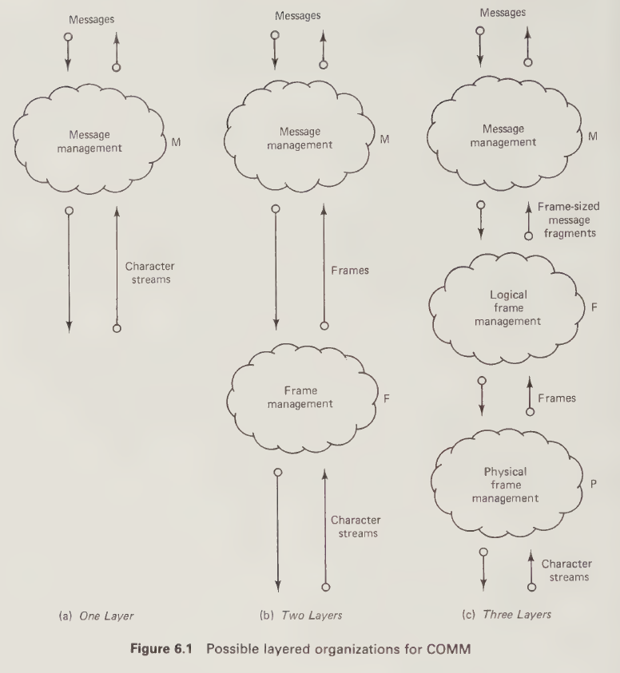

We can anticipate that the frame management module will have responsibilities not only for the correct physical structure of frames but also for logical issues associated with recovery if the frame should be lost during transmission. It will, accordingly, be natural to partition the frame management module into two layers, as shown in Figure 6.1(c)—a logical frame management module F, concerned only with correct sequencing and error recovery of frames, and a physical frame management module P concerned only with the actual transmission and reception.

From a modularity viewpoint, the structure of Figure 6.1(c) has a number of attractions:

Each module should have (if correctly designed) high functional strength and low coupling.

Understandability modularity is potentially high, because each module should have (if correctly designed) a clearly defined function and personality.

Event modularity is likely to be high, because each module has its own set of events to manage, uniquely associated with its own function (the message management module is concerned with events associated with entire messages; the logical frame management module is associated only with correct sequencing of and failures associated with frames; the physical frame management module is concerned only with the physical arrival and departure of complete frames).

We can hope for a high degree of hardware transparency because it should be possible to structure the lower level modules in such a way that they can easily be replaced by chips.

Assuming that our design choice will involve multiple layers, there are modularity issues associated with different approaches to layer coupling. Figure 6.2 provides a data flow view of three different approaches to layer coupling. Layers may be coupled directly, as shown in Figure 6.2(a). They may be coupled indirectly through interface modules, as shown in Figure 6.2(b). Alternatively, they may be coupled through a centralized system control module which manages all interfaces between all layers, as shown in Figure 6.2(c).

In general the layer modules of Figure 6.2 will be specified in Ada as passive or active packages. Because the timing of events in the upward and downward directions through the layers is in general unpredictable, we can anticipate that multiple tasks will be required in the layer modules of Figures 6.2(a) and 6.2(b); that is, these layer packages will be active ones. The approach of Figure 6.2(c) offers the possibility that a system controller package could perform all the sequencing and, therefore, that the layer packages themselves could be passive.

**Figure 6.2 Approaches to layer coupling—data flow view**
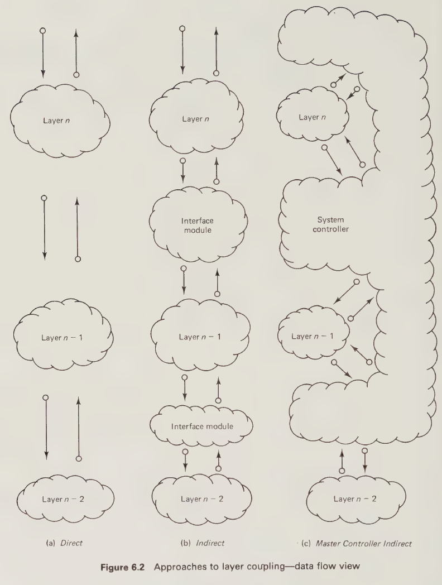

Now, what of system structure? Consider the structure graphs of Figures 6.3 to 6.5, depicting specific forms of coupling between layer packages, to implement the data flow views of Figure 6.2.

In general, the direct coupled approach could have several different structural forms, including unidirectional calls in a downward direction (Figure 6.3) and mutual calls between adjacent packages in both the up and down directions (Figure 6.4). We shall refer to the latter two forms as having, respectively, top-down and symmetrical package interaction structures.

The top-down package interaction structure of Figure 6.3 is attractive because it is familiar and because it guards against deadlock arising from careless use of mutual calls between active layer packages. Because it is familiar, it is easy to understand for persons unused to concurrent systems. Each layer package may be characterized as an agent, following the terminology of Chapter 3. Each package receives calls from higher layers and places calls to lower layers. No calls are made in an upward direction between layers. Transmission of items downward is always initiated from above by calling a procedure of a lower layer. Transmission of items in an upward direction is always initiated from above by calling a procedure of a lower layer to wait for items to arrive from below.

**Figure 6.3 Direct, top-down layer coupling**
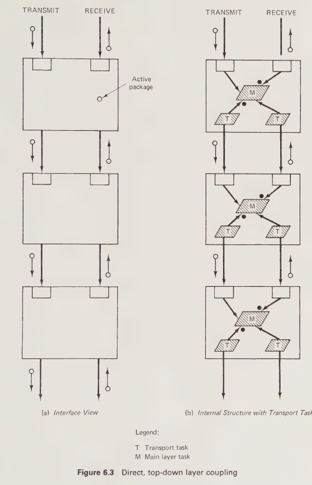

The symmetrical package interaction structure of Figure 6.4 is, on the other hand, a less familiar one. It may therefore make the system harder to understand for the uninitiated. Furthermore, it harbors the danger of deadlock, depending on the internal structure of the layer packages.

Figures 6.3(b) and 6.4(b) and (c) show how the canonical task interaction structures of Chapter 3, shown in Figure 3.18, map onto the direct-coupled package interaction structures of Figures 6.3(a) and 6.4(a), respectively. The dual transport task approach of Figure 3.18(e) maps onto either the top-down or the symmetrical package interaction structures, while the buffer task approach of Figure 3.18(h) maps only onto the symmetrical package interaction structures.

The choice between the top-down interaction structure of Figure 6.3(a) and the symmetrical structure of Figure 6.3(b) thus depends not only on the external aspect of the packages, but also on tradeoffs between possible internal structures. As discussed in Chapter 3, the transport task approach to internal structuring is more flexible than the buffer task approach, but requires more tasks and may be somewhat less efficient (although both require the same number of rendezvous to transfer data). The number of tasks in the transport task approach could be reduced by adopting the single transport task approach for reception, following Figure 3.18(d), leaving it to the main layer tasks to make transmission calls. However, we can anticipate that the requirement for flow control will make this approach inappropriate. This is because of the possibilility of the main layer task having to wait for transmission credit at the next lower layer, as suggested by Figure 3.19(b), thereby blocking it from accepting calls from above. Thus two transport tasks appear to be required if the transport task approach is adopted.

**Figure 6.4 Direct, symmetrical layer coupling**
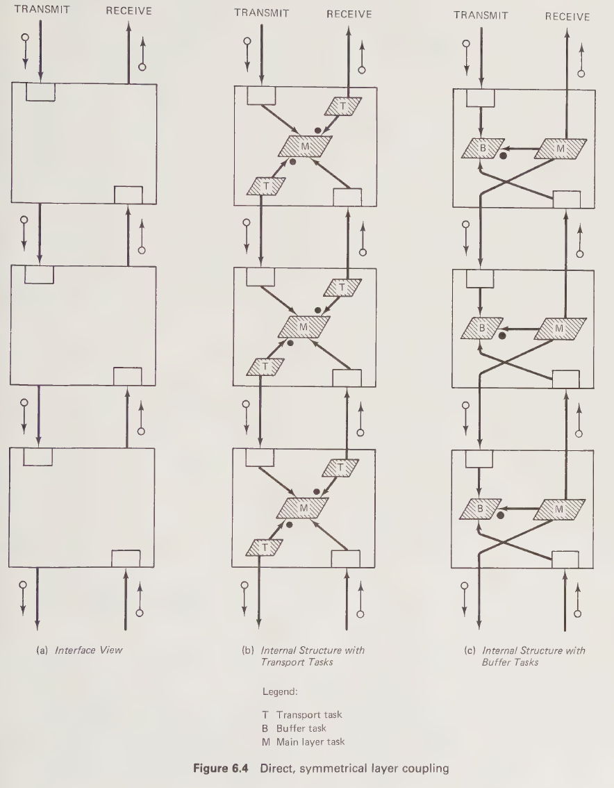

Figure 6.5 shows possible structures for the indirect coupled approach. In Figure 6.5(a) each layer is an active master package which accesses a separate interface package for each higher and lower layer. This structure is less modular than earlier ones. Because none of the layer packages has a defined procedural interface of its own, the purpose of each package is less clearly visible. The system also possesses a higher degree of coupling than those of Figures 6.3 or 6.4, simply because there are more modules and more interfaces between modules for the same degree of overall functionality. Furthermore, the overall control structure is less clear.

**Figure 6.5 Approaches to indirect layer coupling**
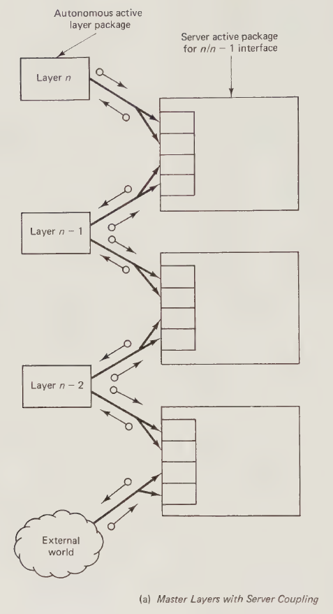
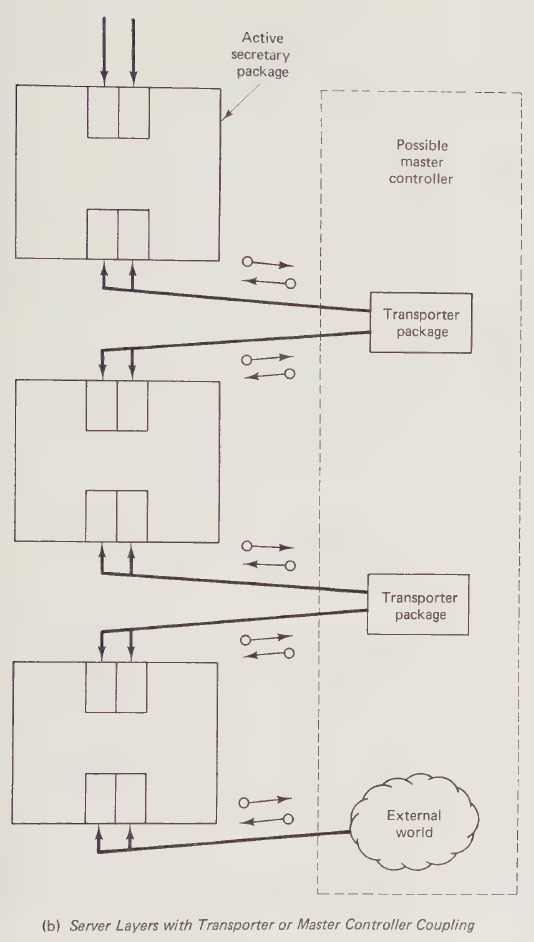

Figure 6.5(b) shows another possible structure for the indirect coupled case; it has either active layer packages and no master controller or passive layer packages and a master controller. In either case the responsibility for transferring data between layers resides outside the layers themselves. This approach suffers from the fact that in the Ada specification the procedures of the layer package which are accessible from above and below are lumped together in a single interface specification. Thus the procedures for use by the next lower layer are visible to the next higher layer as well, and vice versa. This structure also is less modular than those of Figures 6.3 or 6.4.

Based on all of the foregoing discussion of modularity, we make the following tentative design decisions for the COMM subsystem:

adopt a three-layer structure as illustrated by Figure 6.1(c)

use direct coupling between the layers, as suggested by Figure 6.2(a) and as illustrated by either Figure 6.3 or 6.4.

As discussed earlier, the choice between Figures 6.3 and 6.4 is not clearcut. For illustrative purposes, we choose (somewhat arbitrarily) the top-down structure of Figure 6.3. We leave it as an exercise for the reader to develop the symmetrical structure of Figure 6.4 (noting that only Figure 6.4(c) represents a significantly different approach).

Having adopted a layered system organization, it behooves us to be careful with the terminology for describing data flow between layers. From an overall system viewpoint, data may be viewed as flowing downward for transmission and upward after reception. We may also view downward-going data as outgoing and upward-going data as incoming. To avoid confusion, the terms transmission, reception, outgoing and incoming should be used only in this system-wide sense and not to indicate direction of flow across individual layer boundaries. Only the terms downward and upward may be unambiguously used in both contexts. For example, incoming data may be said to flow into or out of a layer, implying that it flows into the layer from below or out of the layer in an upward direction.

6.4 RELIABILITY
6.4.1 Introduction
In this section we discuss reliability issues in the light of COMM subsystem requirements. As we shall see, our reliability concerns can be tackled mainly at the data flow level of design. Thus this section discusses issues which are mainly independent of the use of Ada as a design language.

Before addressing these concerns directly, consider the nature of faults, errors, and mechanisms for their detection and recovery. A fault is a system malfunction which causes an observable error in some aspect of system operation which may, in turn, result in total system failure, partial system failure, or no system failure, depending on the degree of error detection and recovery present in the system.

Faults may be the result of mistakes made in design and implementation, or they may arise unavoidably during system operation, from the following sources:

human error, including (a) bad commands and responses (b) bad data

communications failure, including (a) corrupted data (b) lost data (c) duplicated data

component failure, including (a) failed processor (b) failed communications link (c) failed device (d) failed reliability unit

Our treatment of faults and errors in this chapter will be based on the assumption that the combined DIALOGUE/COMM system is a single reliability unit (in the sense of Chapter 5). Thus our reliability concerns are confined to:

internal logical correctness of the combined DIALOGUE/COMM system

detection and/or recovery from external operational errors.

Because of the reliability unit assumption, we do not consider the possibility of internal operational errors in the COMM subsystem itself.

6.4.2 Internal Logical Correctness of the COMM Subsystem
The area having the most potential for design and implementation mistakes in the COMM subsystem is communications buffering.

Figure 6.6 shows a possible data flow graph for communications buffer flow. Shown in this figure are the event decoder module E and the M, F and P modules identified in Section 6.2. Also shown are separate screen message and frame buffer pool modules S and B, which have preallocated sets of fixed-size buffers for use by the various modules of the subsystem.

**Figure 6.6 Data frame flow in the COMM subsystem with shared buffer pools**
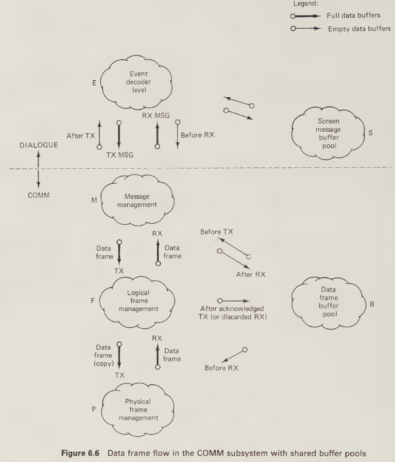

An assumption of Figure 6.6 is that data frames are held for periodic retransmission until they are acknowledged. This assumption follows naturally from the arguments which led to the introduction of frames in Section 6.2.

Consider Figure 6.6 from the viewpoint of frame buffer flow first. For transmission, empty buffers flow from the frame buffer pool B to the message management module M, where they are filled with appropriate data. They then flow to the logical frame management module F for transmission. F hands full buffers over to the physical frame management module P. When transmission is completed, control of the full buffers reverts to F, for possible retransmission later. Eventually, when transmitted frames are acknowledged, the empty frame buffers flow back to the buffer pool B from the logical frame management module F. For reception, empty buffers from the frame buffer pool B flow to the physical frame management module P, where they are filled with incoming data. Filled frame buffers flow upwards and eventually trickle back to the frame buffer pool B from higher-level modules.

Now consider message buffer flow. In Chapter 4, we implicitly assumed a single display buffer (which is just that part of memory containing the message displayed on the screen) and entirely ignored the question of message buffering. However, in general, we may visualize a pool S of screen-sized message buffers, any one of which may be used for screen display on a software-selectable basis.

Figure 6.6 includes the flow of messages to and from such a pool of message buffers. E gets empty message buffers from the pool S for both transmission and reception. On transmission, a full message buffer from E is copied into frame buffers by M and then sent back to E. On reception, an empty message buffer from E is filled with data and then sent on to E.

Sources of potential design and implementation mistakes in this scheme include aliasing (the existence of multiple copies of an access variable for a buffer) and deadlock (due to competition for empty buffers and to intermodule flow control of full ones).

6.4.2.1 Aliasing
Aliasing was mentioned briefly in Chapter 5, and a method of deallocating identifiers was proposed to prevent it from occurring in a limited context. However, in the context of this chapter, aliasing is difficult to avoid.

With reference to Figure 6.5(a), aliasing may arise as follows. Suppose pointers (access variables) to frame buffers are passed between the various modules. It is obvious that in normal operation several modules may have copies of the same frame buffer pointer, although in correct operation only one module at any given time will have the right to use this pointer. A property of Ada and other similar languages is that the ability to use a pointer is not withdrawn when a copy is handed over to another module. Explicit use may be made of this property in system design by requiring that a module having temporary possession of a copy of a pointer discard it when it has finished using it. The original possessor of the pointer may then reuse it. For example, in Figure 6.5(a), the physical frame management module may discard its copy of a buffer pointer when it has transmitted it, if the logical frame management module F retains the original pointer.

A problem with allowing aliasing is that small mistakes in using it can have large and difficult-to-diagnose effects. For example, suppose that the COMM subsystem is being debugged from the bottom up in such a way that an incorrect logical frame management module is being tested with correct physical frame management and frame buffer pool modules. The possibility exists that the incorrect logical frame management module could use an old copy of a buffer pointer which is now in the hands of the physical frame management module in such a way as to cause this correct module to fail in an apparently mysterious manner. Given that aliasing is specified by the designer, the possibility of such problems is unavoidable.

6.4.2.2 Deadlock and Local Flow Control
We introduce the term local here to distinguish conditions occurring within a particular system connected to a communications facility from conditions occurring between different systems connected to the same communications facility.

Flow blockages of various kinds in Figure 6.6 can lead to deadlock. Flow blockages may occur as follows:

at a pool due to the pool running out of empty buffers

at any other module due to its inability to accept any more full buffers (the refusal to accept more full buffers is said to be exercising local flow control)

A module may exercise local flow control for strictly local reasons, such as hitting an arbitrary, implementation-dependent capacity limit, or it may exercise local flow control because it is required by a protocol between peer modules in separate systems connected via a communications facility, as discussed further in Section 6.4.2.

Flow blockages can result in deadlock if individual tasks in the various modules are themselves blocked while waiting for flow blockages to clear. Then the possibility of circular waiting and consequential deadlock rears its ugly head.

Prevention of deadlock due to blockages in frame data flow in Figure 6.6 requires that the following conditions be met at the frame management level.

The pool B must contain at least enough empty frame buffers to satisfy the transmission capacity limit of the logical frame management module, with one left over for reception. Fewer buffers could result in deadlock if all of them end up waiting in the logical frame management module F for acknowledgements which can never come because there are no empty buffers to receive them in. Note that the minimum possible pool size is two buffers (corresponding to a transmission capacity limit of one buffer).

The reception side of the physical frame management module P must always pass on a full buffer before it waits for an empty one. This will ensure that eventually at least one empty buffer will trickle back to the pool for use in reception, even if all the other buffers are tied up waiting for acknowledgments.

The transmission side of the message management module M must stop trying to fill empty frame buffers with message fragments as soon as the logical frame management module F exercises transmission flow control on it (that is, when F's transmission capacity has been reached). This will ensure that the frame buffer pool B is not drained of empty buffers which have no immediate place to go and which may be needed for reception. Otherwise, incoming acknowledgements which would free buffers waiting in F could be blocked.

An assumption underlying these conditions is that the message management module M will never block permanently the flow of received frames, thereby preventing them from ever trickling back to the frame buffer pool B. Such a guarantee can be made if the screen message buffer pool S has a minimum of two buffers and if the message management module M always reserves at least one of them for reception. Then any unavailability of an empty message buffer for reception will always be temporary.

If these conditions are not met, deadlock can occur in various ways. One of the most dramatic is as follows. Suppose F has reached its transmission capacity while M is partway through copying a message buffer into frame buffers for transmission. Suppose E has filled up the remaining message buffers with operator messages for transmission; or suppose that there is only one message buffer in the entire system. Then the flow of received frames will eventually be blocked because the unavailability of a message buffer for reception blocks received frames from trickling back to the pool. Thus incoming acknowledgements for transmitted data frames are blocked. Permanent blockage of both transmitted and received frames is the result. The entire system is deadlocked! Even worse, the deadlock could embrace a pair of systems trying to send messages to each other simultaneously!

We have adopted a conservative approach to solving the deadlock problem. A less conservative approach is to allow unconstrained open competition, with protection provided by avoidance or recovery mechanisms. The reader is referred to any textbook on operating systems for further treatment of the deadlock problem.

6.4.2.3 Local Flow Control Mechanisms
As we have seen, in any multiple module system data flow control may have to be exercised between communicating modules. Various approaches to intermodule flow control were discussed in Chapter 3, including the approach of issuing credit in advance. With the credit approach a sender will never send an item until it first obtains credit from the target to do so. This approach is attractive in a shared buffer pool context because it avoids tying up buffers which have no place to go.

A direct way of issuing credit in a shared buffer pool context is to issue the sender an empty buffer in which to put the data. This direct mechanism is the simplest when credit depends solely on buffer availability, as it does at DIALOGUE/COMM interface. At this interface, therefore, credit may appropriately be issued in the form of an empty message buffer.

A less direct credit mechanism requires that the sender get credit to send one or more data items before itself acquiring empty buffers in which to put the data items. This mechanism may be more suitable when credit depends on circumstances other than buffer availability, as it does at the interface between the M and F modules of the COMM subsystem. For example, we have assumed that the F module has a finite capacity for holding unacknowledged data frames, independent of the availability of buffers. As we shall see in Section 6.4.3, this capacity is a parameter associated with the frame protocol between peer F modules in different systems. Indeed, transmission flow control could be exercised by the F module on the M module even when empty buffers are available in the frame buffer pool B.

So far we have spoken of credit only in terms of buffers of application data (in this case, screen messages or fragments thereof). Figure 6.6 shows only the flow of application data. However, as we shall see in Section 6.4.3, intermodule data flows may be mixed, including not only application data, but also nonapplication (or control) data associated with intersystem protocols. For example, at the F/P interface some frames may contain only protocol messages, associated with activities such as link startup or intersystem (global) flow control of data frames.

When intermodule data flow is mixed in this way in a layered system, lower layers must treat all components of the data flow equally, because they cannot tell the difference between them. Otherwise the layered modularity of the system would be violated. For example the P module must treat all frames flowing between the P and F modules equally, because it cannot (and should not) distinguish between data and control frames. Only the F module distinguishes different types of frames. This means that local flow control of mixed intermodule data flows cannot be applied selectively to the application data components of the flow.

As a consequence, the F module must have an internal mechanism to tell it when to stop trying to transmit new data frames. It cannot rely on the P module to do so. This mechanism is the data frame capacity limit mentioned earlier.

As another consequence, the F module cannot selectively stop the flow of upward going data frames from the P module by local action at the F/P interface. Its only option for local reception flow control at this interface is to discard data frames after they have arrived.

As a final remark on local flow control mechanisms, we note that from a control structure point of view, credit for one item may be obtained implicitly by a sender by returning from a SEND call to a package or given implicitly to a sender by making a RECEIVE call to a package. The implication of this view of credit is that internal tasks of the packages must be designed to block callers of SEND, or to delay calling RECEIVE, until credit is available.

6.4.3 Detection and Recovery from External Operational Errors Using Protocols
6.4.3.1 Introduction
A protocol is a dialogue between peer modules at the same level in different systems, for the purpose of achieving reliable communication between the systems at that level. Overall reliable communication between systems may require protocols at several levels. Protocols require the exchange of protocol messages between peer modules. To distinguish these protocol messages from other forms of messages, we shall call them protocol data units, or PDUs; this terminology is consistent with that used by workers in protocol standardization.

We shall now consider requirements for protocols at the various levels of the COMM subsystem.

6.4.3.2 Protocols at the Message Management Level
The requirements of our example design do not take into account the possibility of other than temporary link failure.

Therefore, it will be sufficient to rely on the human operator to acknowledge entire messages (by sending replies), to save message copies, if desired, until acknowledgement, to retry messages, and to ignore duplicate messages resulting from retries. There is no need for the message management module to perform these functions. In other words, there is no requirement for a message level protocol.

All that is required of the message management module is the copying and delimiting of individual messages. Delimiting is required so that the end of an incoming message can be detected. Delimiting could be performed by inserting a message header containing a message number in the data part of each frame of the message, by inserting a frame count in the data part of the first frame of the message, or by inserting an end-of-message marker in the data part of the last frame of the message.

6.4.3.3 Protocols at the Logical Frame Management Level
As indicated by previous discussions, a protocol is required at this level. Protocol data units at this level may be either data frames containing fragments of application messages or control frames not containing user data but exchanged between peer logical frame management modules for some other purpose.

For sequence analysis and error checking purposes, data frames need to be sequence numbered and to contain redundant error check codes. It should be possible to send several data frames in sequence without waiting for individual acknowledgement of each one first because of the requirement for a full duplex operation.

To improve communication efficiency, we can piggyback acknowledgements of data frames on data frames going in the reverse direction instead of sending these acknowledgements separately. This may be done by associating two sequence numbers with each outgoing data frame: the send sequence number, which is the frame's own sequence number, and the receive sequence number, which is the sequence number of the next expected incoming data frame. The receive sequence number serves as implicit acknowledgement of all data frames with smaller sequence numbers. Based on pending acknowledgements, the sender may decide after a time interval to retransmit data frames. Therefore it must keep copies of data frames until they are acknowledged.

Flow control of data frames may be based on a maximum allowable range of outstanding sequence numbers, known as a window. This window defines the F module's capacity, referred to in previous discussions. When the number of sent but not acknowledged, or received but not picked up data frames exceeds this window, transmission or reception flow control, respectively, is exercised. This flow control may be exercised without control frames. On transmission the outgoing flow of data frames simply stops while the TX window is full except for retransmissions. On reception incoming data frames are simply discarded while the RX window is full. With this approach the exercise of flow control by a remote receiver is indistinguishable to the sender from link or remote node failure. While the flow control condition is in effect, the sender will not receive acknowledgements and may perform fruitless retransmissions.

The use of control frames by a receiver to inform senders when flow control of data frames has been imposed (RECEIVE_NOT_READY) and when it has been

6.4.3.4 Overview of the COMM Subsystem Protocols
At this point we can either develop the details of the protocols first (PDU formats, sequencing rules, states, etc.) before proceeding with the design of the system, or proceed with the design of the system first and fill in the details of the protocols as and when they are required. We shall adopt the latter, stepwise refinement approach here and simply note in passing that in most practical protocol system design situations, the protocol is given in detail first and the system must be designed to fit it. However, at this point we have sufficient information to proceed with system design, without being overly concerned about the details of the protocol.

This situation is somewhat similar to that encountered in the event sequence problems of Chapter 4. There we developed the overall structure of the system based only on knowledge of the events which must be handled and not of the details of a finite state machine processing of the event sequences.

Consider the original data flow graph of Figure 6.6 from a broader perspective, including PDU flows between peer modules in different systems, as shown in Figure 6.7.

**Figure 6.7 PDU flows**
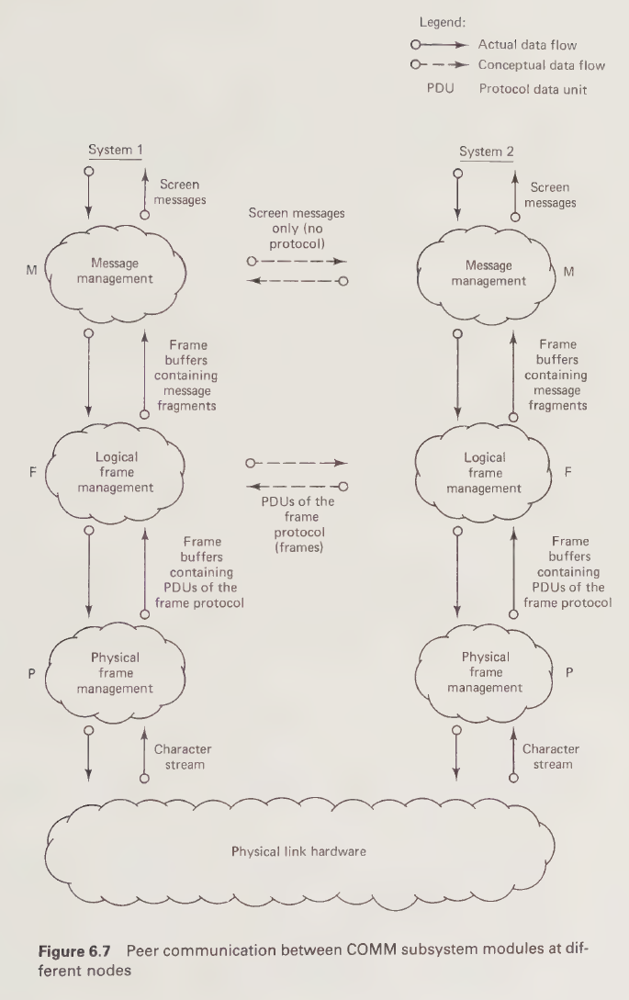

At a conceptual level the peer message management modules communicate directly with each other in terms of screen messages, and the peer logical frame management modules communicate directly with each other in terms of PDUs of the frame protocol. In physical fact each of these levels of communication between peers is handled by lower level system modules.

At the message management module level we have identified only a need for local flow control and message delimiting. This can clearly be handled by a local interface in individual systems between the message management and logical frame management modules and need not involve an explicit protocol between peer message management modules in different systems.

We have identified a need for protocols between peer logical frame management modules for data transfer and for link startup. Only the data transfer protocol is directly concerned with data coming from or going to the message management module. The link startup protocol is not concerned at all with message data but rather has its own autonomous activities resulting in the creation and absorption of PDUs.

With this perspective we are now ready to proceed further with system design.

6.5 COMM SUBSYSTEM DETAILED DESIGN
6.5.1 Introduction
This section develops details of the COMM subsystem design, based on the issues discussed and conclusions reached in Section 6.4. We begin with data flow in Section 6.5.2, and then proceed to structure and internal logic, in Section 6.5.3. Subsections of 6.5.2 and 6.5.3 discussing the same layer are identically numbered for easy cross reference.

6.5.2 Data Flow
Figure 6.8 provides an overview, from a data flow viewpoint, of the basic design decisions...

**Figure 6.8 Data flow overview**
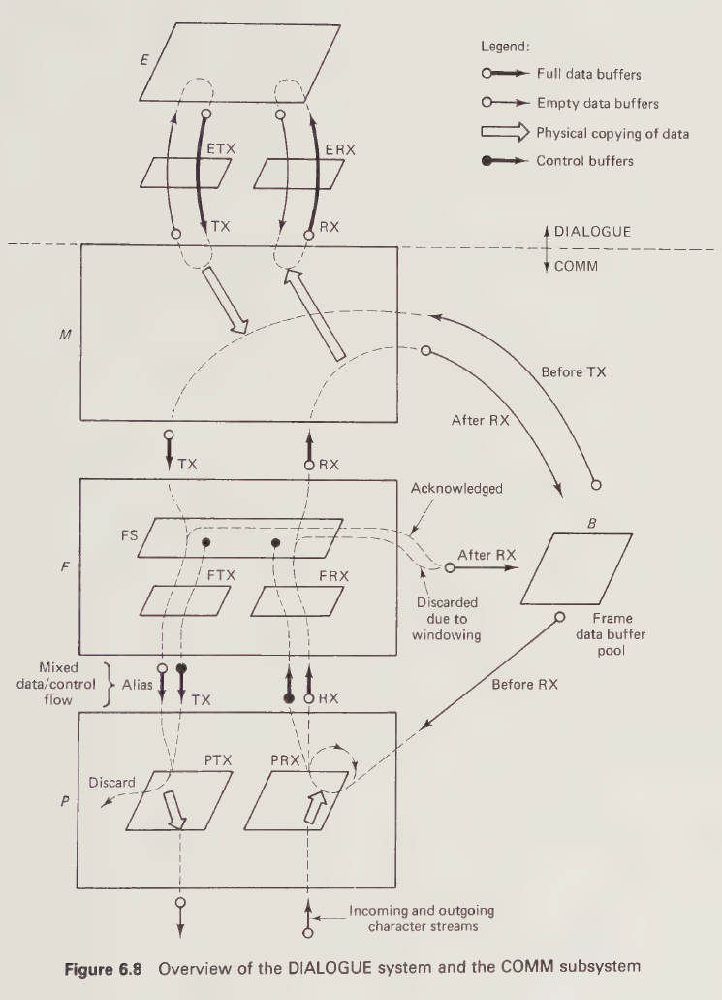 The E, M, and F layers are in general accordance with the top down structure of Figure 6.3(b), with the exception that no tasks are needed in the M layer, because it only acts as a passive conduit. The P layer simply serves as an I/O driver and accordingly needs only an input and an output task.

Some elements of structure are already in place in Figure 6.8, namely the packages and tasks. However, we leave details of the control interactions to Section 6.5.3.

The only significant element missing from this figure is an explicit indication of how local credit is arranged at the M/F and F/P interfaces. We leave these details to Section 6.5.3.

6.5.2.1 The DIALOGUE/COMM Interface Note how at the DIALOGUE/COMM interface message buffers are assumed to be permanently allocated for transmission and reception, in accordance with the discussion in Section 6.4.2.2. Note also how credit for transmission and reception is assumed to be managed at the DIALOGUE/COMM interface by handing over empty message buffers, in accordance with the discussion in Section 6.4.2.3.

6.5.2.2 The Event Decoder Module The message buffer flow control rules suggested by Figure 6.8 may be summarized as follows:

E gives an empty message buffer to M for reception purposes on startup; after every reception and subsequent release of the screen by the operator, E returns this buffer to M.

E gives a full message buffer to M for transmission when the operator strikes the SEND key; when M has copied this message buffer into frame buffers, M returns the buffer to E for reuse.

These rules are conservative but appropriate for the problem. On occasion they may slow up the system. For example, they do not allow an unused TX buffer to be freed for use by M for RX purposes while a previously arrived message is still on the screen. In these circumstances, an incoming message will be temporarily flow controlled.

From the operator's point of view, E extends transmission credit to the operator, when the operator requests it by hitting the RESERVE key, if an empty TX buffer is available. At this point, the screen is available to the operator for entry of a message. When the operator hits the SEND key, E withdraws transmission credit from the operator and will not extend it again until its TX buffer is again free.

At any time, we assume E may arrange for display of either message buffer as appropriate. Details are omitted from the figure and from our discussion here.

6.5.2.3 Message Management Module M The message management module M has no peer protocol to manage. Its only concerns are to provide the service interface for the COMM subsystem and to arrange for message copying, transmission, and reception using the service interfaces of the logical frame management module and the frame buffer pool module.

From M's viewpoint, the message and frame buffer flow control rules may be summarized as follows:

M receives a full message TX buffer from E at a time determined by E.

M returns the empty message TX buffer to E after copying it into frames for transmission.

M receives an empty message RX buffer from E on startup.

M directs a full message RX buffer to E when it has copied the last frame of an incoming message into the buffer.

M receives the empty message RX buffer back from E at a time determined by E.

M directs full frames to F when it has TX credit from F.

M receives full frames from F when frames are available and M is ready to receive.

6.5.2.4 Logical Frame Management Module F The logical frame management module F has two peer protocols to manage in addition to the service interface, transmission, and reception functions.

The startup and data transfer protocols are never active simultaneously and so are managed by a single task, the FS task. In the system as specified, the human operator has no direct access to the startup protocol through keyboard commands. This protocol can only be triggered by turning the system on. Accordingly, there is an implicit system management module, not shown in the overview of Figure 6.8, which would be responsible for triggering the startup protocol. In general, we might like the human operator to have keyboard commands to shut down and restart the link if it is suspected that there is a temporary link failure or that the remote computer has crashed and perhaps might come back up. This functionality will not be included in this design example but could be easily added.

Note in Figure 6.8 that the FS task inserts control frame buffers into the outgoing stream and removes them from the incoming stream without any interactions with the layer above. An assumption of this figure is that empty frame buffers are not used for outgoing control frames. A supply of small buffers suitable for outgoing control frames is held by the logical frame management module and used in a cyclic fashion. A local credit mechanism between the F and P modules ensures that control buffers are not reused by F before P has finished with them.

6.5.2.5 Physical Frame Management Module Because of aliasing of buffer pointers, the F module still retains control of buffers containing outgoing frames. Therefore, as soon as P has transmitted all of the characters of a full buffer, it simply forgets that it ever had the buffer.

Note that, on reception, empty frame data buffers may be cycled back to the reception function if the frame check code indicates an error.

6.5.3 Structure and Logic
6.5.3.1 Introduction The data flow requirements on which the structures of this section are based are contained in correspondingly numbered parts of Section 6.5.2. We use linear interaction structures throughout, as defined in Chapter 5.

6.5.3.2 New DIALOGUE/COMM Interface The original DIALOGUE system event decoder of Figure 4.31 and 4.32 must be modified to take account of buffering and flow control conditions not previously considered. The new structure is shown in Figure 6.9.

**Figure 6.9 New DIALOGUE/COMM Interface**
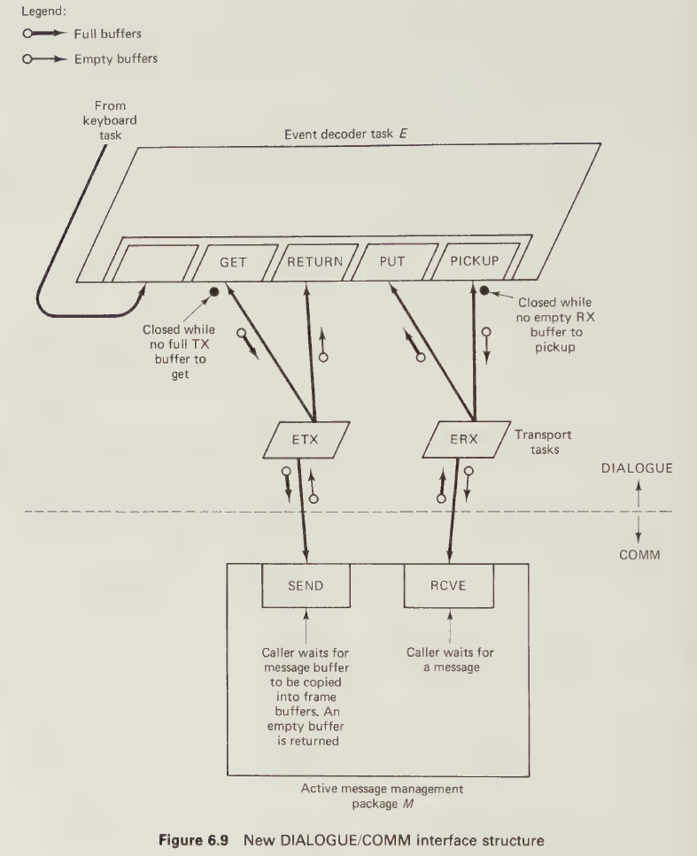 Because the SEND procedure of the M package imposes a potentially lengthy conditional wait on the caller until the entire message has been copied into frame buffers, a transmission transport task (ETX) is required between the event decoder and this procedure. The previous reception transport task has been renamed ERX.

The previous PUT_MSG entry in the event decoder (E) task has been renamed PUT. It provides for no-wait handover of incoming messages. Three new entries in the E task provide places where the transport tasks ETX and ERX can wait for an outgoing message (GET), report sending done and return the empty TX buffer (RETURN), and pickup an empty RX buffer (PICKUP).

The E task provides an empty buffer to M via PICKUP on startup and following release of a displayed RX buffer by the operator.

The ETX task cycles between calls to E.GET, to wait for a message to send, to M.SEND, to send the message, and to E.RETURN to report sending done and to return the empty buffer.

The ERX task cycles between calls to E.PICKUP, to wait for an empty buffer, to E.RCVE, to hand over the empty buffer and to wait for it to be filled by an incoming message, and to E.PUT to hand over the message.

6.5.3.3 New Dialogue System Event Decoder Modified logic for the E task is given in Figure 6.10.

**Figure 6.10 New Dialogue System Event Decoder**
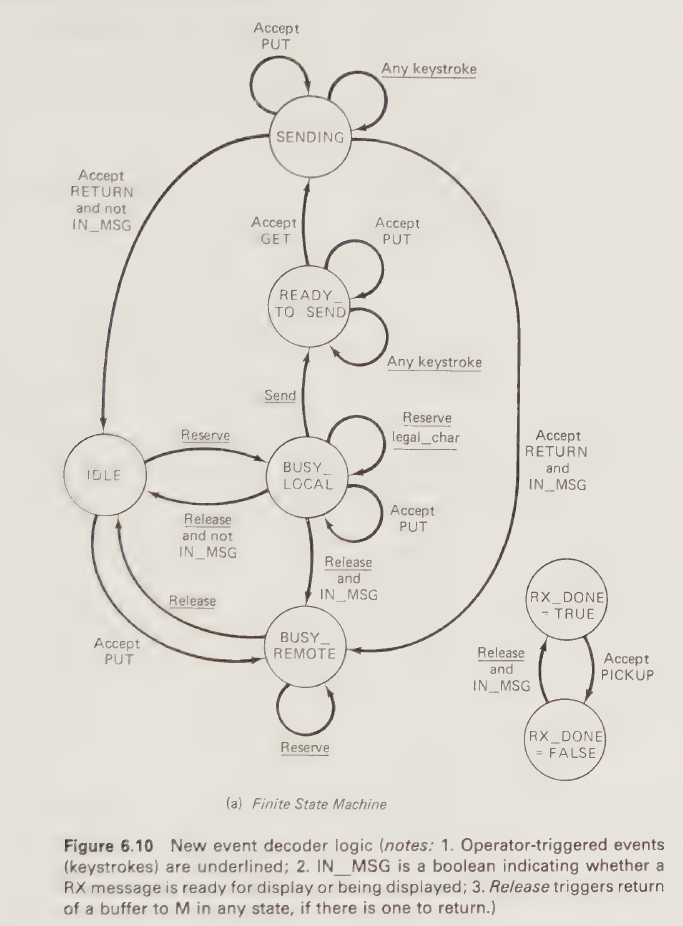 Figure 6.10(a) shows the revised finite state machine controlling the operation of this task and Figure 6.10(b) shows the corresponding Ada code. New features of this finite state machine are the addition of two extra states (READY_TO_SEND and SENDING) and two new auxiliary variables (IN_MSG and RX_DONE). The READY_TO_SEND state provides a guard condition for the acceptance of the GET entry (open only in this state). The SENDING state provides a means of exercising TX flow control on the operator until the TX buffer is returned. (Until this occurs, there can be no return to the IDLE state, which is the only state in which the operator is not TX flow controlled.) The IN_MSG variable is used to record the presence of a message after a call on PUT. It is required because calls on PUT are accepted in any state but only cause state changes in the IDLE state; IN_MSG is used to record the occurrence of a PUT call so that appropriate state changes can be made when other events occur. Calls on PUT are accepted in any state, because reception credit is given by the E task to M by passing an empty buffer to M; therefore, there is no need to exercise RX flow control via a guard on PUT, as was done in the original DIALOGUE system design. The RX_DONE variable is used as a guard on the PICKUP entry. In any state, the RELEASE keystroke will open this entry by setting RX_DONE to true if IN_MSG is true. (Both variables will be set back to false when a call on the entry is accepted.)

6.5.3.4 Message Management Package Because the M package does not need to be an active package, ...by its interface procedures M.SEND and M.RCVE, as shown in Figure 6.11.

**Figure 6.11 Message Management Package**
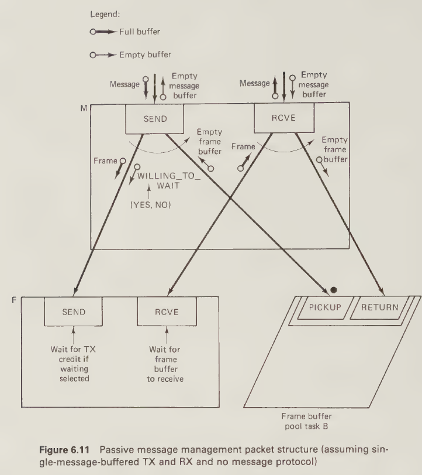 The ETX and ERX tasks wait for credit and/or frame buffers through these procedures.

The M.SEND procedure first waits on F.SEND for TX credit. When it has credit it calls B.PICKUP for an empty frame buffer, copies a message fragment into the buffer, and calls F.SEND to transmit it. Return from F.SEND normally grants transmission credit for another frame. The B.PICKUP/F.SEND cycle is repeated until there is nothing left of the message. On the last call to F.SEND, a parameter set by M.SEND indicates it is not willing to wait for credit. After return from this last call to F.SSEND, the M.SEND returns the now-empty message buffer to its caller. Note that no explicit TX credit parameter needs to pass from the F package to the M package because the M package in our example cannot send multiple frames in a single F.SEND call. Credit to send one frame is implicitly given by return from F.SEND (provided the parameter is set indicating willingness to wait for credit).

The M.RCVE procedure waits first on F.RCVE for an incoming data frame. When such a frame arrives the procedure copies it into the empty message buffer and then returns the frame buffer to the pool via B.LRETURN. When it detects the end of the message (by examining the data part of the frame buffer), it returns the now-full message buffer to its caller. At this point, RX flow control is exercised on the frame level, because F.RCVE will not be called again until M.RCVE is called again.

6.5.3.5 Logical Frame Management Package An appropriate structure for the necessarily active logical frame management package F is shown in Figure 6.12.

**Figure 6.12 Logical Frame Management Package**
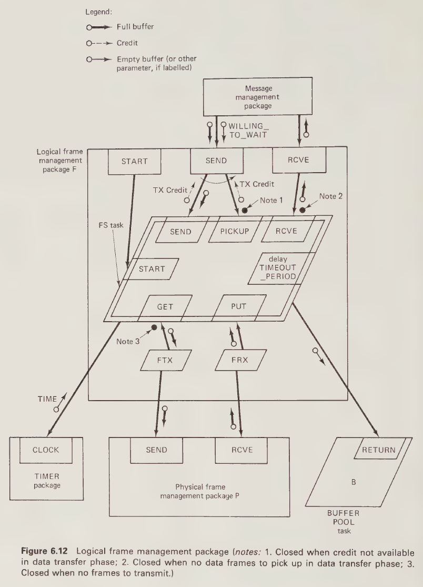 The main new external features of this package, compared to the M package, are the use of the external timer package and the presence of the START procedure. The START procedure is not shown as being used by any higher-level module, because we have not specified how the COMM subsystem interacts with the local system management modules which handle system startup. The main new internal feature of this package, compared to the M package, is the frame service task FS. The FTX and FRX tasks are needed only because of the FS task. The F package manages a full-duplex protocol involving sequences of frames arriving autonomously from above and below. The sequences are not independent because of acknowledgement requirements, and the package itself may add frames to the sequences or remove them. The FS task controls all of this activity. The FTX and FRX tasks are transport tasks which interact with the physical frame management package P for the FS task so that it can continue with its other duties.

The FS task has entries, called from above, to SEND outgoing frame buffers containing message fragments and to RCVE incoming ones. Other entries, called from below, are used to GET outgoing frames and to PUT incoming ones. A START entry triggers the startup protocol. A PICKUP entry gives TX credit to the next higher user, as described below. A delay alternative provides for timeout on failure to receive acknowledgements.

The SEND entry of the FS task returns a credit parameter on every call; if the credit parameter is zero and the caller has indicated a willingness to wait, the SEND procedure calls PICKUP to wait for credit.

The FTX task cycles between calls to P.SEND and FS.GET, transferring a frame on each cycle. Return from P.SEND implies credit to send the next frame. Note that this credit mechanism is strictly local between the F and P packages and does not distinguish between data and control frames. On startup, credit is assumed to be available, so the FTX task calls FS.GET first to wait for a frame.

The FRX task cycles between calls to P.RCVE and FS.PUT, transferring a frame on each cycle. On startup, the FRX task calls P.RCVE first to wait for a frame. The job of discarding data frames when the RX window is full is left to the FS task.

How should the internal logic of the FS task be organized to manage all this activity? For modularity, separation is desirable between the peer protocol logic and the local system-dependent logic for handling local flow control, frame buffer manipulation, and queueing. ...A possible approach which satisfies this requirement is illustrated in Figure 6.13.

**Figure 6.13 FS Task Internal Logic**
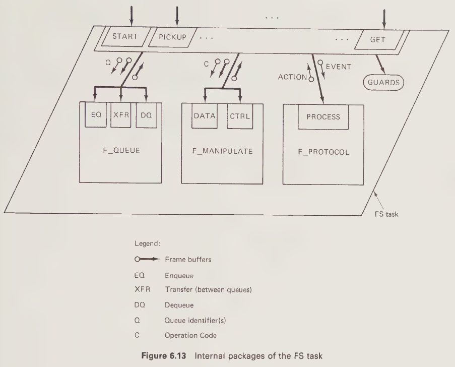 The F_PROTOCOL package encapsulates all the logic of the peer protocol, including that for startup and data transfer. The various entries of the FS task interpret entry calls and parameters as events of the peer protocol. Event identifiers are passed to the PROCESS procedure of the F_PROTOCOL package, which returns action identifiers for consequent actions. The action identifiers are examined and acted on by the entry routine which called PROCESS in the first place. Actions include preparing and enqueueing data and control frames for transmission, and arranging for proper disposition of received data and control frames. The actions are performed using the services of the F_QUEUE and F_MANIPULATE packages.

With care using the package approach, it should be possible to structure the internal logic of a task such as the FS task so that its internal peer protocol package is portable between different types of implementations (for example, between implementations requiring callers to wait for items to pick up, as in this example, and implementations without this requirement, which simply return status parameters indicating nothing to pick up, or between implementations employing transport tasks, as in this example, and implementations employing the buffer task approach of Figure 6.4(c)).

The F_PROTOCOL package's prime function is to manage the finite state machines and auxiliary variables controlling the startup and data transfer phases of operation. For our simple protocol there is one finite state machine and two auxiliary variables. The finite state machine controls the peer-to-peer protocol sequences which result in the peers agreeing that communication has been established and it is safe to send data frames. The auxiliary variables are the current send and receive sequence numbers for outgoing data frames.

A simple finite state machine is illustrated in Figure 6.14(a).

**Figure 6.14 Frame Protocol**
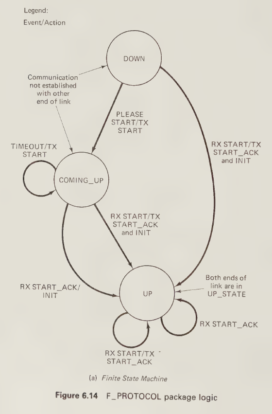 For simplicity, the basic assumptions of this figure are somewhat unrealistic, as follows:

Systems may start up independently at any time, but once they are up, they stay up. Therefore, START frames arriving in the UP state do not signify an attempt to restart after a crash during the data transfer phase of operation. Rather, they only occur during link startup, as a result of timeout in the COMING-UP state.

The only actions required in the UP state are maintaining the current send and receive sequence numbers. These sequence numbers will both be set to zero on initial entry to the UP state; because of assumption 1, they do not need to be reset to zero when START frames arrive in the UP state. There are no other data transfer states besides the UP state.

To give the flavor of the approach, a specification of a possible F_PROTOCOL package is given in Figure 6.14(b). The package determines the acceptability of events and indicates the consequential actions. It performs no processing of control and data frames itself. The event and action parameters are variant records, enabling send and receive sequence counts to be passed in and out when required.

Send and receive sequence counts from received data frames are passed in to the package. The received value of the send sequence count is internally incremented and stored for use as the receive sequence count in the next transmitted data frame. The received value of the receive sequence count is used to determine whether any previous transmitted data frames have been acknowledged.

A pair of send sequence counts is passed out from the package if an acknowledgement or timeout has occurred, to identify the sequence range of previously transmitted frames which may be returned to the pool, or which must be retransmitted.

A send sequence count is passed out from the package when a data buffer arrives from above for transmission (for inclusion in the data buffer as the send sequence count of the frame).

A receive sequence count is passed out from the package when a data buffer is about to be passed downward for transmission (for inclusion in the data buffer as the receive sequence count of the frame).

The body of the F_PROTOCOL package is easily implemented using tables for the finite state machine, following the approach taken for the LIFE system command decoder in Chapter 4. The details are left as an exercise for the reader.

Given this view of the F_PROTOCOL package, it is easy to see how it can be used by the various entries of the FS task to help manage the flow of frames.

Figure 6.15 indicates the nature of the internal frame data flow in the FS task.

**Figure 6.15 Internal Frame Data Flow**
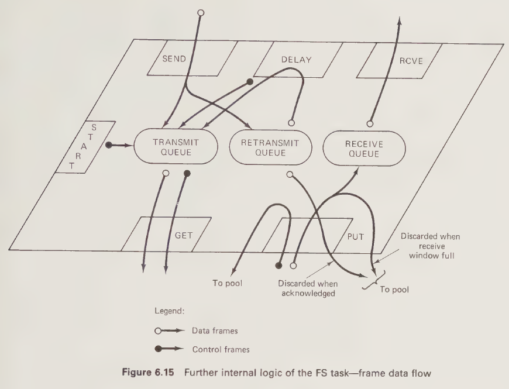 The internal queues shown are assumed to be accessed via the F_QUEUE package of Figure 6.13. Manipulations of frames are assumed to be performed by the F_MANIPULATE package of Figure 6.13. Examples of manipulations are adding headers to data frames on transmission and stripping them on reception, preparing control frames, and updating frame headers with appropriate count values before sending them.

The retransmit queue contains copies of the transmitted but not yet acknowledged frames. The capacity of this queue is determined by the flow control window for transmission. Frame copies are deleted from this queue only when they have been acknowledged; their buffers can then be returned to the pool. Frame copies in this queue are transferred to the transmit queue when they have timed out without acknowledgement. The delay time will be reset on every invocation of the F_PROTOCOL package, to ensure wakeup at a time no later than the oldest time in the retransmit queue, plus the acknowledgement timeout period.

The transmit queue holds outgoing data and control frames for pickup by GET. Both types of frames are queued together, without distinguishing them, in FIFO order.

The receive queue holds incoming data frames not yet picked up via RCVE. Its capacity is determined by the flow control window for reception. If there are no empty places in this queue, as determined by the F_PROTOCOL package, the PUT entry will discard data frames.

We leave it as an exercise for the reader to develop further details of the interactions among the various entries and internal packages of the FS task to manage the data flow of Figure 6.15.

6.5.3.6 Physical Frame Management Package The physical frame management package P needs only two tasks, as shown in Figure 6.16.

**Figure 6.16 Physical Frame Management Package**
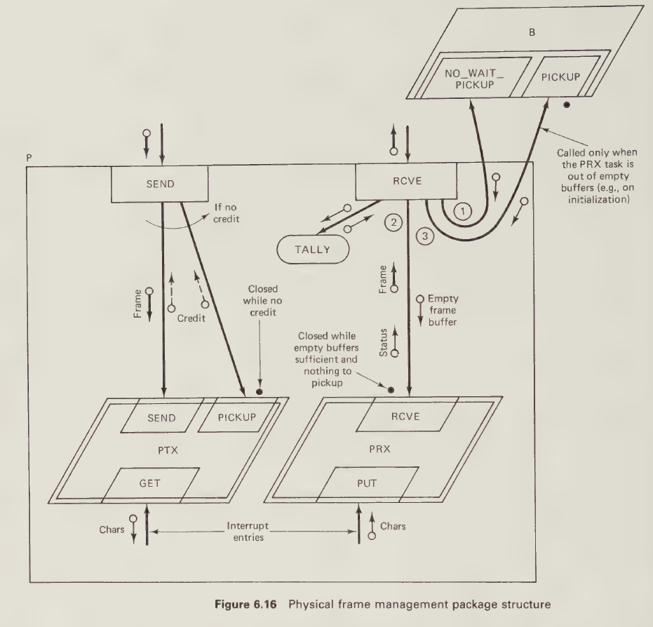 The PTX and PRX tasks are the interrupt service routines which transmit and receive characters from the character-oriented communications hardware assumed at the start of this chapter. On the hardware side, interrupt entries transfer characters. On the system side, the SEND entry of the PTX task transfers frames downwards and TX credit upwards; the PICKUP entry of the PTX task is used to wait for credit if it is exhausted by the SEND call; and the RCVE entry of the PRX task transfers frames upwards and empty buffers downwards.

The use of P.RCVE to transfer empty buffers downwards frees the PRX task from having to call the buffer pool B itself; thus it decreases the probability of the PRX task missing characters. The PRX task is initialized in this manner with an appropriate number (at least two) of empty frame buffers from the pool.

During the normal operation, the P.RCVE procedure calls a NO_WAIT_PICKUP entry of the buffer pool task B when TALLY is greater than zero. TALLY is used to maintain a running record of the difference between the number of frames passed upwards and the number of empty buffers passed downwards. The PICKUP entry is used only when the PRX task indicates it has run out of empty buffers, as described below.

The buffer pool task is required to have a NO_WAIT_PICKUP entry so that the caller of P.RCVE does not have to choose between waiting in two conflicting places (at B for empty buffers and at PRX for full ones). Thus any possibility of deadlock is avoided.

When the PRX task has received a full frame, it clears the guard on RCVE (if it is set) and is immediately ready to start filling the next empty buffer. When the RCVE entry is accepted, a frame is handed over to the caller, and the guard on RCVE is reset if the PRX task has at least one empty buffer but no more frames. If the PRX task has neither frames nor empty buffers, then it indicates this condition to the caller of RCVE by returning an appropriate value of a status parameter. While the PRX task has at least one empty buffer but no frames, the RCVE entry is closed.

The PTX task has internal queue space for an appropriate number (at least two) of frame copies (probably represented by access variables). When it has transmitted a copy, it immediately frees that space in the queue (thus effectively discarding the copy) and starts work on the next frame copy in the queue. While there are no free spaces in the queue, the PICKUP entry is closed by a guard.

The interrupt entries transfer frames one character at a time between the program and the hardware, adding or deleting framing characters as appropriate. This is a consequence of the assumption made at the beginning of this chapter that the hardware is character-oriented. With such hardware, performance could be a problem. Due to the rendezvous overhead, characters could be lost during high-speed, synchronous operation. A way of avoiding such problems is to write the actual interrupt service routines in assembly language and to use a timed delay to force the PRX task (for example) periodically to check for and pick up incoming characters from the assembly language interrupt service routine's input buffer. Alternatively, better hardware could be specified.

6.6 DESIGN POST-MORTEM
6.6.1 Introduction
Many system details have been omitted from this design discussion. The actual mechanisms for handling the creation of buffer space and the allocation of pointers have not been considered. Nor have any details been provided for internal queueing structures in various modules in which data can accumulate. Package and task specifications have not been given in detail and parameter type declarations are missing.

The system logic has been developed for the most part in pictures and words. Only a few program fragments have been given to illustrate key, new points. Thus, program fragments are given only for the event decoder task and a simple version of the F_PROTOCOL package specification. However, no program fragments are given for the message management package, or the physical frame management package, because no new issues are involved.

A more general F_PROTOCOL package might be internally complex in detail, depending on the complexity of the more general protocol, but the nature of its interfaces to the local system for sending, receiving, and flow-controlling frames would be essentially as given in the COMM subsystem design independent of its level of internal complexity. The variant records defining

events and action would, of course, require additional components, to take account of additional types of frames in the protocol.

The COMM subsystem design as given is at an appropriate logical level for the first attempt at defining the major features of the system architecture. The material as given is appropriate for a design walkthrough. Following this walkthrough, complete interface specifications for all packages and tasks would be developed and a start made on defining the omitted details.

We now examine the COMM subsystem design from two viewpoints:

- In Section 6.6.2, we consider extensions, for greater functionality.
- In Section 6.6.3, we consider the possibility of different fundamental design decisions leading to different system structures.

### 6.6.2 Design Extensions

The design is relatively independent of the details of the frame protocol. Therefore, it should be relatively easy to include frame-level protocol features such as explicit end-to-end link flow control, link shutdown and restart control, and link failure notification. These affect primarily the frame protocol package.

It should be possible to include end-to-end frame data flow control in the frame protocol package without affecting the mechanisms already existing for local flow control within the logical frame management package.

An approach to reporting link failure, shown in Figure 6.17, would be to have a special CHECKER task wait on a special entry in the frame service task which would be accepted after link failure. This task would then report back to other concerned packages and tasks. Of course, appropriate procedures and entries would have to be provided and the internal logic of the various modules appropriately modified.

**Figure 6.17 Reporting significant frame level events to higher levels**
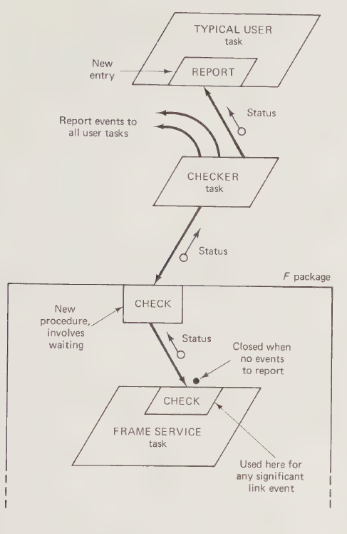

An active message management package would be required for multibuffered transmission and reception of messages (assuming more than two message buffers were available). It would also be required to support a message level protocol which could automatically recover from link or remote system shutdown and restart without losing or duplicating messages. A possible structure, having the same external interfaces as before, is shown in Figure 6.18. The logic is similar to that of the F package, with differences to account for the use of actual buffers to give credit and the fact that buffers must therefore be returned.

**Figure 6.18 Possible active message management package structure**
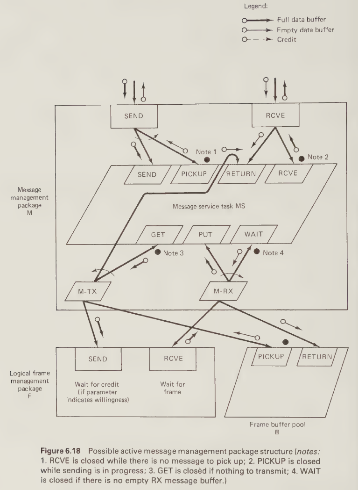

### 6.6.3 Different Fundamental Design Decisions

The COMM subsystem used shared buffer pools. Such shared pools may be undesirable for at least two reasons:

- **Complexity**: open competition for shared buffers and aliasing of buffer pointers may increase logical complexity and therefore increase the possibility of design or implementation mistakes.
- **Transparency**: the need for shared memory makes it impossible to allocate different modules to different processors which do not share memory.

Note that competition for shared buffers was not used at the higher levels of the system. The message buffer pool was placed under sole control of the event decoder task. What about applying the same approach to frame buffering? Frame buffers would be under the sole control of the logical frame management package. Instead of empty frame buffers being separately acquired, they would be exchanged for full buffers at each appropriate interaction. On transmission empty buffers going up would be exchanged for full buffers coming down; on reception the reverse would be true.

Even though this approach eliminates direct competition for frame buffers, it still requires a shared pool. Empty and full buffers are exchanged, implying that buffers from a shared pool are passed by reference. Thus aliasing is still a problem and transparency is still compromised.

If the system design is required to be transparent to a possible absence of shared memory, then intermodule data flows must be by value, as shown in Figure 6.19. Each module must now have buffer space to accommodate copying buffers from one module to another. When copying is used, it is meaningless to speak of credit being given in the form of actual empty buffers; instead, it must be given in the form of counts of units of data.

**Figure 6.19 Data flow without shared buffers**
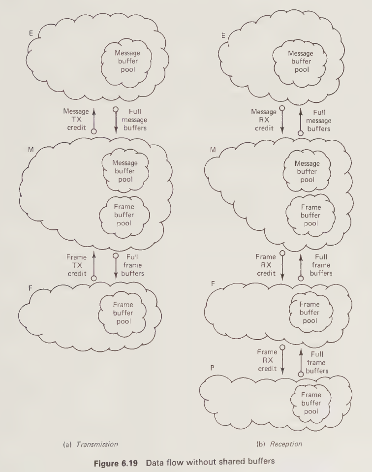

The COMM subsystem emerged from the design process as a three-layer system with six tasks (Figure 6.8). Use of an active M package would increase this to nine tasks. The relatively large number of tasks was a particular result of the design decision that each active layer package would require callers to wait for transmission credit and for items to receive. Each layer, thus, has three places to wait:

- for calls from above;
- for transmission credit from below; and
- for items to receive from below.

In general, three tasks are required to wait in these three places. The only exceptions are the M layer, which is not active, and the P layer, which requires only two interrupt service tasks, one for transmission and one for reception.

The number of tasks could be reduced, if each layer package provided only no-wait calls which returned status parameters. Then, the need for transport tasks would vanish. However, the internal logic of the remaining tasks would be more complicated as a result.

The logical nature of the tradeoffs between designs with many and few tasks is easy to identify. Many tasks can result in simpler system and task logic for at least two reasons:

- There is no need for busy-checking for events.
- When an event occurs, the task processing the event is immediately aware of the context of the event.

On the other hand if there are few tasks, there will be less context switching and dispatching overhead. This is unlikely to be very important in higher system layers, where task switches are likely to occur relatively infrequently. However, it could be important in lower system layers. The quantitative tradeoffs are implementation-dependent and largely outside the scope of this book.

The combined DIALOGUE/COMM system was specified as a single reliability unit. Therefore, the COMM subsystem design guards against a wide variety of external failures, but not against internal failures in its own logic. Such failures could be handled by breaking the system down into smaller reliability units, each of which protects itself from failures in the others. In general, each module of a layered communication system could be a separate reliability unit interfaced to higher and lower modules by a possibly unreliable communications link. In this general case, protocols may not only be required horizontally between peer modules in separate nodes of a communication network but possibly also vertically between the different reliability units forming the vertically separated layers. This general possibility should be kept in mind, even though it will not be explored further here. Figure 6.19 could provide a starting point for the development of an appropriate system design.

However, no matter how the system is split into reliability units, there may be a possibility of a reliability unit developing a fault in its internal logic which causes it to behave in a disruptive manner without completely disabling it. Such a fault might be the result, for example, of a failed bit in a memory chip. If the fault is sufficiently pathological, it could cause the unit to behave in a way that appears rational but disrupts the system. For example, what if it continues to obey the syntactic rules of all protocols but not the semantic ones? It might then acknowledge protocol data units which others have sent but which it has not received causing loss of data.

Such problems are difficult to solve. One approach to solving them is to kick them upstairs by assuming that some higher-level unit will eventually notice the problem and initiate recovery action. However, we eventually run out of higher-level units, and the highest-level unit might be the one with the problem. Then the ultimate appeal must be to a human operator.

Another, expensive, approach is to specify physical redundancy of unreliable components. For example, one might specify that two complete links be available so that the active link could be switched if excessive retransmissions were occurring.

## 6.7 CONCLUSIONS

What is important in this chapter is not so much the structure of the final COMM subsystem (although it is a viable one) but the process of design which was used to arrive at this structure and the graphical notation which was used to describe it. The design decisions were depicted in pictorial form in a manner suitable for group discussion. Although the process is relatively informal, the pictures have formal meaning in Ada terms and can be used to develop Ada code in a relatively mechanical fashion.

A key feature of all the designs developed in Part C (and elsewhere in this book) is the definition of different procedures and entries of packages and tasks for different services provided by the packages and tasks. For tasks, we have shown how separate entries should be provided for different interactions, to provide so-called linear interaction structures, which have no nested rendezvous. This approach enables structure graphs to display the different nature of the processing of the different calls in a very clear and explicit fashion. For tasks, this ensures the waiting structure is explicit at the task interface. Thus it enables design to be performed in detail at the structure graph level, and it makes explanation of the final design possible without resort to code.

In general we have shown how single and multiple tasks can be advantageously hidden inside packages for modularity.

As appropriate for the design-oriented aims of the book, the role of Ada in Part C has been primarily to provide the inspiration for and the semantics of the graphical notation. Therefore, actual examples of Ada programs do not occupy a large amount of space in Part C.

The design examples chosen in Part C to illustrate the approach are interesting in themselves. Many design issues relating to protocol systems have been discussed and resolved. The power of the approach is illustrated by its ability to deal with such issues in a compact and understandable fashion.

---
