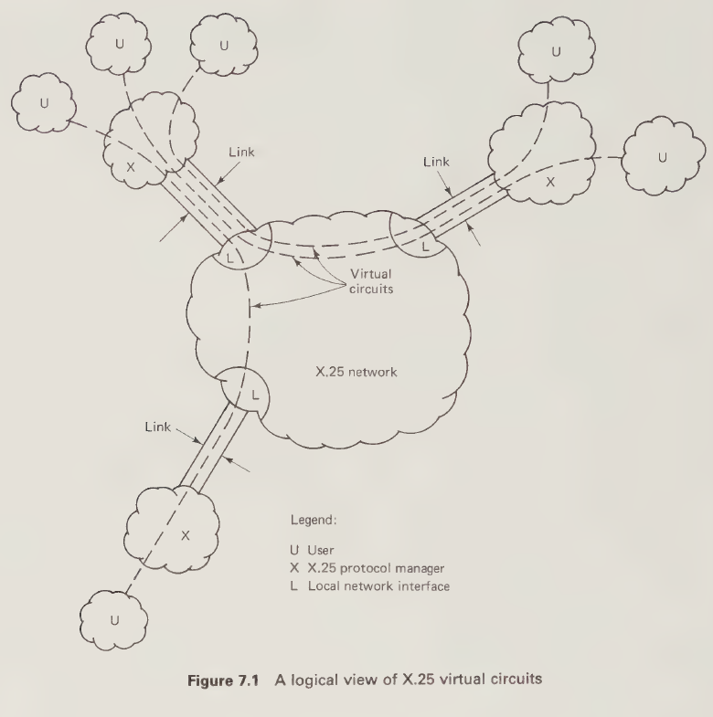
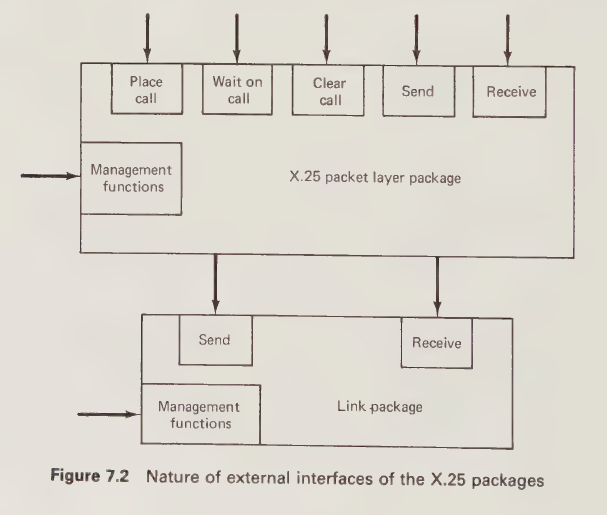
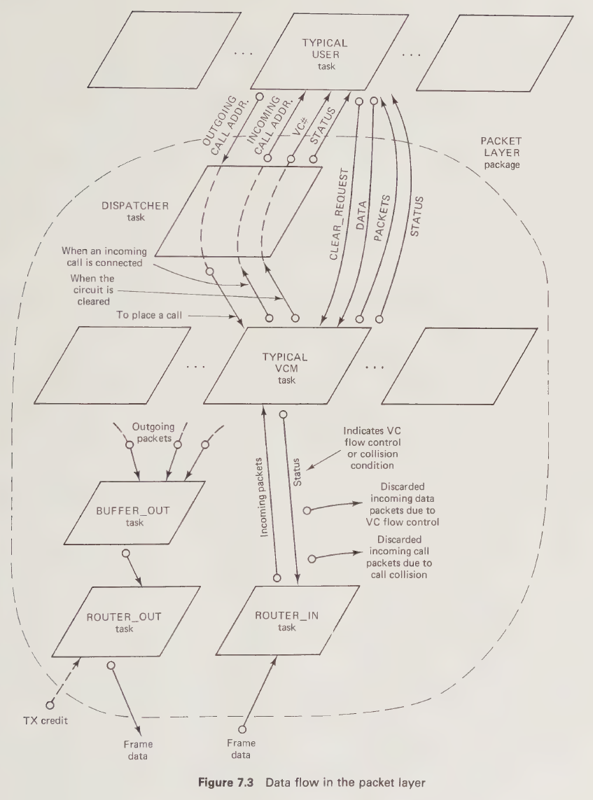
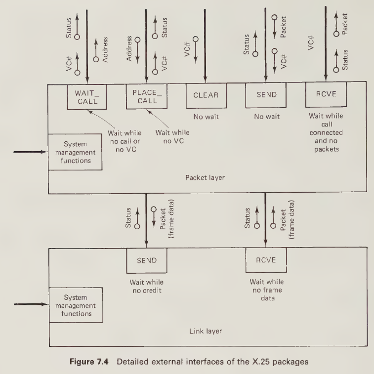
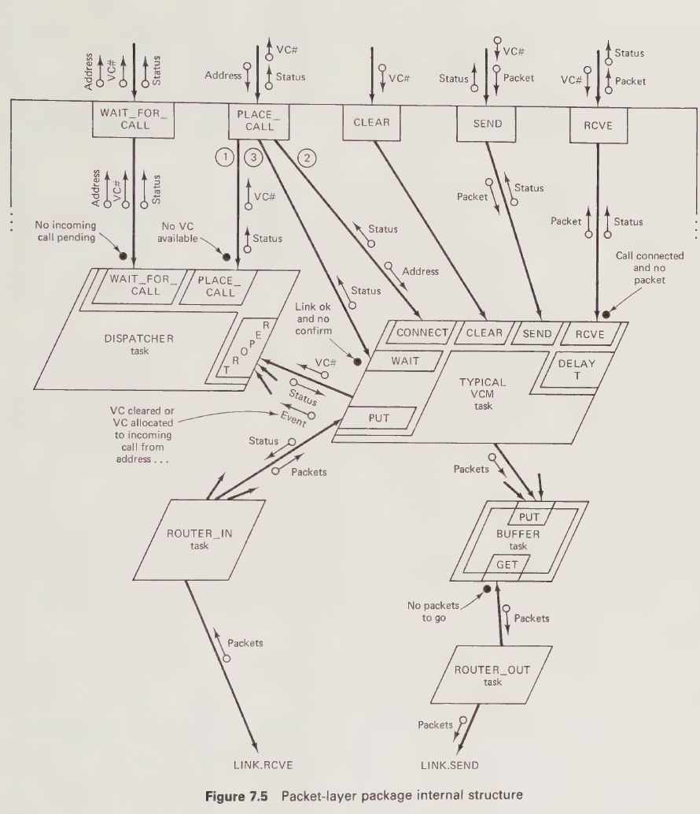
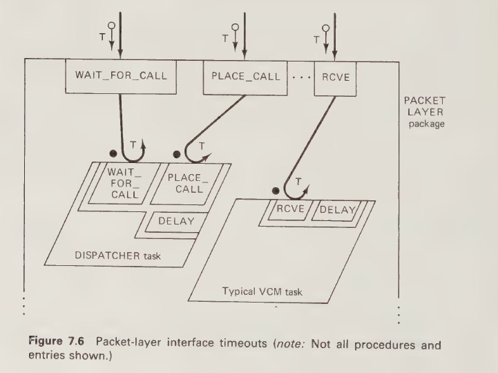
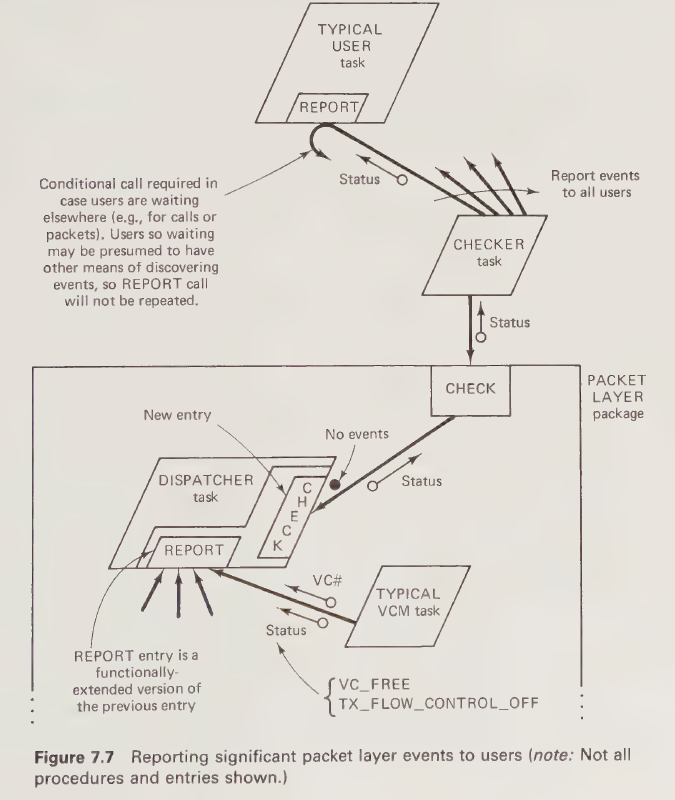
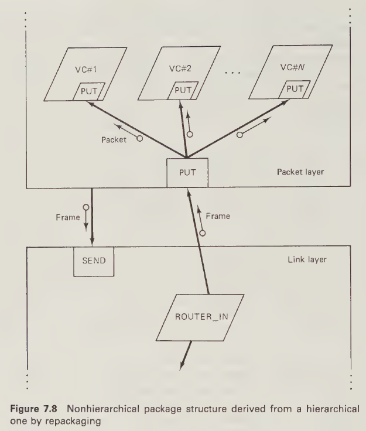

# Chapter 7

# Logical Design of Layered Systems: An X.25 Protocol Example

## 7.1 INTRODUCTION

This chapter tackles the problem of designing layered systems, using layered protocols as examples. It uses the three-layer CCITT X.25 protocol as a specific example for concreteness, but its methods are intended to be generally applicable to layered systems of any kind. Of particular interest are layered systems to implement the seven-layer ISO model for Open System Interconnection (OSI).

Of the three layers of the X.25 protocol, this chapter will be concerned only with the top one (layer 3—the so-called *packet* layer). Layer 2 of X.25 (the so-called *link* layer) uses a more complex version of the logical frame management protocol of the COMM subsystem of Chapter 6. This link protocol is called HDLC (High-Level Data Link Control). The additional complexity of HDLC can be hidden in a link layer package with essentially the same specification as the logical frame management package of Chapter 6. The general internal structure of that package is still suitable, and only details need to be changed. This chapter will assume the existence of such a package without treating its design further.

Our main purpose in this chapter is to show, using X.25 as an example, how our design methodology may be used to develop appropriate layered system structures for realistically complex problems. It is not our purpose to provide either a detailed treatment of X.25 or a complete system design to implement it. Accordingly, at each stage of the design, we introduce only those aspects of X.25 necessary to make design decisions for that stage, and we stop the design process when a system structure has emerged which can be explained clearly and unambiguously in pictures and words. At this stage in an actual design project, a major design review would be performed before proceeding to fill in details and write programs. In accordance with the purpose of this chapter we give no program examples, relying on previous chapters to show how designs expressed in structure graph form can be converted into programs.

For readers unfamiliar with X.25, Section 7.2 provides a brief overview of it sufficient for the purposes of this chapter.

Section 7.3 develops a design for an X.25 packet layer package.
Section 7.4 provides a design postmortem.
Section 7.5 suggests approaches for more elaborate layered protocols, such as are required for the ISO Model for Open Systems Interconnection.
Section 7.6 concludes Chapter 7, Part C, and the book.

## 7.2 THE GENERAL NATURE OF THE X.25 PROTOCOL

The X.25 protocol enables its users to establish multiple *virtual circuits* with remote systems and to exchange data packets with these systems using the virtual circuits. A *virtual circuit* is a logical communications pathway which may be multiplexed with other virtual circuits over a single physical link to a public data network. For each such link there is a predefined set of virtual circuit numbers which are used by both the users and the network to identify the virtual circuits sharing that link. Both incoming and outgoing packets contain a virtual circuit number.

In practice the X.25 protocol will be managed by an X.25 protocol manager module in each system. However, it is not the purpose of the X.25 protocol specification to dictate the structure of this module. The specification is concerned only with what flows between the different communicating systems. Thus, it is concerned only with formatting, sequencing, and functionality of protocol data units (PDUs). In the case of X.25, the packet layer PDUs are known as packets and the link layer PDUs as frames.

Figure 7.1 illustrates the nature of the use of X.25. User modules establish virtual circuits connecting them with remote user modules via the services of the X.25 protocol managers.

**Figure 7.1 A logical view of X.25 virtual circuits**

The main purpose of the link and packet layers are as follows:

1.  The link layer provides for error-free, correctly sequenced, flow-controlled communication of frames over a single link. As well it provides for link startup and shutdown.
2.  The packet layer provides for error-free, correctly sequenced, flow-controlled communication of packets over each virtual circuit. It also provides for establishing and clearing virtual circuits. Although the concept of X.25 illustrated by Figure 7.1 is of user modules communicating over virtual circuits via the network, many of the X.25 interactions are with the local network interface; that is, they are not end-to-end between users. However, connection requests and responses and clear requests and responses are end-to-end, and hence, the complete connection is considered to be end-to-end in nature. The system structure to implement X.25 itself is not affected by whether or not certain of its interactions are end-to-end. However, higher layers may be affected.

Management of a single virtual circuit at the packet level is logically very similar to the management of a single link at the link level. Virtual circuits and links are both communication connections which can be opened and closed at will. Therefore, the experience gained in Chapter 6 in designing the logical frame management package for a single link will be applicable to the design of managers for each virtual circuit of the packet layer. The main new features of the packet layer which will concern us in this chapter are as follows :

* multiplicity of virtual circuits to be managed;
* dynamic nature of the virtual circuits (at any time, a variable number may be active); and
* multiplexing of the active virtual circuits over a single lower level connection.

User data and packet layer control information are contained in packets of typically 128 or 256 bytes. Packet control information, such as the virtual circuit number, type of packet, packet number (on that virtual circuit), etc., is contained in a packet header. Link control information, such as the frame send and receive sequence numbers and the error check code, is added to form the frame header and trailer.

The X.25 packet level specification gives the following kind of information:

* types and formats of the packets;
* possible states of virtual circuits (e.g., cleared, call setup, data transfer, and clearing);
* changes in state required upon receipt of a packet, occurrence of a timeout, etc.;
* packets to be issued as a result of the state changes.

This kind of information is complicated in detail but familiar in nature from previous examples in Chapters 4, 5 and 6. It leads to the design of modules which provide control of event sequencing via finite state machines. Only the details of the finite state machines are affected by the details of the X.25 specification if the design is modular.

For our purposes it will be sufficient to identify the types of user packets and their uses. This information is given in Table 7.1 for a subset of X.25.

**TABLE 7.1 USER PACKET TYPES AND USES FOR A SUBSET OF X.25** 

| Packet name | TX or RX | Use |
| --- | --- | --- |
| Data | TX | User data |
| Call-request | TX | Request call on a particular VC to a given address |
| Clear-request | TX | Clear call in a particular VC |
| Call-accept | TX | Reply to an incoming-call packet |
| Clear-confirm | TX | Reply to a clear-indication packet |
| Data | RX | User data |
| Incoming-call | RX | Indicate call on a particular VC from a given address |
| Clear-indication | RX | Indicate call on a particular VC should be cleared |
| Call-connected | RX | Confirm a call-request |
| Clear-confirm | RX | Confirm a clear-request |

## 7.3 X.25: STUDY IN LAYERED SYSTEM DESIGN

### 7.3.1 Introduction

Following common sense and the lead of Chapter 6, it is natural to divide the overall X.25 protocol manager into layers corresponding to the layers of the protocol with each layer as an active package, as shown in Figure 7.2. Parameters and waiting conditions for this figure will be given in Section 7.3.3, following the development of the internal data flow design of the packet layer in Section 7.3.2.

**Figure 7.2 Nature of external interfaces of the X.25 packages**

### 7.3.2 Packet Layer Internal Data Flow Design

Given the background of the BANK example of Chapters 3 and 5, the AGENT_POOL example of Chapter 5, and the COMM example of Chapter 6, we can begin the data flow design phase with a head start. Identification of the main internal tasks can be performed immediately based on these examples. The main data flow issues are then concerned with the routing and flow control of packets between tasks.

Figure 7.3 identifies the tasks of the packet layer package and shows the data flow between them. Many of the design decisions implicit in this figure will be familiar from previous examples. In particular the use of multiple virtual circuit managers (VCM) tasks and a single dispatcher task follows naturally from the BANK and AGENT_POOL examples. Here for the first time, we see a significant practical application of this type of structure. As in previous examples each task in the pool has a permanently assigned number to identify it. In this case the number identifies the virtual circuit managed by the task .

The dispatcher in Figure 7.3 has slightly more to do than previous dispatchers, because requests for virtual circuits may originate not only from local users but also from the network. The dispatcher keeps track of the status (free or busy) of VCM tasks and allocates them to users in response to incoming or outgoing call requests.

The VCM tasks manage all packet flows for their respective virtual circuits for both call control (clearing and establishment) and data transfer. They interact with the dispatcher to report incoming calls, to report themselves free after circuit clearing, and to receive addresses for outgoing calls. Otherwise they interact with users, with the ROUTER_IN task, and with the BUFFER_OUT task. Each VCM task has a permanently assigned virtual circuit number, which it keeps in a local variable and which is passed around to the dispatcher and to users as required. Possession of this number enables the possessor to contact the VCM task.

A key design decision implicit in Figure 7.3 is that VCM tasks are able to interact with other tasks while their circuits are cleared. This enables them to handle incoming call packets directly. As a consequence the data flow patterns are very clear and direct in Figure 7.3.

A single reception transport task is identified in Figure 7.3. This task is called ROUTER_IN because it routes incoming packets to the correct VCM tasks. Only one such task is needed for many VCM tasks because there is only one place to wait for incoming packets: the RCVE procedure of the link layer package.

**Figure 7.3 Data flow in the packet layer**

Incoming packets are routed to the appropriate VCM task by the ROUTER_IN task. Control of packets which cannot be accepted by the VCM task reverts immediately to the ROUTER_IN task, which simply discards them. Flow control is not the only cause of the VCM task's inability to accept incoming packets. Another cause is call collision, defined as the same virtual circuit number appearing simultaneously in an outgoing call-request packet and an incoming-call packet. The rule in X.25 is that the outgoing call takes precedence, and the network clears the incoming call. Accordingly, the ROUTER_IN task simply discards incoming-call packets when call collision occurs.

In X.25, the term call collision refers to packets actually received and sent. An attempt by a user to connect an outgoing call using a VCM task which has already accepted an incoming call is not call collision in the X.25 sense, because no call-request packet has been sent. Therefore the outgoing call will not be placed.

Further incoming packets destined for a flow-controlled virtual circuit might still be in the pipe in the link layer package at the time of the discard. If the flow-control condition is lifted before they are picked up by the ROUTER_IN task, they will (apparently unfairly) be passed on to the correct VCM task. However, the rules of X.25 will cause them to be discarded at this point because of the gap in the packet number sequence caused by the first discard.

A single transmission transport task called ROUTER_OUT is identified in Figure 7.3. Only one such task is needed for many VCM tasks, provided there is an intermediate BUFFER_OUT task, as shown in the figure, where all outgoing packets from all VCM tasks are buffered for pickup. Outgoing packets are sent to the link by the ROUTER_OUT task when it has frame TX credit. While frame TX credit is not available, outgoing packets pile up in the BUFFER_OUT task up to the limit of its buffer capacity. If its buffer capacity is the sum of all the transmission flow control windows of all the VCM tasks, then the VCM tasks will never need to worry about local TX credit .

The above mechanism is consistent with the way the logical frame management package of Chapter 6 gives credit. However, it violates the original justification for a credit mechanism given in earlier chapters. Recall that the justification was to avoid allocating buffers to send transactions which could not be immediately completed. This violation did not occur in Chapter 6, because multiple logical connections were not being multiplexed over a single link as they are here. This violation cannot be avoided here, because frame TX credit cannot be preallocated fairly among individual virtual ciruits.

### 7.3.3 Packet Layer Internal Structure Design

The internal tasks and data flows of the packet layer have already been identified, so our main concern here is with interaction structures and functionality. Most of the issues have already been discussed in previous chapters.

The internal structure will be partially determined by the interface details omitted from Figure 7.2. A more complete interface structure graph is provided in Figure 7.4.

**Figure 7.4 Detailed external interfaces of the X.25 packages**

The main points to note about the Packet Layer procedures of Figure 7.4 are as follows:

* The `WAIT_FOR_CALL` procedure returns the number of an already connected virtual circuit. If the call is not wanted (as indicated by the address parameter), the appropriate response is to use the `CLEAR` procedure immediately.
* For simplicity, the `SEND` procedure is identified as a no-wait procedure (implying there are no guards on the corresponding entries of internal tasks).
* There is no credit parameter associated with the `SEND` procedure. A flow control condition is reported via a status parameter after an attempt to `SEND` has been made.
* For simplicity, no timeout parameters are included in any of the procedures.

The reader should be careful not to confuse the two possible meanings of the word *call*, as exemplified in the phrase: A user *calls* the `WAIT_FOR_CALL` procedure to *wait for a call*. As with overloading in Ada, the intended meaning will be evident from the context.

Sufficient Ada interface specifications have been presented previously for structure diagrams such as Figure 7.4 that at this point the translation of this figure into such a specification can be left to the reader.

The internal structure graph of Figure 7.5 follows naturally from the interface structure of Figure 7.4, from the data flow graph of Figure 7.3, from a commitment to linear interaction structures between tasks, from the discussion of the `AGENT_POOL` example, and from the fundamental design decision that free VCM tasks do not wait at the dispatcher to be allocated but rather just declare themselves FREE and then return to wait for calls on their own entries. Virtual circuit numbers (VC#) identify both virtual circuits and their manager tasks .

**Figure 7.5 Packet-layer package internal structure**

We leave it to the reader to define Ada interface specifications as required for the various tasks of Figure 7.5. There is nothing new in doing so at this stage.

We now briefly describe the functionality of each of the tasks and the interactions between them.

#### 7.3.3.1 DISPATCHER Task

The dispatcher allocates free VCM tasks to users as follows:

* for incoming calls, by returning an allocated VC# as a parameter of the `WAIT_FOR_CALL` entry following a `REPORT` call from a VCM task which has connected an incoming call (if no user is at `WAIT_FOR_CALL`, a status value indicating this is returned to the VCM task as an out parameter of the `REPORT` entry following which the VCM task will clear the call)
* for locally requested calls, by returning a free VC# as a parameter of the `PLACE_CALL` entry, leaving it up to the caller of that entry (namely, the `PLACE_CALL` procedure of the package) to ask the free VCM task to `CONNECT` the call.

#### 7.3.3.2 VIRTUAL CIRCUIT MANAGER (VCM) Tasks

VCM tasks manage all aspects of virtual circuit interactions. A virtual circuit manager task is similar in many ways to the frame service (FS) task of the logical frame management package of the COMM subsystem example. In fact the only significantly new issues introduced by the VCM tasks are associated with their allocation and access. Individually, their design presents no new issues or problems. Each VCM task will be structured internally like the FS task with the peer protocol managed by a passive package containing the packet level protocol FSMs.

**Call Control**
The `PLACE_CALL` procedure first calls the dispatcher's `PLACE_CALL` entry to obtain a virtual circuit number. It then calls the VCM task's `CONNECT` entry and passes it the destination address. If the VCM task has just connected an incoming call, the `CONNECT` entry will return a status parameter indicating the circuit is no longer available. If the circuit is available, the `PLACE_CALL` procedure then calls the `WAIT` entry; in the meantime the VCM task sends a connect-request packet. When a call-connected packet arrives on that circuit via `PUT`, the call on `WAIT` is accepted and the user is released to use the virtual circuit.

When an incoming-call packet arrives at a free VCM task via `PUT`, the VCM task sends a call-accepted packet and notifies the dispatcher of the connected call via `REPORT`. If there is no user, the VCM task is notified via the status parameter of `REPORT` so that it may clear the call. Otherwise the dispatcher accepts `WAIT_FOR_CALL`, passing the originator's address and a virtual circuit number to the caller. If the VCM task is not free at the time of arrival of an incoming-call packet, the packet is ignored in accordance with the X.25 collision rules.

When a `CLEAR` request is made by the local user, the VCM task leaves the data transfer phase, sends a clear-request packet and waits for a clear-confirmation packet in return before declaring itself `FREE`. When a clear-indication packet arises from the network, the VCM task leaves the data transfer phase, sends a clear-confirmation packet and immediately declares itself free via `REPORT`. In either case when the VCM task leaves the data transfer phase, all data packet queues are cleared, and further data packets arriving via `PUT` are discarded until a new call is connected.

**Data Transfer**
All of the logic and data structures concerning data packet transmission, reception, acknowledgement, and retransmission are internal to the VCM task. The outstanding data packets are stored in two queues, a retransmit queue containing data packets sent but not acknowledged and a receive queue, containing data packets received but not picked up. The primary controlling factors in the task are the state of the task, which includes the state of the virtual circuit, the size of retransmit and receive queues, and the time in the system of the oldest unacknowledged packet. The logic will be similar to that required for the logical frame management service task of the COMM subsystem .

In the data transfer state, the VCM task always accepts the `SEND`, `PUT`, and `CLEAR` entries but only accepts `RCVE` if the receive queue is not empty. Upon each acceptance of an entry, the VCM task takes the appropriate action, updating queues and sending packets, then returns to the selective accept clause to wait for the next call. If the retransmit or receive queues are full (their capacity is determined by the virtual circuit flow control window), then flow control will be exercised on transmission from above or reception from below, as the case may be. Transmission flow control is exercised by a VCM task by terminating a `SEND` rendezvous without accepting the data packet; the flow control condition is indicated to the caller by a returned `STATUS` parameter. Reception flow control is exercised in a similar fashion by terminating a `PUT` rendezvous without accepting a data packet (control packets are always accepted, however).

Retransmission of packets is handled in the fashion of the COMM subsystem. Each packet is stamped with the time of its last transmission. The head of the retransmit queue is the oldest, hence, it will require retransmission first. Before entering the selective accept clause, the VCM task determines how much time is left on the head of the queue of unacknowledged packets and sets up a delay parameter accordingly. Should no accept occur before the timer expires, the delay alternative is taken, and unacknowledged packets are retransmitted. If an entry is accepted, the delay is adjusted appropriately.

#### 7.3.3.4 ROUTER_IN, ROUTER_OUT, and BUFFER Tasks

The `ROUTER_IN` task waits at the link package for incoming frame data, decodes the frame data as a packet for a particular virtual circuit, and calls the `PUT` entry of the appropriate VCM task to hand over the packet. Depending on the value of a `STATUS` parameter returned after the `PUT` rendezvous, it may have to discard the packet (return it to the frame buffer pool); this will be required if the VCM task is exercising reception flow control or if the VCM task is not free at the time of arrival of an incoming-call packet.

The `ROUTER_OUT` task is a simple transport task which moves one packet at a time from the `BUFFER` task to the `LINK` package while it has frame TX credit.

The `BUFFER` task simply accumulates outgoing packets for all virtual circuits.

## 7.4 DESIGN POST-MORTEM

### 7.4.1 Introduction

Many of the comments made in the COMM subsystem design post-mortem also apply here and will not be repeated.

The design presented in Figure 7.5 emerged after several frustrating attempts to simplify the awkward internal logic of a dispatcher task based on a slightly different system structure. This different structure had incoming call packets for unallocated VCM tasks flowing to the dispatcher instead of the VCM task. The three-way interaction (with the `ROUTER_IN` task, the designated VCM task and the user) proved awkward to describe clearly. No matter how it was approached, the internal logic of the dispatcher seemed excessively complex, considering the relative simplicity of the allocation problem. There is a rule that applies in writing and design which is helpful in such situations: When what one is trying to say seems difficult to say, perhaps one is trying to say the wrong thing. As soon as the system structure of Figure 7.5 was adopted, the problems with the internal logic of the dispatcher task disappeared. We were trying to say the wrong thing! From another viewpoint, the structure which was causing problems is clearly not as modular, by the criteria of Chapter 6, as that of Figure 7.5. Accordingly, we should have expected problems! .

The awkwardness mentioned above arose primarily because of the fixed allocation of virtual circuit numbers to VCM tasks. The simplicity of the solution of Figure 7.5 is directly due to this fixed allocation. Dynamic allocation would require a different solution.

### 7.4.2 Design Extensions

In practice, timeout parameters would be needed for the interface procedures of the packet layer package which involve waiting; the requisite timeouts would be implemented by making timed entry calls from the interface procedures to the appropriate entries of internal tasks, as shown in Figure 7.6. Internal tasks would have to ensure that they were never stuck waiting for a timed-out call, resulting in deadlock. Recall that deadlock can occur when a task has accepted a timed call, based on the count attribute of an entry, only to find that the caller has timed out between the evaluation of the count attribute and the acceptance of the entry .

**Figure 7.6 Packet-layer interface timeouts**

The question was not discussed in Section 7.3 of how to notify users of the lifting of packet transmission flow control. The implicit assumption was that a user who was flow controlled on transmission would simply keep calling `SEND` at suitable time intervals until the packet was accepted. However this solution is not very satisfactory. Too short a retry period may use up excessive processor time in busy waiting. Too long a retry period may reduce throughput unacceptably. In either case the logic is more complex than necessary because of the need to program retries explicitly.

A solution to this event notification problem which does not require retry is shown in Figure 7.7. A `CHECKER` task calls a new `CHECK` entry in the dispatcher to wait for significant packet level events. The only significant event under consideration at the moment is the lifting of transmission flow control on a virtual circuit. However, others are possible. When an event occurs, the `CHECKER` reports it to users via conditional entry calls. These calls must be conditional in case the user is waiting elsewhere .

Another solution is to specify a credit mechanism between the user and the packet layer package.

**Figure 7.7 Reporting significant packet layer events to users**

### 7.4.3 Different Design Decisions

The X.25 packet layer package emerged from the design process with N + 4 tasks for N virtual circuits. Fewer tasks are also possible, as follows.

Instead of a dedicated VCM task for each virtual circuit, one or two main tasks could handle all packet layer virtual circuits. One main task could be used to manage all virtual circuits for the entire layer. Or a pair of main tasks could be used, one to manage call control for all virtual circuits and the other to manage data transfer. These tasks must maintain explicit state tables and data packet counters for each circuit. Still required are the `ROUTER_IN` and `ROUTER_OUT` tasks. No longer required is the `DISPATCHER` task. The `BUFFER` task is only required if two separate tasks manage call control and data transfer. Therefore the total number of tasks required by these approaches is at most five and at least three.

These tasks will require many entries so that they can accept entry calls for different virtual circuits differently, according to the different states of the circuits.

As discussed in Chapter 6, quantitative performance tradeoffs between designs with many and few tasks are implementation-dependent and largely outside the scope of the book. However, qualitative judgements can be made, as discussed in Chapter 6 and as discussed further below.

Modularity is on the side of the task-per-virtual-circuit approach. There is an inherent conceptual clarity in designing a system so that form follows function. If the system's function is displayed by the form which implements it, then the design is likely to be easier to understand and to implement. We argue that this is likely to be the case with the task-per-virtual-circuit approach. A virtual circuit is logically independent of and concurrent with other virtual circuits, and is therefore naturally managed by a task. An important consideration is that the program logic is simpler if virtual circuits are managed separately. For example, handling of timeouts is simpler with the one task-per-virtual circuit approach. To follow a similar mechanism with fewer tasks requires that the tasks maintain extra data structures or more intricate logic to enable the delay alternative of the selective accept clause to find and time-out the correct packet or circuit.

Another design alternative is to take the task-per-virtual-circuit approach but allow the dispatcher to create the tasks as needed and permit them to exist only for the duration of the call. The user would be passed an identifier for the task managing his virtual circuit, following the philosophy of dynamic access in the forward direction discussed in Chapter 5.

The dynamic task approach offers the possible advantage of not tying up memory with context tables and stacks for idle tasks. In this dynamic task approach, to enable the `ROUTER_IN` task to access the VCM tasks, we require a look-up table maintained by the dispatcher and containing the access variables of the VCM tasks.

When a VCM task finishes, the dispatcher must know that the circuit is free and that it can create a new task to manage that circuit when it is next allocated; hence, the VCM tasks must still call `DISPATCHER.FREE`. Furthermore, we must adopt the previously rejected structure in which the `ROUTER_IN` task sends incoming-call packets to the dispatcher.

The `ROUTER_IN` task must be prevented from attempting to access a terminated VCM task. However, such a situation can arise due to a race between the `ROUTER_IN` task and a VCM task, as follows. `ROUTER_IN` could obtain the access variable to a VCM task in between the time the task declares its circuit clear to the `DISPATCHER` and terminates and the time when the dispatcher updates the table. This problem can be solved, but the solution adds complexity. Two possible approaches are:

* Design the VCM task so that after it declares its circuit free, it performs a selective wait on all of its entries together with a delay alternative. Any entry calls now issued on the manager will cause the manager to return a cleared status to the caller. After timeout, the task terminates.
* Include a local exception handler in each task rendezvousing with a VCM task to recover from this erroneous condition should it occur.

Clearly, the dynamic task approach is more complex.

Throughout Chapters 6 and 7, only top-down control structures have emerged from the design process; in these structures each layer calls the next lower one for all interactions. This approach was originally suggested for layered systems at the beginning of Chapter 6 because it is familiar and avoids deadlock due to careless use of bidirectional calls between layers. However, our intent is not to advocate top-down control structures as necessarily the best or only ones.

Symmetrical control structures are also possible. The differences between top-down and symmetrical control structures may be only a matter of cosmetic packaging, as illustrated by Figure 7.8 (which follows Figure 6.4(b)). If we draw the package boundaries differently between tasks in our top-down X.25 structures, the package interactions can be made two-way without changing the nature of the task interactions. All we have done in this figure is moved the `ROUTER_IN` task of Figure 7.5 into the link layer package and added a new interface procedure `PUT` to the packet layer package. The new `PUT` procedure now decodes frame data and directs packets to the correct internal task, whereas formerly the body of the `ROUTER_IN` task performed this function. Thus the `ROUTER_IN` task itself does not need to distinguish packets for different virtual circuits, it acts simply as a transport task for frame data.

An alternative symmetrical structure, using buffer tasks instead of transport tasks, might be based on Figure 6.4(c). We leave development of the details to the reader.

## 7.5 EXTENDING THE DESIGN APPROACH TO THE SEVEN-LAYER OPEN SYSTEM INTERCONNECTION MODEL

This section discusses briefly how the design approach may be applied to the ISO's seven layer model for Open System Interconnection (OSI).

The Open System Interconnection model is based on the concept of entities providing services to higher-level entities. To provide services, entities interact with remote peer entities by exchanging protocol data units via services provided by lower level entities.

Although entities may rely on lower-level entities to manage the physical exchange of protocol data units, each entity's protocol data units are logically private. To permit this logical privacy, the protocol data units of higher layers are nested in those of lower layers in exactly the way X.25 packet level protocol data units (packets) are nested in link protocol data units (frames).

**Figure 7.8 Nonhierarchical package structure derived from a hierarchical one by repackaging**

Each entity is said to have a service access point (the identifier of the entity) and to manage connections (like X.25 virtual circuits). Services are provided via service primitives, which may have associated parameters. Service primitives may flow in two directions between entities.

Just as with X.25, protocol specifications for OSI define only the protocol data units to be exchanged, together with their sequences and effects, and not the system structure to implement the protocol.

In our designs the OSI entities are active packages. The service access points are the names of the packages. Primitives are implemented using visible procedures of packages.

Based on our design examples, guidelines for designing an OSI system with a top-down control structure following the pattern of Figure 6.3(b), are as follows:

* Make each OSI layer an active package.
* Make each entity within the layer a visible active package called from above.
* Define the service primitives in terms of visible procedures of the package, with appropriate parameters. Use separate procedures for primitives handled in different protocol states for clarity of structure.
* Provide a minimum of two tasks in each entity package, one to manage the service interface and one to transport upward-going interactions from the next lower layer (assuming interactions with lower layers are full duplex and may require waiting). Provide an additional transport task if downward-going interactions with the next lower layer may require conditional waiting.
* Provide at least one task for each connection managed by the layer to control the protocol associated with establishing, using, and clearing the connection.
* For multiple connections, provide a buffer task to accumulate downward-going interactions for pickup by the appropriate transport task, if there is one.

The X.25 design serves as an example of the application of these guidelines. Readers particularly concerned with OSI conventions should note, however, that a few details of this example are anomalous relative to OSI. In OSI, a `WAIT_FOR_CALL` procedure would not provide a connected call but only an indication of an incoming-call packet. A separate `ACCEPT_CALL` procedure would be needed to confirm acceptance of the call. Furthermore, in OSI, circuit identifiers would be dynamically assigned to circuit manager tasks in certain cases (for example, in the transport layer).

Similar guidelines for designing an OSI system with a symmetrical control structure, following the pattern of Figure 6.4(c), could also be developed. We leave this as a project for the reader.

The previous discussion tantalizingly reveals only the tip of the OSI iceberg. Many other important issues associated with system design and implementation for OSI are being investigated in the author's laboratory.

## 7.6 CONCLUSIONS

This section concludes Chapter 7, Part C, and the book.

Part C has served to illustrate how, during system design, interactions and tradeoffs between a large number of issues in modularity, reliability, and structure can be explored and resolved using a graphical notation and methodology based on Ada. The graphical notation and methodology provide a suitable basis for group discussion. The process of developing a design using this graphical notation and methodology can be relatively informal. However, its end product, namely, a well-annotated set of structure graphs, has formal meaning in Ada terms and can be used to develop Ada code in a relatively mechanical fashion.

A key feature of all the designs developed in Part C (and elsewhere in this book) is the definition of different procedures and entries of packages and tasks for different services provided by the packages and tasks. For tasks, we have shown how separate entries should be provided for different interactions, to provide so-called linear interaction structures, which have no nested rendezvous. This approach enables structure graphs to display the different nature of the processing of the different calls in a very clear and explicit fashion. For tasks, this ensures the waiting structure is explicit at the task interface. Thus it enables design to be performed in detail at the structure graph level, and it makes explanation of the final design possible without resort to code.

In general we have shown how single and multiple tasks can be advantageously hidden inside packages for modularity.

As appropriate for the design-oriented aims of the book, the role of Ada in Part C has been primarily to provide the inspiration for and the semantics of the graphical notation. Therefore, actual examples of Ada programs do not occupy a large amount of space in Part C.

The design examples chosen in Part C to illustrate the approach are interesting in themselves. Many design issues relating to protocol systems have been discussed and resolved. The power of the approach is illustrated by its ability to deal with such issues in a compact and understandable fashion.

